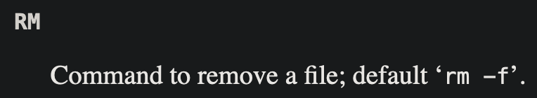
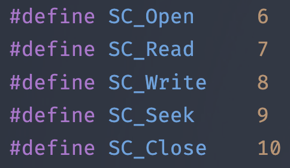
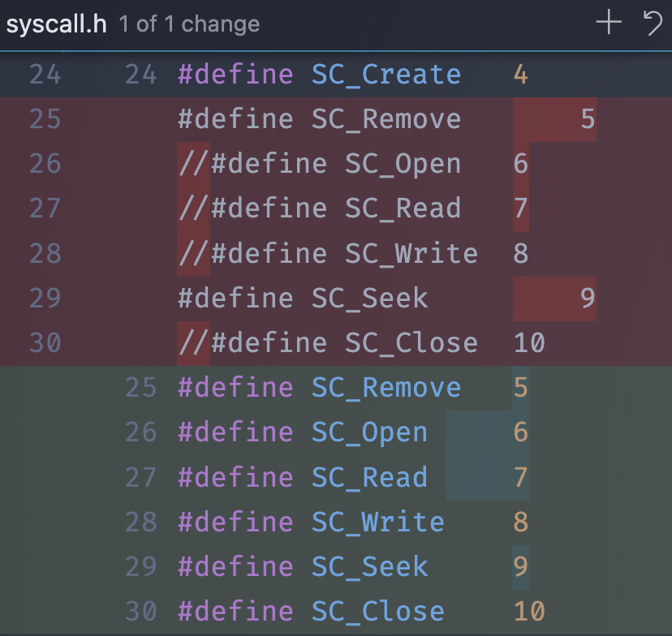
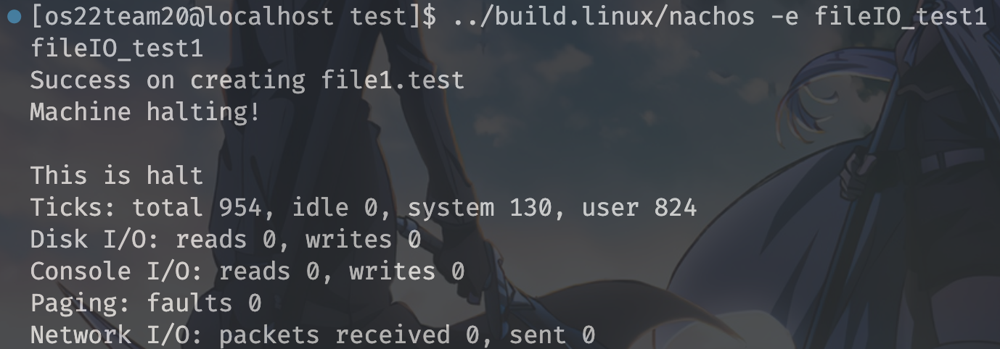
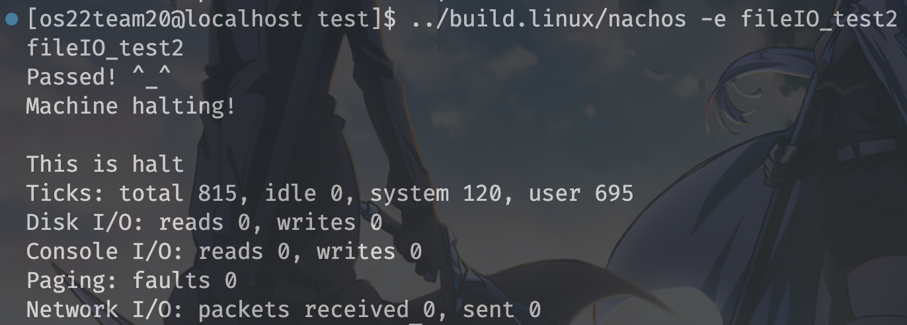

# MP1 Report from team20

> The first assignment of NachOS
>
> Course: Operating System
>
> Professor: 周志遠


## Part 1: member list and contributions

### Member list

* 109062274 資訊工程系三年級 楊子慶 `Eroiko`
* 109080076 生科院學士班三年級 俞政佑 `Blue`

### Contributions

1. Code tracing

    We first traced code separately, and then explained them to each other.

    ||楊子慶|俞政佑|
    |:-:|:-:|:-:|
    |`SC_Halt`||V|
    |`SC_Create`|V||
    |`SC_PrintInt`||V|
    |`Makefile`|V||

2. Implementation

    The four functions are done and tested by 楊子慶.

3. Report

    |Items|楊子慶|俞政佑|
    |:-:|:-:|:-:|
    |Report design|V||
    |`SC_Halt`||V|
    |`SC_Create`|V||
    |`SC_PrintInt`||V|
    |`Makefile`|V||
    |**Implementation** of<br>I/O System calls<br>and **difficulties**|V||
    |Feedback|V|V|

## Part 2-1: Explain how system calls works in NachOS

### (A) $\tt{SC\_Halt}$ system call

### $\tt{Machine::Run()}$

> in `machine/mipssim.cc`

* code

    ```cpp
    void
    Machine::Run()
    {
        Instruction *instr = new Instruction; // storage for decoded instruction
        if (debug->IsEnabled('m')) {
            cout << "Starting program in thread: " << kernel->currentThread->getName();
            cout << ", at time: " << kernel->stats->totalTicks << "\n";
        }
        kernel->interrupt->setStatus(UserMode); // 改變系統狀態為"UserMode"
        for (;;) {
            DEBUG(dbgTraCode, "In Machine::Run(), into OneInstruction " << "== Tick " << kernel->stats->totalTicks << " ==");
            
            OneInstruction(instr); // 執行instruction
                
            DEBUG(dbgTraCode, "In Machine::Run(), return from OneInstruction  " << "== Tick " << kernel->stats->totalTicks << " ==");
            DEBUG(dbgTraCode, "In Machine::Run(), into OneTick " << "== Tick " << kernel->stats->totalTicks << " ==");
                
            kernel->interrupt->OneTick(); // 將時間向前一單位
                
            DEBUG(dbgTraCode, "In Machine::Run(), return from OneTick " << "== Tick " << kernel->stats->totalTicks << " ==");
            if (singleStep && (runUntilTime <= kernel->stats->totalTicks))
                Debugger();
        }
    }
    ```
  
* `Machine::Run()` 功能: 在 NachOS 上, 模擬 **user level** 的運行, 當 program 開始運行, 就會 called by kernel。

* `Machine::Run()` 做了什麼:

    1. 首先會透過 `setStatus()` 將系統狀態改成user mode。
    2. 呼叫 `OneInstruction()` (稍後會詳細提到)
        1. 取出指令
        2. 對指令進行操作 (decode)
        3. 進行模擬執行
    3. 透過 `OneTick()` 時間前進一個單位
    4. 再回到 **2.** 因為是在無限迴圈中

* `void setStatus(MachineStatus st) { status = st; }`: 是定義在 `class Interrupt` 中的 function, 他可以改變系統的狀態
**{ idle , kernel , user }**

* `void Machine::OneInstruction(Instruction *instr)`: 是定義在 `class Machine` 的 function, 他會執行一個 user program 的 instruction。稍後會再次提到。

* `void Interrupt::OneTick()`: 是定義在`class Interrupt` 的 function。將時間前進一個單位, 並檢查有沒有 `pending interrupts` 待調用, 有則進行中斷處理。晚點會再次提到。(執行 instruction、interrupt 重啟都會調用此 function)

#### $\tt{Machine::OneInstruction()}$

> in `machine/mipssim.cc`

* code: 因版面關係, 先略

* `Machine::OneInstruction()` 功能: 執行 user的指令

* `Machine::OneInstruction()` 做了什麼:

    1. 獲得指令

        ```cpp
        if (!ReadMem(registers[PCReg], 4, &raw)) return; 
        // 讀到的值存在raw中
        // 如果有 exception  直接return
        instr->value = raw;
        ```

        1. 用 `ReadMem(int addr, int size, int *value)` 獲得 register 中的資料, 有exception `ReadMem()` 會回傳 false 之後直接 return。

    2. decode 指令

        ```cpp
        instr->Decode();
        ```

        1. 假設一切正常, 我們會從 `register[PCReg]` 得到資料, 之後用 `Decode()` 轉換他, 分離出 opcode, rs, rt, rd..., 不同 type 的指令分離出不同東西

    3. 執行指令

        ```cpp
        // 巨量的 case 故截取部分 
        switch (instr->opCode) {
           case OP_SYSCALL:
              DEBUG(dbgTraCode, "In Machine::OneInstruction, RaiseException(SyscallException, 0), " << kernel->stats->totalTicks);
              RaiseException(SyscallException, 0);
           return; 
        }
        ```

        1. 透過 switch 與大量的 case, decode 出來的 opcode 可以找到對應要做的事情
        2. 以上面的 code 為例, decode 出來的opCode 是 **OP_SYSCALL** 的類型, 就會呼叫 `RaiseException(SyscallException, 0)`, 詳細過程請看下一點

    4. 呼叫 `DelayedLoad(nextLoadReg, nextLoadValue)` 進行延遲加載

    5. 更新 program counter

    ```cpp
    registers[PrevPCReg] = registers[PCReg]; // for debugging
    registers[PCReg] = registers[NextPCReg];
    registers[NextPCReg] = pcAfter;
    ```

* `ReadMem(int addr, int size, int *value)`: 是定義在 `translate.cc` 的 function, 可以讀取 addr(virtual address) 的資料。 其中的`Translate()` 可以將virtual address translate into physical address (用 page table、TLB)

* `Decode()`: 是定義在 `class Instruction` 中的 function, 透過 shift, and 分離出 instruction 的資料,包含何種 type formate,opcode, rs, rt, rd...等資料 (不同 type 會得到的東西也不同)

* `void Machine::DelayedLoad(int nextReg, int nextValue)`: 是定義在 `mipssim.cc` 的 function, 會將上次 delay 的資料存入該存的地方, 並將參數的資料存入 delay 相關的 register

#### $\tt{Machine::RaiseException()}$

> in `machine/machine.cc`

* code:

    ```cpp
    
    void Machine::RaiseException(ExceptionType which, int badVAddr)   //which 是出錯的類型 badVAddr是出錯的地址
    {
        DEBUG(dbgMach, "Exception: " << exceptionNames[which]);
        
        registers[BadVAddrReg] = badVAddr; //將出錯的地址存到registers[BadVAddrReg]
        DelayedLoad(0, 0);  // finish anything in progress
        kernel->interrupt->setStatus(SystemMode);     //改變mode
        ExceptionHandler(which);  // interrupts are enabled at this point
        kernel->interrupt->setStatus(UserMode);       //改變mode
    }
    ```

* `Machine::RaiseException()` 的功能: 呼叫`ExceptionHandler()` 來處理 exception, 包含**system call** 或是其他錯誤, 如錯誤的地址等

* `Machine::RaiseException()`做了什麼

  1. 參數:
     1. which = 出錯的類型, 源自於`Machine::OneInstruction()` 在不同情況會填入不同的 exception 類型 ex.(SyscallException)
     2. badVAddr = 出錯的地址

  2. 將錯誤地址存到 registers[BadVAddrReg] 中

  3. 使用 `DelayedLoad(0, 0)` 結束當前運行的東西, 並在進入 system mode 前,將還沒 Load 的東西 Load 好 (輸入 0, 0 對往後不影響, 因為register 0 只會是 0)

  4. 狀態從 user mode 變為 system mode

  5. 呼叫 `ExceptionHandler(which)`, 處理exception, 稍後會提到

  6. 將狀態改回 user mode

#### $\tt{ExceptionHandler()}$

> in `userprog/exception.cc`

* code
  
    ``` cpp
    // 由於case多,只擷取與halt 有關的
    void ExceptionHandler(ExceptionType which)
    {
        char ch;
        int val;
        int type = kernel->machine->ReadRegister(2); // 從register 2 讀取資料 什摩type 的 exception ex.SC_Halt 
        int status, exit, threadID, programID, fileID, numChar;
        DEBUG(dbgSys, "Received Exception " << which << " type: " << type << "\n");
        DEBUG(dbgTraCode, "In ExceptionHandler(), Received Exception " << which << " type: " << type << ", " << kernel->stats->totalTicks);
        switch (which) {  //從Machine::RaiseException()丟進來哪種exception 和前面type不同的是 這裡是指 SyscallException 還是OverflowException 的那種不同  
            case SyscallException:
                switch(type) {    //是哪種type 的syscall exception 
                case SC_Halt:
                   DEBUG(dbgSys, "Shutdown, initiated by user program.\n");
                   SysHalt();
                   cout<<"in exception\n";
                   ASSERTNOTREACHED(); // 照理說不應該執行
                   break;
                }
    ```

* `ExceptionHandler()` 的功能: 根據不同exception, 進行不同行為, 如這次要 trace `的就是SC_Halt` 是怎麼處理的

* `ExceptionHandler()` 做了什麼:

  1. 這次 trace SC_Halt 會用到的參數
     1. which: 由 `Machine::RaiseException()`, 呼叫時傳入, 源自 `Machine::OneInstruction()`

     2. type: 為透過`ReadRegister(2)`, 讀取到register 2 的資料

  2. 透過 `ReadRegister(2)` 取得 exception 的 type

  3. 透過 `switch case` 找到對應處理行為, 以這部分為例, `which = SyscallException`, `type = SC_Halt`, 將執行 `SysHalt()`

* `int Machine::ReadRegister(int num)`: 是 `class machine` 中定義的 function, 會回傳 `registers[num]` 中的資料

* `SysHalt()`: 是在 `ksyscall.h` 中定義的function, 他會呼叫 `kernel->interrupt->Halt()` 等等就會講到

#### $\tt{SysHalt()}$

> in `ksyscall.h`

* code

    ```cpp
    void SysHalt()
    {
       kernel->interrupt->Halt(); //呼叫在
    }
    ```

* `SysHalt()` 的功用: 呼叫`kernel->interrupt->Halt()`, 為了達到 `SC_Halt` 的目的

* `SysHalt()`做了什麼: 呼叫`kernel->interrupt->Halt()`

#### $\tt{Interrupt::Halt()}$

> in `machine/interrupt.cc`

* code

    ```cpp
    void Interrupt::Halt()
    {
        cout << "Machine halting!\n\n";
        cout << "This is halt\n";
        kernel->stats->Print();
        delete kernel;// Never returns.刪掉kernel所有東西就沒了
    }
    ```

* `Interrupt::Halt()` 的功用: 打印出參數,並結束系統

* `Interrupt::Halt()` 做了什麼:
  
  1. 透過 `kernel->stats->Print()` 打印參數

  2. 刪除 kernel, 也就結束整個系統了

* `kernel->stats->Print()`: 是定義在 `class Statistic` 的 function, 他會打印出許多數據。

    ```cpp
    void Statistics::Print()
    {
        cout << "Ticks: total " << totalTicks << ", idle " << idleTicks;
        cout << ", system " << systemTicks << ", user " << userTicks <<"\n";
        cout << "Disk I/O: reads " << numDiskReads;
        cout << ", writes " << numDiskWrites << "\n";
        cout << "Console I/O: reads " << numConsoleCharsRead;
        cout << ", writes " << numConsoleCharsWritten << "\n";
        cout << "Paging: faults " << numPageFaults << "\n";
        cout << "Network I/O: packets received " << numPacketsRecvd;
        cout << ", sent " << numPacketsSent << "\n";
    }
    ```

### `SC_Halt()` 小結

* `Machine::Run()` 是模擬的主體, called by kernel, 會將狀態改為 user mode, 透過`Machine::OneInstruction()` 不斷讀取指令、執行指令

* 當 `Machine::OneInstruction()` 接收到 `OP_SYSCALL` 的指令時, 會 call `Machine::RaiseException(SyscallException, 0)`, exception 的種類為 **SyscallException**
  
* `Machine::RaiseException(which,badVAddr)` 會改變狀態為 SystemMode, 呼叫 `ExceptionHandler(which)` 處理 exception, `ExceptionHandler()` 會從 `Machine::RaiseException()` 知道 exception 的類型 (**SyscallException**), 並從register 2 得到他的 type (**SC_Halt**), 並呼叫 `SysHalt()`

* `SysHalt()` 又會呼叫 `kernel->stats->Halt()`, 刪除 kernel, 結束系統

* `Machine::Run()` $\rightarrow$ `Machine::OneInstruction()` $\rightarrow$ `Machine::RaiseException(SyscallException, 0)` $\rightarrow$ `ExceptionHandler(which)`  $\rightarrow$ `SysHalt()` $\rightarrow$ `kernel->stats->Halt()`

### (B) $\tt{SC\_Create}$ system call

#### $\tt{ExceptionHandler}$

> in `userprog/exception.cc`

Since we've discussed the `ExceptionHandler` in the previous part, we're going to focus on the part that related to `SC_Create`.

The code block below shows where we should focus on:

```cpp
/** 
 * In file userprog/exception.cc, 
 *      function ExceptionHandler
 * 
 * In exception handling routine 
 *      (switch-case) of type: SC_Create
 */
case SC_Create:
    // fetch the argument store in a0 register, 
    //      which should be a file pointer
    val = kernel->machine->ReadRegister(4);

    // use a block to initialize a variable
    //      inside the switch-case 
    {
        // fetch the file name stored 
        //      inside the main memory
        char *filename = &(kernel->machine->mainMemory[val]);

        // create a file with the filename, 
        //      implement in ksyscall.h
        status = SysCreate(filename);
        
        // write the file-creation status
        //      to register 2
        kernel->machine->WriteRegister(2, (int) status);
    }
    
    // store current PC to the "previous PC", 
    //      only for debugging
    kernel->machine->WriteRegister(
        PrevPCReg, kernel->machine->ReadRegister(PCReg));
        
    // PC += 4, i.e. point to the next instruction
    kernel->machine->WriteRegister(
        PCReg, kernel->machine->ReadRegister(PCReg) + 4);
        
    // "next PC" = PC + 4, 
    // i.e. calculate the next instruction 
    //      for branch delaying
    kernel->machine->WriteRegister(
        NextPCReg, kernel->machine->ReadRegister(PCReg)+4);

    // end of function call, so the next line
    //      shouldn't be reached
    return;
    ASSERTNOTREACHED(); // shouldn't reach this
    break;
```

In this system exception, we first fetch the filename of the file we want to create by taking the index of filename of the main memory, stored in argument register `a0 (r4)`, and then use the index to access our main memory to obtain the pointer of filename.

Next, we use the service: `SysCreate` provided by NachOS kernel to create a new file, which the service will call the NachOS filesystem. The service will return the status of file creation and then be written to register `v0 (r2)` using the `Machine::WriteRegister` function.

After file creation, the function manipulates the registers listed below:

||Meaning|Purpose|New value|
|:-:|:-:|:-:|:-:|
|`PrevPCReg`|Previous program counter|debugging|`PCReg`|
|`PCReg`|Program counter|the most important register that<br>tells where current instruction is|`PCReg + 4`|
|`NextPCReg`|Next program counter|branch delay|`PCReg + 8`|

then return to the caller without reaching the code after the `return` statement.

#### $\tt{SysCreate}$

> in `userprog/ksyscall.h`

```cpp
/** 
 * In userprog/ksyscall.h
 */
int SysCreate(char *filename)
{
    // return value
    // 1: success
    // 0: failed
    return kernel->fileSystem->Create(filename);
}
```

After discussing the `ExceptionHandler`, we found out that the handler will call this function if the system call is `SC_Create`.

The behavior of this function is straightforward enough, that is, to call the filesystem service: `FileSystem::Create` (method of the `FileSystem` object), which should return `success (1) / failed (0)` status after the function call. In fact, this is nothing but a wrapper to the function in filesystem.

#### $\tt{FileSystem::Create}$

> in `filesys/filesys.h`

Since we're using the stub file system, i.e. the `FILESYS_STUB` flag will be defined, we can just focus on lines in `filesys/filesys.h` shown below. We don't need to care about the `filesys/filesys.cc` file because we don't need to implement our own filesystem now.

```cpp
/** 
 * In filesys/filesys.h
 *      method of class FileSystem
 */
bool Create(char *name) {
    // OpenFroWrite: a function defined in lib/sysdep.h
    //      that calls C system call defined in fcntl.h
    int fileDescriptor = OpenForWrite(name);

    // the valid file descriptor should >= 0
    if (fileDescriptor == -1)
        return FALSE;
    
    // after we create the file, we should close it
    //      since our purpose is only to "create" a file
    // Close: a function defined in lib/sysdep.h
    //      that calls C system call defined in fcntl.h
    Close(fileDescriptor); 
    
    return TRUE; 
}
```

The function aims to create a file by using the two functions: `OpenForWrite` and `Close` to first open (create) a file and then close it immediately.

Notice that the two functions are all defined in `lib/sysdep.h`, in which the functions are nothing but the wrappers of the C language system calls such as `open` and `close`.

If the file descriptor (i.e. a number that represent a opened file, managed by the OS) is $-1 (< 0)$, it means that there was something wrong happened in the real system call implemented by the host OS. If that is the case, we should return `FALSE`, otherwise the code should work as expected and a `TRUE` should be returned.

### (C) $\tt{SC\_PrintInt}$ system call

#### $\tt{ExceptionHandler()}$

> in `userprog/exception.cc`

* 先前在 `SC_Halt()` 已有介紹過, 故重點放在不同的地方

* code

```cpp
case SC_PrintInt:
    DEBUG(dbgSys, "Print Int\n");
    val=kernel->machine->ReadRegister(4); //從register4讀取要print的資料
    DEBUG(dbgTraCode, "In ExceptionHandler(), into SysPrintInt, " << kernel->stats->totalTicks);    
    SysPrintInt(val);                   //請看下一點
    DEBUG(dbgTraCode, "In ExceptionHandler(), return from SysPrintInt, " << kernel->stats->totalTicks);
    // 更新 Program Counter
    
    kernel->machine->WriteRegister(PrevPCReg, kernel->machine->ReadRegister(PCReg)); // 將PCReg 的資料寫到PrevPCReg
    kernel->machine->WriteRegister(PCReg, kernel->machine->ReadRegister(PCReg) + 4);// 將PCReg +4的資料寫到PCReg
    kernel->machine->WriteRegister(NextPCReg, kernel->machine->ReadRegister(PCReg)+4); //將(舊的PCReg +4)+4 存到NextPCReg
    return;
    ASSERTNOTREACHED();
    break;
```

* `ExceptionHandler()` 的功能: 根據不同exception, 進行不同行為, 如這次要 trace 的就是 `SC_PrintInt` 是怎麼處理的

* `ExceptionHandler()` 做了什麼:

   1. 用 `ReadRegister(4)` 從 register 4 讀取要 print 的資料

   2. 執行 `SysPrintInt(val)`, 稍後會講解

   3. 更新 PCReg。PCReg 的資料寫到 PrevPCReg; PCReg + 4 的資料寫到 PCReg; 將 (舊的 PCReg  + 4) + 4 存到 NextPCReg

* `void Machine::WriteRegister(int num, int value)`: 為定義在 `machine.cc` 的 function, 可以將 value 寫進 `register[num]` 中

#### $\tt{SysPrintInt()}$

> in `userprog/ksyscall.h`

* code

    ```cpp
    void SysPrintInt(int val)
    { 
        DEBUG(dbgTraCode, "In ksyscall.h:SysPrintInt, into synchConsoleOut->PutInt, " << kernel->stats->totalTicks);
        kernel->synchConsoleOut->PutInt(val);
        DEBUG(dbgTraCode, "In ksyscall.h:SysPrintInt, return from synchConsoleOut->PutInt, " << kernel->stats->totalTicks);
    }
    ```

* `SysPrintInt()` 的功能: 調用`kernel->synchConsoleOut->PutInt(val);` 稍後介紹

* `SysPrintInt(int val)`的參數:

   1. val: 由 `ExceptionHandler()` 調用此function 時傳入

#### $\tt{SynchConsoleOutput::PutInt()}$

> in `userprog/syschconsole`

* code
  
    ```cpp
    void SynchConsoleOutput::PutInt(int value)
    {
        char str[15];
        int idx=0;
        //sprintf(str, "%d\n\0", value);  the true one
        sprintf(str, "%d\n\0", value); //將value存到str,轉成文字型態
        
        lock->Acquire(); //取得lock
        do{
        DEBUG(dbgTraCode, "In SynchConsoleOutput::PutChar, into consoleOutput->PutChar, " << kernel->stats->totalTicks);
        
        consoleOutput->PutChar(str[idx]); //輸出
        DEBUG(dbgTraCode, "In SynchConsoleOutput::PutChar, return from consoleOutput->PutChar, " << kernel->stats->totalTicks);
        
        idx++;
    
        DEBUG(dbgTraCode, "In SynchConsoleOutput::PutChar, into waitFor->P(), " << kernel->stats->totalTicks);
        
        waitFor->P(); //等待
    
        DEBUG(dbgTraCode, "In SynchConsoleOutput::PutChar, return form  waitFor->P(), " << kernel->stats->totalTicks);
        } while (str[idx] != '\0');
        
        lock->Release();//釋放lock
    }
    ```

* `SynchConsoleOutput::PutInt()` 的功能:

* `SynchConsoleOutput::PutInt()` 做了什麼:

  1. 透過 cpp 的 function `sprintf` 將 value 從 int 轉換為 char array 並加上了 `\n\0` 存進 `str`

  2. 用 `lock->Acquire()` 來達到同時間只會有一個 writer, 拿到 lock 的 thread 才能執行

  3. 調用 `consoleOutput->PutChar(str[idx])`, 將要打印的字輸出到模擬顯示器, 細節稍後會再介紹

  4. 調用`waitfor->p()`: 等待 semaphore value > 0

  5. `lock->Release()` 將 lock 釋放出來

* `lock->Acquire(),lock->Release()`: 是定義在`class Lock` 的 function, 功能是為了避免多執行緒所衍生的錯誤 (ex. 多執行緒同時存取、修改某資料)

* `consoleOutput->PutChar(str[idx])`: 定義在`class ConsoleOutput` 的 function, 能將字符輸出到模擬顯示器, 細節稍後會提到

*`waitFor->P()`: 定義在 `class Semaphore`下的function, 會讓 thread sleep, 禁止進行其他 thread, 直到獲得 call back

#### $\tt{SynchConsoleOutput::PutChar()}$

> in `userprog/syschconsole`

* code

    ```cpp
    void SynchConsoleOutput::PutChar(char ch)
    {
        lock->Acquire();
        consoleOutput->PutChar(ch);
        waitFor->P();
        lock->Release();
    }
    ```

* 基本上和 `SynchConsoleOutput::PutInt(int value)` 一樣, 差在一個需要先將 `int` 轉成 char array, 而現在要輸出的直接就是 `char`, 其他原理操作都一樣

#### $\tt{ConsoleOutput::PutChar()}$

>in `machine/console.cc`

* code

    ```cpp
    void ConsoleOutput::PutChar(char ch)
    {
        ASSERT(putBusy == FALSE); //判斷putBusy == FALSE flase 則abort
        WriteFile(writeFileNo, &ch, sizeof(char));//將ch寫到writeFileNo
        putBusy = TRUE;      //
        kernel->interrupt->Schedule(this, ConsoleTime/*100*/, ConsoleWriteInt);//安排interrupt
    }
    ```

* `ConsoleOutput::PutChar(char ch)` 的功能: 將 `ch` 寫到 simulated display, 並安排 interrupt

* `ConsoleOutput::PutChar(char ch)` 做了什麼:

  1. 判斷 `putBusy == FALSE` false 則 abort

  2. 調用 `WriteFile()` 將要輸出的 char 寫到`writeFileNo` (他是模擬顯示的 UNIX 文件)

  3. 調用 `Schedule()` 安排 interrupt

`WriteFile()`: 定義在 `sysdep.cc` 的 function, 他可以將 characters 寫到 open file

`Schedule()`: 是定義在 `class Interrupt` 下的function, 細節稍後會介紹

#### $\tt{Interrupt::Schedule()}$

>in`machine/interrupt.cc`

* code

    ```cpp
    void Interrupt::Schedule(CallBackObj *toCall, int fromNow, IntType type)
    {
        int when = kernel->stats->totalTicks + fromNow; //現在時間+多久後
        PendingInterrupt *toOccur = new PendingInterrupt(toCall, when, type);
    
        DEBUG(dbgInt, "Scheduling interrupt handler the " << intTypeNames[type] << " at time = " << when);
        ASSERT(fromNow > 0);
    
        pending->Insert(toOccur);
    }
    ```

* `Interrupt::Schedule()` 的功能:
  
* `Interrupt::Schedule()` 做了什麼:

    1. 參數:

        1. `toCall`: interrupt 發生時要 Call 的 object

        2. `fromNow`: 多久後 interrupt 發生 (in simulated time)

        3. `type`: 產生 interrupt 的硬體類型

    2. 什麼時候要 interrupt = `totalTicks` (現在) + `fromNow`

    3. `new` 一個 `PendingInterrupt(toCall, when, type)` 存 interrupt 的相關資訊到 `toOccur`

    4. 調用 `pending->Insert(toOccur)`, 將剛剛紀錄的 interrupt 加到 `pending` 中

* `pending` 是 `class Interrupt` 的參數, 儲存 interrupt 的 list

#### $\tt{Machine::Run()}$

* 略, 過去已介紹過

#### $\tt{Interrupt::OneTick()}$

> in `machine/interrupt.cc`

* code

    ```cpp
    void
    Interrupt::OneTick()
    {
       MachineStatus oldStatus = status;
       Statistics *stats = kernel->stats;
    
       // advance simulated time
        if (status == SystemMode) {
          stats->totalTicks += SystemTick;//SystemTick=10
          stats->systemTicks += SystemTick;
        } else {
          stats->totalTicks += UserTick; //UserTick=1
          stats->userTicks += UserTick;
        }
        DEBUG(dbgInt, "== Tick " << stats->totalTicks << " ==");
    
    // check any pending interrupts are now ready to fire
        ChangeLevel(IntOn, IntOff);  // first, turn off interrupts
       // (interrupt handlers run with
       // interrupts disabled)
        CheckIfDue(FALSE);  // check for pending interrupts
        ChangeLevel(IntOff, IntOn);  // re-enable interrupts
        if (yieldOnReturn) {   // if the timer device handler asked 
                               // for a context switch, ok to do it now
       yieldOnReturn = FALSE;
       status = SystemMode;  // yield is a kernel routine
       kernel->currentThread->Yield();
       status = oldStatus;
        }
    }
    ```

* `Interrupt::OneTick()` 功能: 更新simulated time,檢查有沒有待辦的interrupts要執行

* `Interrupt::OneTick()` 做了什麼:

   1. 根據不同的 status 更新 simulated time, SystemMode: + 10, other +1

   2. 檢查待辦interrupt:

      1. 調用 `ChangeLevel()` 改變 interrupt 狀態 on -> off

      2. 調用 `CheckIfDue()` 檢查待辦 interrupt

      3. 調用 `ChangeLevel()` 改變 interrupt 狀態 off -> on

   3. 如果 timer device handler 要求 context switch 就執行

* `ChangeLevel()`: 定義在 `class Interrupt` 的 function, 改變 interrupts 狀態

* `CheckIfDue()`: 定義在 `class Interrupt` 的function, 稍後會再提到

* `kernel->currentThread->Yield()`: 定義在`class Thread` 的 function, 將 thread 放到 ready list 的末端, 將 cpu 分給 next thread

#### $\tt{Interrupt::CheckIfDue()}$

> in `machine/interrupt.cc`

* code

    ```cpp
    bool Interrupt::CheckIfDue(bool advanceClock)
    {
        PendingInterrupt *next;
        Statistics *stats = kernel->stats;
    
        ASSERT(level == IntOff);  // interrupts need to be disabled,
                                  // to invoke an interrupt handler
        if (debug->IsEnabled(dbgInt)) {
            DumpState();
        }
        if (pending->IsEmpty()) { // no pending interrupts 判斷是否有待辦 interrupt
            return FALSE;
        }
        next = pending->Front();   //取出最前面的待辦interrupt
        if (next->when > stats->totalTicks) {
            if (!advanceClock) {     // not time yet
                return FALSE;
            }
            else {   // advance the clock to next interrupt
                stats->idleTicks += (next->when - stats->totalTicks);
                stats->totalTicks = next->when;
                // UDelay(1000L); // rcgood - to stop nachos from spinning.
            }
        }
    
        DEBUG(dbgInt, "Invoking interrupt handler for the ");
        DEBUG(dbgInt, intTypeNames[next->type] << " at time " << next->when);
    
        if (kernel->machine != NULL) {
            kernel->machine->DelayedLoad(0, 0);
        }
       
        inHandler = TRUE;  //如果我們在運行interrupt handler 會打開
        do {
           next = pending->RemoveFront();    // pull interrupt off list
           DEBUG(dbgTraCode, "In Interrupt::CheckIfDue, into callOnInterrupt->CallBack, " << stats->totalTicks);
           
           next->callOnInterrupt->CallBack();// call the interrupt handler
    
           DEBUG(dbgTraCode, "In Interrupt::CheckIfDue, return from callOnInterrupt->CallBack, " << stats->totalTicks);
           delete next;         //釋放interrupt 佔用的記憶體
        } while (!pending->IsEmpty() && (pending->Front()->when <= stats->totalTicks));
        inHandler = FALSE;
        return TRUE;
    }
    ```

* `Interrupt::CheckIfDue()` 的功能: 檢查現在有沒有 interrupt, 並根據不同情況進行處理

* `Interrupt::CheckIfDue()` 做了什麼:

   1. 判斷是否有待辦 interrupt

   2. 取出最前面的待辦 interrupt

   3. 如果時間還沒到:

      1. 如果沒設置 `advanceClock`, 則 return (OneTick: false)

      2. 如果有設置 `advanceClock`, 則將時間跳到, interrupt 要發生的時間 (Idle: true)

   4. 使用 `DelayedLoad(0, 0)` 結束當前運行的東西, 將還沒 Load 的東西 Load 好 (輸入0, 0 對往後不影響, 因為register 0 只會是 0)

   5. 中斷發生

      1. inHandler 設定成 True, 代表我正在運行interrupt handler

      2. 進行中斷處理, 調用 `callback()`, 如果還有待辦的 interrupt 且待辦的時間 <= 現在, 則會繼續進行新的一輪中斷處理

      3. inHandler 設定成 False

      4. return

* `callback()`: 是定義在 `class CallBackObj` 下的函數, 他是 virtual functions, 此 class 會被其他 class 繼承, 並覆寫此函式。以目前為例, 我們在 `ConsoleOutput::PutChar()` 中會調用`kernel->interrupt->Schedule(this, ConsoleTime, ConsoleWriteInt)`, 其中參數 this 指的是 `class ConsoleOutput`, 隨著 function 的調用, 他會被包含在 interrupt 中, 所以在進行中段處理時就會調用 `ConsoleOutput::CallBack()`

#### $\tt{ConsoleOutput::CallBack()}$

> in `machine/console.cc`

* code

    ```cpp
    void ConsoleOutput::CallBack()
    {
        DEBUG(dbgTraCode, "In ConsoleOutput::CallBack(), " << kernel->stats->totalTicks);
        putBusy = FALSE; //將putBusy改回來
        kernel->stats->numConsoleCharsWritten++;//紀錄有多少字符被顯示
        callWhenDone->CallBack();
    }
    ```

* `ConsoleOutput::CallBack()` 的功能: 改變一些變數, 代表可以去寫下一個 character, 並再次呼叫 `CallBack()`

* `ConsoleOutput::CallBack()` 做了什麼:

   1. `putBusy` 回到 false

   2. `numConsoleCharsWritten++`

   3. 調用 `SynchConsoleOutput::CallBack()`

#### $\tt{SynchConsoleOutput::CallBack()}$

> in `userprog/synchonsole`

* code

    ```cpp
    void SynchConsoleOutput::CallBack()
    {
        DEBUG(dbgTraCode, "In SynchConsoleOutput::CallBack(), " << kernel->stats->totalTicks);
        waitFor->V();
    }
    ```

* `SynchConsoleOutput::CallBack()` 的功能: 呼叫 `V()`, 回傳訊號, 表示可以執行其他 thread

* `SynchConsoleOutput::CallBack()` 做了什麼:

  1. 呼叫 `waitFor->V()`

* `V()`: 是定義在 `class Semaphore` 的 function, 如果必要會喚醒在 `P()` 等待的 thread

### `SC_PrintInt` 小結

* 當我們要執行一個 SC_Print, 首先產生 exception , 接著會進入到`ExceptionHandler()`, 從 register 4 取得要打印的資料 `val`, 接著呼叫 `SysPrintInt(val)`

* `SysPrintInt(val)` 再呼叫 `SynchConsoleOutput::PutInt()` ,會將  `val` 改成 `char` array , 取得 lock 後呼叫 `ConsoleOutput::PutChar()` 打印一個字符, `waitFor->P()` 等待 `SynchConsoleOutput::CallBack()` 中的 `waitFor->V()` 來進行下一個thread

* `ConsoleOutput::PutChar(char ch)` 打印出字符, 並將參數 `putBusy = TRUE` (待稍後 `ConsoleOutput::CallBack()` 才會將他改回) 並呼叫`Interrupt::Schedule()` 安排一個 interrupt

* 在 `Machine::Run()` 執行每個指令後他會呼叫 `Interrupt::OneTick()` 進而更新新的 `Ticks` , 並檢查待辦的 interrupt , 並呼叫 `Interrupt::CheckIfDue()` 進行處理

* `Interrupt::CheckIfDue()` 中斷的處理方式就是 呼叫 `ConsoleOutput::CallBack()`將剛剛提到的 `putBusy` 改回 FALSE 並再呼叫 `SynchConsoleOutput::CallBack()` 執行 `waitFor->V()` 表示可以執行其他 thread 也可以開始新的一輪的打印字符,將所有要打印的字符打印完會執行 `lock->Release()` 歸還lock 結束 `SynchConsoleOutput::PutInt()`

* 最後回到 `ExceptionHandler()` 更新 PCReg

* syscall $\rightarrow$ `ExceptionHandler()` $\rightarrow$ `SysPrintInt(val)` $\rightarrow$ `SynchConsoleOutput::PutInt()` $\rightarrow$ `ConsoleOutput::PutChar()` $\rightarrow$`Interrupt::Schedule()`

* `Machine::Run()` $\rightarrow$ `Interrupt::OneTick()` $\rightarrow$ `Interrupt::CheckIfDue()` $\rightarrow$ `ConsoleOutput::CallBack()` $\rightarrow$ `SynchConsoleOutput::CallBack()` $\rightarrow$ `SynchConsoleOutput::PutInt()` $\rightarrow$ `ExceptionHandler()`

### (D) How $\tt{Makefile}$ works

GNU Makefile is the command line script that does a bunch of commands with the concept of string-literal variables and some flow control.

In `test/Makefile`, we're given a quite beautiful and formal makefile.

We can run the makefile script with the command below:

```make
make
```

which the GNU make program should

1. Check whether there is a file named `Makefile` or `makefile` in current shell (working) directory.
2. Find the `all` entry in the script and run the commands below it with a **hard tab**. Notice that GNU make will check all the specified dependencies and generate them first.

The commands below `all` may composed with a bunch of dependency, i.e. some object files. They should be linked and compiled together to make the final executable. As a result, GNU make program should trace the dependency and compile the dependency files before compiling the final executable.

Notice that the format of a normal make entry (command) is like:

```makefile
# The thing comes after the ":" specify all the dependencies of some make command
makecmd: dependency1 dependency2 # ...
    command_1_to_run_with_hard_tab
    command_2_to_run_with_hard_tab
    command_2_to_run_with_hard_tab
    # more commands
```

Let me trim some part of the `Makefile` to show how it works.

```makefile
# there are many variables defined
# in test/Makefile.dep, helping NachOS
# to be compiled in different host OS
include Makefile.dep

# variables to simplify our commands
# $(__VAR__) means fetch the value of __VAR__.
# $(GCCDIR) is defined in Makefile.dep
CC = $(GCCDIR)gcc # GNU compiler
LD = $(GCCDIR)ld  # GNU linker

# include directory
INCDIR = ...
# compiler flags specifying some function of gcc
# and defining some macros
CFLAGS = ...

# variable conforms with all upper case
PROGRAMS = add halt

# "all" is the entry of running "make" command.
all: $(PROGRAMS)

# compile source code
start.o: start.S ../userprog/syscall.h
    $(CC) $(CFLAGS) $(ASFLAGS) -c start.S

# compile source code
halt.o: halt.c
    $(CC) $(CFLAGS) -c halt.c
# link the object files to complete the entry definition
halt: halt.o start.o
    $(LD) $(LDFLAGS) start.o halt.o -o halt.coff
    $(COFF2NOFF) halt.coff halt

# compile source code
add.o: add.c
    $(CC) $(CFLAGS) -c add.c
# link the object files to complete the entry definition
add: add.o start.o
    $(LD) $(LDFLAGS) start.o add.o -o add.coff
    $(COFF2NOFF) add.coff add

# declare another make command named "clean"
# with no dependency needed
# we can run this command with "make clean"
clean:
    $(RM) -f *.o *.ii
    $(RM) -f *.coff
```

Notice that there are some implicit variables pre-defined by GNU make.

Inspired by [this website](https://stackoverflow.com/questions/40907379/makefile-syntax-what-is-rm), we can fetch the pre-defined variables by `make -p` and use the Unix `grep` command to specify what we're curious about.


It turns out that the value of `RM` variable is the well-known program `rm` of Unix, helping us to remove files and directories.

Also, we can see the list of implicit variables of GNU make on [the official website](https://www.gnu.org/software/make/manual/html_node/Implicit-Variables.html), on which we can find the descriptions below.



So we can now use commands like `make` to compile object files and use `make clean` to delete all of them easily :)

## Part 2-2: Explain the implementation of I/O system calls

### Purpose

By the hints provided in the spec ppt, we're going to manipulate the following files:

* `test/start.S`
* `userprog/`
  * `syscall.h`
  * `exception.cc`
  * `ksyscall.h`
* `filesys/filesys.h`

to implement the following system calls:

* `Open`
* `Read`
* `Write`
* `Close`

### Part 1: Assign System Calls

> change assembly file: `test/start.S`

As the format of the other system calls, we assign our four system calls to the system call assembly table. Take the `Open` system call for instance:

```assembly
    .globl Open
    .ent    Open
Open:
    addiu $2,$0,SC_Open
    syscall
    j   $31
    .end Open
```

and the other three system calls are all of the same format.

### Part 2: Enable macros w.r.t. our system calls

> change the macro definition of system calls: `userprog/syscall.h`

The original template had actually defined but commented the macros, so we can just remove the comment and call it a day in this file. The table below shows the before and after:

> Powered by the most fantastic IDE: VSCode and the function of git.

|Result|Git Edit View|
|:-:|:-:|
|||

### Part 3: Add entries to the Exception Vector

> change the exception vector in `userprog/exception.cc`

#### Part 3-1: `SC_Open` system call entry

The spec of the system call is

```cpp
OpenFileId Open(char *name);
```

which the input is a pointer to a string and the output is an integer (`OpenFileId`).

As a result, we know that the function parameter register `r4` is already filled with the string pointer index to the main memory. We can obtain the filename easily by:

```cpp
// obtain the string pointer by 
//      reading the r4 register and 
//      accessing main memory
val = kernel->machine->ReadRegister(4);
// in switch case, to initialize a variable 
//      we should enclose it with a block
//      to specify its lifecycle
{
    // get the string
    char * filename = &(kernel->machine->mainMemory[val]);
    // ...
```

After getting the filename, we can use the defined whereas commented system call: `int SysOpen(char *)` in `userprog/ksyscall.h` to complete file opening. Then we catch the return status and write it back to the return value register `r2` with the `kernel->machine->WriteRegister` function.

```cpp
    // ...
    status = SysOpen(filename); // system call
    kernel->machine->WriteRegister(2, status);
}
```

Nevertheless, we haven't actually finish the exception handling, nor have we implemented the `SysOpen` kernel system call (which will be introduced in [Part 4](#part-4-implement-the-kernel-system-call)).

For the former one, we should do what the other exception handlers does, that is to:

1. After finishing the instruction, we simulate the behavior of CPU updating the Program Counter (PC)
2. For debugging, we save the PC to the Previous PC register before changing PC.
3. For branch delay (introduced in the course: Computer Architecture) simulation, we save our possible value of next PC to the "Next PC register".

The following code shows the implementation accordingly.

```cpp
// in case SC_Open exception entry

kernel->machine->WriteRegister(
    PrevPCReg, kernel->machine->ReadRegister(PCReg));
kernel->machine->WriteRegister(
    PCReg, kernel->machine->ReadRegister(PCReg) + 4);
kernel->machine->WriteRegister(
    NextPCReg, kernel->machine->ReadRegister(PCReg)+4);
return;
ASSERTNOTREACHED();
break;
```

#### Part 3-2: `SC_Read` system call entry

The spec of the system call is

```cpp
int Read(char *buffer, int size, OpenFileId id);
```

which the input are a pointer to a string, an integer and a integer. The output is an integer.

As a result, we know that the function parameter registers `r4`, `r5` and `r6` are already filled with the index of main memory, the size of file reading, and the ID of opened file. More specifically, `r4` contains the pointer points to the starting position of the buffer. We can obtain the value of parameters easily by calling `kernel->machine->ReadRegister` three times as follows:

```cpp
// in case SC_Read exception entry

// obtain the buffer pointer by 
//      fetching the value of r6 register and 
//      accessing main memory
val = kernel->machine->ReadRegister(4);
{
    char * buffer = &(kernel->machine->mainMemory[val]);
    // obtain the size of file reading by 
    //      fetching the value of r5 register
    int size = kernel->machine->ReadRegister(5);
    // obtain the file id to be read by 
    //      fetching the value of r6 register
    OpenFileId id = kernel->machine->ReadRegister(6);
    // ...
```

After getting the parameters, we can imitate what we've done to the `Open` (`SysOpen`) system call, that is, to create a new function `SysRead`, doing what the `Read` system call does. We'll discuss that in [Part 4](#part-4-implement-the-kernel-system-call), so we can pretend that we've done implementing that function now.

As a result, we can use the (unimplemented) system call `int SysRead(char *)` in `userprog/ksyscall.h` to complete file reading. Then we catch the returned status and write it back to the return value register `r2` with the `kernel->machine->WriteRegister` function.

```cpp
    // ...
    status = SysRead(buffer, size, id);
    kernel->machine->WriteRegister(2, status);
}
```

After that, as we've discussed in [Part 3-1](#part-3-1-sc_open-system-call-entry), we complete the PC simulation and return to the user program, that is:

```cpp
kernel->machine->WriteRegister(
    PrevPCReg, kernel->machine->ReadRegister(PCReg));
kernel->machine->WriteRegister(
    PCReg, kernel->machine->ReadRegister(PCReg) + 4);
kernel->machine->WriteRegister(
    NextPCReg, kernel->machine->ReadRegister(PCReg)+4);
return; // end of function call
ASSERTNOTREACHED(); // should never reach this
break;
```

then we can call it a day.

#### Part 3-3: `SC_Write` system call entry

The spec of the system call is

```cpp
int Write(char *buffer, int size, OpenFileId id);
```

which the input are a pointer to a string, an integer and also a integer. The output is an integer.

Because the behavior is totally similar to [the previous part](#part-3-2-sc_read-system-call-entry), I think we can leave the implementation here.

```cpp
case SC_Write:
    DEBUG(dbgSys, "File Write\n");
    val = kernel->machine->ReadRegister(4);
    {
        char * buffer = &(kernel->machine->mainMemory[val]);
        int size = kernel->machine->ReadRegister(5);
        OpenFileId id = kernel->machine->ReadRegister(6);
        status = SysWrite(buffer, size, id);
        kernel->machine->WriteRegister(2, status);
    }
    kernel->machine->WriteRegister(
        PrevPCReg, kernel->machine->ReadRegister(PCReg));
    kernel->machine->WriteRegister(
        PCReg, kernel->machine->ReadRegister(PCReg) + 4);
    kernel->machine->WriteRegister(
        NextPCReg, kernel->machine->ReadRegister(PCReg)+4);
    return; // end of function call
    ASSERTNOTREACHED(); // should never reach this
    break;
```

then we can call it a day.

#### Part 3-4: `SC_Close` system call entry

The spec of the system call is

```cpp
int Close(OpenFileId id);
```

which the input is an integer and the output is an integer, too.

As a result, we know that the function parameter register `r4`, is already filled with the ID of opened file to be closed. We can obtain the value of parameter easily by calling `kernel->machine->ReadRegister`:

After getting the file id, similar to the past three cases, we pretend that we've implement the `SysClose` kernel system call that can handle the file closing function.

As a result, we can use the (unimplemented) system call `int SysClose(char *)` in `userprog/ksyscall.h` to complete file reading. Then we catch the return status and write back to the return value register `r2` with the `kernel->machine->WriteRegister` function.

After that, as we've discussed in [Part 3-1](#part-3-1-sc_open-system-call-entry), we complete the PC simulation and return to the user program.

The result of the implementation is

```cpp
case SC_Close:
    DEBUG(dbgSys, "File Close\n");
    val = kernel->machine->ReadRegister(4);
    status = SysClose(val);
    kernel->machine->WriteRegister(2, status);
    kernel->machine->WriteRegister(
        PrevPCReg, kernel->machine->ReadRegister(PCReg));
    kernel->machine->WriteRegister(
        PCReg, kernel->machine->ReadRegister(PCReg) + 4);
    kernel->machine->WriteRegister(
        NextPCReg, kernel->machine->ReadRegister(PCReg)+4);
    return; // end of function call
    ASSERTNOTREACHED(); // should never reach this
    break;
```

Notice that different from the previous three cases, we don't need to make a inner block `{}` to enclose the code inside `case SC_Close` since we're not creating any variable.

### Part 4: Implement the kernel system call

> Actually the functions we're going to implement in `userprog/ksyscall.h` are wrappers to the methods in the filesystem (`filesys/filesys.h`).

After tracing the `SysCreate` function (`SC_Create` system call), we know that the kernel-provided system calls related to file operation are actually the wrapper to the filesystem we've discussed in [the code tracing part](#ttsyscreate), that is:

```cpp
int SysCreate(char *filename)
{
    // return value
    // 1: success
    // 0: failed
    return kernel->fileSystem->Create(filename);
}
```

We can intimate the format of the other functions in `userprog/ksyscall.h` to define our four system calls as follow, notice that the signature of the functions are perfectly the same as the system calls introduced in the given spec, which this design is for convenience:

```cpp
// this is already commented, which is
//      the biggest hint of my implementation
OpenFileId SysOpen(char *name)
{
    // return value
    // -1: failed
    // otherwise: success
    return kernel->fileSystem->OpenAFile(name);
}

int SysRead(char * buffer, int size, OpenFileId id) 
{
    // return value: size of read bytes
    return kernel->fileSystem->ReadAFile(buffer, size, id);
}

int SysWrite(char * buffer, int size, OpenFileId id) 
{
    // return value: size of written bytes
    return kernel->fileSystem->WriteAFile(buffer, size, id);
}

int SysClose(OpenFileId id) 
{
    // return value
    // otherwise: success
    return kernel->fileSystem->CloseAFile(id);
}
```

Happy, right? Nevertheless, we haven't really implemented the data structure of the filesystem yet, which we're going to introduce in the next part.

### Part 5: Implementation of Stub Filesystem

> link to the host filesystem and take the advantage of well-implemented OpenFile OOP in `filesys/filesys.h`

Again, since we're only implementing a stub filesystem, the `FILESYS_STUB` macro will be defined and we don't need to care about `filesys/filesys.cc` file. We can just focus on `filesys/filesys.h` file.

#### Implementation of `FileSystem::OpenAFile`

Comply with hint of the commented code, we can complete the `FileSystem::OpenAFile` method and let [`SysOpen`](#part-4-implement-the-kernel-system-call) call it.

To implement `OpenAFile`, as the requirement mentioned, we should maintain the `OpenFile * OpenFileTable[20]`, which is an array of up to 20 well-implemented `OpenFile` object pointers declared in `filesys/openfile.h`.

To maintain the data structure in file open part, we should decide the entry of `OpenFileTable` to be assigned with the new reference (pointer) of the new-opened file. Of course, we can use some fancy data structure like a hash table rather than an normal array like `OpenFileTable` to satisfy the requirement (or use double indexing from input to the hash table and then to `OpenFileTable`), but I'll choose not to touch the std template library this time to make our `FileSystem` object become thinner.

The normal way to find a unused entry in an array is the linear search. Since we've known that type of `OpenFileId` is just type of `int`, the following logic can help us find the first empty entry or return `-1` if there is no empty place, i.e. if we've reached our file opening limitation: 20 files.

```cpp
OpenFileId id; // file descriptor, i.e. file id

for (id = 0; id < 20; ++id) 
    if (!OpenFileTable[id])
        break;

if (id == 20)
    return -1;
```

After finding a valid entry, since we need to open a file, which the file-open function are already implemented: the `FileSystem::Open` method, we can just call it, allocating a `OpenFile` object and return its pointer. Notice that `FileSystem::Open` may have chance returning `NULL`, which we should catch the edge case and return `-1`.

```cpp
OpenFile * fp = Open(name);
if (!fp)
    return -1;
```

In the end, we just need to assign the `OpenFile` object pointer to our `OpenFileTable` and return the file id, that is:

```cpp
OpenFileTable[id] = fp;
return id;
```

#### Implementation of `FileSystem::ReadAFile`

> The method naming style is based on the `OpenAFile` :)

After tracing the `OpenFile` object to details, we can directly utilize the methods like `OpenFile::Read`, `OpenFile::Write` to complete the requirement of the next two methods we're going to introduce. Before using them, we should grantee that the input id of file is always in range $[0, 20)$. Plus, we should check whether the corresponding table entry is empty (`NULL`) or not:

```cpp
if (id < 0 || id >= 20 || !OpenFileTable[id])
    return -1;
```

Then we can safely call the method to complete file reading function:

```cpp
int ret = OpenFileTable[id]->Read(buffer, size);

if (!ret) // if read file fails, i.e. ret == 0
    return -1;

return ret;
```

Notice that we should return `-1` if the operation fails.

#### Implementation of `FileSystem::WriteAFile`

> The method naming style is based on the `OpenAFile` :)

The implementation of `FileSystem::WriteAFile` is quite similar to [`FileSystem::ReadAFile`](#implementation-of-filesystemreadafile), so I just leave the result of implementation here.

```cpp
//  The WriteAFile function is used
//      by kernel write system call
int WriteAFile(char *buffer, int size, OpenFileId id){
    if (id < 0 || id >= 20 || !OpenFileTable[id])
        return -1;

    int ret = OpenFileTable[id]->Write(buffer, size);
    
    if (!ret)
        return -1;
    
    return ret;
}
```

#### Implementation of `FileSystem::CloseAFile`

> The method naming style is based on the `OpenAFile` :)

Last but not least, to close a file, we should somehow call the `Close` function defined in `sysdep.h`. Nevertheless, the "File Descriptor" can't be accessed directly since it is a private member of `OpenFile` object (i.e. `OpenFile::file`). Fortunately, we found that the destructor of `OpenFile` object has already include the file-close process, which means we can just free the pointer and C++ will automatically invoke the destructor and close the file.

Before we close a file according to the given `id` parameter, we should again check whether its valid or not, then call the delete function of C++. Finally, we should also assign the value of the table entry with `NULL` to reset the state of it. Still, the requirement said that we should return `1` is success, `-1` otherwise.

In conclusion, the implementation can be:

```cpp
//  The CloseAFile function is used for kernel close system call
int CloseAFile(OpenFileId id){
    if (id < 0 || id >= 20 || !OpenFileTable[id])
        return -1;
    
    delete OpenFileTable[id]; // invoke the destructor
    OpenFileTable[id] = NULL; // reset the status of the entry
    return 1;
}
```

To here, we finally implement all the function of MP1 :)

### Result of the implementation

> Looks good :)

|`fileIO_test1`|`fileIO_test2`|
|:-:|:-:|
|||

## Difficulties encountered when implementing

### Access global (extern) function

In the beginning of implementation, I want to access the functions like `OpenForReadWrite`, `Read`, `WriteFile` and `Close` defined in `lib/sysdep.h`, calling them inside the `filesys/filesys.h::FileSystem` class. However, since I initially named the methods of `FileSystem` as `Open`, `Read`, `Write` and `Close`, the name of some method conflict with the extern functions I need, as follows:

```cpp
OpenFileId FileSystem::Read(char *buffer, 
    int size, OpenFileId id) {
    // I want to call lib/sysdep.h::Read(),
    //      but FileSystem::Read() already exists
    //      this invoke the class method rather
    //      than the external Read function
    Read(name);
    // ...
}
```

To call the extern function, according to [this website](https://stackoverflow.com/questions/33654305/how-to-call-function-with-same-name-as-class-member), we can use namespace scope parser directly to call the global variables and functions, like:

```cpp
//  vv
    ::Read(name);
//  ^^
```

Well done, but in the end I didn't use this knowledge after going deeper to the designation of `FileSystem` and `OpenFile` objects.

### About the `OpenFile` object

Briefly speaking, since we should trace `filesys/openfile.h::OpenFile` code to better understand how to use the `OpenFile` object pointers inside `FileSystem::OpenFileTable` pointer array, we recommend to append this information to the spec in the future. Especially the object destructor part.

### About implicit variables of GNU make

I'd used makefile in the past with the most fundamental functions. After tracing the `test/Makefile`, I find the un-defined `RM` variable and trace all the files referencing it. It turns out that there was no hint between all the lines.

After searching, it turns out that there are some implicit variables described in the [`Makefile` part](#d-how-ttmakefile-works). This question confused me from the first time I acknowledge the `make` and `makefile` for a long time. This time I finally understand what's going on.

## Feedback

### 楊子慶's feedback

Before we started to trace and implement this assignment, we first tried to build our workspace using the extension of VSCode: **Remote-SSH** to obtain an localhost-like developing environment, which we'd never done before. Thanks for the assignment that gives us a chance to develope something remotely.

Also, MP1 is kind of a large project that I spent a lot of time tracing the system and guessing what the design philosophy is behind the pre-implemented objects. After understanding the logic of it, I came to the conclusion that NachOS is a well-designed, education-friendly operating system. I'm looking forward to work with my teammate to learn a lot in all the MPs.

### 俞政佑's feedback

在過去的程式經驗中，我寫過的 code 都是從 0 開始，很少有 trace code 的經驗。這次的作業是我第一次看到這麼大量的 code 雖然第一眼看到它們的時候我感到十分的害怕，但經過長時間的 trace 後，發現它們之間都是環環相扣、有跡可循的，(雖然因為不知道該 trace 到多深，導致篇幅略長)，我開始了解他們的前後關係，加上連結到上課的知識，一切都顯得豁然開朗，漸漸開始了解 syscall 在 NachOS 的運作原理。
另外在撰寫報告方面，感謝楊子慶教我使用 Markdown 讓我可以寫出比平常更好看的報告。