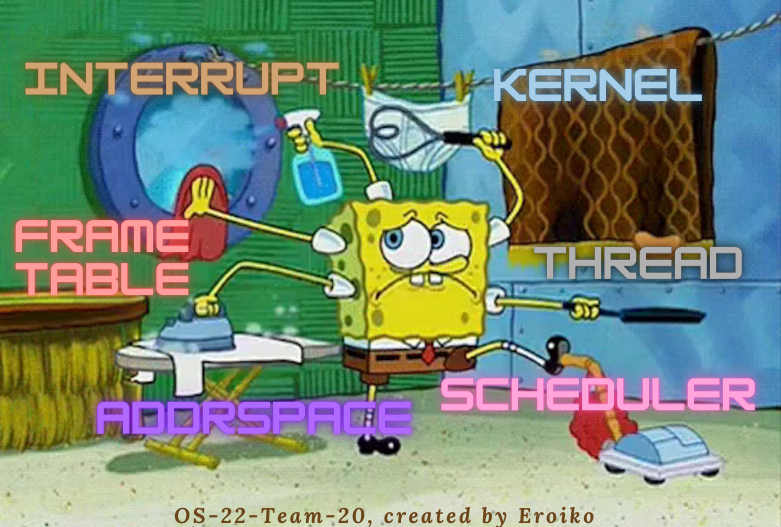
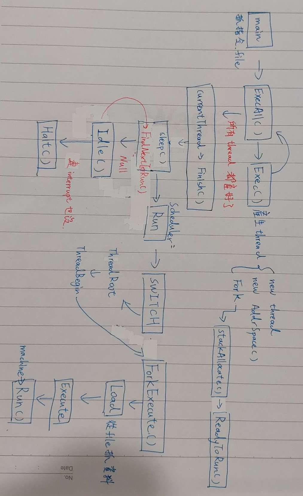
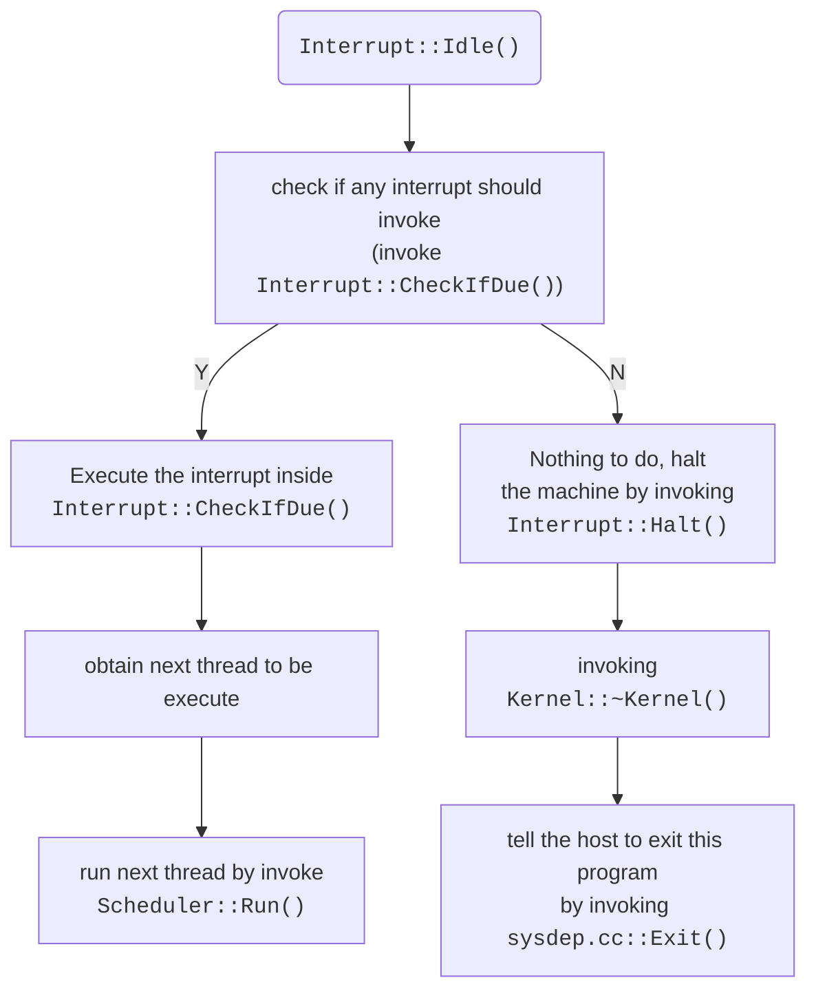
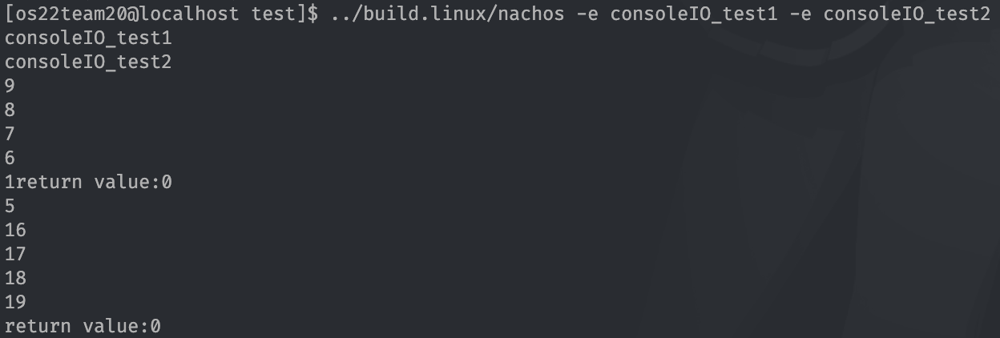
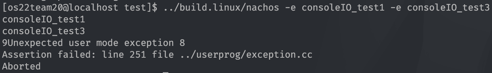

# MP2 Report from team20

> The first assignment of NachOS
>
> Course: Operating System
>
> Professor: 周志遠



## Part 1: member list and contributions

### Member list

* 109062274 資訊工程系三年級 楊子慶 `Eroiko`
* 109080076 生科院學士班三年級 俞政佑 `Blue`

### Contributions

|Items|楊子慶|俞政佑|
|:-:|:-:|:-:|
|Code tracing|V|V|
|Report of Code tracing|V||
|Explain how NachOS<br>create thread||V|
|Implementation and<br>corresponding report|V||

## Part 2-1: Trace Code

### Trace 範圍與介紹流程

* 自 `Kernel::ExecAll()` in `threads/kernel.cc`
* 到 `Thread::Sleep()` in `threads/kernel.cc`
* 直到 `Machine::Run()` in `machine/mipssim.cc`

開始追蹤 MP2 之前, 希望讀者能先去[認識 `Thread` 物件的構成](#thread-物件的構成), 以便快速進入狀況。

以下介紹流程將由 NachOS 程式的進入點開始, 透過超連結的方式一路追蹤連接各函式。函式以其檔案歸屬來編排。

下圖展示本次追蹤的幾個重要函式與方法。



### `main()`

> in `threads/main.cc`

之所以從 `main` 開始, 是想趁本次機會, 連同理解整隻 NachOS 程式的運作原理。

首先看到 `threads/main.h`, 當中定義了兩個全域變數:

* `kernel`: 作業系統本身，作為一個 `Kernel` 物件。
* `debug`: 提供除錯服務的物件。

然後請看 `main.cc` 中的 `main()`, 其任務便是初始化以上兩個全域變數。

以下為簡要版的程式碼擷取與註解。

```cpp
int main(int argc, char **argv) {
    /** 
     * Initialize some helper variables and
     * parse parameters of NachOS
     */
    for (i = 1; i < argc; i++) {
        /* parsing parameters... */
    }

    /** 
     * Initialize the two global variables
     * according to the parsed parameter
     */
    // 1. global debug object (for debug)
    debug = new Debug(debugArg);
    // 2. global kernel object (OS itself)
    kernel = new Kernel(argc, argv);
    kernel->Initialize();
    // run user program if requested
    kernel->ExecAll();
    
    // if "return", abort without clean
    ASSERTNOTREACHED();
}
```

請注意與 `kernel` 物件有關的部分，其...

1. 從和 `main()` 相同的 command line 參數來呼叫建構子 `Kernel::Kernel()`, 建構 `kernel` 物件。

    比如執行 NachOS 時的參數為

    ```bash
    ../build.linux/nachos -e consoleIO_test1 -e consoleIO_test2
    ```

    則 `Kernel::Kernel()` 會將 `consoleIO_test1` 和 `consoleIO_test2` 以檔名字串 (`char *`) 的形式, 作為將要執行的兩隻 user program, 存入 `Kernel::execfile[]` 中。

2. 呼叫 `Kernel::Initialize()` 初始化 `kernel` 物件的成員。

    當中將以名為 `"main"`、執行序流水號 `threadNum = 0` 的 `Thread` 物件初始化 `Kernel::currentThread` 成員, 並將其設為執行中 `RUNNING`。

    另將 `Kernel::threadNum` 執行序計數器遞增 $1$。

3. 初始化完 user programs 後, 呼叫 [`Kernel::ExecAll()`](#kernelexecall) 方法執行建構時搜集好的數個 user program。

可以注意到一個細節, `Kernel` 物件的建構之所以分成 `Kernel::Kernel()` 和 `Kernel::Initialize()`, 是希望將「解析 `argc` 和 `argv`」和「初始化成員」的邏輯分開, 我認為寫在同一個函式內也無妨。

到此我們理解了 NachOS 的啟動細節, 接著讓我們進一步追蹤 [`Kernel::ExecAll()`](#kernelexecall) 的細節。

### `Thread` 物件的構成

MP2 中, 能先理解 `Thread` 物件的行為, 將大幅地有助於對整體的理解。

以下為簡略版的 `Thread` 物件之定義, 我將簡述各個成員跟方法的功能。

注意, 以下為了方便閱讀與理解, 我調整了成員與方法的順序, 但並不修改原始碼, 因為原始碼的順序與其運行 [`SWITCH`](#switch) (context switch) 的正確性有關。

```cpp
class Thread {
// 1. members
private:
    // basic information of a thread
    ThreadStatus status; // ready, running or blocked
    char* name; // thread name for debug
    int ID;

    // registers
    int* stackTop; // the current stack pointer
    int* stack;    // Bottom of the stack 
    void* machineState[MachineStateSize]; // all registers except for stackTop
    int userRegisters[NumTotalRegs]; // user-level CPU register state
public:
    AddrSpace* space; // User code this thread is running

// 2. methods
public:
    // 2-1. basic object method
    Thread(char* debugName, int threadID); // initialize a Thread 
    ~Thread(); // deallocate a Thread

    // 2-2. basic thread operations
    void Fork(VoidFunctionPtr func, void *arg); // Make thread run (*func)(arg)
    void Yield(); // Relinquish the CPU if any other thread is runnable
    void Sleep(bool finishing); // Put the thread to sleep and relinquish the processor
    void Begin(); // Startup code for the thread
    void Finish(); // The thread is done executing

    // 2-3. thread status manipulator
    void CheckOverflow(); // Check if thread stack has overflowed
    void SaveUserState(); // save user-level register state
    void RestoreUserState(); // restore user-level register state

    // 2-4. getters and setters
public:
    void setStatus(ThreadStatus st) { status = st; }
    ThreadStatus getStatus() { return (status); }
private:
    char* getName() { return (name); }
    int getID() { return (ID); }

    // 2-0. private method for Thread::Fork()
    void StackAllocate(VoidFunctionPtr func, void *arg); // Allocate a stack for thread
};
```

`Thread` 物件就是 thread control block, 旨在完成執行緒的經典行為, 以下分析其成員和方法。

1. 成員分為三種, 正好是我們熟悉之執行緒所儲存的狀態。

   * 一些基本狀態資訊, 諸如 `status`, `ID`
   * 兩組保存 registers 資料的空間
     * `machineState`
       * 紀錄 kernel status registers 的預留空間
       * 內容諸如執行緒的呼叫方法 (詳見 [`StackAllocate()`](#threadstackallocate))
     * `userRegisters`
       * 紀錄 user program registers 的預留空間
       * 在 [`SaveUserState()`](#threadsaveuserstate) 中保存當前 NachOS 的 registers
       * 在 [`RestoreUserState()`](#threadrestoreuserstate) 中把記錄下的 registers 寫回 NachOS 的 registers
   * Address Space 的指標, 其管理執行檔的在記憶體的相關狀態。

   透過以上的分析, 由於其儲存 user program registers 和 kernel status registers, 我們可以總結出 <font color=#cd5c5c>**NachOS 執行緒管理的模型為 One-to-One**</font> (同 Linux) 模型, 意即對於每個 user thread, 都有其對應的 kernel thread 支持其運作。

2. 方法分為五種。

    > 不過 [`Thread::StackAllocate()`](#threadstackallocate) 是 [`Thread::Fork()`](#threadfork) 的私有幫手方法, 故只討論重要的另外四個種類。

    * 建構子與解構子
    * 執行緒的經典方法們
    * [`Fork()`](#threadfork), [`Sleep()`](#threadsleep), [`Finish()`](#threadfinish) 三者都屬於此
    * 與執行緒的狀態相關的方法
    * 會介紹 [`SaveUserState()`](#threadsaveuserstate) 和 [`RestoreUserState()`](#threadrestoreuserstate) 兩者
    * 一些 getter 和 setter

有以上先備知識, 方能自 [`main()` 開始追蹤 MP2](#main)。

### `threads/kernel.cc`

#### `Kernel::ExecAll()`

> in `threads/kernel.cc`

此方法的邏輯極其簡單, 便是連續呼叫 [`Kernel::Exec()`](#kernelexec) 方法, 將方才搜集好的數個 user program 拿去執行。

簡略程式碼如下。

```cpp
void Kernel::ExecAll() {
    for (int i = 1; i <= execfileNum; i++) 
        Exec(execfile[i]);
    currentThread->Finish();
}
```

所有 user program 都呼叫執行後, 呼叫 [`Thread::Finish()`](#threadfinish) 方法, 結束當前執行緒。

#### `Kernel::Exec()`

程式碼如下。

```cpp
int Kernel::Exec(char* name) {
    t[threadNum] = new Thread(name, threadNum);
    t[threadNum]->space = new AddrSpace();
    t[threadNum]->Fork(
        (VoidFunctionPtr) &ForkExecute, 
        (void *) t[threadNum]);
    threadNum++;

    return threadNum-1;
}
```

1. 建立新執行緒
   * 以執行緒建構子, 傳入執行檔檔名與執行緒流水號來建構
   * 儲存在 kernel 的成員  `Kernel::t` (執行緒表) 之當前執行緒流水號所索引的位置中
2. 以 [`AddrSpace::AddrSpace()`](#addrspaceaddrspace) 初始化[之前](#thread-物件的構成)提到之執行緒的 Address Space 成員: `Thread::space`
3. 用 [`Thread::Fork()`](#threadfork) 方法將此執行緒 fork 出去, 參數為
   * [`ForkExecute()`](#forkexecute) 函式指標
   * 此執行緒 (的指標) 本身
4. 將執行緒流水號遞增, 並回傳遞增前的流水號

#### `ForkExecute()`

程式碼如下。

```cpp
void ForkExecute(Thread *t) {
    // load executable and check if success or not
    if ( !t->space->Load(t->getName()) ) 
        return;             // executable not found
    // success -> execute given thread
    t->space->Execute(t->getName());
}
```

其先透過 [`AddrSpace::Load()`](#addrspaceload) 將執行檔載入記憶體, 接著透過 [`AddrSpace::Execute()`](#addrspaceexecute) 將其執行。若載入失敗, 則直接結束函式。

### `threads/thread.cc`

#### `Thread::Sleep()`

```cpp
void Thread::Sleep(bool finishing) {
    Thread *nextThread;
    
    // make sure that only current thread
    //      can invoke this method
    ASSERT(this == kernel->currentThread);
    // make sure we've turned off the interrupt
    ASSERT(kernel->interrupt->getLevel() == IntOff);

    // change thread status to "BLOCKED"
    status = BLOCKED;

    // is thread (still) queue empty? (still: while loop)
    while ((nextThread = kernel->scheduler->FindNextToRun()) == NULL) {
        // empty -> no next thread to run, wait for an interrupt
        kernel->interrupt->Idle();
    }    
    // not empty -> returns when it's time for us to run
    kernel->scheduler->Run(nextThread, finishing); 
}
```

其行為如下。

1. 確保呼叫此方法的合法性
2. 將當前執行緒的狀態設為 `BLOCKED`
3. 以 [`Scheduler::FindNextToRun()`](#schedulerfindnexttorun) 尋找並呼叫下一個待執行的執行緒, 若下一個執行緒...
    * 存在, 則呼叫 [`Scheduler::Run()`](#schedulerrun) 方法, 完成本函數的邏輯:「終止當前執行緒, 並執行下一個執行緒」
    * 沒有, 則呼叫 [`Interrupt::Idle()`](#interruptidle) 方法, 處理尚未完成的 interrupt, 抑或直接關機

#### `Thread::StackAllocate()`

以下為簡略版程式碼與註解。

```cpp
void
Thread::StackAllocate(VoidFunctionPtr func, void *arg) {
    // Allocate a fix-sized (8192 int space) stack memory 
    stack = (int *) AllocBoundedArray(StackSize * sizeof(int));
    /** 
     * Adjust the stack and stackTop pointer
     * for different architecture: 
     * PARISC, SPARC, PowerPC, DECMIPS, ALPHA, x86
     **/
// #ifdef ...
    /* ... */
// #endif
    
    /** 
     * Initialize Kernel Registers (machineState)
     * for PARISC or the other architecture
     */
#ifdef PARISC
    // the same logic as the code below, just for PARISC arch
#else
    // saving thread invoking routine
    machineState[PCState] = (void*) ThreadRoot;
    // void ThreadRoot() above will invoke
    //      the routines saved below
    machineState[StartupPCState] = (void*) ThreadBegin;
    machineState[InitialPCState] = (void*) func;
    machineState[InitialArgState] = (void*) arg;
    machineState[WhenDonePCState] = (void*) ThreadFinish;
#endif
}
```

其行為為

1. 準備固定大小的 stack memory
   * 為不同架構特別處理 stack memory 的細節
2. 將 [`ThreadRoot 與其他 Routine`](#threadroot) 存入 Kernel Registers

另外注意到用來初始化 `Thread::stack` 的 [`AllocBoundedArray()`](#allocboundedarray) 函式。之後將會介紹其細節。

#### `Thread::Finish()`

程式碼如下。

```cpp
void Thread::Finish() {
    // turn off the interrupt
    (void) kernel->interrupt->SetLevel(IntOff);
    
    // make sure that only current running thread
    //      can call the finish method
    ASSERT(this == kernel->currentThread);
    /* ... Some debug message */
    Sleep(TRUE); // invokes SWITCH
    // not reached
}
```

首先確保僅 `kernel->currentThread` 可以呼叫此方法, 並呼叫自身物件之 [`Thread::Sleep()`](#threadsleep) 方法來完成執行緒的中止行為, 其傳入 `TRUE` 表示此**執行緒已經結束, 請排程器此執行緒刪掉**。如此一來 [`Thread::Sleep()`](#threadsleep) 方法同時實作了正常的 sleep 邏輯和結束執行緒的邏輯。

#### `Thread::Fork`

以下為簡略版程式碼與註解。

```cpp
void Thread::Fork(VoidFunctionPtr func, void *arg) {
    // for abbreviation (rename variable)
    Interrupt *interrupt = kernel->interrupt;
    Scheduler *scheduler = kernel->scheduler;
    // Allocating Stack Memory
    StackAllocate(func, arg);
    // turn off interrupt
    IntStatus oldLevel = interrupt->SetLevel(IntOff);
    // ReadyToRun assumes that interrupts are disabled!
    scheduler->ReadyToRun(this); 
    // restore interrupt status
    (void) interrupt->SetLevel(oldLevel);
}  
```

可以看見 NachOS 要 Fork 一個執行緒的過程為

1. Allocate Stack Memory use [`Thread::StackAllocate()`](#threadstackallocate)
2. Disable interrupt and schedule current thread using [`Scheduler::ReadyToRun()`](#schedulerreadytorun)
3. Restore original interrupt status

#### `Thread::SaveUserState()`

程式碼如下。

```cpp
void Thread::SaveUserState() {
    for (int i = 0; i < NumTotalRegs; i++)
        userRegisters[i] = kernel->machine->ReadRegister(i);
}
```

將所有當前 registers 的值存入本執行緒的成員 `userRegisters` 中。

#### `Thread::RestoreUserState()`

程式碼如下。

```cpp
void Thread::RestoreUserState() {
    for (int i = 0; i < NumTotalRegs; i++)
        kernel->machine->WriteRegister(i, userRegisters[i]);
}
```

將所有本執行緒的成員 `userRegisters` 的值復原回當前 registers 中。

### `userprog/addrspace.cc`

#### `AddrSpace::AddrSpace()`

以下為程式碼。

```cpp
AddrSpace::AddrSpace() {
    /* Initialize page table with NumPhysPages (default 128) pages */
    pageTable = new TranslationEntry[NumPhysPages];

    /* Initialize all the entries */
    for (int i = 0; i < NumPhysPages; i++) {
        // for now, virt page # = phys page #
        pageTable[i].virtualPage = i;
        pageTable[i].physicalPage = i;
        // other bits that shows
        // some properties of entry
        pageTable[i].valid = TRUE;  //是否在使用
        pageTable[i].use = FALSE;   //是否被使用過
        pageTable[i].dirty = FALSE; //對應的物理頁使用情況, true 表被寫過
        pageTable[i].readOnly = FALSE;  //是否只能讀
    }
    
    // zero out the entire address space
    bzero(kernel->machine->mainMemory, MemorySize);
}
```

預設的 Address Space 的建構邏輯很簡單。即先以 `TranslationEntry` 來建構 `AddrSpace::pageTable`, 並初始化其所有欄位, 最後把主記憶體清為零。

#### `AddrSpace::Execute()`

簡略程式碼如下。

```cpp
void 
AddrSpace::Execute(char* fileName) {
    kernel->currentThread->space = this;

    // initialize registers
    this->InitRegisters();
    // load page table register
    this->RestoreState();

    // jump to the user program
    kernel->machine->Run();
    // machine->Run never returns;
    ASSERTNOTREACHED();
}
```

其行為很簡單: 執行當前執行緒, 其呼叫之兩個 `AddrSpace` 方法的細節如下。

* `AddrSpace::InitRegisters()`

    初始化所有 registers, 程式碼與註釋如下。

    ```cpp
    void AddrSpace::InitRegisters() {
        // abbreviate variable
        Machine *machine = kernel->machine;

        // initialize all registers with 0
        int i;
        for (i = 0; i < NumTotalRegs; i++)
            machine->WriteRegister(i, 0);

        // initialize three special registers
        // 1. program counter, assumed VA zero
        machine->WriteRegister(PCReg, 0);
        // 2. next PC register for branch delay
        machine->WriteRegister(NextPCReg, 4);
        // 3. stack register to the end of the address space
        machine->WriteRegister(StackReg, numPages * PageSize - 16);
    }
    ```

* `AddrSpace::RestoreState()`

    將 NachOS 的 page table 以本物件的兩個成員復原為此 Address Space 的狀態。程式碼如下。

    ```cpp
    void AddrSpace::RestoreState() {
        kernel->machine->pageTable = pageTable;
        kernel->machine->pageTableSize = numPages;
    }
    ```

另外特別注意到, 此函式的輸入並沒有使用到, 也許是實作時可以使用的一個參數。

如此一來, 透過最後呼叫的 `machine->kernel->Run()`, 我們成功執行起新的執行緒。

#### `AddrSpace::Load()`

以下為其精簡版程式碼與註解。

```cpp
bool AddrSpace::Load(char *fileName) {
    /** 
     * 1. Open executable
     */
    OpenFile *executable = kernel->fileSystem->Open(fileName);
    NoffHeader noffH;
    unsigned int size;

    if (executable == NULL) 
        return FALSE;

    /** 
     * 2. Load executable to noffH
     */
    executable->ReadAt((char *)&noffH, sizeof(noffH), 0);
    // manipulate noffH.noffMagic when 
    //      the host is big endian
    if ((noffH.noffMagic != NOFFMAGIC) && 
        (WordToHost(noffH.noffMagic) == NOFFMAGIC)) {
        // swap from little endian to big endian format
        SwapHeader(&noffH);
    }
    // noffH.noffMagic should be NOFFMAGIC, 
    //      marking that file-read works successfully
    ASSERT(noffH.noffMagic == NOFFMAGIC);

    /** 
     * 3. Calculate the size of Address Space
     * 
     * 3-1. evaluate the size of address space
     * 3-2. estimate the numbers of pages we need
     * 3-3. retrieve the real size of Address Space
     */

    // 3-1. calculate the (least) size of address space
#ifdef RDATA
    size = noffH.code.size + noffH.readonlyData.size
        + noffH.initData.size + noffH.uninitData.size + UserStackSize;
#else
    size = noffH.code.size + noffH.initData.size
        + noffH.uninitData.size + UserStackSize;
#endif
    // 3-2. calculate numbers of pages
    numPages = divRoundUp(size, PageSize);
    // 3-3. re-calculate the real size of address space
    size = numPages * PageSize;
    // check this before virtual memory is implemented
    ASSERT(numPages <= NumPhysPages);

    /** 
     * 4. Copy our code and data segments into memory
     * 
     * Note: this code assumes that
     * virtual address == physical address
     * 
     * Reading content of executable to Memory if
     * the corresponding segment exist
     */

    if (noffH.code.size > 0) {
        // Initializing code segment
        executable->ReadAt(
        &(kernel->machine->mainMemory[noffH.code.virtualAddr]), 
            noffH.code.size, noffH.code.inFileAddr);
    }

    if (noffH.initData.size > 0) {
        // Initializing data segment
        executable->ReadAt(
        &(kernel->machine->mainMemory[noffH.initData.virtualAddr]),
            noffH.initData.size, noffH.initData.inFileAddr);
    }

#ifdef RDATA // read only case
    if (noffH.readonlyData.size > 0) {
        // Initializing read only data segment
        executable->ReadAt(
        &(kernel->machine->mainMemory[noffH.readonlyData.virtualAddr]),
            noffH.readonlyData.size, noffH.readonlyData.inFileAddr);
    }
#endif

    /** 
     * 5. close executable and return success
     */
    delete executable; // close file
    return TRUE; // success
}
```

載入檔案的邏輯如下。

1. 開啟執行檔, 若開啟失敗則加載失敗, 回傳 `FALSE`

2. 讀取整個執行檔, 存入 `NoffHeader` 中

    特別注意, `COFF` 表示 [Common Object File Format](https://en.wikipedia.org/wiki/COFF), 為 Unix 家族共通的執行檔格式。`NOFF` 則是 NachOS Object File Format, 其細節以及與 `COFF` 的轉換定義在 `userprog/noff.h` 中。

    其確認讀檔是否成功, 包含處理 big/little endian host 的議題: 成功時 `noffH.noffMagic` 須為 `NOFFMAGIC`

3. 計算 Address Space 的大小

4. 將 `code`, `initData` 和 `readonlyData` 這三個區段載入主記憶體。(後者看是否有 `RDATA` 巨集定義)

5. 關閉方才開啟的執行檔, 並回傳成功執行。

### `threads/scheduler.cc`

#### `Scheduler::FindNextToRun()`

程式碼如下。

```cpp
Thread * Scheduler::FindNextToRun() {
    ASSERT(kernel->interrupt->getLevel() == IntOff);

    if (readyList->IsEmpty())
        return NULL; // nothing to remove
    else 
        return readyList->RemoveFront();
}
```

邏輯十分簡單清晰。首先確定當前並非中斷狀態, 再來在本 Scheduler 的成員: 待執行隊列 `Scheduler::readyList` 中, 尋找下一個可執行的執行緒。有則回傳之, 無則回傳 `NULL`。

#### `Scheduler::ReadyToRun()`

程式碼如下。

```cpp
void Scheduler::ReadyToRun(Thread *thread) {
    ASSERT(kernel->interrupt->getLevel() == IntOff);

    thread->setStatus(READY);
    readyList->Append(thread);
}
```

邏輯和 [`Scheduler::FindNextToRun()`](#schedulerfindnexttorun) 一樣簡單清晰。首先確定當前並非中斷狀態, 再來將當前執行緒設為準備狀態, 最後將本線程放入本 Scheduler 的成員: 待執行隊列 `Scheduler::readyList`。

#### `Scheduler::Run()`

```cpp
void Scheduler::Run(Thread *nextThread, bool finishing) {
    // fetching current thread
    Thread *oldThread = kernel->currentThread;
    
    ASSERT(kernel->interrupt->getLevel() == IntOff);

    // finishing == true:
    //      need to delete current thread
    if (finishing) {
        // assert the "toBeDestroyed" member
        //      doesn't hold any thread that
        //      should have been destroyed
        ASSERT(toBeDestroyed == NULL);
        toBeDestroyed = oldThread;
    }
    
    // if this thread is a user program
    if (oldThread->space != NULL) {
        // save the user's CPU registers and program block
        oldThread->SaveUserState();
        oldThread->space->SaveState();
    }

    // check if the old thread
    //      had an undetected stack overflow
    oldThread->CheckOverflow();

    // switch to the next thread
    kernel->currentThread = nextThread; 
    // nextThread is now running
    nextThread->setStatus(RUNNING);
    
    // context switch
    SWITCH(oldThread, nextThread);

    // we're back, running oldThread
    //      interrupts are off when we return from switch!
    ASSERT(kernel->interrupt->getLevel() == IntOff);

    // check if thread we were running
    //      before this one has finished
    //      and needs to be cleaned up
    CheckToBeDestroyed();

    // if this thread is a user program
    if (oldThread->space != NULL) {
        // restore status of it
        oldThread->RestoreUserState();
        oldThread->space->RestoreState();
    }
}
```

執行新的執行緒, 我們需要進行 context switch, 執行完後也可能需要 context switch 回來。

以下簡述其流程。

1. Context switch 之前

   * 若輸入的參數 `finishing` 為 `true`...

     * 表示切換到下一個執行緒後, 當前執行緒已經沒用了, 應該被刪除

     * 因此先儲存當前執行緒的指標至 `Thread::toBeDestroyed`

   * 若當前執行緒為 user program, 則在 context switch 之前, 透過 `Thread::SaveUserStatus()` 和 `AddressSpace::SaveStatus()` 將 registers 和 `AddressSpace` 的資訊客製化的儲存好。

2. Context switch

   * 切換執行緒

   * 設定切換之執行緒的狀態為 `RUNNING`

   * 呼叫 [`SWITCH`](#switch) 進行 context switch, 細節詳見[超連結](#switch)

3. Context switch back

   * 執行 `Thread::CheckToBeDestroyed()`, 程式碼如下

        ```cpp
        void Scheduler::CheckToBeDestroyed() {
            if (toBeDestroyed != NULL) {
                delete toBeDestroyed;
                toBeDestroyed = NULL;
            }
        }
        ```

        若方才輸入的參數 `finishing` 為 `true`, 則 `Thread::toBeDestroyed` 非 `NULL`, 那該執行緒就會因此被刪除。注意 `Thread` 的解構子僅會將其在 [`StackAllocate`](#threadstackallocate) 獲得的 stack 記憶體空間移除, 不會真的把 `Thread` 物件的所有位於 Heap Memory 的成員都刪掉 (當然 Stack Memory 都會被 C++ delete 函式回收)。

   * 若之前的執行緒執行了 user program, 且...
     * 本執行緒要被刪除: 則其 `Thread::space` 成員的記憶體命沒有被真正釋放, 可以在 [`Thread::RestoreUserState()`](#threadrestoreuserstate) 或者之前的 `Thread::SaveUserStatus()` 中完成這部分的行為。

     * 本執行緒要繼續執: 則可以呼叫 `Thread::RestoreUserStatus()`, `AddressSpace::RestoreStatus()` 來重新載回與 register, `AddressSpace` 相關的資訊。

### 其他函式

> main 函式獨立出來, 在最前面 :)

#### `ThreadRoot()`

ThreadRoot 定義於 `threads/switch.S`, 會呼叫以下函式

1. `static void ThreadBegin()`

    即呼叫 kernel 中當前執行緒的啟動方法。

    ```cpp
    /* in threads/thread.cc  */
    static void ThreadBegin() {
        kernel->currentThread->Begin();
    }
    ```

2. `void * func(arg)`
    > 或者寫成 `VoidFunctionPtr func(arg)`

    `func` 和 `arg` 為本方法 `Thread::StackAllocate` 的兩個參數。

3. `static void ThreadFinish()`

    即呼叫 kernel 中當前執行緒的結束方法。

    ```cpp
    /* in threads/thread.cc  */
    static void ThreadFinish() { 
        kernel->currentThread->Finish();
    }
    ```

#### `AllocBoundedArray()`

> in `lib/sysdep.cc`

以下為程式碼與註解。注意到 `lib/sysdep.cc` 中的函式都是 host 提供的服務。

```cpp
char * AllocBoundedArray(int size) {
#ifdef NO_MPROT // no memory protect
    return new char[size];
#else // with memory protection
    // fetch page size
    int pgSize = getpagesize();
    // initialize memory space with 2 pages more than the request
    char *ptr = new char[pgSize * 2 + size];
    // protect mem: [ptr, ptr + pgSize)
    mprotect(ptr, pgSize, PROT_NONE);
    // protect mem: 
    //      [ptr + psSize + size, ptr + 2 * psSize + size)
    mprotect(ptr + pgSize + size, pgSize, PROT_NONE);
    // return the protected part
    return ptr + pgSize;
#endif
}
```

特別注意到其保護記憶體的邏輯。首先先用 `new` 取得比需求還大 $2$ 個 page 的空間。接著用 `mprotect` 保護此空間上下兩的 page, 形成一個三明治的記憶體組成。下表總結其記憶體的配置。

|content|addr (from)|addr (to)|
|:-:|:-:|:-:|
|MAX|MAX|MAX|
|...|...|...|
|保護緩衝區|`ptr + psSize + size`|`ptr + 2 * psSize + size`|
|使用之記憶體|`ptr + pgSize`|`ptr + psSize + size`|
|保護緩衝區|`ptr`|`ptr + pgSize`|
|...|...||
|0|0|0|

另外注意, [`mprotect` 為定義在 `<sys/mman.h>` 下的函式](https://man7.org/linux/man-pages/man2/mprotect.2.html), 屬於 host OS 的功能, 其簽名如下。

```cpp
int mprotect(void *addr, size_t len, int prot);
```

輸入輸出如下表。

|`addr`|`len`|`prot`|return value|
|:-:|:-:|:-:|:-:|
|起始位址|保護長度|限制訪問規則的 flag<br>定義於 `<unistd.h>`|`0` if ok<br>otherwise `-1`|

利用此函式, 便完成配置一個有界記憶體的行為。

#### `Interrupt::Idle()`

> in `machine/interrupt.cc`

當 NachOS 沒事做, i.e. ready queue 沒東西時, 就會呼叫此函式。

以下為簡略程式碼與註解。

```cpp
void Interrupt::Idle()
{
    status = IdleMode; // in idle mode

    // check for any pending interrupts
    if (CheckIfDue(TRUE)) {// invoke interrupt
        status = SystemMode;
        return;// return in case there's now
                // a runnable thread
    }

    // no ready process, no interrupt
    // -> nothing to do, halt the machine
    Halt();
}
```

此函式的細節可由下圖表示。



#### `SWITCH`

> in `threads/switch.S`

`SWITCH` (context switch) 是由組合語言實現於 `threads/switch.S` 中, 其定義如下。

```cpp
void SWITCH(Thread *oldThread, Thread *newThread);
```

行為是將...

* 當前 CPU register 的值放入舊執行緒之 thread control block 的 registers 區塊中

    > 實作上是將 register 的值放入 `Thread::stackTop` 指標所指向的區塊

* 取出新執行緒保存在 thread control block 之 registers 區塊的值, 寫入 CPU register

    > 實作上是取得 `Thread::stackTop` 指摽指向之區塊的值, 寫入 register

有趣的是, 可以發現以上實作的正確性建立在 `Thread::stackTop` 成員一定要在 `Thread` 物件的起始位置, 故我們<font color=#cd5c5c>**不可任意修改 `Thread` 的成員順序**</font>。

## Part 2-2: Q & A

### 1. How does Nachos allocate the memory space for a new thread (process)?

1. 在`fork()`的時候我們會呼叫 `StackAllocate(func, arg)`
2. 其中又執行 `stack = (int *) AllocBoundedArray(StackSize * sizeof(int));`
3. 其中 `AllocBoundedArray` 會回傳記憶體位置, 其位置到加上 Size 的區塊為使用的記憶體, 其上下會有保護緩衝區。

### 2. How does Nachos initialize the memory content of a thread (process), including loading the user binary code in the memory?

1. 我們會透過 `AddrSpace()` 來初始化 Thread 的 space , 在 `AddrSpace()`時, `bzero()` 會將 `kernel->machine->mainMemory` 都設成 0

2. 當我們都將 thread 送到 `readyList` 後,會呼叫 `Finish()`,其會把 interrupt 關掉,並呼叫 `sleep()`, 接著依情況進入 [`kernel->scheduler->Run(nextThread, finishing)`](#schedulerrun) , 隨後進行 `context switch` 就會執行 `ThreadRoot`

3. [`ThreadRoot`](#threadroot) 又會執行 `ThreadBegin`,將 interrupt 打開,接著執行`func`

4. `func` 就是 [`ForkExecute()`](#forkexecute) 包含 [`AddrSpace::Load()`](#addrspaceload), [`AddrSpace::Execute()`](#addrspaceexecute)

5. 其中 [`AddrSpace::Load()`](#addrspaceload) 會我們要執行的資料讀進 `mainMemory`

    ```c++
    if (noffH.code.size > 0) {
        // Initializing code segment
        executable->ReadAt(
        &(kernel->machine->mainMemory[noffH.code.virtualAddr]), 
            noffH.code.size, noffH.code.inFileAddr);
    }

    if (noffH.initData.size > 0) {
        // Initializing data segment
        executable->ReadAt(
        &(kernel->machine->mainMemory[noffH.initData.virtualAddr]),
            noffH.initData.size, noffH.initData.inFileAddr);
    }

    #ifdef RDATA // read only case
    if (noffH.readonlyData.size > 0) {
        // Initializing read only data segment
        executable->ReadAt(
        &(kernel->machine->mainMemory[noffH.readonlyData.virtualAddr]),
            noffH.readonlyData.size, noffH.readonlyData.inFileAddr);
    }
    ```

6. `AddrSpace::Execute()` 會呼叫 `AddrSpace::InitRegisters()`,`AddrSpace::RestoreState()` 參考[AddrSpace::Execute()](#addrspaceexecute)
   1. `AddrSpace::InitRegisters()`:會初始化 register

        ```c++
        for (i = 0; i < NumTotalRegs; i++)
            machine->WriteRegister(i, 0);
        machine->WriteRegister(PCReg, 0);
        machine->WriteRegister(NextPCReg, 4);
        machine->WriteRegister(StackReg, numPages * PageSize - 16);
        ```

   2. `AddrSpace::RestoreState()`: 復原 page table

        ```c++
        kernel->machine->pageTable = pageTable;
        kernel->machine->pageTableSize = numPages;
        ```

7. 呼叫 `kernel->machine->Run()` 開始執行

### 3. How does Nachos create and manage the page table?

1. `在 new thread` 後,我們要初始化 thread 的 AddrSpace() ,因為目前 virt page = phys page ,所以只要直接對應即可

    ```c++
        pageTable = new TranslationEntry[NumPhysPages];

        /* Initialize all the entries */
        for (int i = 0; i < NumPhysPages; i++) {
            // for now, virt page # = phys page #
            pageTable[i].virtualPage = i;
            pageTable[i].physicalPage = i;
            // other bits that shows
            // some properties of entry
            pageTable[i].valid = TRUE;  // 是否在使用
            pageTable[i].use = FALSE;   // 是否被使用過
            pageTable[i].dirty = FALSE; // 對應的物理頁使用情況, true 表被寫過
            pageTable[i].readOnly = FALSE; // 是否只能讀
        }
    ```

2. 另外 manage 的部分透過 valid (是否在使用),use (是否被使用過),dirty (對應的物理頁使用情況),readOnly (是否只能讀) 來進行操控

### 4. How does Nachos translate addresses?

NachOS 將位址翻譯實作於 `AddrSpace::Translate` 方法。

由於虛擬記憶體與實體記憶體的關係為

$$
\rm{Physical Addr} = \rm{PageTable [ \rm{Page\ Num} ] } \times \rm{Page\ Size} + \rm{Page\ Offset}
$$

故 `AddrSpace::Translate` 依序取得

* $\rm{Page\ Num}$: `vpn = vaddr / PageSize`

* $\rm{Page\ Offset}$: `offset = vaddr % PageSize`

* $\rm{Page\ Table\ Entry}$: `pte = &pageTable[vpn]`

* $\rm{PageTable [ \rm{Page\ Num} ] }$: `pfn = pte->physicalPage`

所以

$\rm{Physical Addr}$: `*paddr = pfn * PageSize + offset`

最後適度的注意例外與調整 `use`, `dirty` bit 即可完成位址翻譯與維護 `pageTable`。

### 5. How Nachos initializes the machine status (registers, etc) before running a thread (process)

1. 我們會透過 `AddrSpace()` 來初始化 Thread 的 space , 在 `AddrSpace()`時, `bzero()` 會將 `kernel->machine->mainMemory` 都設成 0
2. 當我們要讓 Thread 去執行,會呼叫 `fork()` 接著
   1. 呼叫 `StackAllocate(func, arg)` , 會初始化 Kernel Registers (machineState)

        ```c++
        machineState[PCState] = (void*) ThreadRoot;
        machineState[StartupPCState] = (void*) ThreadBegin;
        machineState[InitialPCState] = (void*) func;
        machineState[InitialArgState] = (void*) arg;
        machineState[WhenDonePCState] = (void*) ThreadFinish;
        ```

   2. 將 interrupt 關掉
   3. 調用 `ReadyToRun()` Thread 準備被執行
   4. 回復原本的 interrupt 狀態

### 6. Which object in Nachos acts the role of process control block

[`class Thread`](#thread-物件的構成) 這個 object 相當於 Nachos 中的 process control block ,他的功能如下,

   1. 紀錄基本訊息: name, ID, status 等
   2. 紀錄相關空間:`machineState`, `userRegisters`, `Address Space`
   3. 對於 Thread 的各項操作:
      1. [`Fork()`](#threadfork): Make thread run
      2. [`Sleep()`](#threadsleep): Put the thread to sleep and relinquish the processor
      3. [`Finish()`](#threadfinish): The thread is done executing
      4. `setStatus()`: 改變 thread 的狀態 (`JUST_CREATED`, `RUNNING`, `READY`, `BLOCKED`, `ZOMBIE`)
      5. `Yield()`: Relinquish the CPU if any other thread is runnable

### 7. When and how does a thread get added into the ReadyToRun queue of Nachos CPU scheduler?

1. 一開始我們會執行 [`main()`](#main), 創建 kernel 並初始化他,並將我們要執行的 user program 存到 `Kernel::execfile[]`
2. 呼叫 [`Kernel::ExecAll()`](#kernelexecall) 會依照我們有幾個 user program 呼叫 [`Kernel::Exec()`](#kernelexec)
   1. [`Kernel::Exec()`](#kernelexec) 會創一個 thread , 接著透過 `new AddrSpace()` 來初始化 thread 的 AddrSpace
   2. 最後呼叫 [`Fork()`](#threadfork), 他會先透過 [`StackAllocate(func, arg)`](#threadstackallocate) , allocating stack memory, 並關閉 interrupts 接著呼叫 [`scheduler->ReadyToRun(this)`](#schedulerreadytorun), 其會將 thread 設為 `READY`, 並將此 thread 加到 `readyList` 中

## Part 2-3: Explain the implementation Part

### Purpose

由 Spec 的提示, 我們將修改以下檔案:

* Main Logic
  * `userprog/addrspace.*`
  * `threads/kernel.*`

* Exception related
  * `machine.h::ExceptionType`
  * `userprog/exception.cc` (這次不用改, 直接當做 `Unexpected use mode exception` 來處理!!!)

並須符合以下要求:

* 紀錄已經使用之實體記憶體的資料結構需儲存在 `kernel.*` 中
* 須設定 Page Table 中各個 `TranslationEntry` 物件的 `valid`, `readOnly`, `use`, `dirty` 欄目
* 當記憶體不足時, 需呼叫 `ExceptionHandler()`
  * 為 `MemoryLimitException`
  * 在 `ExceptionType` 中並沒有定義此例外
  * 要手動加在 `NumExceptionTypes` 例外之前
  * 自己寫記憶體不足相關的測資, 助教會用隱藏測資來測 $\rightarrow$ `consoleIO_test3.c`
* 執行緒結束時, 確保回復舊執行緒的狀態

### `machine.h::ExceptionType`

這裡的修改很簡單, 就是依要求加上 `MemoryLimitException` (enum value: $8$), 如下。

```cpp
enum ExceptionType {
    NoException,           // Everything ok!
    SyscallException,      // A program executed a system call.
    PageFaultException,    // No valid translation found
    ReadOnlyException,     // Write attempted to page marked 
                           // "read-only"
    BusErrorException,     // Translation resulted in an 
                           // invalid physical address
    AddressErrorException, // Unaligned reference or one that
                           // was beyond the end of the
                           // address space
    OverflowException,     // Integer overflow in add or sub.
    IllegalInstrException, // Unimplemented or reserved instr.
             
    MemoryLimitException,  // Insufficient memory = 8, CHANGE HERE!!!
    NumExceptionTypes
};
```

### `FrameTable` 資料結構的設計與實作

#### 規格設計

> "data structure recording used physical memory" -- spec

以上引言相當於要我們設計一個自己的 Frame Table, 並擁有類似 MMU 的功能, 可以管理 Frame Table, 並為執行緒產生 Page Table。

故我希望設計 `FrameTable` 物件, 其提供以下方法。

* `FrameTable`: 建構子

* `~FrameTable`: 解構子

* `Allocate`: 尋找指定頁數的實體記憶體空間, 製成並返回 `PageTable` (a.k.a. `TranslationEntry *`)

* `Release`: 釋放 `PageTable` 中紀錄的實體記憶體分頁

* `RemainSize`: 剩餘之實體記憶體的頁面數量

#### 物件定義

`FrameTable` 物件的定義在 `addrspace.h` 中, 程式碼如下。

```cpp
/** 
 * Data structure of Virtual Memory
 */
typedef TranslationEntry* PageTable;

/** 
 * Data structure of Physical Memory
 */
class FrameTable {
public:
    /** 
     * Initialize a frame table
     */
    FrameTable();
    ~FrameTable();

    /** 
     * Allocate pageNum of frames (pages) and collect
     * corresponding translation information into a page table.
     * 
     * @param pageNum numbers of pages
     * @return a new Page table, NULL if not enough memory space
     */
    PageTable Allocate(uint pageNum);

    /** 
     * Release the physical memory frame 
     * which the info stored in PageTable
     */
    void Release(PageTable ptb, int pageNum);

    /** 
     * @return the remaining numbers of entry of the frame table
     */
    uint RemainSize();

private:
    List<int> available;
};
```

另外注意到上方程式最前面, 為了命名方便, 我定義 `PageTable` 型別如下。

```cpp
typedef TranslationEntry* PageTable;
```

#### 實作環節

`FrameTable` 的實作在 `userprog/addrspace.cc` 中。以下幾點將闡述過程。

#### 1. 概念

首先讓我簡單分析我們需求: 盡可能快速取得未使用的實體記憶體, 並在釋放記憶體時紀錄釋放掉的頁面, 以空間換取時間。

故我選則 Queue 資料結構, 將可使用的頁面存入其中, 當被使用時將這些頁面取出, 釋放時再存回隊列。

在 NachOS 中, 我們可以利用 `lib/list.h` 的 `List` 資料結構作為隊列來使用。

#### 2. `FrameTable::FrameTable`

以實體記憶體大小來初始化隊列, 複雜度 $O(NumPhysPages)$。

```cpp
FrameTable::FrameTable() {
    for (int i = 0; i < NumPhysPages; ++i)
        available.Append(i);
}
```

#### 3. `FrameTable::~FrameTable`: 目前沒做任何事, 保留給未來

#### 4. `FrameTable::RemainSize`

邏輯簡單, 複雜度 $O(1)$。

```cpp
uint FrameTable::RemainSize() {
    return available.NumInList();
}
```

#### 5. `FrameTable::Allocate`

核心方法, 不過邏輯依然簡單, 即取出指定數量個頁面建立 `PageTable`, 初始化後返回, 複雜度 $O(pageNum * bzero)$

```cpp
PageTable FrameTable::Allocate(uint pageNum) {
    // if not enough memory
    if (RemainSize() < pageNum) 
        return NULL;

    PageTable ptb = new TranslationEntry[pageNum];

    for (int i = 0; i < pageNum; ++i) {
        ptb[i].virtualPage = i;
        int f = available.RemoveFront(); // frame number
        ptb[i].physicalPage = f;
        // initialize flags
        ptb[i].valid = TRUE;
        ptb[i].use = FALSE;
        ptb[i].dirty = FALSE;
        ptb[i].readOnly = FALSE;
        // zero out the entire address space
        bzero(kernel->machine->mainMemory + f * PageSize, PageSize);
    }
    return ptb;
}
```

#### 6. `FrameTable::Release`

和 `FrameTable::Allocate` 相呼應, 將輸入之 `PageTable` 中紀錄的 frame 資訊存回隊列中, 複雜度 $O(pageNum)$。

```cpp
void FrameTable::Release(PageTable ptb, int pageNum) {
    if (!ptb)
        return; // nothing to release
    for (int i = 0; i < pageNum; ++i)
        available.Append(ptb[i].physicalPage);
    delete [] ptb;
}
```

有了以上資料結構後, 我們可以繼續實作後續要求。

### `threads/kernel.*`

#### `kernel.h`

加上方才實作好的資料結構。

```cpp
// include our data structure
#include "addrspace.h"
class Kernel {
    // ...
    // public members of Kernel object
    int hostName; // machine identifier

    // add our data structure here
    FrameTable *frameTable;

private:
    // ...
};
```

#### `kernel.cc`

加入資料結構成員後, 我們需要管理其記憶體, 對應 `Kernel::Initialize()` 和 `Kernel::~Kernel()` 兩個方法。

```cpp
void Kernel::Initialize() {
    /* ... allocate many members */
    frameTable = new FrameTable();

    interrupt->Enable();
}
```

```cpp
Kernel::~Kernel(){
    /* ... delete many members */
    delete frameTable;

    Exit(0);
}
```

### `addrspace.cc`

#### `AddrSpace::AddrSpace`

原本執行緒建立時, 就立刻初始化 `Thread::space` (i.e. `AddrSpace` 物件, 內容為 page table 與其他資訊) 成員。但啟用虛擬記憶體後, 執行緒確立其 Address Space 的時機變成在此執行緒被 scheduler 切換為 `RUNNING` 之前, 並在切換成 `BLOCKING` 時釋放。

故我們不應該在執行緒被建立時就確立其 Address Space, 所以我們可以調整建構子, 將 `AddrSpace::pageTable` 設為 `NULL`。

```cpp
AddrSpace::AddrSpace() {
    pageTable = NULL; // initialize with NULL
}
```

之所以會設為 `NULL`, 是因為之後 `pageTable` 透過 [`FrameTable::Allocate()`](#5-frametableallocate) 方法取得新 `PageTable` 後, 其位址必不為 `NULL`, 故 `pageTable` 可以作為一個儲存我們產生了 `PageTable` 與否的標記。

#### `AddrSpace::~AddrSpace`

由[程式碼追蹤環節](#schedulerrun), 我們清楚定址空間物件會在擁有其參考的執行緒進入 `BLOCKING` 狀態時被釋放, 其釋放方法為 `delete` 函式, 故我們釋放 `PageTable` 的邏輯需要寫在這裡。

透過 `FrameTable::Release` 方法, 我們可以輕鬆歸還 `PageTable`, 讓 `FrameTable` 為我們釋放記憶體, 並為接下來的請求做準備。

```cpp
AddrSpace::~AddrSpace() {
   // release frame table by page table
    kernel->frameTable->Release(pageTable, numPages);
}
```

#### `AddrSpace::Load`

最重要的就是本方法了。由[程式碼追蹤環節](#schedulerrun), 我們知道當擁有此定址空間物件之執行緒進入 `RUNNING` 時, 會讀取執行檔並寫入記憶體中。此時正是我們配置 `PageTable` 的好時機。因為我們要決定虛擬記憶體與實體記憶體的對應關係, 才能將執行檔寫入正確的記憶體分頁中。

首先, 模板已經提供 `numPages` 變數, 紀錄要建立多少個分頁, 故我們透過 `FrameTable::Allocate` 建立 `PageTable`。若實體記憶體 (分頁) 不足, 呼叫例外。

```cpp
    // ...
#endif
    numPages = divRoundUp(size, PageSize);
    size = numPages * PageSize;

    pageTable = kernel->frameTable->Allocate(numPages);

    if (!pageTable) {
        kernel->interrupt->setStatus(SystemMode);
        ExceptionHandler(MemoryLimitException);
        kernel->interrupt->setStatus(UserMode);
    }
    // ...
```

接下來要將執行檔載入記憶體, 我們先定義一些幫手變數。

```cpp
uint paddr; // physical address
ExceptionType ex; // occurring exception
int sz, // total size to load
    vaddr, // base virtual address
    fpos, // base file position
    to_load; // size to load on each time
```

接下來要將執行檔的 3 個區段: `code`, `initData` 和 `readonlyData` (後者依巨集而有可能沒有) 透過剛取得的 `pageTable`, 載入記憶體。

有了前述的幫手變數, 三個區段的載入變得異常簡單, 邏輯幾乎共用。以下的 `SOME_SEGMENT` 可以是 `noffH.code`, `noffH.initData` 或者 `noffH.readonlyData`。

> 唯後者會多一些細節, 將馬上闡明。

```cpp
if (SOME_SEGMENT > 0) {
    // 除錯訊息
    DEBUG(dbgAddr, "Initializing SOME_SEGMENT.");
    DEBUG(dbgAddr, SOME_SEGMENT.virtualAddr << ", " << SOME_SEGMENT.size);

    // 幫 SOME_SEGMENT 的成員重新命名, 以便套用相同邏輯
    sz = SOME_SEGMENT.size;
    vaddr = SOME_SEGMENT.virtualAddr;
    fpos = SOME_SEGMENT.inFileAddr;

    // 將區段載入記憶體的邏輯
    for (uint offset = 0; offset < sz; offset += PageSize) {
        ex = Translate(vaddr + offset, &paddr, 1);

        if (ex != NoException) {
            kernel->interrupt->setStatus(SystemMode);
            ExceptionHandler(ex);
            kernel->interrupt->setStatus(UserMode);
        }
        
        to_load = offset + PageSize < sz ? PageSize : sz - offset;

        executable->ReadAt(
            &(kernel->machine->mainMemory[paddr]), 
            to_load, fpos + offset);
    }
}
```

`readonlyData` 需要多設定一些東西, 不同處有二。

1. 要額外為 `PageTable` 設定 `readOnly` flag

    ```cpp
    for (int i = 0, lim = divRoundUp(sz, PageSize), 
        from = vaddr / PageSize; i < lim; ++i)
    pageTable[from + i].readOnly = TRUE;
    ```

2. 呼叫 `AddrSpace::Translate` 方法時, 最後一個參數為 `0`, 表只讀取。(另兩區段都是 `1`, 表讀寫。)

    ```cpp
    ex = Translate(vaddr + offset, &paddr, 0); // read only
    ```

如此便完成所有的實作。

### Result

> 看起來很棒 :)

|`consoleIO_test1` + `consoleIO_test2`|`consoleIO_test1` + `consoleIO_test3`|
|:-:|:-:|
|||

## Feedback

### 楊子慶's feedback

本次相較於上次難度大幅增加, 除了要追蹤的程式碼份量大幅增加外, 也變得更加錯綜複雜, 進一步使報告的撰寫變得更加困難, 也因此嘗試用超連結的方式輔助撰寫。實作也顯得更加活潑而比較少引導, 不像 MP1 可以完全臨摹模板程式碼就寫得出來, 也花很多心思在想要怎麼設計與實作資料結構, 以及如何讓其派上用場, 使整體的邏輯簡單易懂不冗余。總共大概花了兩整天來完成, 收穫頗豐, 不過確實累人。

### 俞政佑's feedback

這次作業雖然看起來需要 trace 的部分相較於上次少, 但卻更加的錯綜複雜, 邏輯並非一條線, 而是有不同的上下、平行關係, 另外包含了許多回傳 function 地址的方式, 組合語言的 code 讓我看得非常地不習慣, 常常 trace 到一半又迷失在 code 之中了。不過搞懂複雜的關係後, 帶來的成就感也令人感到滿足! 並且這次作業正值段考、作業超多的時間, 能夠順利的完成真的充滿艱辛,因此順便在此向隊友以及自己說聲辛苦了~