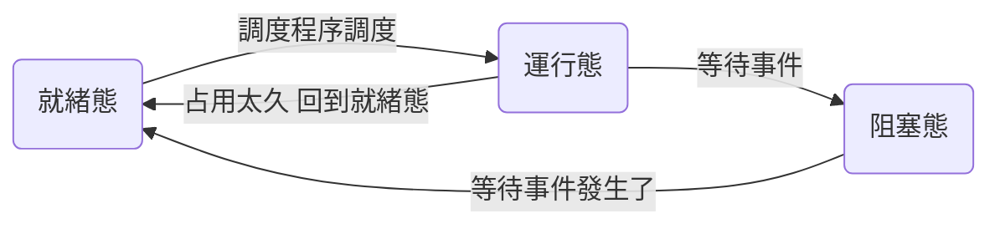

# blue_note_MP2

1. 運行態 -> 就绪態

    如果有個 thread 占用太久 CPU ,為了大家能平衡的共享 CPU ,我們會讓其他的 thread 上去運行,原本的 thread 回到就緒態

2. 就绪態 -> 運行態

    調度程序有機會將他弄上處理器(轉為運行態),從上個中斷點開始運行

3. 運行態 -> 阻塞态

    thread 因事件而暫停, ex： 磁碟輸出輸入,會變成阻塞態,同時調度程序會讓一個就緒態上去運行

4. 阻塞態 -> 就绪態

    已經等到要等的事情後,從阻塞態變為就緒態,等待下次運行



* 搶佔式調度 VS 非搶佔式調度

## 覺得可以改一下

1. `Kernel::Kernel()` 會根據不同的指令而進行不同行為，以下圖指令為例

把相關的程式碼加入
```c++
else if (strcmp(argv[i], "-e") == 0) {
        execfile[++execfileNum]= argv[++i];
        cout << execfile[execfileNum] << "\n";
}
```

```c++
Thread* t[10]; 
```

代表最多有10個11 thread

## `AddrSpace` 可以往前提？

## `fork` 或許可以加一下參數的意義

* `func` is the procedure to run concurrently.
* `arg` is a single argument to be passed to the procedure.
