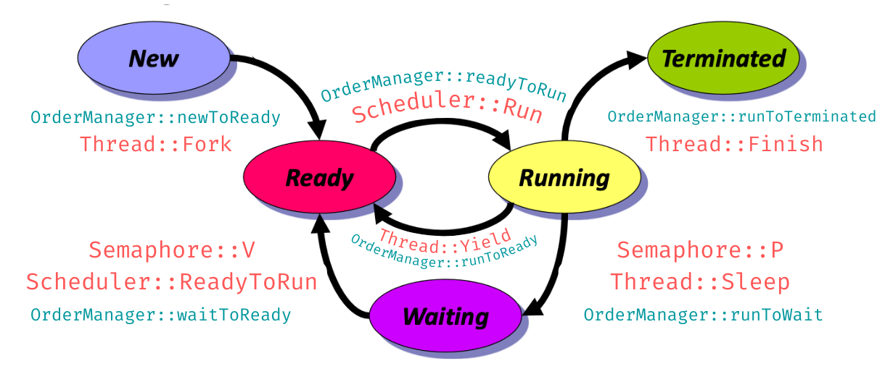
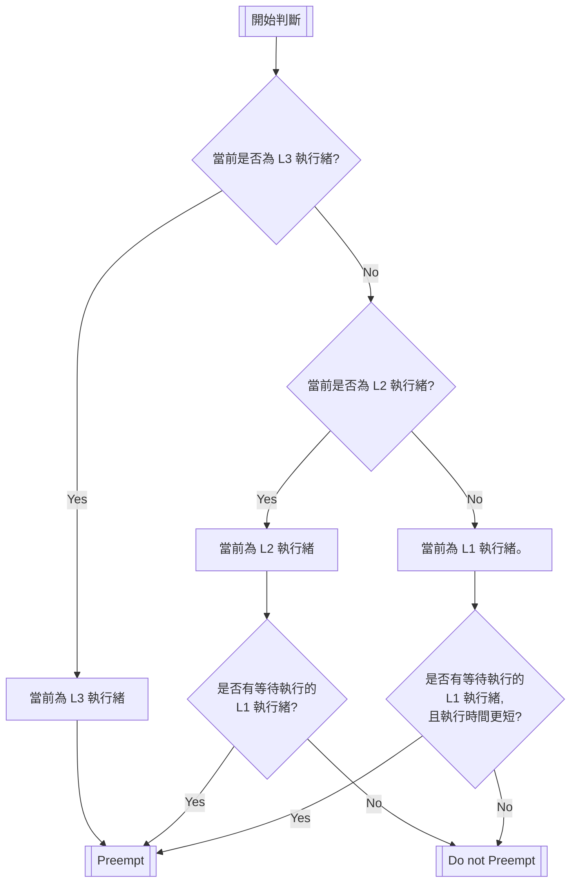

# MP3 Report from team20

> Third assignment of NachOS
>
> Course: Operating System
>
> Professor: 周志遠


## Part 1: member list and contributions

### Member list

* 109062274 資訊工程系三年級 楊子慶 `Eroiko`
* 109080076 生科院學士班三年級 俞政佑 `Blue`

### Contributions

|Items|楊子慶|俞政佑|
|:-:|:-:|:-:|
|Code tracing|V|V|
|Report of Code tracing||V|
|Implementation and Testing|V||
|Report of Implementation|V||

## Part 2-1: Trace Code

### 前言

此次 trace code 的部分, 像是統整過去所學到的各種知識, 所以大多數的 function 在過去的 MP1、MP2 中都有出現過, 也都有詳細解釋, 因此對於出現過的 function, 我們就不浪費篇幅詳細敘述, 而改以重點提點的方式進行, 如需要完整詳細解釋, 請參閱 MP1、MP2。

### 1-1. New → Ready

#### function 功能重點回顧

##### `Kernel::ExecAll()`

1. 連續呼叫 `Kernel::Exec()`, 將方才搜集好的數個 user program 拿去執行
2. 所有 user program 都呼叫執行後, 呼叫 `Thread::Finish()` 方法, 結束當前執行緒

##### `Kernel::Exec(char*)`

1. 建立新執行緒
2. 為設定執行緒的 AddrSpace
3. 呼叫 `Thread::Fork()` 將執行緒 fork 出去

##### `Thread::Fork(VoidFunctionPtr, void*)`

1. 呼叫 `Thread::StackAllocate()` 來 Allocate Stack Memory
2. 呼叫 `Scheduler::ReadyToRun()` 來 schedule current thread using

##### `Thread::StackAllocate(VoidFunctionPtr, void*)`

1. 準備固定大小的 stack memory
2. 將 ThreadRoot 與其他 Routine 存入 Kernel Registers

##### `Scheduler::ReadyToRun(Thread*)`

1. 將執行緒設為準備狀態
2. 將本執行緒放入本 Scheduler 的成員: 待執行隊列 `Scheduler::readyList`

#### 流程目的與解釋

1. 產生新的 thread: 當我們傳入 user program 後, 會透過 `Kernel::ExecAll()`、`Kernel::Exec(char*)`, 來生成新的 thread
2. thread 由 `JUST_CREATED` →`READY`: 調用 `Thread::Fork()`, 待 `Thread::StackAllocate()` 完成, 呼叫 `Scheduler::ReadyToRun()` <font color=#cd5c5c>**將 thread 狀態改為由 `JUST_CREATED`→`READY`**</font>, 並加入到 Scheduler::readyList 中

### 1-2. Running → Ready

#### function 功能重點回顧

##### `Machine::Run()`

1. 模擬的主體, 呼叫 `OneInstruction()` 從 `registers[PCReg]` 讀取指令、 decode、 並執行
2. 呼叫 `OneTick()`

##### `Interrupt::OneTick()`

1. 更新 simulated time
2. 檢查待辦 interrupts
3. 如果 time device handler 要求 context switch, (`yieldOnReturn`==`TRUE`)就執行--呼叫 `kernel->currentThread->Yield()`

* 細節: `Timer::SetInterrupt()` 會在 `timer` 被建構後就被呼叫一次, 其功能是在 100ticks 後 schedule 1個 interrupt, 處理 interrupts 所呼叫的 `Timer::CallBack()` 會再次呼叫 `Timer::SetInterrupt()` 來達到每 100ticks 就中斷一次的功能, 另外他也呼叫 `Alarm::CallBack()`, 其呼叫 `Interrupt::YieldOnReturn()` 改變 `yieldOnReturn` 這個值

* 因為是有些部分第一次 trace, 故附上 code
* 
    ```c++
    Alarm::Alarm(bool doRandom)
    {
        timer = new Timer(doRandom, this);
    }

    Timer::Timer(bool doRandom, CallBackObj *toCall)
    {
        randomize = doRandom;
        callPeriodically = toCall;  // toCall 是 class ALarm
        disable = FALSE;
        SetInterrupt(); //  建構時就呼叫一次
    }

    void Timer::SetInterrupt() 
    {
        if (!disable) {
        int delay = TimerTicks; //  TimerTicks == int (100)
        
        if (randomize) {
            delay = 1 + (RandomNumber() % (TimerTicks * 2));
            }
        // schedule the next timer device interrupt
        kernel->interrupt->Schedule(this, delay, TimerInt); // 建1個 interrupt 在 100ticks 後
        }
    }

    void Timer::CallBack() 
    {
        // invoke the Nachos interrupt handler for this device
        callPeriodically->CallBack();
        
        SetInterrupt(); // do last, to let software interrupt handler
                        // decide if it wants to disable future interrupts
    }

    void Alarm::CallBack() 
    {
        Interrupt *interrupt = kernel->interrupt;
        MachineStatus status = interrupt->getStatus();

        interrupt->YieldOnReturn(); // original
    }

    void Interrupt::YieldOnReturn()
    { 
        ASSERT(inHandler == TRUE);  
        yieldOnReturn = TRUE; 
    }
    ```

##### `Thread::Yield()`

1. 為定義在 class Thread 的 function, 透過呼叫 `FindNextToRun();`、`ReadyToRun(this)`、`Run(nextThread, FALSE)`, 找next thread, 將原本的 thread 放到 ready list 的末端, 並將 cpu 分給 next thread
2. 上述提到的每個 function 等等複習到

* 首次 trace, 附上 code
  
  ```c++
    void Thread::Yield ()
    {
        Thread *nextThread;
        IntStatus oldLevel = kernel->interrupt->SetLevel(IntOff);
        
        ASSERT(this == kernel->currentThread);
        
        DEBUG(dbgThread, "Yielding thread: " << name);
        
        nextThread = kernel->scheduler->FindNextToRun();
        if (nextThread != NULL) {
            kernel->scheduler->ReadyToRun(this);
            kernel->scheduler->Run(nextThread, FALSE);
        }
        (void) kernel->interrupt->SetLevel(oldLevel);
    }
  ```

##### `Scheduler::FindNextToRun()`

1. 確定當前並非中斷狀態後, 在本 `Scheduler` 的成員: 待執行隊列 `Scheduler::readyList` 中, 尋找下一個可執行的執行緒。有則回傳之, 無則回傳 `NULL`。

##### `Scheduler::ReadyToRun(Thread*)`

1. 首先確定當前並非中斷狀態, 再來將當前執行緒設為準備狀態, 最後將本執行續放入本 Scheduler 的成員: 待執行隊列

##### `Scheduler::Run(Thread*, bool)`

1. 執行新的執行緒 (本小節與此 function 並無太大關聯, 故不詳細介紹, 如要完整介紹, 請參照
[1-6. Ready→Running](#1-6-ready-→-running)

#### 流程目的與解釋

1. `Machine::Run()` 角度: `Machine::Run()` 會不斷的執行 instruction, 執行完後呼叫 `OneTick()`, 更新時間, 如果 `yieldOnReturn`==`TRUE` 呼叫 `kernel->currentThread->Yield()`, 其呼叫的 `Scheduler::ReadyToRun(Thread*)` 將正在執行的 <font color=#cd5c5c>**thread 從 `RUNNING`→`READY`**</font>, 並呼叫 `Scheduler::Run(Thread*, bool)` 去執行 `Scheduler::FindNextToRun()` 找到的 `nextThread` 
2. `Alarm::Alarm` 的角度: `Alarm::Alarm` 建構後就會 new 一個 `Timer::Timer`, 其建構好後會執行 `Timer::SetInterrupt()` 在 100ticks 後設一個 interrupts, 處理 interrupts 時會呼叫 `Timer::CallBack()` 其又呼叫`Timer::SetInterrupt()` (來達到 100ticks 就中斷一次的功能)並呼叫 `Alarm::CallBack()`, 其又呼叫 `Interrupt::YieldOnReturn()`, 其會將 `yieldOnReturn` 設為 `TRUE`, 讓 `Yield()` 順利被呼叫
3. 目的： 每 100ticks 會有一個 timer 設的 interrupts 強制目前執行的 thread 釋放 cpu, 並執行 next thread

### 1-3. Running → Waiting

#### function 功能重點回顧

* 本小節的 code 有些沒有 trace 過, 故附上 code

##### `SynchConsoleOutput::PutChar(char)`

```c++
    SynchConsoleOutput::SynchConsoleOutput(char *outputFile)
    {
        consoleOutput = new ConsoleOutput(outputFile, this);
        lock = new Lock("console out");
        waitFor = new Semaphore("console out", 0);
    }

    void SynchConsoleOutput::PutChar(char ch)
    {
        lock->Acquire();   
        consoleOutput->PutChar(ch);
        waitFor->P();
        lock->Release();
    }


    void Lock::Acquire()
    {
        semaphore->P();
        lockHolder = kernel->currentThread;
    }

    void Lock::Release()
    {
        ASSERT(IsHeldByCurrentThread());
        lockHolder = NULL;
        semaphore->V();
    }
```

1. 調用 `lock->Acquire()` 取得 lock,  來達到同時間只會有一個 writer, 拿到 lock 的 thread 才能執行 ( 最後會釋放 )
2. `PutChar(ch)` 打印的字輸出到模擬顯示器
3. 調用 `waitfor->p()`: 等待 semaphore value > 0 ( wait for callBack )
4. `lock->Release()`,　釋放 lock

* 不論 lock or waifor 都是為了避免同步問題
  1. lock: 目的是 only one writer at a time, 同時只能有一個 thread 用`SynchConsoleOutput`
  2. waitFor: 目的是 確保 putchar 已經做完, wait for callback
  3. 以上兩者皆是 (`class SynchConsoleOutput` 的 private 參數), 但目的有些微不同
  4. `lock->Acquire()`、`lock->Release()`、`semaphore->P()` 都會調用 `Semaphore::P()`, 稍後會再提到

* waitfor 細節補充
    1. waitfor 的目的是確保 putchar 已經做完, 才可以繼續往下一步進行, 可能是做下一次的 `consoleOutput->PutChar(ch)`, 這點從 `SynchConsoleOutput::PutInt(int value)` 可以明顯看出, 或者就直接歸還 lock
    2. waitfor 這個 `Semaphore` 訊號的初始值為0 (從`SynchConsoleOutput::SynchConsoleOutput(char *outputFile` 建構子可以看出)
    3. `PutChar(ch)` 後 `waitFor->P()` 開始等待 `SynchConsoleOutput::CallBack()` 中的 `waitFor->V()`, `PutChar(ch)` 會安排1個 interrupts, 之後會呼叫 `ConsoleOutput::CallBack()`, 其又呼叫 `SynchConsoleOutput::CallBack()`
    4. 待 callback fuction 都執行完就代表 `PutChar(ch)` 完成了!
    5. 然後看是要歸回 lock 或是 執行下一次的 `PutChar(ch)`

##### `Semaphore::P()`

* code 

```c++
void Semaphore::P()
{
    DEBUG(dbgTraCode, "In Semaphore::P(), " << kernel->stats->totalTicks);
    Interrupt *interrupt = kernel->interrupt;
    Thread *currentThread = kernel->currentThread;
    
    // disable interrupts
    IntStatus oldLevel = interrupt->SetLevel(IntOff);
    
    while (value == 0) {        // semaphore not available
    queue->Append(currentThread);   // so go to sleep
    currentThread->Sleep(FALSE);
    } 
    value--;    // semaphore available, consume its value
   
    // re-enable interrupts
    (void) interrupt->SetLevel(oldLevel);
}
```

1. 將 interrupt disable
2. 如果 `value == 0` 就將 `currentThread` 放到 queue 的尾端
3. 呼叫 `currentThread->Sleep(FALSE)` (稍後會介紹)
4. semaphore available, consume its value
5. re-enable interrupts

* 相關連結: [`Semaphore::V()`](#semaphorev)

##### `List<T>::Append(T)`

* code
  
```c++
template <class T>
void List<T>::Append(T item)
{
    ListElement<T> *element = new ListElement<T>(item);

    ASSERT(!IsInList(item));
    if (IsEmpty()) {    // list is empty
        first = element;
        last = element;
    } 
    else {              // else put it after last
        last->next = element;
        last = element;
    }
    numInList++;
    ASSERT(IsInList(item));
}
```

1. `List<T>` 是 NachOS 定義並實作好的資料結構
2. `Semaphore::P()` 所呼叫的就是 `queue->Append(currentThread)`  將 `currentThread` 放到這個 `queue` 的尾端

##### `Thread::Sleep(bool)`

1. 確保呼叫此方法的合法性
2. 將當前執行緒的狀態設為 `BLOCKED`
3. 以 `Scheduler::FindNextToRun()` 尋找並呼叫下一個待執行的執行緒, 若下一個執行緒...
    * 存在, 則呼叫 `Scheduler::Run()` 方法, 完成本函數的邏輯:「終止當前執行緒, 並執行下一個執行緒」
    * 沒有, 則呼叫 `Interrupt::Idle()` 方法, 處理尚未完成的 interrupt, 抑或直接關機

##### `Scheduler::FindNextToRun()`

1. 確定當前並非中斷狀態後, 在本 `Scheduler` 的成員: 待執行隊列 `Scheduler::readyList` 中, 尋找下一個可執行的執行緒。有則回傳之, 無則回傳 `NULL`。

##### `Scheduler::Run(Thread*, bool)`

1. 執行新的執行緒 (本小節與此 function 並無太大關聯, 故不詳細介紹, 如要完整介紹, 請參照
[1-6. Ready→Running](#1-6-ready-→-running)

#### 流程目的與解釋

1. 不論是 lock or waiting 都有的 `Semaphore::P()`, 其通常代表資源的佔用與驗證, 如果 `value>0` 就代表資源可用, 於是將他減1, 讓`value==0`, 代表有人佔用, 如果有人再要求此資源時, `value==0` (已被占用), 就會將 `currentThread` 加入到 `Semaphore` 的成員 `queue` 中, 並呼叫 `currentThread->Sleep(FALSE)`, <font color=#cd5c5c>**其會將 `currentThread` 的狀態從 `RUNNING`→`BLOCKED`**</font>, 並找 nextthread 並執行他, 如果沒有 nextthread 就會進入 `Idle()` 去處理尚未完成的 interrupts
2. 總結來說, 假如要資源要不到 (要做I/O但別人在用, 我目前的 thread 就會<font color=#cd5c5c>**`RUNNING`→`BLOCKED`**</font>)

### 1-4. Waiting → Ready

#### function 功能重點回顧

##### `Semaphore::V()`

* code

```c++
void Semaphore::V()
{
    DEBUG(dbgTraCode, "In Semaphore::V(), " << kernel->stats->totalTicks);
    Interrupt *interrupt = kernel->interrupt;
    
    // disable interrupts
    IntStatus oldLevel = interrupt->SetLevel(IntOff);
    
    if (!queue->IsEmpty()) {  // make thread ready.
    kernel->scheduler->ReadyToRun(queue->RemoveFront());
    }
    value++;
    
    // re-enable interrupts
    (void) interrupt->SetLevel(oldLevel);
}
```

1. 通常在 callback function 會呼叫此 function
2. disable interrupt
3. 將 `Semaphore::P()` 存到 `queue` 中 thread 透過 `kernel->scheduler->ReadyToRun(queue->RemoveFront())` 改變狀態為 `READY` 並放到執行隊列 `Scheduler::readyList`
4. value 會加回來
5. interrupt 的狀態也會改回來

* 相關連結: [`Semaphore::P()`](#semaphorep)

##### `Scheduler::ReadyToRun(Thread*)`

1. 將執行緒設為準備狀態
2. 將本執行緒放入本 Scheduler 的成員: 待執行隊列 `Scheduler::readyList`

#### 流程目的與解釋

1. 在歸還 lock ( ex:[`SynchConsoleOutput::PutChar(char)`](#synchconsoleoutputputcharchar) 的 `lock->Release()`) 或是許多 callback fuction 中 ( ex: SynchConsoleOutput::CallBack()), 都會有 `Semaphore::V()`, 通常代表著資源釋放 (與 `Semaphore::P()` 是相對的), 會將 `value+1` 代表其他人可以用這個資源了
2. 同時也會從 `Semaphore` 的成員 `queue` 取出一個因為需要此資源而被 `BLOCKED` 的 `thread`, <font color=#cd5c5c>**將狀態改變從 `BLOCKED`→`READY`**</font>, 並加入執行隊列 `Scheduler::readyList`

### 1-5. Running → Terminated

#### function 功能重點回顧

##### `ExceptionHandler(ExceptionType) case SC_Exit`

1. 從參數 `which` 得知哪種 exception (此例為 `SyscallException`), 從`Machine::RaiseException()`, 呼叫時傳入, 源自 `Machine::OneInstruction()`
2. 透過 `ReadRegister(2)`, 讀取到 register 2 的資料, 獲得哪種 type (此例為 `case SC_Exit`) 資料
3. 執行 `case SC_Exit`
    * code
  
   ```c++
    DEBUG(dbgAddr, "Program exit\n");
    val=kernel->machine->ReadRegister(4);
    cout << "return value:" << val << endl;
    kernel->currentThread->Finish();
    break;
   ```

    * 讀取資料後, 呼叫 `currentThread` 自身的方法 `kernel->currentThread->Finish()`
 
##### `Thread::Finish()`

1. 首先確保僅 `kernel->currentThread` 可以呼叫此方法, 並呼叫自身物件之 `Thread::Sleep()` 方法來完成執行緒的中止行為, 其傳入 `TRUE` 表示此執行緒已經結束, 請排程器此執行緒刪掉。如此一來 `Thread::Sleep()` 方法同時實作了正常的 sleep 邏輯和結束執行緒的邏輯。

##### `Thread::Sleep(bool)`

1. 確保呼叫此方法的合法性
2. 將當前執行緒的狀態設為 `BLOCKED`
3. 以 `Scheduler::FindNextToRun()` 尋找並呼叫下一個待執行的執行緒, 若下一個執行緒...
    * 存在, 則呼叫 `Scheduler::Run()` 方法, 完成本函數的邏輯:「終止當前執行緒, 並執行下一個執行緒」, 此時會傳一個 bool `finishing`, 其值 ==`TRUE`
    * 沒有, 則呼叫 `Interrupt::Idle()` 方法, 處理尚未完成的 interrupt, 抑或直接關機

##### `Scheduler::FindNextToRun()`

1. 將執行緒設為準備狀態
2. 將本執行緒放入本 Scheduler 的成員: 待執行隊列 `Scheduler::readyList`

##### `Scheduler::Run(Thread*, bool)`

1. `Context switch` 前若輸入的參數 `finishing` 為 `true`...
   *  表示切換到下一個執行緒後, 當前執行緒已經沒用了, 應該被刪除
   *  因此先儲存當前執行緒的指標至 `class Scheduler` 的成員 `Thread *toBeDestroyed`
2. 刪除 thread (兩種情況)
   1. 進行 `Context switch` 另一 thread 曾 `switch` 過:
      *  switch 過的 thread 會接著 `Scheduler::Run(Thread*, bool)` 中的 `SWICH()` 後執行, 因此執行 `Thread::CheckToBeDestroyed()` 將欲刪除的 thread 刪除
   2. 進行 `Context switch` 另一 thread 為新生: 
      * 當 thread 為新生要開始執型時, 會執行 `Thread::Begin ()`  其中會調用 `CheckToBeDestroyed()` 將要刪除的 thread 刪除
3. 注意! 原本的 code 並沒有將 thread 的狀態改為 `TERMINATED`, 此次實作有加上

#### 流程目的與解釋

1. 當 `Machine::Run()` 讀取到 user program 的最後時, 應該會讀到要 **Exit** 的 syscall, 其表示 userprogram 要結束了, 於是透過 `ExceptionHandler` 會調用 `currentThread` 自身的方法 `kernel->currentThread->Finish()`
2. `Finish()` 會呼叫 `sleep(TRUE)`, 其又會呼叫 `Run(nextThread, finishing)`
3. 在 `Scheduler::Run(Thread*, bool)` 中, 會將 `currentThread` 傳入 `toBeDestroyed`, 最終依不同情況調用 `Thread::CheckToBeDestroyed()` 刪除要刪的 `thread`, <font color=#cd5c5c>**要刪除的 thread 狀態 `RUNNIG`→`刪除` (原本並沒有會改成 `TERMINATED`, 實作 MP3 後才有)**</font>
4. 刪除 thread 的時機有二
   1. context switch 到 nextthread, nexthread 從 `SWITCH()` 往後執行
   2. 新的 thread 呼叫 `begin()` 時

### 1-6. Ready → Running

#### function 功能重點回顧

##### `Scheduler::FindNextToRun()`

1. 確定當前並非中斷狀態後, 在本 `Scheduler` 的成員: 待執行隊列 `Scheduler::readyList` 中, 尋找下一個可執行的執行緒。有則回傳之, 無則回傳 `NULL`。

##### `Scheduler::Run(Thread*, bool)`

* code

```cpp
void Scheduler::Run(Thread *nextThread, bool finishing) {
    // fetching current thread
    Thread *oldThread = kernel->currentThread;
    
    ASSERT(kernel->interrupt->getLevel() == IntOff);

    // finishing == true:
    //      need to delete current thread
    if (finishing) {
        // assert the "toBeDestroyed" member
        //      doesn't hold any thread that
        //      should have been destroyed
        ASSERT(toBeDestroyed == NULL);
        toBeDestroyed = oldThread;
    }
    
    // if this thread is a user program
    if (oldThread->space != NULL) {
        // save the user's CPU registers and program block
        oldThread->SaveUserState();
        oldThread->space->SaveState();
    }

    // check if the old thread
    //      had an undetected stack overflow
    oldThread->CheckOverflow();

    // switch to the next thread
    kernel->currentThread = nextThread; 
    // nextThread is now running
    nextThread->setStatus(RUNNING);
    
    // context switch
    SWITCH(oldThread, nextThread);

    // we're back, running oldThread
    //      interrupts are off when we return from switch!
    ASSERT(kernel->interrupt->getLevel() == IntOff);

    // check if thread we were running
    //      before this one has finished
    //      and needs to be cleaned up
    CheckToBeDestroyed();

    // if this thread is a user program
    if (oldThread->space != NULL) {
        // restore status of it
        oldThread->RestoreUserState();
        oldThread->space->RestoreState();
    }
}
```

執行新的執行緒, 我們需要進行 context switch, 執行完後也可能需要 context switch 回來。

以下簡述其流程。

1. Context switch 之前

   * 若輸入的參數 `finishing` 為 `true`...

     * 表示切換到下一個執行緒後, 當前執行緒已經沒用了, 應該被刪除

     * 因此先儲存當前執行緒的指標至 `Thread::toBeDestroyed`

   * 若當前執行緒為 user program, 則在 context switch 之前

     * 將 registers 的值寫入 `Thread` 物件 (thread control block) 的成員中

     * 將 Address Space 保留下來

     * 設定切換之執行緒的狀態為 `RUNNING`

2. Context switch

   * 切換執行緒

   * 呼叫 `SWITCH` 進行 context switch

   * 切換 thread

3. Context switch back

   * 如果切換到的 thread 之前有 switch 過, 則往下執行, 如果是完全新的 thread, 則會開始執行 thread (從 threadRoot 開始) 詳見 [`SWITCH`](#switchthread-thread)

   * 執行 `Thread::CheckToBeDestroyed()`

   * 若此執行緒為 user program, 則在 context switch 回來時

     * 將 `Thread` 的成員中取回之前執行緒執行時的 registers

     * 載入 Address Space

##### `SWITCH(Thread*, Thread*)`

* code

```python

        .text
        .align  2

        .globl  ThreadRoot
        .globl  _ThreadRoot

/* void ThreadRoot( void )
**
** expects the following registers to be initialized:
**      eax     points to startup function (interrupt enable)
**      edx     contains inital argument to thread function
**      esi     points to thread function
**      edi     point to Thread::Finish()
*/
_ThreadRoot:
ThreadRoot:
        pushl   %ebp
        movl    %esp,%ebp
        pushl   InitialArg
        call    *StartupPC
        call    *InitialPC
        call    *WhenDonePC

        # NOT REACHED
        movl    %ebp,%esp
        popl    %ebp
        ret


/* void SWITCH( thread *t1, thread *t2 )
**
** on entry, stack looks like this:
**      8(esp)  ->              thread *t2
**      4(esp)  ->              thread *t1
**       (esp)  ->              return address
**
** we push the current eax on the stack so that we can use it as
** a pointer to t1, this decrements esp by 4, so when we use it
** to reference stuff on the stack, we add 4 to the offset.
*/
        .comm   _eax_save,4 #用來對齊

        .globl  SWITCH
    .globl  _SWITCH
_SWITCH:    
SWITCH:                                 
        movl    %eax,_eax_save          # save the value of eax
        movl    4(%esp),%eax            # move pointer to t1 into eax
        movl    %ebx,_EBX(%eax)         # save registers
        movl    %ecx,_ECX(%eax)
        movl    %edx,_EDX(%eax)
        movl    %esi,_ESI(%eax)
        movl    %edi,_EDI(%eax)
        movl    %ebp,_EBP(%eax)
        movl    %esp,_ESP(%eax)         # save stack pointer
        movl    _eax_save,%ebx          # get the saved value of eax
        movl    %ebx,_EAX(%eax)         # store it
        movl    0(%esp),%ebx            # get return address from stack into ebx
        movl    %ebx,_PC(%eax)          # save it into the pc storage

        movl    8(%esp),%eax            # move pointer to t2 into eax

        movl    _EAX(%eax),%ebx         # get new value for eax into ebx
        movl    %ebx,_eax_save          # save it
        movl    _EBX(%eax),%ebx         # retore old registers
        movl    _ECX(%eax),%ecx
        movl    _EDX(%eax),%edx
        movl    _ESI(%eax),%esi
        movl    _EDI(%eax),%edi
        movl    _EBP(%eax),%ebp
        movl    _ESP(%eax),%esp         # restore stack pointer
        movl    _PC(%eax),%eax          # restore return address into eax
        movl    %eax,4(%esp)            # copy over the ret address on the stack
        movl    _eax_save,%eax

        ret

#endif // x86

```

1. 首先 AT&T 語法的組語, src在左, dst在右

2. 我們先回顧一下當我們新創一個 thread 時, 我們會呼叫 `Thread::StackAllocate (VoidFunctionPtr func, void *arg)`

    1. code
        ```c++
        void Thread::StackAllocate (VoidFunctionPtr func, void *arg)
        {
            stack = (int *) AllocBoundedArray(StackSize * sizeof(int));
            // the x86 passes the return address on the stack.  In order for SWITCH() 
            // to go to ThreadRoot when we switch to this thread, the return addres 
            // used in SWITCH() must be the starting address of ThreadRoot.
            stackTop = stack + StackSize - 4;   // -4 to be on the safe side!
            *(--stackTop) = (int) ThreadRoot;
            *stack = STACK_FENCEPOST;
            machineState[PCState] = (void*)ThreadRoot;
            machineState[StartupPCState] = (void*)ThreadBegin;
            machineState[InitialPCState] = (void*)func;
            machineState[InitialArgState] = (void*)arg;
            machineState[WhenDonePCState] = (void*)ThreadFinish;
        }
        ```

        所以我們知道...
        `machineState[7]` 儲存 `(void*)ThreadRoot`
        `machineState[2]` 儲存 `(void*)ThreadBegin`
        `machineState[5]` 儲存 `(void*)func`
        `machineState[3]` 儲存 `(void*)arg`
        `machineState[6]` 儲存 `(void*)ThreadFinish`


3. `SWITCH` 的內容

   1. 當我們呼叫 `SWITCH(oldThread, nextThread)`, 對應的 code 是...

        ```asm
            push Thread * nextThread
            push Thread * oldThread
            call SWITCH
        ```

   2. 所以我們的 stack 由上而下是 `Thread*nextThread` → `Thread*oldThread` → Return address ( esp: 指到這)

        

   3. thread 中的成員對應到記憶體位址

        ```c++
        class Thread {
            private:
            int *stackTop;             // the current stack pointer
            void *machineState[MachineStateSize];  // all registers except for stackTop
        }
        ```

        所以...
        `Thread*` + 0 就會存取到 stackTop
        `Thread*` + 4 就會存取到 `machineState[0]`
        `Thread*` + 8 就會存取到 `machineState[1]`

   4. code 解釋 ( 請看註解 )

        ```python
        movl    %eax,_eax_save         
        # %eax 中資料存到 _eax_save
        
        movl    4(%esp),%eax            
        # %esp 中的值為 stack pointer , +4 後就會指到 old thread
        # 把 old thread 的地址存到 %eax 
        # %eax 為 old thread
        movl    %ebx,_EBX(%eax)    # 將 registers 資料存到 oldThread 的 machineState[1] 
        movl    %ecx,_ECX(%eax)    # 將 registers 資料存到 oldThread 的 machineState[2]
        movl    %edx,_EDX(%eax)    # 將 registers 資料存到 oldThread 的 machineState[3]
        movl    %esi,_ESI(%eax)    # 將 registers 資料存到 oldThread 的 machineState[5]
        movl    %edi,_EDI(%eax)    # 將 registers 資料存到 oldThread 的 machineState[6]
        movl    %ebp,_EBP(%eax)    # 將 registers 資料存到 oldThread 的 machineState[4]
        movl    %esp,_ESP(%eax)    # save stack pointer at oldThread 的成員 stackTop
        #define _ESP     0
        #define _EAX     4
        #define _EBX     8
        #define _ECX     12
        #define _EDX     16
        #define _EBP     20
        #define _ESI     24
        #define _EDI     28
        #define _PC      32

        movl    _eax_save,%ebx          # get the saved value of eax
        movl    %ebx,_EAX(%eax)         # store it in oldThread 的 machineState[0]
        movl    0(%esp),%ebx            # get return address from stack into ebx
        movl    %ebx,_PC(%eax)          # save it into the pc storage machineState[7]

        movl    8(%esp),%eax            # 讓%eax 的值指到 new thread

        movl    _EAX(%eax),%ebx         # get new value for eax into ebx
        movl    %ebx,_eax_save          # save it
        movl    _EBX(%eax),%ebx         # 將 new thread 中的資料放到對應的 registers 中
        movl    _ECX(%eax),%ecx         # 將 new thread 中的資料放到對應的 registers 中
        movl    _EDX(%eax),%edx         # 將 new thread 中的資料放到對應的 registers 中
        movl    _ESI(%eax),%esi         # 將 new thread 中的資料放到對應的 registers 中
        movl    _EDI(%eax),%edi         # 將 new thread 中的資料放到對應的 registers 中
        movl    _EBP(%eax),%ebp         # 將 new thread 中的資料放到對應的 registers 中
        movl    _ESP(%eax),%esp         # 從 stackTop 取得資料 restore stack pointer 
        
        movl    _PC(%eax),%eax          # restore return address into eax
        movl    %eax,4(%esp)            # copy over the ret address on the stack
        movl    _eax_save,%eax
        ret
        ```

   5. 執行 `SWITCH()` 就是將 registers 的資料存進 old thread, 將new thread 中的資料拿出來(因為要準備執行此 thread), 此時會發生兩種情況:

      1. nextThread 並未經歷過 `SWITCH（)`:
         * 因為是首此執行, 所以會執行 `stackTop` 中的 `ThreadRoot`, 進而開啟全新的 thread, 並且在 `ThreadRoot` 的上方放的是 `ret`, 待 `ThreadRoot` 完全執行完後才會執行到

      2. nextThread 經歷過 `SWITCH()`:
         * 我在前次的 `SWITCH()` 會因為 `movl %esp, _ESP(%eax)`, 而導致我的 `stackTop`, 被複寫成 `ret` 所以會執行 `SWITCH()` 下方的程式碼

4. `ThreadRoot`
   1. expects the following registers to be initialized:
      * eax points to startup function (interrupt enable)
      * edx contains inital argument to thread function
      * esi points to thread function
      * edi point to Thread::Finish()

   2. code

        ```python
        pushl   %ebp            
        movl    %esp,%ebp
        pushl   InitialArg      # arg
        call    *StartupPC      # 執行(void*)ThreadBegin
        call    *InitialPC      # (void*)func
        call    *WhenDonePC     # 執行(void*)ThreadFinish

        # NOT REACHED
        movl    %ebp,%esp
        popl    %ebp
        ret
        ```

    3. 執行 `ThreadRoot` 後會執行

       1. `ThreadBegin`:
           1. code:

                ```c
                static void ThreadBegin() { kernel->currentThread->Begin(); }
                ```

                ```c++
                void Thread::Begin ()
                {
                    ASSERT(this == kernel->currentThread);
                    DEBUG(dbgThread, "Beginning thread: " << name);
                    
                    kernel->scheduler->CheckToBeDestroyed();
                    kernel->interrupt->Enable();
                }
                ```

           2.  透過調用 `CheckToBeDestroyed()` 將要刪除的 thread 刪除 (可以乎應1-5), 同時 enable interrupts

       2. `(void*)func`: 其實也就是 `ForkExecute(Thread *t)`
          1. code:

            ```c++
            void ForkExecute(Thread *t) {
                // load executable and check if success or not
                if ( !t->space->Load(t->getName()) ) 
                    return;             // executable not found
                // success -> execute given thread
                t->space->Execute(t->getName());
            }
             ```
        
           2. 其中會呼叫 `AddrSpace::Load()`, 將執行檔載入記憶體, 並呼叫 `AddrSpace::Execute()`, 其中會初始化 registers, 並呼叫 `kernel->machine->Run()`, 開始執行

       3. `ThreadFinish()`:

           1. code:
            
                ```c
                static void ThreadFinish(){ kernel->currentThread->Finish(); }
                ```

                ```c++
                void Thread::Finish ()
                {
                    (void) kernel->interrupt->SetLevel(IntOff);
                    ASSERT(this == kernel->currentThread);
                    
                    DEBUG(dbgThread, "Finishing thread: " << name);
                    Sleep(TRUE);               // invokes SWITCH
                    // not reached
                }
                ```
            2. 當 thread 執行完後, 就會執行 `ThreadFinish()`, 其中會呼叫 `Thread::Finish ()`, 並進行一連串的操作[(可以參考1-5)](#1-5-running-→-terminated), 刪除此 thread

##### `for loop in Machine::Run()`

1. 模擬的主體, 不斷的呼叫 `OneInstruction()` 從 `registers[PCReg]` 讀取指令、 decode、 並執行、 呼叫 `OneTick()`

2. 在 loop 中執行此 thread

#### 流程目的與解釋

1. 透過 `Scheduler::FindNextToRun()` 找到待執行的執行緒, 並進入`Scheduler::Run(Thread*, bool)`
2. 在 `Scheduler::Run(Thread*, bool)` 中, <font color=#cd5c5c>**要執行的 thread 狀態 `READY`→`RUNNING`**</font>, 接著會進行 `SWITCH()`
3. 此時依是否有被 `SWITCH()` 分兩種情況
   1. 有：因為 `stackTop` 被覆寫, 因而執行上次 `SWITCH()` 後的程式碼
   2. 無：會呼叫 `ThreadRoot`, 並依序呼叫 `ThreadBegin`, `(void*)func`, `ThreadFinish()`
      1. `ThreadBegin`: 呼叫 `Thread::Begin()`, 刪除待刪除的 thread, enable interrupts
      2. `(void*)func` (`ForkExecute(Thread *t)`): 尋找檔案資料, 初始化, 並進入 `Machine::Run()` 的 loop 中執行
      3. `ThreadFinish()`: 當執行完 `(void*)func`, 代表此 thread 完成了, 呼叫`ThreadFinish()`, 其又呼叫 `kernel->currentThread->Finish()`, 結束此thread

## Part 2-2: Explain the implementation Part

### Abstract

本次的目標是實作三層級排程隊列的機理。

為了保護舊有程式的正確性, 同時新增正確的隊列邏輯, 我設計 [`SystemQueue`](#systemqueue-的定義) 資料結構來完成三層級排程隊列的機理。刻意設計使 `SystemQueue` 對外的接口與原本 `List<Thread*>* readyList` 相等, 如此一來, 幾乎所有 `Scheduler` 的程式碼都不用更動。

為了實現新的隊列邏輯, 每個執行緒都需要紀錄一些新資料, 比如為了決定 L1 執行順序 (搶佔與否) 和實現 aging 機理, 我們需要一些時間記錄器; 決定 L2 執行順序, 需要儲存優先級資訊等。同 `SystemQueue`, 為了不破壞舊有程式碼的正確性, 我設計 [`OrderManager`](#ordermanager-的定義) 物件來儲存這些新資料, 可以也僅可以透過呼叫其方法來調整這些資料, 外部 (`Thread`) 無法直接或接近直接的修改 `OrderManager` 的內容, 意即我並非只設計一堆 getter 跟 setter。

這些方法都是高度抽象化的方法, `Thread` 物件不需要知道 `OrderManager` 是怎麼調整資料的, 只需要在[正確的時機](#threadsetstatus)呼叫這些方法即可。這樣一來, 擁有新成員 `OrderManager` 的 `Thread` 在原本就邏輯正確的程式碼可以幾乎不調整的情況下, 能成功管理更多的資訊, 並向外部 (`Scheduler`, 或者說 `OrderManager`) 提供更多抽象的方法, 比如[「比較」兩個 `Thread`](#static-threadcmpremaintime) 和 [aging 機理](#static-threadaging)。

最後有兩點要更改。一是我們要加入為設定執行緒優先級的解析輸入邏輯, 當中引入自定義小物件 `ExeFileInfo`, 二是要新增 `'z'` (`dbgSch`) 除錯資訊。

以下先介紹執行緒內儲存與管理新資料的 `OrderManager` 物件, 再來介紹實現隊列邏輯的 `SystemQueue` 資料結構, 過程中同時加入新的除錯訊息。解析與設定執行緒優先級的邏輯將放在最後介紹。

### `ASSERT_MSG` 巨集的新增

> in `debug.h`

首先要提到本巨集, 在 MP3 (相信未來的 MP4 也是) 大量的派上用場。

為了使程式更容易維護並除錯, 我設計本巨集, 其可以印出客製化錯誤訊息, 它的定義與實作如下。

```c++
//---------------------------------------------------------------
// ASSERT_MSG
//      If condition is false, print a message with msg and dump core.
//  Useful for documenting assumptions in the code.
//
//  NOTE: needs to be a #define, to be able to print the location 
//  where the error occurred.
//---------------------------------------------------------------
#define ASSERT_MSG(condition, msg)  \
    if (condition) {} else {        \
        cerr << "Assertion failed: line " \
            << __LINE__ << " file "     \
            << __FILE__ << " since: "   \
            << msg << "\n";             \
        Abort();                        \
    }
```

今後我自己定義的 sanity check 都會依靠此巨集來完成。

### `OrderManager` 的定義

> in `threads/thread.h`, namespace `Thread::OrderManager`

本物件作為 `Thread` 內私有區域內定義的物件, 外部無法訪問之, 所有 `OrderManager` 內公開的方法都僅能由 `Thread` 內部調用, 實現了良好的邏輯封閉性。

#### Member of `OrderManager`

`OrderManager` 顧名思義, 是管理那些決定執行緒「在系統隊列中的順位」資訊的物件。這些資訊作為成員儲存在本物件中, 如下。

```c++
class OrderManager {
private:
    Thread * ref;               // reference of thread
    double remain_burst_time;   // remaining burst time
    double last_burst_time;     // last accumulate time
    double current_burst_time;  // current running time
    int priority;               // priority of thread
    const int init_priority;    // initial priority
    int tick_cache;             // caches starting tick
}
```

第一個成員純粹是為了讓 `OrderManager` 能取得其所屬執行緒的資料, 來印出除錯訊息。
第二至六個成員意如其名, 第七個則是暫存當前狀態的時間起點, 在進入新的狀態時會暫存當前 `kernel->stats->totalTicks` 的值。

另外，我定義一個靜態常數成員 `OrderManager::AGING_TICK` 來決定每多少 tick 要老一歲。

```c++
class OrderManager {
// ...
public:
    static const int AGING_TICK;
};
```

其值為 $1500$。

```c++
const int Thread::OrderManager::AGING_TICK = 1500;
```

#### Method of `OrderManager`

本物件的方法高度抽象化, 其設計根據行程轉換圖如下。



圖中紅字表示預設的實現行程轉換的重點函式, 藍綠字表示我在 `OrderManager` 設計之對應的公開方法。共有六種狀態轉移, 故有六個幫手方法, 其名稱也十分淺顯易懂, 如下。

```c++
class OrderManager {
// ... 
public:
    /** 
     * Collect information when the thread is turning to wait state
     */
    void runToWait();
    
    /** 
     * Collect information when the thread start running
     * @param last must be provided except for
     * the first execution of the main thread
     */
    void readyToRun(Thread * last);
    
    /** 
     * Collect information when the thread is interrupt
     */
    void runToReady();
    
    /** 
     * Collect information when the thread is 
     * back to ready from waiting
     */
    void waitToReady();
    
    /** 
     * Collect information when the thread is 
     * initialized to ready queue
     */
    void newToReady();
    
    /** 
     * Collect information when the thread terminating
     * Does nothing now :)
     */
    void runToTerminated();
};
```

另外有以下方法協助外部訪問或修改資料, 不存在直接的 setter 以避免外部隨意破壞物件的資料。

```c++
class OrderManager {
// ...
public:
    OrderManager();

    /** 
     * Get remained execution time needed (approximated)
     */
    double getRemainTime();

    /** 
     * Get the priority of this thread
     */
    int getPriority();

    /** 
     * Apply the aging check and aging mechanism
     */
    void aging();
};
```

為了增加程式碼的維護性, 我設計三個私有幫手方法如下:

```c++
class OrderManager {
//...
private:
    /** 
     * Set the priority of this thread with correctness sanity check
     */
    int setPriority(int priority);

    /** 
     * Update status of Order Manager 
     * while changing state of the thread (XXX -> READY)
     * 
     * Reset tick_cache and priority
     */
    void toReady();

    /** 
     * Update status of Order Manager 
     * while changing state of the thread (RUN -> XXX)
     * 
     * Accumulate the value of current execution time
     * when the thread ENDs running!
     */
    void leaveRun();
}
```

#### `Thread` 的修改

所有執行緒都應該有一個 `OrderManager` 實例, 故為 `Thread` 添加新成員如下。

```c++
class Thread {
// ...
private:
    OrderManager * sys_q_stub; // stub object in thread for System Queue
};
```

而 `OrderManager` 我將其設計為對 `Thread` 外部隱藏其存在。當外部需要取得 `Thread` 內部資訊時, 僅可透過少量侷限的方法來訪問, 盡可能隱蔽 `OrderManager` 不必要暴漏的部分, 故我為 `Thread` 加入以下方法 (我撰寫的最初始版本有三個 getter 方法, 不過在重構後減為一個)。

```c++
class Thread {
// ...
public:
    /** 
     * Get the priority of this thread
     */
    int getPriority();
};
```

另外我定義三個靜態方法來協助外部比較任意兩個 `Thread` 的次序, 以及 aging 的功能。

```c++
class Thread {
// ...
public:
    /** 
     * Compare the remain burst time of the two thread
     * @return [= 0]: t1 and t2 has the same priority.
     *         [< 0]: t1 has higher priority.
     *         [> 0]: t2 has higher priority.
     */
    static int cmpRemainTime(Thread * t1, Thread * t2);

    /** 
     * Compare the priority of the two threads
     * @return [= 0]: t1 and t2 has the same priority.
     *         [< 0]: t1 has higher priority.
     *         [> 0]: t2 has higher priority.
     */
    static int cmpPriority(Thread * t1, Thread * t2);

    /** 
     * Apply Aging Mechanism for the given thread
     */
    static void Aging(Thread * thread);
};
```

`Thread` 內唯一要大幅調整的方法為 [`Thread::setStatus`](#threadsetstatus), 其簽名也加上新參數。不過為了向下兼容, 依舊提供了預設參數值。

```c++
class Thread {
// ...
public:
    /** 
     * Always change status through this method.
     * Both for outer and inner use.
     * @param last must be provided if we're READY --> RUNNING, 
     * except for the first execution of the main thread
     */
    void setStatus(ThreadStatus st, Thread * last = NULL);
};
```

### `OrderManager` 的實作

> in `threads/thread.h`, namespace `Thread::OrderManager`

#### `OrderManager::runToWait`

實作 run 到 wait 狀態轉換時的邏輯, 我們要更新 approximate burst time (`OrderManager::remain_burst_time`), 故套用下列公式

$$
\rm{Remain\ burst\ time}_{i} = 0.5 \times \rm{Current\ burst\ time} + 0.5 \times \rm{Remain\ burst\ time}_{i - 1}
$$

特別注意我使用私有幫手方法 [`OrderManager::leaveRun`](#ordermanagerleaverun-private-helper-function) 來計算正確的 `OrderManager::current_burst_time` 數值。此成員應該儲存過去尚未進入 wait 狀態前的總執行時間, 當中很可能包含數次透過 Interrupt 從 run 進入 ready 狀態所經過的執行時間。另外, 在本方法的最後要將其設為 `0`, 再來就是透過 [`OrderManager::runToReady`](#ordermanagerruntoready) 方法來共同維護其值。

當然, 只有本方法會更改 approximate burst time, 故印出 approximate burst time 變化之除錯訊息的邏輯應該實作在此。

```c++
void Thread::OrderManager::runToWait() {
    // update burst time
    leaveRun();
    double old_remain_burst_time = remain_burst_time;

    if (current_burst_time) { // has been executed
        remain_burst_time = 0.5 * current_burst_time + 0.5 * remain_burst_time;

        DEBUG(dbgSch, "[D] Tick [" << kernel->stats->totalTicks 
            << "]: Thread [" << ref->ID 
            << "] update approximate burst time, from: [" 
            << old_remain_burst_time << "], add [" 
            << current_burst_time << "], to [" << remain_burst_time << "]");
        
        current_burst_time = 0.; // reset CPU burst time
    }
}
```

#### `OrderManager::readyToRun`

首先, 我將執行起點時間暫存於 `OrderManager::tick_cache`, 此成員唯一用途是計算 Thread 在某狀態下持續了多久。

接著, 由於呼叫此方法時必然正準備進行 Context Switch, 故我們正好可以印出 Context Switch 的除錯訊息。

注意到 main 執行緒第一次 (也是 main 的結束) 進行 context switch 時, 由於不存在「前一個執行緒 `last`」, 故我客製化一個除錯訊息放在下面程式碼的 `else` 中。

```c++
void Thread::OrderManager::readyToRun(Thread * last) {
    // update run starting tick
    tick_cache = kernel->stats->totalTicks;
    if (last) {
        DEBUG(dbgSch, "[E] Tick [" << kernel->stats->totalTicks 
            << "]: Thread [" << ref->ID 
            << "] is now selected for execution, thread [" 
            << last->ID << "] is replaced, and it has executed [" 
            << last->sys_q_stub->last_burst_time << "] ticks");
    }
    else { // the first launch (and the end) of the main thread
        DEBUG(dbgSch, "[E] Tick [" << kernel->stats->totalTicks 
            << "]: Thread [" << ref->ID 
            << "] (main thread) starts its execution");
    }
}
```

#### `OrderManager::leaveRun` (private helper function)

此函式幫助管理 `current_curst_time` 在結束執行時的數值。我的防衛性程式設計使得本方法僅在執行緒狀態為 `RUNNING` 時才允許調用。

另外, 在此我維護 `last_burst_time` 以便在 Context Switch 前印出正確的除錯訊息。

```c++
void Thread::OrderManager::leaveRun() {
    // only accumulate when the thread ends running
    ASSERT_MSG(ref->status == RUNNING, 
        "attempt to accumulate current bursting time "
        << "when a thread isn't in RUNNING status"
        << ", but rather " << ref->status);
    int cur_tick = kernel->stats->totalTicks;
    current_burst_time += cur_tick - tick_cache;
    tick_cache = cur_tick;
    // save the last burst time for debug message
    last_burst_time = current_burst_time;
}
```

#### `OrderManager::toReady` (private helper function)

當一個執行緒要進入 ready 狀態時, 有三種可能, 但都有共通的邏輯, 故我將此邏輯實作為本私有方法, 方便程式碼統一性與正確性的維護。

邏輯也很簡單, 就是

1. 暫存當前狀態起始時間
2. 重設執行緒的優先級為 `OrderManager::init_priority` (該執行緒最初的優先級)

```c++
void Thread::OrderManager::toReady() {
    tick_cache = kernel->stats->totalTicks;
    priority = init_priority; // reset the priority
}
```

#### `OrderManager::setPriority` (private helper function)

設定優先級的私有輔助方法。會確認新優先級的合法性, 且在更新優先級時印出除錯訊息。

```c++
int Thread::OrderManager::setPriority(int priority){
    ASSERT_MSG(priority >= 0 && priority < 150, 
        "attempt to set an invalid priority: " << priority);
    if (this->priority != priority) {
        DEBUG(dbgSch, "[C] Tick [" << kernel->stats->totalTicks 
            << "]: Thread [" << ref->ID 
            << "] changes its priority from [" 
            << this->priority << "] to [" << priority << "]");
        this->priority = priority;
    }
}
```

#### `OrderManager::runToReady`

作為其中一個實作轉移為 ready 狀態的方法, 可以活用 [`OrderManager::toReady`](#ordermanagertoready-private-helper-function) 和 [`OrderManager::leaveRun`](#ordermanagerleaverun-private-helper-function) 方法來將程式的撰寫變得更邏輯化且避免寫出重複的邏輯。

注意到由 run 受 interrupt 轉回 ready 時, 要維護 `OrderManager::current_burst_time`, 以便...

1. 未來呼叫 [`OrderManager::runToWait`](#ordermanagerruntowait) 時更新正確的執行時間
2. 使 [`OrderManager::getRemainTime`](#ordermanagergetremaintime) 方法回傳正確的剩餘執行時間

```c++
void Thread::OrderManager::runToReady() {
    // record the burst time before interrupt in current_burst_time
    leaveRun();
    toReady();
}
```

#### `OrderManager::waitToReady`

直接使用 [`OrderManager::toReady`](#ordermanagertoready-private-helper-function) 即可, 沒有額外需要維護的邏輯。

```c++
void Thread::OrderManager::waitToReady() { toReady(); }
```

#### `OrderManager::newToReady`

直接使用 [`OrderManager::toReady`](#ordermanagertoready-private-helper-function) 即可, 沒有額外需要維護的邏輯。

```c++
void Thread::OrderManager::newToReady() { toReady(); }
```

#### `OrderManager::runToTerminated`

紀錄執行緒的總執行時長。

```c++
void Thread::OrderManager::runToTerminated() {
    // counting the last accumulated running time
    leaveRun();
}
```

#### `OrderManager::OrderManager` (建構子)

即初始化所有成員。注意, `tick_cache` 的初始化需依賴核心的 `Stats` 物件, 故之後需要調整 [`Kernel::Initialize`](#kernel-的修改) 的實作細節。

```c++
Thread::OrderManager::OrderManager(Thread * t, int priority):
    ref(t), remain_burst_time(0), current_burst_time(0),
    last_burst_time(0), tick_cache(kernel->stats->totalTicks), 
    init_priority(priority), priority(priority) {}
```

#### `OrderManager::getPriority`

即取得優先級量值。

```c++
int Thread::OrderManager::getPriority() { return priority; }
```

#### `OrderManager::getRemainTime`

$$
\rm{Real\ remain\ time} = \begin{cases}
\rm{Remain} - (\rm{Current} + \rm{One}), & \rm{if\ running} \\
\rm{Remain} - \rm{Current}, & \rm{if\ interrupt} \\
\rm{Remain},  & \rm{otherwise}
\end{cases}
$$

其中

$$
\rm{One} = \rm{total\ tick} - \rm{start\ bursting\ tick}
$$

不過在第三個情況下 (new $\rightarrow$ ready 和 wait $\rightarrow$ ready) 我的實作都保證了 `OrderManager::current_burst_time` 為 $0$, 故上述分支可以合併為

$$
\rm{Real\ remain\ time} = \begin{cases}
\rm{Remain} - (\rm{Current} + \rm{One}), & \rm{if\ running} \\
\rm{Remain} - \rm{Current}, & \rm{otherwise} \\
\end{cases}
$$

實作如下, 記得若當前執行緒為 running 狀態時要為其補上當前執行時間 (`One`)。

```c++
int Thread::OrderManager::getRemainTime(){
    if (ref->status == RUNNING)
        return remain_burst_time - 
            (current_burst_time + kernel->stats->totalTicks - tick_cache);
    else
        return remain_burst_time - current_burst_time;
}
```

#### `OrderManager::aging`

對單一執行緒來說, Aging 的邏輯也不複雜, 當在 ready 狀態下等待超過 $\tt{AGING\_TICK} = 1500$ ticks 時, 要「增長幾歲」 可以用除法來獲得, 以每一歲增加 10 個優先級的方式調整之, 注意不能高於最大優先級 ($149$)。

實作上, 要取得當前等待時間, 可以利用暫存下來的 `OrderManager::tick_cache` 和 `kernel->stats->totalTicks` 相減獲得。

最後不忘更新 `OrderManager::tick_cache`, 讓未來呼叫本方法時不會誤加以前已經加過的部分。

```c++
void Thread::OrderManager::aging() {
    // only apply aging mechanism in READY status
    ASSERT_MSG(ref->status == READY, 
        "attempt to apply aging mechanism when a thread[" << ref->ID 
        << "] is not in ready status");
    int age = (kernel->stats->totalTicks - tick_cache) / AGING_TICK;
    if (age) { // apply aging
        tick_cache += AGING_TICK * age; // update tick_cache
        setPriority(min(priority + 10 * age, 149));
    }
}
```

### `Thread` 的實作調整

有了 `OrderManager` 的設計, 使原本 `Thread` 內全部舊的程式碼幾乎不用更動, 主要是新加一些套皮方法。這並不是魔術, 而是由於我們唯一進行大改動的 [`Thread::setStatus`](#threadsetstatus) 方法的威力。

#### `Thread` 的建構子與解構子

由於現在執行緒具有「優先級」, 且要多維護一個自己實作的物件 `OrderManager`, 我們需要在建構與解構時加入新邏輯。注意 priority 參數預設值為 $0$, 故不影響任何直接建構 `Thread` 而不賦予其優先級的程式碼。

```c++
Thread::Thread(char* threadName, int threadID, int priority) {
    // ...
    sys_q_stub = new OrderManager(this, priority);
    // ...
}
```

```c++
Thread::~Thread() {
    // ...
    delete sys_q_stub;
}
```

#### `Thread::setStatus`

要讓原本的 `Thread` 照新的邏輯運作, 我們要在狀態轉移時呼叫前面實作好的 `OrderManager` 中對應的方法。不過原本就已經有 `Thread::setStatus` 方法的存在, 其會在狀態轉移時被呼叫, 正好適合將 `OrderManager` 相關的更改 (也就是呼叫會改變 `Thread::sys_q_stub` 的方法) 置於此處。

特別注意, 我為此方法新增 `last` 參數, 並將預設值設為 `NULL`。這是因為 Context Switch 時, 我們要印出新舊執行緒的相關資訊, 故要將舊執行緒的指標傳遞至 `SystemQueue::readyToRun` 方法。

```c++
void Thread::setStatus(ThreadStatus st, Thread* last) {
    if (st == READY) {
        switch (status) {
        case JUST_CREATED:
            sys_q_stub->newToReady();
            break;
        case RUNNING:
            sys_q_stub->runToReady();
            break;
        case BLOCKED:
            sys_q_stub->waitToReady();
            break;
        default:
            ASSERT_MSG(FALSE, "Invalid status transfer from " 
                << status << " to " << st); // error, abort
            break; // never reach
        }
    }
    else if (status == RUNNING && st == BLOCKED)
        sys_q_stub->runToWait();
    else if (st == RUNNING) {
        ASSERT_MSG(status == READY, 
            "Can only transfer to running from ready status, but got " << status); // must be ready -> run
        // "last" is just for debug message
        sys_q_stub->readyToRun(last);
    }
    else if (st == TERMINATED) {
        ASSERT_MSG(status == RUNNING, 
            "Can only terminate a thread from running status, but got " << status); // must be run -> terminate
        DEBUG(dbgThread, "Thread terminating");
        sys_q_stub->runToTerminated();
    }
    
    status = st;
}
```

與以上實作同步的, 我微調 `ThreadStatus` 的內容, 加入 `ThreadStatus::TERMINATED` 與更多註解如下。

```c++
enum ThreadStatus { 
    JUST_CREATED, // new
    RUNNING,      // running
    READY,        // ready
    BLOCKED,      // waiting
    TERMINATED,   // terminated
    ZOMBIE        // ??
};
```

#### `Thread::getPriority`

為 [`OrderManager:getPriority`](#ordermanagergetpriority) 的套皮方法。

```c++
int Thread::getPriority() {
    return sys_q_stub->getPriority();
}
```

#### `static Thread::cmpRemainTime`

為 [`OrderManager::getRemainTime`](#ordermanagergetremaintime) 的靜態套皮方法, 方便外面的世界理解兩個 `Thread` 之間基於剩餘時間的大小關係。

> 基於防衛式程式設計的風格, 呼叫此方法時要確認是否在正確的時機呼叫。

```c++
int Thread::cmpRemainTime(Thread * t1, Thread * t2) {
    // compare the remain burst time is only meaningful
    // in one of the below situations
    ASSERT_MSG((t1->status == READY && t2->status == RUNNING) ||
               (t2->status == READY && t1->status == RUNNING) ||
               (t1->status == READY && t2->status == READY), 
               "attempt to compare the priority of two thread[" << t1->ID 
               << "] (status:" << t1->status << ") and thread[" << t2->ID 
               << "] (status:" << t2->status 
               << "), the status of them may be invalid");
    return static_cast<int>(t1->sys_q_stub->getRemainTime() - 
                            t2->sys_q_stub->getRemainTime());
}
```

#### `static Thread::cmpPriority`

> 同樣基於防衛式程式設計的風格, 呼叫此方法時要確認是否在正確的時機呼叫。

為 [`OrderManager::getPriority`](#ordermanagergetpriority) 的靜態套皮方法, 方便外面的世界理解兩個 `Thread` 之間基於優先級的大小關係。

```c++
int Thread::cmpPriority(Thread * t1, Thread * t2) {
    // compare the priority is only meaningful
    // in one of the below situations
    ASSERT_MSG((t1->status == READY && t2->status == RUNNING) ||
               (t2->status == READY && t1->status == RUNNING) ||
               (t1->status == READY && t2->status == READY), 
               "attempt to compare the priority of two thread[" << t1->ID 
               << "] (status:" << t1->status << ") and thread[" << t2->ID 
               << "] (status:" << t2->status 
               << "), the status of them may be invalid");
    return t2->sys_q_stub->getPriority() - 
           t1->sys_q_stub->getPriority();
}
```

#### `static Thread::Aging`

為 [`SystemQueue::Aging`](#systemqueueaging) 中進行 aging 邏輯的靜態物件函式, 每次呼叫都完成一次對 [`OrderManager::aging`](#ordermanageraging) 的呼叫。

```c++
void Thread::Aging(Thread * thread) {
    thread->sys_q_stub->aging();
}
```

#### `Thread::Sleep`

只有一個小地方要修改, 就是在原本 `setStatus(BLOCKED)` 這行區分為 `ThreadStatus::BLOCK` (waiting) 和 `ThreadStatus::TERMINATED` 兩種狀態, 以正確的表示執行緒的生命週期, 程式碼如下。

```c++
    // ...
    if (finishing)
        setStatus(TERMINATED); // running -> terminated
    else 
        setStatus(BLOCKED); // running -> waiting
    // ...
```

### `SystemQueue` 的定義

> in `threads/scheduler.h`, namespace `Scheduler::SystemQueue`

本物件作為 `Scheduler` 私有區域內定義的物件, 外部無法訪問之, 所有 `SystemQueue` 內公開的方法都僅能由 `Scheduler` 內部調用, 實現了良好的邏輯封閉性。

#### Member of `SystemQueue`

`SystemQueue` 實作了 Spec 所要求的三層系統隊列, 其內部維護三個隊列, 宣告如下。注意我額外定義 `enum Level` 增加程式的可讀性。

```c++
class SystemQueue {
private:
    // level in system queue, integer
    enum Level { 
        Lv1 = 1, // level 1 (highest level)
        Lv2 = 2, // level 2 (median level)
        Lv3 = 3, // level 3 (lowest level)
    };
    
    SortedList<Thread *> * L1; // L1 ready queue (priority 100 ~ 149), preemptive SJF
    SortedList<Thread *> * L2; // L2 ready queue (priority 50 ~ 99), non-preemptive Priority Queue
    List<Thread *> * L3; // L3 ready queue (priority 0 ~ 49), round robin per 100 ticks
}
```

#### Method of `SystemQueue`

`SystemQueue` 旨在完全模擬 `List<Thread*>` 對 `Scheduler` 來說的所有表現, 並增加 aging 相關的方法。如此一來就能在完成新邏輯的情況下, 使 `Scheduler` 舊有的程式碼完全不需要更動。

故 `SystemQueue` 應該實作以下方法來向舊程式碼兼容。

```c++
class SystemQueue {
// ...
public:
    /** 
     * Append a thread to System Queue
     */
    void Append(Thread * thread);

    /** 
     * Check whether System Queue is empty
     */
    bool IsEmpty();

    /** 
     * Remove the front thread in System Queue
     */
    Thread * RemoveFront();

    /** 
     * Peek the front thread in System Queue
     */
    Thread * Front();

    /** 
     * Apply a callback function to all the threads
     */
    void Apply(void (* callback)(Thread *));
};
```

同時要加入新方法來完成隊列初始化、aging 和搶佔與否的判斷。

```c++
class SystemQueue {
private:
    /** 
     * Get the level of priority queues w.r.t. given thread
     * @return SystemQueue::Level (integer)
     */
    Level getLevel(Thread * t);

public:
    SystemQueue();
    ~SystemQueue();

    /** 
     * Apply Aging Mechanism to System Queue
     */
    void Aging();

    /** 
     * Check whether we should preempt current thread
     */
    bool ShouldPreempt();
};
```

### `SystemQueue` 的實作

> in `threads/scheduler.cc`, namespace `Scheduler::SystemQueue`

#### `SystemQueue::Append`

邏輯很簡單, 依據輸入之執行緒的優先級決定應該被放入的隊列。特別注意, 只有呼叫此方法時會將執行緒加入系統隊列, 故可以在此印出加入執行緒的除錯訊息。

注意, 執行緒優先級的取得, 是透過 [`SystemQueue::getLevel`](#systemqueuegetlevel) 方法實現, 原本我將本方法設計為 `Thread` 的方法, 改放這裡是因為系統隊列層級的資訊應該僅由系統隊列自己來維護, 不需要暴露給外部 (i.e. `Thread`) 知道。

```c++
void Scheduler::SystemQueue::Append(Thread * thread) {
    int level = getLevel(thread);
    switch (level) {
    case Lv1:
        L1->Insert(thread);
        break;
    case Lv2:
        L2->Insert(thread);
        break;
    case Lv3:
        L3->Append(thread);
        break;
    default:
        ASSERT_MSG(FALSE, "Bad queue level, maybe the SystemQueue::getLevel method corrupts"); // error, abort
        break; // never reach
    }
    DEBUG(dbgSch, "[A] Tick [" 
        << kernel->stats->totalTicks << "]: Thread [" 
        << thread->getID() << "] is inserted into queue L[" 
        << level << "]"); // print debug message
}
```

#### `SystemQueue::IsEmpty`

確認三個隊列是否為空即可。

```c++
bool Scheduler::SystemQueue::IsEmpty() {
    return L1->IsEmpty() && L2->IsEmpty() && L3->IsEmpty();
}
```

#### `SystemQueue::Front`

逐一測試是否有東西可以查看, 預設認定整個隊列裡必須存在東西。

> 不過實際上目前不會呼叫此方法, 僅為向下兼容性 :)

```c++
Thread * Scheduler::SystemQueue::Front() {
    if (!L1->IsEmpty())
        return L1->Front();
    else if (!L2->IsEmpty())
        return L2->Front();
    else if (!L3->IsEmpty())
        return L3->Front();
    
    ASSERT_MSG(FALSE, "There is no element in SystemQueue"); // error, abort
    return NULL; // never reach
}
```

#### `SystemQueue::RemoveFront`

逐一測試是否有東西可以取出, 預設認定整個隊列裡必須存在東西。特別注意只有此方法可以從 `SystemQueue` 中取出 (移除) 執行緒, 故相關的除錯訊息應該放在此處。

```c++
Thread * Scheduler::SystemQueue::RemoveFront() {
    ASSERT_MSG(!IsEmpty(), 
        "Can't remove thread in SystemQueue when queue is empty");
    
    Thread * ret;
    Level level;

    if (!L1->IsEmpty()) {
        ret = L1->RemoveFront();
        level = Lv1;
    }
    else if (!L2->IsEmpty()) {
        ret = L2->RemoveFront();
        level = Lv2;
    }
    else {
        ret = L3->RemoveFront();
        level = Lv3;
    }
    
    DEBUG(dbgSch, "[B] Tick [" << kernel->stats->totalTicks 
        << "]: Thread [" << ret->getID() 
        << "] is removed from queue L[" << level << "]");
    
    return ret;
}
```

#### `SystemQueue::Apply`

將輸入之函式指標傳遞到各個 `List<Thread*>::Apply` 中, 作用於所有執行緒。

```c++
void Scheduler::SystemQueue::Apply(void (* callback)(Thread *)) {
    L1->Apply(callback);
    L2->Apply(callback);
    L3->Apply(callback);
}
```

#### `SystemQueue` 的建構子與解購子

建立兩個 `SortedList` 和一個 `List` 作為三個系統隊列。$L1$ 和 $L2$ 分別依據 (approximated) burst time 和優先級來排序, 比較子為 `Thread` 中已經抽象化實作好的兩個靜態方法 [`Thread::cmpRemainTime`](#static-threadcmpremaintime) 和 [`Thread::cmpPriority`](#static-threadcmppriority)。

```c++
Scheduler::SystemQueue::SystemQueue(): 
    L1(new SortedList<Thread*>(Thread::cmpRemainTime)), 
    L2(new SortedList<Thread*>(Thread::cmpPriority)), 
    L3(new List<Thread*>()) {}
```

解構時便將它們分別釋放。

```c++
Scheduler::SystemQueue::~SystemQueue() {
    delete L1;
    delete L2;
    delete L3;
}
```

#### `SystemQueue::getLevel`

透過 [`Thread::getPriority`](#threadgetpriority) 方法的結果來判斷此執行緒的歸屬, 回傳我們定義的 `enum SystemQueue::Level`。

題外話, 一開始我設計本方法是屬於 `Thread` 物件的。不過這逾越了 `Thread` 物件的本分, 系統隊列的分級細節僅 `SystemQueue` 這個資料結構需要知道, 不應該透露給其他資料結構, 故最後放在此。如此一來, `Thread` 內部就不存在奇怪的 Magic Number 了 :)

```c++
Scheduler::SystemQueue::Level Scheduler::SystemQueue::getLevel(Thread * t) {
    int p = t->getPriority();
    if (p >= 0 && p < 50)
        return Lv3;
    else if (p >= 50 && p < 100)
        return Lv2;
    else
        return Lv1;
}
```

#### `SystemQueue::Aging`

以前實作的 Aging 都是針對單一執行緒函式, 本方法則是要將 `SystemQueue` 中的所有執行緒都套用一次 aging 的檢查。由於之前已經實現 [`SystemQueue::Apply`](#systemqueueapply) 和 [`static Thread::Aging`](#static-threadaging) 了, 我們應用這兩個方法。

```c++
void Scheduler::SystemQueue::Aging() {
    Apply(Thread::Aging); // apply aging to all threads

    // ...
}
```

接著要處理那些透過 aging 提升優先級至更高層隊列的情況。

透過 `ListIterator`, 我們可以遍歷這三個隊列。對於應該放入更高級隊列的執行緒, 我們的目標首先是「取出」節點, 但若我們在遍歷 `List` 資料結構的過程中刪除 (取出) 當前遍歷節點, 將會使遍歷下一個節點時在大多數情況下失敗。這是因為 `List::Remove` 已經釋放該節點, 卻又要去訪問這塊已經釋放之記憶體中的 `ListElement<Thread*>::next` 成員。

解決辦法之一是, 我們可以透過延遲刪除節點的行為來完成「取出要修改優先級之節點」的邏輯, 透過暫存那些不屬於其當前優先級對應的隊列的節點, 在下一次回圈中將其從其所屬的隊列中移除, 接著透過之前實作好的 [`SystemQueue::Append`](#systemqueueappend) 來完成修改優先級的邏輯。

特別注意到, 由於我們延遲刪除節點的行為, 故結束回圈的判斷要等到最後一次將暫存節點的重新修改 (取出再放入) 後再進行。

程式碼如下。

```c++
void Scheduler::SystemQueue::Aging() {
    Apply(Thread::Aging); // apply aging to all threads
    Thread * to_ch = NULL; // caching the thread to be changed

    // Update L3 queue
    for (ListIterator<Thread *> it(L3); ; it.Next()) {
        if (to_ch) {
            L3->Remove(to_ch);
            Append(to_ch);
            to_ch = NULL; // reset to_ch cache state
        }
        if (it.IsDone())
            break;
        if (getLevel(it.Item()) != Lv3)
            to_ch = it.Item(); // set to_ch cache state
    }

    // Update L2 queue
    for (ListIterator<Thread *> it(L2); ; it.Next()) {
        if (to_ch) {
            L2->Remove(to_ch);
            Append(to_ch);
            to_ch = NULL; // reset to_ch cache state
        }
        if (it.IsDone())
            break;
        if (getLevel(it.Item()) != Lv2)
            to_ch = it.Item(); // set to_ch cache state
    }
}
```

#### `SystemQueue::ShouldPreempt`

此方法判斷正在執行的執行緒是否應該被搶佔。

下圖顯示是否需要搶佔的邏輯, 注意到僅等待中的 $L1$ 有可能搶佔正在執行的執行緒, 而若當前為 $L3$ 執行緒, 則必定讓位給其他執行緒。



上述流程可以實作為以下程式碼。

```c++
bool Scheduler::SystemQueue::ShouldPreempt() {
    Thread * t = kernel->currentThread;
    bool ret = false;

    /** 
     * if cur is L3 and has burst 100 ticks, then preempt (round robin)
     */
    if (getLevel(t) == Lv3)
        ret = true;
    /** 
     * if L1 not empty 
     * -> if cur is L2, then preempt
     * -> if cur is L1 but has less priority, then preempt
     **/
    else if (!L1->IsEmpty() && (getLevel(t) == Lv2 || Thread::cmpRemainTime(t, L1->Front()) > 0)) 
        ret = true;

    return ret;
}
```

到此, 我們完成了所有 `SystemQueue` 的邏輯。

### `Scheduler` 的設計與實作調整

得益於我向下兼容的設計, `Scheduler` 的程式碼幾乎不需要更動。

以下列出所有要更動的程式碼。

#### 定義

```c++
// in scheduler.h, definition of class Scheduler
private:
    SystemQueue * readyList; // queue of threads that are ready to run
```

#### 建構子

```c++
// in scheduler.cc, implementation of constructor of Scheduler
Scheduler::Scheduler() { 
    // ...
    readyList = new SystemQueue(); // allocate a SystemQueue object 
    // ...
} 
```

#### `Scheduler::Aging`

實際上就是 [`SystemQueue::Aging`](#systemqueueaging) 的套皮方法。

```c++
void Scheduler::Aging() {
    readyList->Aging();
}
```

#### `Scheduler::ShouldPreempt`

實際上就是 [`SystemQueue::ShouldPreempt`](#systemqueueshouldpreempt) 的套皮方法。

```c++
bool Scheduler::ShouldPreempt() {
    return readyList->ShouldPreempt();
}
```

僅需做這些更改, `Scheduler` 就擁有全新的三層優先級隊列功能 :)

### `Alarm` 的修改

原本 NachOS 的 `Scheduler` 搭配 `Alarm::CallBack` 實現了 round robin 的排程方式: 呼叫 `Interrupt::YieldOnReturn` 方法使當前執行緒讓位給其他執行續。

在 MP3 的要求下, 我們在此實現 Aging 和 Preemption 的邏輯。由於過去我們已經完整的實現 [`Scheduler::Aging`](#scheduleraging) 和 [`Scheduler::ShouldPreempt`](#schedulershouldpreempt) 與其相關的所有方法, 故可以直接調用這些邏輯, 實作如下。

```c++
void 
Alarm::CallBack() {
    Interrupt *interrupt = kernel->interrupt;
    MachineStatus status = interrupt->getStatus();

    kernel->scheduler->Aging(); // apply aging mechanism
    
    // whether should preempt or not
    if (status != IdleMode && kernel->scheduler->ShouldPreempt())
        interrupt->YieldOnReturn();
}
```

### `Kernel` 的修改

對於每個執行檔, 由於我們要多儲存其優先級資訊, 故設計 `ExeFileInfo` 物件來儲存檔名和其優先級, 預設優先級為 $0$。

```c++
class ExeFileInfo {
public:
    char * name;
    int priority;
    ExeFileInfo(char * name = NULL, int priority = 0): 
        name(name), priority(priority) {}
};
```

此物件旨在向下兼容原本的 `char * execfile[10]`, 故 `Kernel` 的定義需要小小調整。

```c++
class Kernel {
// ...
private:
    ExeFileInfo execfile[10];
};
```

而解析 `-ep` 參數的過程可為以下：

```c++
// ... } 
else if (strcmp(argv[i], "-ep") == 0) {
    char * name = argv[++i];
    int pri = atoi(argv[++i]);
    execfile[++execfileNum] = ExeFileInfo(name, pri);
    cout << execfile[execfileNum].name << "\n";
} // else if { ...
```

對應 `Kernel::Exec` 方法為了向下兼容, 其輸入型別應該改成 `ExeFileInfo &`, 且實作的第一句也要微調成以下。

```c++
int Kernel::Exec(ExeFileInfo& file)
{
    t[threadNum] = new Thread(file.name, threadNum, file.priority);
    // ...
}
```

另外, 由於我將 main thread 也納入 `Thread` 和 `OrderManager` 的管轄範圍。這兩者不僅依賴於 `kernel->stats->totalTicks`, 還需要觸動行程狀態轉換的正確順序, 否則我嚴格的防衛式程式設計不會允許 main thread 正常結束並切換至下一個執行緒。

故在 `Kernel::Initialize` 時, 除了要將 `Kernel::stats` 的初始化提前, 還要觸發正確的行程狀態轉移, 更動如下。

```c++
void Kernel::Initialize() {
    stats = new Statistics(); // collect statistics

    /** 
     * Thread::Thread and Thread::setStatus 
     * depends on kernel->stats->totalTicks
     * 
     * All thread should be READY then RUNNING, 
     * main thread is not an exception
     */
    currentThread = new Thread("main", threadNum++);
    currentThread->setStatus(READY); // new -> ready
    currentThread->setStatus(RUNNING); // ready -> running
    // ...
}
```

如此便完成解析與運行執行檔的邏輯。

## Feedback

### 楊子慶's feedback

本次的實作非常困難但有趣。一方面是本次相當於順著行程轉換圖摸清 NachOS 總體的行程管理, 令一方面是希望撰寫易於維護、邏輯清晰又易於復用的程式碼, 所以花了非常多心思在設計與向下兼容的工程。總結來說是一次將理論應用於實作, 且嘗試了一回工程上可行的設計與實作風格的珍貴經歷, 感謝也辛苦教授與所有助教了。

### 俞政佑's feedback

這次的 MP3 我認為是相當於 MP1、MP2 的超級總整理, 過去在 trace code 的時候, 總會發現有一些奇怪的斷點, 導致我們不能完全理解, 這次透過 trace thread 的每種情形, 讓我們更了解 thread 的各種操作, 以及 NachOS 對 thread 的各種管理, 由其了解 switch 的組合語言後 (雖然真的很難看懂),終於將先前的知識串聯起來, 有一種打通觀念的爽感!