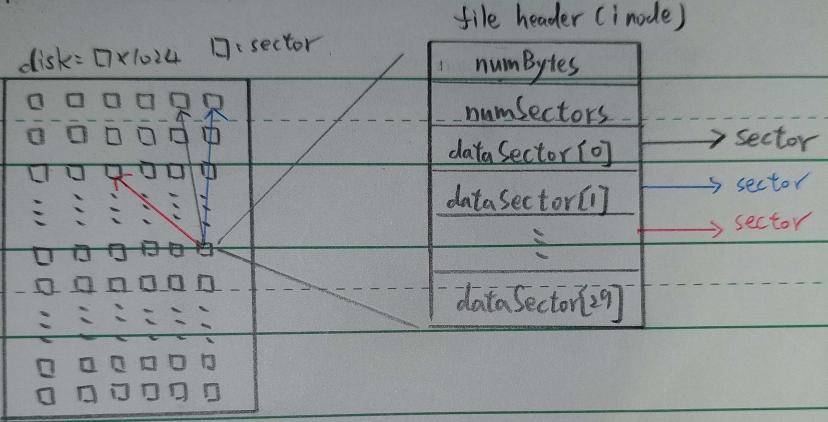

### note

1. 只要是 file 就包含 (in NachOS):
   1. file header
   2. data blocks
   3. an entry

2. file system 包含兩個 data structures
   1. bitmap of free disk sectors
   2. directory of filenames and file header

3. 前一點所提到的兩個 data structures 視為兩個 file, 所以也要有第一點提到的東西
   1. bitmaps 的 file header 存在 sector 0
   2. directory 的 file header 存在 sector 1

   * 這樣就在 file system 在 bootup 時就可以找到他們

4. file system assumes bitmap and directory are kept "open"
    1. 所以有對 file 進行操作 (Create, Remove...), 成功就立即寫回
    2. 失敗就放棄修改的版本

5. 目前 Nachos 的假設與限制
   1. there is no synchronization for concurrent accesses
   2. files have a fixed size, set when the file is created
   3. files cannot be bigger than about 3KB in size
   4. there is no hierarchical directory structure, and only a limited number of files can be added to the system
   5. there is no attempt to make the system robust to failures (if Nachos exits in the middle of an operation that modifies the file system, it   may corrupt the disk)

### `FileSystem::FileSystem(bool format)`

* code

```c++
FileSystem::FileSystem(bool format)
{
    DEBUG(dbgFile, "Initializing the file system.");
    if (format)
    {
        PersistentBitmap *freeMap = new                 
        PersistentBitmap(NumSectors);
        Directory *directory = new Directory(NumDirEntries);
        FileHeader *mapHdr = new FileHeader;
        FileHeader *dirHdr = new FileHeader;

        DEBUG(dbgFile, "Formatting the file system.");

        // First, allocate space for FileHeaders for the directory and bitmap
        // (make sure no one else grabs these!)
        freeMap->Mark(FreeMapSector);
        freeMap->Mark(DirectorySector);

        // Second, allocate space for the data blocks containing the contents
        // of the directory and bitmap files.  There better be enough space!

        ASSERT(mapHdr->Allocate(freeMap, FreeMapFileSize));
        ASSERT(dirHdr->Allocate(freeMap, DirectoryFileSize));

        // Flush the bitmap and directory FileHeaders back to disk
        // We need to do this before we can "Open" the file, since open
        // reads the file header off of disk (and currently the disk has garbage
        // on it!).

        DEBUG(dbgFile, "Writing headers back to disk.");
        mapHdr->WriteBack(FreeMapSector);
        dirHdr->WriteBack(DirectorySector);

        // OK to open the bitmap and directory files now
        // The file system operations assume these two files are left open
        // while Nachos is running.

        freeMapFile = new OpenFile(FreeMapSector);
        directoryFile = new OpenFile(DirectorySector);

        // Once we have the files "open", we can write the initial version
        // of each file back to disk.  The directory at this point is completely
        // empty; but the bitmap has been changed to reflect the fact that
        // sectors on the disk have been allocated for the file headers and
        // to hold the file data for the directory and bitmap.

        DEBUG(dbgFile, "Writing bitmap and directory back to disk.");
        freeMap->WriteBack(freeMapFile); // flush changes to disk
        directory->WriteBack(directoryFile);

        if (debug->IsEnabled('f'))
        {
            freeMap->Print();
            directory->Print();
        }
        delete freeMap;
        delete directory;
        delete mapHdr;
        delete dirHdr;
    }
    else
    {
        // if we are not formatting the disk, just open the files representing
        // the bitmap and directory; these are left open while Nachos is running
        freeMapFile = new OpenFile(FreeMapSector);
        directoryFile = new OpenFile(DirectorySector);
    }
}
```

1. 不論是否 format, 最終得到的是 `OpenFile *freeMapFile` (Bit map of free disk blocks), `OpenFile *directoryFile`("Root" directory -- list of file names,) 這兩個開啟的檔案
2. 依據是否 format, 走不同路徑
   1. `format==false`:
      1. 將存 freeMapFile directoryFile 的 file header 的 sector 標起來
      2. 向 freeMap allocate 一定數量的 sector, 會存在 file header 的 datasector[i]
      3. 將 freeMapFile 和 directoryFile 的 file header 寫回各自的 sector
      4. open `FreeMapSector`, `DirectorySector`, 獲得 `OpenFile *freeMapFile`, `OpenFile *directoryFile`
      5. 將 freeMap 和 directory 的改動寫回 disk
   2. `format==true`:
      1. 直接從 `FreeMapSector`, `DirectorySector` 開 file, 獲得 `OpenFile *freeMapFile`, `OpenFile *directoryFile`

### `bool FileSystem::Create(char *name, int initialSize)`

* code

```c++
bool FileSystem::Create(char *name, int initialSize)
{
    Directory *directory;
    PersistentBitmap *freeMap;
    FileHeader *hdr;
    int sector;
    bool success;

    DEBUG(dbgFile, "Creating file " << name << " size " << initialSize);

    directory = new Directory(NumDirEntries);
    directory->FetchFrom(directoryFile); // 讀取 dirctoryFile 的資料

    if (directory->Find(name) != -1)
        success = FALSE; // file is already in directory
    else
    {
        freeMap = new PersistentBitmap(freeMapFile, NumSectors);
        sector = freeMap->FindAndSet(); // 找一個 sector for file header
        if (sector == -1)
            success = FALSE; // no free block for file header
        else if (!directory->Add(name, sector)) // 將此檔案的名稱與 file header 的 sector 加入 directory
            success = FALSE; // no space in directory
        else
        {
            hdr = new FileHeader;
            if (!hdr->Allocate(freeMap, initialSize))
                success = FALSE; // no space on disk for data
            else
            {
                success = TRUE;
                // everthing worked, flush all changes back to disk
                hdr->WriteBack(sector);
                directory->WriteBack(directoryFile);
                freeMap->WriteBack(freeMapFile);
            }
            delete hdr;
        }
        delete freeMap;
    }
    delete directory;
    return success;
}
```

1. we can't increase the size of files dynamically
2. 基本的步驟:
   1. 讀取 `directoryFile` 並確定檔案並沒有存在
   2. 讀取 `freeMap`
   3. 呼叫 `FindAndSet()` 找一個 sector for file header
   4. 呼叫 `Add()` 在 directry 加入檔案名稱與其 file header 的 sector
   5. 呼叫 `Allocate()` 在 disk 找一塊空間給 file 的 datablock
   6. 將 file header 存回 disk
   7. 將修改過的 freeMap 和 directory 寫回 disk
3. 回傳是否成功
4. create 失敗的可能原因:
   1. 檔案已經存在
   2. 沒有空間給 file header
   3. 沒有 directory 沒有 entry
   4. 沒有空間 for data block

### `bool FileHeader::Allocate(PersistentBitmap *freeMap, int fileSize)`

* code

```c++
bool FileHeader::Allocate(PersistentBitmap *freeMap, int fileSize)
{
    numBytes = fileSize;
    numSectors = divRoundUp(fileSize, SectorSize); // 計算要幾個 sector 
    if (freeMap->NumClear() < numSectors)   // 確認剩下的 sector 夠不夠
        return FALSE; // not enough space
    for (int i = 0; i < numSectors; i++)
    {
        dataSectors[i] = freeMap->FindAndSet();
        // since we checked that there was enough free space,
        // we expect this to succeed
        ASSERT(dataSectors[i] >= 0);
    }
    return TRUE;
}
```

1. 根據要求的空間計算需要多少個 sector
2. `freeMap->NumClear()` 會回傳還有多 sector 沒被使用, 來確認 sector 夠不夠
3. 透過迴圈呼叫 `FindAndSet()` 取得未被使用的 sector 編號, 時間存在 `daatSectors[]` 中

### `int Bitmap::FindAndSet()`

* code

```c++
int Bitmap::FindAndSet()
{
    for (int i = 0; i < numBits; i++)
    {
        if (!Test(i))
        {
            Mark(i);
            return i;
        }
    }
    return -1;
}
```

1. `Test(i)` 可以得知 i sector 是否被使用, `Mark(i)`, 則標記 i sector 被使用
2. 運用遍歷的方式尋找哪個 sector 沒被用過, 找到就標註使用並回傳

### `Directory::Directory(int size)`

* code

```c++
Directory::Directory(int size)
{
    table = new DirectoryEntry[size];
    memset(table, 0, sizeof(DirectoryEntry) * size); 
    tableSize = size;
    for (int i = 0; i < tableSize; i++)
        table[i].inUse = FALSE;
}
```

1. 我們 new 了一個 `DirectoryEntry` 的 陣列
2. 並將每個 `DirectoryEntry`  的 `inuse` 設為 FALSE

### `class DirectoryEntry`

* code

```c++
class DirectoryEntry
{
public:
    bool inUse;     // 是否被用
    int sector;     // 存檔案的 file header 的 sector
    char name[FileNameMaxLen + 1]; // 檔名
};
```

### `bool Directory::Add(char *name, int newSector)`

* code

```c++
bool Directory::Add(char *name, int newSector)
{
    if (FindIndex(name) != -1)
        return FALSE;

    for (int i = 0; i < tableSize; i++)
        if (!table[i].inUse)
        {
            table[i].inUse = TRUE;
            strncpy(table[i].name, name, FileNameMaxLen);
            table[i].sector = newSector;
            return TRUE;
        }
    return FALSE; // no space.  Fix when we have extensible files.
}
```

1. 當我們要加入新檔案時, 會先檢查是否已有同樣的檔名
2. 遍歷尋找可用的 `DirectoryEntry`, 並設定 `inuse` `name` `sector`

### `OpenFile * FileSystem::Open(char *name)`

* code

```c++
OpenFile * FileSystem::Open(char *name)
{
    Directory *directory = new Directory(NumDirEntries);
    OpenFile *openFile = NULL;
    int sector;

    DEBUG(dbgFile, "Opening file" << name);
    directory->FetchFrom(directoryFile);
    sector = directory->Find(name);
    if (sector >= 0)
        openFile = new OpenFile(sector); // name was found in directory
    delete directory;
    return openFile; // return NULL if not found
}
```

1. 先呼叫 `directory->FetchFrom(directoryFile);`, 讀取 `directoryFile` 資料
2. `Find(name)` 可以找到對應 name 的 file 的 file header sector
3. 有 file header sector 就可以開檔了

### `int Directory::Find(char *name)`

* code

```c++
int Directory::Find(char *name)
{
    int i = FindIndex(name);

    if (i != -1)
        return table[i].sector;
    return -1;
}
```

1. 回傳要找的檔案的 file header 的 sector

### `int Directory::FindIndex(char *name)`

* code

```c++
int Directory::FindIndex(char *name)
{
    for (int i = 0; i < tableSize; i++)
        if (table[i].inUse && !strncmp(table[i].name, name, FileNameMaxLen))
            return i;
    return -1; // name not in directory
}
```

1. 遍歷尋找到 name 相同的 entry

### Explain how the NachOS FS manages and finds free block space? Where is this information stored on the raw disk (which sector)?

1. 從 FileSystem 的建構子 `FileSystem::FileSystem(bool format)`, 可以發現, 他最終開啟了 `OpenFile *freeMapFile` 來掌管 free block 與 `OpenFile *directoryFile` 來儲存 file name.
2. how to manage free block space
   1. `*freeMap` 屬於 `class PersistentBitmap`, 而它繼承自`Bitmap`, 所以它用 `Bitmap` 這個資料結構來管理 sector, 總共有多少個 sector 我們就會要有多少個 bit 來紀錄哪些 sector 是被用過的, 這也是為甚麼 freeMapFile 的 file header 需要 allocate `#define FreeMapFileSize (NumSectors / BitsInByte)` bytes 的空間.
3. how to find free blocks: 
    1. 基本上是用迴圈來遍歷尋找未被使用的 sector 
    (參考[`FindAndSet()`](#int-bitmapfindandset) [`Allocate()`](#bool-fileheaderallocatepersistentbitmap-freemap-int-filesize))
    2. 以 `bool FileSystem::Create(char *name, int initialSize)` 中的 code 為例
    3. 首先呼叫 `freeMap = new PersistentBitmap(freeMapFile, NumSectors)` 將 `freeMap` 從 `freeMapFile` 這個已開啟的檔案讀進來
    4. 呼叫 `freeMap->FindAndSet()` 可以回傳一個未被使用的 sector 編號, 並在 `Bitmap` 中設定它被使用
    5. 呼叫 `hdr->Allocate(freeMap, initialSize)`, 可以要到一定數量的 sector, 哪個 sector 會直接傳進 file header 的私有成員 `int dataSectors[NumDirect]`
    6. 將修改後的 `freeMap` 等資料寫回 disk (如果 create 不成功就不用, 也就不會改動到 disk 的資料)
4. Where is this information stored on the raw disk (which sector)?
   1. 從 `FileSystem::FileSystem(bool format)` 可以發現 `freeMapFile` 的 file header allocate 一些空間(`mapHdr->Allocate(freeMap, FreeMapFileSize)`), 並被寫進了 `FreeMapSector`(`mapHdr->WriteBack(FreeMapSector);`)
   2. 而之後我們從 `FreeMapSector` 開啟 `freeMapFile`
   3. 將 `freeMap` 的改動重新寫進這個檔案
   4. 所以有關 free block 的資訊就存在 `freeMapFile` 這個檔案中
   5. 而 `freeMapFile` 的 file header 存在 `FreeMapSector` 中, 所以我們要讀取 free block 的相關資訊就需要讀取 `FreeMapSector` 中的 file header, 也就是讀 sector 0 (`#define FreeMapSector 0`), 但不等於 `Bitmap` 的資訊也存在 sector 0, 而是存在 allocate 來的sector 2 ( sector 1 放 `directoryFile` 的 file header, 所以 allocate 來的是 sector 2, 只需要 1 sector 的原因是我們總共有 1024 個 sector, 共需要 1024/8=128 bytes 來記錄 free blocks, 而每個 sector 大小為 128 bytes, 所以只要 1 個 sector, 第二題將貼出相關大小的定義程式碼)


### What is the maximum disk size that can be handled by the current implementation? Explain why

```c++
const int SectorSize = 128;     // number of bytes per disk sector
const int SectorsPerTrack  = 32;    // number of sectors per disk track 
const int NumTracks = 32;   // number of tracks per disk
const int NumSectors = (SectorsPerTrack * NumTracks);
```

1. disk 的空間 = sectorsize * numsector = sectorsize * sectorpertrack * numtrace = 128 * 32 *32 = 128 KB
2. 如果是指初始化後的空間 = 128 * (32*32-2-1-2)=127.375KB
(初始化後減去 `freeMapFile` 和 `directoryFile` file header 占用的 sector 以及 allocate 的 sector, 計算方面 `freeMapFile`部分已提到, `directoryFile` 則稍後會提到)

### Explain how the NachOS FS manages the directory data structure? Where is this information stored on the raw disk (which sector)?

1. 與第一題相似, 在 FileSystem 的建構子 `FileSystem::FileSystem(bool format)` 中, 我們開啟了 `directoryFile` 來儲存 file name
2. how to manages the directory data structure?
   1. 參考 [`Directory()`](#directorydirectoryint-size) 和 [`DirectoryEntry()`](#class-directoryentry)
   2. 用 `Directory` 和 `DirectoryEntry` 來進行維護
   3. 在 `Directory`的建構子中 new 了 `DirectoryEntry` 的陣列, 其中可以記錄每個 entry 的 `inuse`, 紀錄檔案的 `name` 與 file header 的 `sector`, 如此就可以維護我們的 file name
3. 以 `bool FileSystem::Create(char *name, int initialSize)` 中的 code 為例
   1. 先呼叫 `directory->FetchFrom(directoryFile)`, 讀取 `directoryFile` 的資料
   2. 呼叫 `directory->Find(name)`, 檢查是否已有相同的檔名
   3. `directory->Add(name, sector)` 將創建的 file name 與 file header 所在的 sector 加入 `directory` 進行管理
   4. 如果創檔成功要寫回 disk
4. 另外要 open file 時:
   1. 請參考 [`FileSystem::Open(char *name)`](#openfile--filesystemopenchar-name)
   2. 可以透過 `find(name)` 找到對應的 sector 進行開檔
5. Where is this information stored on the raw disk (which sector)?
   1. 從 `FileSystem::FileSystem(bool format)` 可以發現 `directoryFile` 的 file header allocate 一些空間(`dirHdr->Allocate(freeMap, DirectoryFileSize)`), 並被寫進了 `DirectorySector`(`dirHdr->WriteBack(DirectorySector)`)
   2. 而之後我們從 `DirectorySector` 開啟 `directoryFile`
   3. 將 `directory` 的改動重新寫進這個檔案
   4. 所以有關 file name 的資訊就存在 `directoryFile` 這個檔案中
   5. 而 `directoryFile` 的 file header 存在 `DirectorySector` 中, 所以我們要讀取 file name 的相關資訊就需要讀取 `DirectorySector` 中的 file header, 也就是讀 sector 1 (`#define DirectorySector 1`), 但不等於 `directory` 的資訊也存在 sector 1, 而是存在 allocate 來的sector 3,4 ( 前面的 sector 方別存 `freeMapFile` 的 file header, `directoryFile` 的 fileheader, `freeMap` allocate 走, 所以 allocate 來的應該是 sector 3,4, 需要 allocate 兩個 sector 的原因是申請的 size = `#define DirectoryFileSize (sizeof(DirectoryEntry) * NumDirEntries)` = 20*10 = 200, 1 sector 才 128 bytes 所以申請兩個)

### Explain what information is stored in an inode, and use a figure to illustrate the disk allocation scheme of the current implementation

```c++
class FileHeader
{
    int numBytes;   // Number of bytes in the file
    int numSectors;	// Number of data sectors in the file
    int dataSectors[NumDirect]; // Disk sector numbers for each data block in the file
};

#define NumDirect ((SectorSize - 2 * sizeof(int)) / sizeof(int))
#define MaxFileSize (NumDirect * SectorSize)
```

1. i-node 就是 fileheader
2. 從 `class FileHeader` 的私有成員我們可以看到, `numBytes` 記錄了 file 的大小有多少 bytes, `numSectors` 則紀錄此 file 用了多少 sector, `dataSectors[]` 則記錄了此 file 存放資料的所連結到的 sectors
3. 最多可以存放 `NumDirect` 個 sector, 因為 file header 只存在 1 個 sector, 減去 `numBytes` 和 `numSectors` 兩變數的空間後, (128-2*4)/4=30 (`#define NumDirect ((SectorSize - 2 * sizeof(int)) / sizeof(int))`), 所以最多可以存到 30 個 sector 編號
4. 

### Why is a file limited to 4KB in the current implementation?

1. 承上題的 code
2. 目前的 file header 都是只包含 1 個 sector, `FileHeader` 中的私有成員 `dataSectors[]` 中的 sector 也只純粹放資料不會再連結到其他 sector
3. 所以存放 file header 的 sector 中, 減去存放 `numBytes` 和 `numSectors` 兩變數的空間後, 剩餘的空間可以拿來存放 allocate 到的 sector 編號, 也就是 (128 - 8) / 4 (`#define NumDirect ((SectorSize - 2 * sizeof(int)) / sizeof(int))`), 可以存 30 個 sector 編號, 1 個 sector 可以存 128 bytes, 所以最大可以存 30*128 bytes 的 file (`#define MaxFileSize (NumDirect * SectorSize)`), 約等於 3.75KB

### feedback

這次的作業實在是太趕, 所有科目的段考 final 作業都集中在一起, 期間電腦甚至出現問題, 幸好我們都挺過來, 順利完成了, 向同樣熬超多天夜的好 partner 說聲辛苦了~