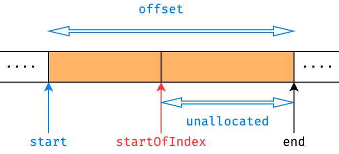

# MP4 Report from team20

> The forth assignment of NachOS
>
> Course: Operating System
>
> Professor: 周志遠

## Part 0: member list and contributions

### Member list

* 109062274 資訊工程系三年級 楊子慶 `Eroiko`
* 109080076 生科院學士班三年級 俞政佑 `Blue`

### Contributions

|Items|楊子慶|俞政佑|
|:-:|:-:|:-:|
|Code tracing|V|V|
|Report of Part 1||V|
|Basic Implementation|V||
|Bonus Implementation|V||
|Report of Implementation|V||

## Part 1: Understanding NachOS file system

### Explain how the NachOS FS manages and finds free block space? Where is this information stored on the raw disk (which sector)?

1. 從 FileSystem 的建構子 `FileSystem::FileSystem(bool format)`, 可以發現, 他最終開啟了 `OpenFile *freeMapFile` 來掌管 free block 與 `OpenFile *directoryFile` 來儲存 `OpenFile` 實例, 以供後續傳遞其參考.
2. how to manage free block space
   1. `*freeMap` 屬於 `class PersistentBitmap`, 而它繼承自`Bitmap`, 所以它用 `Bitmap` 這個資料結構來管理 sector, 總共有多少個 sector 我們就會要有多少個 bit 來紀錄哪些 sector 是被用過的, 這也是為甚麼 freeMapFile 的 file header 需要 allocate `#define FreeMapFileSize (NumSectors / BitsInByte)` bytes 的空間.
3. how to find free blocks: 
    1. 基本上是用迴圈來遍歷尋找未被使用的 sector 
    (參考[`FindAndSet()`](#int-bitmapfindandset) [`Allocate()`](#bool-fileheaderallocatepersistentbitmap-freemap-int-filesize))
    2. 以 `bool FileSystem::Create(char *name, int initialSize)` 中的 code 為例
    3. 首先呼叫 `freeMap = new PersistentBitmap(freeMapFile, NumSectors)` 將 `freeMap` 從 `freeMapFile` 這個已開啟的檔案讀進來
    4. 呼叫 `freeMap->FindAndSet()` 可以回傳一個未被使用的 sector 編號, 並在 `Bitmap` 中設定它被使用
    5. 呼叫 `hdr->Allocate(freeMap, initialSize)`, 可以要到一定數量的 sector, 哪個 sector 會直接傳進 file header 的私有成員 `int dataSectors[NumDirect]`
    6. 將修改後的 `freeMap` 等資料寫回 disk (如果 create 不成功就不用, 也就不會改動到 disk 的資料)
4. Where is this information stored on the raw disk (which sector)?
   1. 從 `FileSystem::FileSystem(bool format)` 可以發現 `freeMapFile` 的 file header allocate 一些空間(`mapHdr->Allocate(freeMap, FreeMapFileSize)`), 並被寫進了 `FreeMapSector`(`mapHdr->WriteBack(FreeMapSector);`)
   2. 而之後我們從 `FreeMapSector` 開啟 `freeMapFile`
   3. 將 `freeMap` 的改動重新寫進這個檔案
   4. 所以有關 free block 的資訊就存在 `freeMapFile` 這個檔案中
   5. 而 `freeMapFile` 的 file header 存在 `FreeMapSector` 中, 所以我們要讀取 free block 的相關資訊就需要讀取 `FreeMapSector` 中的 file header, 也就是讀 sector 0 (`#define FreeMapSector 0`), 但不等於 `Bitmap` 的資訊也存在 sector 0, 而是存在 allocate 來的sector 2 ( sector 1 放 `directoryFile` 的 file header, 所以 allocate 來的是 sector 2, 只需要 1 sector 的原因是我們總共有 1024 個 sector, 共需要 1024/8=128 bytes 來記錄 free blocks, 而每個 sector 大小為 128 bytes, 所以只要 1 個 sector, 第二題將貼出相關大小的定義程式碼)


### What is the maximum disk size that can be handled by the current implementation? Explain why

```c++
const int SectorSize = 128;     // number of bytes per disk sector
const int SectorsPerTrack  = 32;    // number of sectors per disk track 
const int NumTracks = 32;   // number of tracks per disk
const int NumSectors = (SectorsPerTrack * NumTracks);
```

1. disk 的空間 = sectorsize * numsector = sectorsize * sectorpertrack * numtrace = 128 * 32 *32 = 128 KB
2. 如果是指初始化後的空間 = 128 * (32*32-2-1-2)=127.375KB
(初始化後減去 `freeMapFile` 和 `directoryFile` file header 占用的 sector 以及 allocate 的 sector, 計算方面 `freeMapFile`部分已提到, `directoryFile` 則稍後會提到)

### Explain how the NachOS FS manages the directory data structure? Where is this information stored on the raw disk (which sector)?

1. 與第一題相似, 在 FileSystem 的建構子 `FileSystem::FileSystem(bool format)` 中, 我們開啟了 `directoryFile` 來儲存 file name
2. how to manages the directory data structure?
   1. 參考 [`Directory()`](#directorydirectoryint-size) 和 [`DirectoryEntry()`](#class-directoryentry)
   2. 用 `Directory` 和 `DirectoryEntry` 來進行維護
   3. 在 `Directory`的建構子中 new 了 `DirectoryEntry` 的陣列, 其中可以記錄每個 entry 的 `inuse`, 紀錄檔案的 `name` 與 file header 的 `sector`, 如此就可以維護我們的 file name
3. 以 `bool FileSystem::Create(char *name, int initialSize)` 中的 code 為例
   1. 先呼叫 `directory->FetchFrom(directoryFile)`, 讀取 `directoryFile` 的資料
   2. 呼叫 `directory->Find(name)`, 檢查是否已有相同的檔名
   3. `directory->Add(name, sector)` 將創建的 file name 與 file header 所在的 sector 加入 `directory` 進行管理
   4. 如果創檔成功要寫回 disk
4. 另外要 open file 時:
   1. 請參考 [`FileSystem::Open(char *name)`](#openfile--filesystemopenchar-name)
   2. 可以透過 `find(name)` 找到對應的 sector 進行開檔
5. Where is this information stored on the raw disk (which sector)?
   1. 從 `FileSystem::FileSystem(bool format)` 可以發現 `directoryFile` 的 file header allocate 一些空間(`dirHdr->Allocate(freeMap, DirectoryFileSize)`), 並被寫進了 `DirectorySector`(`dirHdr->WriteBack(DirectorySector)`)
   2. 而之後我們從 `DirectorySector` 開啟 `directoryFile`
   3. 將 `directory` 的改動重新寫進這個檔案
   4. 所以有關 file name 的資訊就存在 `directoryFile` 這個檔案中
   5. 而 `directoryFile` 的 file header 存在 `DirectorySector` 中, 所以我們要讀取 file name 的相關資訊就需要讀取 `DirectorySector` 中的 file header, 也就是讀 sector 1 (`#define DirectorySector 1`), 但不等於 `directory` 的資訊也存在 sector 1, 而是存在 allocate 來的sector 3,4 ( 前面的 sector 方別存 `freeMapFile` 的 file header, `directoryFile` 的 fileheader, `freeMap` allocate 走, 所以 allocate 來的應該是 sector 3,4, 需要 allocate 兩個 sector 的原因是申請的 size = `#define DirectoryFileSize (sizeof(DirectoryEntry) * NumDirEntries)` = 20*10 = 200, 1 sector 才 128 bytes 所以申請兩個)

### Explain what information is stored in an inode, and use a figure to illustrate the disk allocation scheme of the current implementation

```c++
class FileHeader
{
    int numBytes;   // Number of bytes in the file
    int numSectors;	// Number of data sectors in the file
    int dataSectors[NumDirect]; // Disk sector numbers for each data block in the file
};

#define NumDirect ((SectorSize - 2 * sizeof(int)) / sizeof(int))
#define MaxFileSize (NumDirect * SectorSize)
```

1. i-node 就是 fileheader
2. 從 `class FileHeader` 的私有成員我們可以看到, `numBytes` 記錄了 file 的大小有多少 bytes, `numSectors` 則紀錄此 file 用了多少 sector, `dataSectors[]` 則記錄了此 file 存放資料的所連結到的 sectors
3. 最多可以存放 `NumDirect` 個 sector, 因為 file header 只存在 1 個 sector, 減去 `numBytes` 和 `numSectors` 兩變數的空間後, (128-2*4)/4=30 (`#define NumDirect ((SectorSize - 2 * sizeof(int)) / sizeof(int))`), 所以最多可以存到 30 個 sector 編號
4. 

### Why is a file limited to 4KB in the current implementation?

1. 承上題的 code
2. 目前的 file header 都是只包含 1 個 sector, `FileHeader` 中的私有成員 `dataSectors[]` 中的 sector 也只純粹放資料不會再連結到其他 sector
3. 所以存放 file header 的 sector 中, 減去存放 `numBytes` 和 `numSectors` 兩變數的空間後, 剩餘的空間可以拿來存放 allocate 到的 sector 編號, 也就是 (128 - 8) / 4 (`#define NumDirect ((SectorSize - 2 * sizeof(int)) / sizeof(int))`), 可以存 30 個 sector 編號, 1 個 sector 可以存 128 bytes, 所以最大可以存 30*128 bytes 的 file (`#define MaxFileSize (NumDirect * SectorSize)`), 約等於 3.75KB

## Part 2 to Bonus: Implementation Part

### Abstract

本次的實作很複雜, 難以以 Spec 的順序說明, 故我將以主要三大物件的角度, 分別說明 `FileHeader`, `Directory` 和 `FileSystem` 的設計與實作, 並說明與之相關的輔助物件。

再來介紹五個 System Call 的實作, 以及其他調整。

若想快速瀏覽實作的結果, 可以先看 [FileHeader 概覽](#fileheader-概覽)以及 [Directory 概覽](#directory-概覽)兩章節。

### `FileHeader` 概覽

我以類似 (29 way) B tree 的方式設計 `FileHeader`。但與純粹的 B tree 抑或 Multi-level scheme 又有所不同, 是介於這兩種實作的產物。概念是將需求的檔案大小盡可能地以 `FileHeader` (大小為一個 sector) 為基礎, 對檔案大小取對數, 以此結果來長出整棵樹。結果是以樹形結構模擬 Multi-level scheme 的行為, 整顆 `FileHeader` Tree 的大小完全是動態的根據檔案大小調整, 沒有檔案大小的理論上限。

這樣的設計可以滿足 Part 2-3, Bonus I 和 Bonus II。

以下為使用 `test/num_100.txt`, `test/num_1000.txt` 和自己生成之 64MB 整的 `test/num_64MB.txt` 所建構的 FileHeader Tree, 其列印方式可使用 `test/FS_big_diff_hdr.sh` 生成, 當中使用我為 NachOS 擴充之 `NACHOS_EXE -ps FILE_PATH` 指令, 會呼叫...

1. `FileSystem::PrintStructure`
2. ...
3. `FileHeader::Print`

最後將印出如下結果, 包含 `FileHeader` Tree 之

1. 對應之檔案大小 (Part 2-3 + Bonus I: 第三份為 64MB 的檔案)
2. 本身在硬碟的大小 (Bonus II)
3. 在記憶體中的大小 (Bonus II)
4. 結構細節, 包含所有節點的概況與對應之檔案資料 (Bonus II)

另由於內容過多, 僅節錄部分, 完整檔可至 `test/logps100.log`, `test/logps1000.log`, `test/logps64.log` 查看。

1. `test/logps100.log`

    ```log
    FileHeader contents:
    1. File size: 1000 bytes (8 sectors)
    2. FileHeader Size in disk: 128 bytes (1 sectors)
    3. Memory Usage: 368 bytes
    4. File header structure:
    ├─── [E] start: 0, sector: 1084, ind: 0, content: { 00 ...
    ├─── [E] start: 1, sector: 1085, ind: 1, content: { 3  ...
    ├─── [E] start: 2, sector: 1086, ind: 2, content: { 02 ...
    ├─── [E] start: 3, sector: 1087, ind: 3, content: { 00 ...
    ├─── [E] start: 4, sector: 1088, ind: 4, content: { 00 ...
    ├─── [E] start: 5, sector: 1089, ind: 5, content: { 00 ...
    ├─── [E] start: 6, sector: 1090, ind: 6, content: { 7  ...
    └─── [E] start: 7, sector: 1091, ind: 7, content: { 09 ...
    ```

2. `test/logps1000.log`

    ```log
    FileHeader contents:
    1. File size: 10000 bytes (79 sectors)
    2. FileHeader Size in disk: 384 bytes (3 sectors)
    3. Memory Usage: 1104 bytes
    4. File header structure:
    ├─── [T] start: 0, sector: 1104, ind: 0
    │     ├─── [E] start: 0, sector: 1105, ind: 0, content:...
    │     ├─── ...
    │     └─── [E] start: 28, sector: 1133, ind: 28, conte ...
    │
    ├─── [T] start: 29, sector: 1134, ind: 1
    │     ├─── [E] start: 29, sector: 1135, ind: 0, conten ...
    │     ├─── ...
    │     └─── [E] start: 57, sector: 1163, ind: 28, conte ...
    │
    ├─── [E] start: 58, sector: 1164, ind: 2, content: { 0 ...
    ├─── ...
    └─── [E] start: 78, sector: 1184, ind: 22, content: {  ...
    ```

3. `test/logps64.log`

    ```log
    FileHeader contents:
    1. File size: 64000000 bytes (500000 sectors)
    2. FileHeader Size in disk: 2285824 bytes (17858 sectors)
    3. Memory Usage: 6571744 bytes
    4. File header structure:
    ├─── [T] start: 0, sector: 1197, ind: 0
    │     ├─── [T] start: 0, sector: 1198, ind: 0
    │     │     ├─── [T] start: 0, sector: 1199, ind: 0
    │     │     │     ├─── [E] start: 0, sector: 1200, ind:...
    │     │     │     ├─── ...
    │     │     .     └─── [E] start: 28, sector: 1228, ind...
    │     │     .
    │     │     └─── [T] start: 1653, sector: 2910, ind: 28
    │     │           ├─── ...
    │     │           └─── [E] start: 1681, sector: 2939, i...
    │     │
    │     ├─── [T] start: 1682, sector: 2940, ind: 2
    │     │     .
    │     │     └─── [T] start: 2494, sector: 3781, ind: 28
    │     .           ├─── ...
    │     .           .
    │     .
    │     └─── [T] start: 490274, sector: 508980, ind: 28
    .           ├─── ...
    .           └─── [E] start: 490302, sector: 509009, ind...
    .
    └─── [T] start: 494508, sector: 513365, ind: 28
        ├─── [T] start: 494508, sector: 513366, ind: 0
        │     ├─── [T] start: 494508, sector: 513367, ind: 0
        .     .     ├─── ...
        .     .     └─── [E] start: 494536, sector: 513396,...
        ├─── ...
        ├─── [E] start: 499995, sector: 519048, ind: 27, co...
        │
        └─── [T] start: 499996, sector: 519049, ind: 28
                ├─── ...
                └─── [E] start: 499999, sector: 519053, ind...
    ```

### `FileHeader` 的設計

#### `FileHeader` 提供的服務

要設計本物件, 首先得先了解它提供什麼服務, 換言之, 它要如何使用。NachOS 的 `FileHeader` 有兩種初始化方式。一種是「創建」, 另一種是「載入」。

創建的模式如下, 透過 `FileHeader::Allocate` 給定 `freeMap` 和要為檔案定址的大小來建立對應的 `FileHeader` (Tree), 最後會呼叫 `FileHeader::WriteBack` 來將 `FileHeader` 的資料寫回硬碟:

```c++
FileHeader *hdr = new FileHeader();
hdr->Allocate(freeMap, size); // freeMap: remain space indicator
// ...
hdr->WriteBack(sector); // write file/directory header into disk
```

而載入的模式如下, 透過 `FileHeader::FetchFrom` 將 `FileHeader` 自硬碟的 sector 讀入:

```c++
FileHeader * hdr = new FileHeader();
hdr->FetchFrom(sector);
```

通常後者不用我們親自呼叫, 另一種方式是以 `OpenFile` 物件來對 `FileHeader` 操作, `OpenFile` 的使用發生在我們要對檔案進行讀寫時, 其內部會呼叫 `FileHeader::FetchFrom`, `FileHeader::FileLength` 和 `FileHeader::ByteToSector` 來載入 `FileHeader`, 取得檔案大小以及確認檔案的某 byte 在哪個 sector。最後, `FileHeader` 還要能印出與之相關的資訊, 包含其整體結構。

#### `FileHeader` 的成員設計調整

以上是我們的需求, 大致上與原本相同, 只是我們要將內部改成類似 29 way B tree 的形狀, 為此我們需要額外的成員來記錄樹的資訊, 最終我的成員設計可以分為 in-disk part 和 in-core part。

1. in-disk part

    ```c++
    //* MP4 in-disk part
    int numBytes;    // Number of bytes in the file
    int numSectors;  // Number of data sectors in the file

    /** 
     * Map that determine whether the column 
     * is a node sector (TRUE) or data sector (FALSE)
     * 
     * The reason of the existence of this member 
     * is to identify whether the content of dataSectors 
     * represents a leaf data or a header node
     */
    Bitmap * map;

    /** 
     * Disk sector numbers for each data 
     * block in the file
     */
    int dataSectors[N_SECTORS]; 
    ```

    與原本的差異有二, 列敘如下:

    1. `FileHeader::map`
       * 為一 `Bitmap` (bit vector)
       * 目的是標記 `dataSectors` 的 sector 表示的是
           * `LEAF = FALSE` (data sector) 或
           * `NON_LEAF = TRUE` (non-leaf node sector)
       * 大小為 $\lceil \dfrac{29}{8} \rceil = 4$ bytes, 即一個整數大小
    2. `dataSectors` 的大小改為 `N_SECTORS = 29`
       * map 的資料部分在硬碟佔用 4 bytes
       * 故會比原始的少一個整數空間可放 sector

    這些資料可以寫回硬碟, 也可以自硬碟讀入來初始化 `FileHeader`。

2. in-core part

    ```c++
    //+ MP4 in-core part
    /** 
     * leading sector count of current file header 
     * among the whole tree, the additional one position 
     * is for traversing convenience
     */
    int startSector[N_SECTORS + 1];
    FileHeader * children[N_SECTORS];
    int additionalSector;
    ```

    他們的作用分別為

    1. `startSector`
       * 決定該節點某索引之下的樹所代表之起始檔案 sector 編號
       * 相當於 B tree 中節點的 key
       * 有 `N_SECTORS + 1` 個欄位是為了實作時比較需求位置的方便
    2. `children`: B tree 中指標的部分, 指向子節點 (子 `FileHeader`)
    3. `additionalSector`: 紀錄以該節點為根的樹額外使用幾個 sector

    這些成員是我們在創建檔案時定址、自硬碟讀入 in-disk part 後要額外維護的資料。

另外, 為了程式碼的可讀性, 我定義私有靜態常數如下:

```c++
// static constant members
static const int FILEHDR_SZ = SectorSize / sizeof(int); // size of FileHeader
static const int MEMBER_SZ = 3; // # of non-array members
static const int N_SECTORS = FILEHDR_SZ - MEMBER_SZ; // available # of index to record sector
static const bool LEAF = FALSE; // LEAF node mark
static const bool NON_LEAF = TRUE; // NON_LEAF node mark
static const int INVALID_SECTOR = -1; // represent invalid sector
```

#### `FileHeader` 新增的方法設計

完成樹的邏輯遠難於原本的實現, 我們可以借助遞迴函式的力量來幫我們用盡可能簡單的邏輯完成樹的創建與重建。通常這種函式習慣是對外開放出「啟動遞迴」的函式, 並在內部設計一個真正執行遞迴的私有函式來完成。我的設計亦同, 利用 C++ 函式多載的特性, 我定義了三組這樣的函式:

1. `FileHeader::Allocate`

    ```c++
    public:
        bool Allocate(PersistentBitmap *freeMap, int fileSize);
    private:
        int Allocate(PersistentBitmap *freeMap, 
            int totalSectors, int currentSector, int totalByte);
    ```

    公開的方法照舊, 私有的方法多了中間兩個參數 (`totalByte` 與 `fileSize` 相同), `totalSectors` 是該節點為根的樹所擁有的 sector 數量, `currentSector` 是該節點的初始 sector 位置。由於對 `FileHeader` 而言, 一切都應該以 sector 來劃分, 故比起 `fileSize` 的資訊, sector 相關的資訊更有實際意義, 所以遞回 `FileHeader::Allocate` 的簽名才會多兩個與 sector 相關的資訊。而回傳值表示該節點以下的樹多用了幾個 sector (i.e. 有幾的 `FileHeader` non leaf node)。

2. `FileHeader::FetchFrom`

    ```c++
    public:
        void FetchFrom(int sectorNumber);
    private:
        int FetchFrom(int sectorNumber, int currentSector);
    ```

    公開的方法照舊, 私有的方法多一個參數, 其意義與 `FileHeader::Allocate` 對應的參數相同。回傳值也同 `FileHeader::Allocate`, 表示該節點以下的樹多用了幾個 sector (i.e. 有幾的 `FileHeader` non leaf node)。

3. `FileHeader::Print`

    ```c++
    public:
        void Print(bool with_content = false);
    private:
        void Print(bool with_content, vector<bool> indent_list);
    ```

    公開的方法多一個 `bool` 參數, 決定是否要印出檔案的內容, 私有的方法又多一個參數, 是為了印出正確且美觀的 FileHeader 結構所使用的輔助資料結構, 故本方法需要用上 `std::vector`。順帶一提, `Directory` 由於也需要類似的印出功能, 故也會用上 `std::vector`。

另有三個輔助私有方法, 僅用來初始化 `FileHeader` 物件。

1. `FileHeader::ResetStackMemory`
2. `FileHeader::ResetHeapMemory`
3. `FileHeader::ResetArrays`

如此, 確定好成員與方法的調整, 我們可以進入實作階段。

### `FileHeader` 的實作

#### 修改硬碟以擴容

Spec (Bonus I) 提到要使單檔上限提高至 64MB, 同時對於非 contiguous scheme 的 `FileHeader` 來說, 必須使用額外空間, 故我將 disk 的設定改為以下

```c++
// in machine/disk.h
const int SectorsPerTrack = 1024; // # of sectors per disk track 
const int NumTracks = 1024;       // # of tracks per disk
const int NumSectors = (SectorsPerTrack * NumTracks);
```

如此一來, 硬碟大小變成

$$
\tt{SectorsPerTrack} \times \tt{NumTracks} \times \tt{SectorSize}
$$

$$
= 1024 \times 1024 \times 128 \rm{B} = 2^{10+10+7} \rm{B} = 128 \rm{MiB}
$$

如此便保證無論是 $64\rm{MiB}$ 還是 $64\rm{MB}$ 的檔案都可以在理論上完好放入硬碟。接下來便是讓實作上也可以完檔歸碟。

#### `FileHeader::Allocate`

本函式如前所述, 有兩個, 一表一裏。表的任務是啟動遞迴, 裏的任務是遞回地完成整顆樹的建構。

表的實作如下, 注意, 若想要加入人性化的除錯邏輯, 在這裡加入「出入遞回」的邏輯最合適。另一方面, 在遞回函式中, 使用我在 MP3 定義的 `ASSERT_MSG`, 以防衛性設計的實作方法來容易除錯, 才不會印出大量難看的除錯訊息。

首先是表函式的實作。

```c++
bool FileHeader::Allocate(PersistentBitmap *freeMap, int fileSize)
{
    int totalSectors = divRoundUp(fileSize, SectorSize);

    DEBUG(dbgFile, "Ready to allocate " << fileSize 
        << " bytes in total " << totalSectors << " sectors");
        
    Allocate(freeMap, totalSectors, 0, fileSize);
    
    DEBUG(dbgFile, "End of allocation, " 
        << "additional sectors of allocation is " << additionalSector);
    return TRUE;
}
```

接著, 裏的目標是建構「一個節點」, 並遞回呼叫建構該節點以下的子節點, 實作架構如下:

```c++
int FileHeader::Allocate(
    PersistentBitmap *freeMap, int totalSector, 
    int currentSector, int totalBytes)
{
    // 初始化非陣列的節點成員

    // 計算子節點的資料量

    // 確認結果符合預期並回傳
}
```

以下我將分區說明。

1. 初始化非陣列的節點成員

    ```c++
    // record file header size
    additionalSector = 1;
        
    // initialize members
    numSectors = totalSector;
    numBytes = totalBytes;

    ASSERT_MSG(freeMap->NumClear() > numSectors, 
        "Not enough space for allocation");

    // assert is NULL, or abort and print warning message!
    ASSERT_MSG(!map, 
        "Warning: attempt to allocate with fileSectors: " << totalSector 
        << " into an FileHeader which the map (of value: " 
        << map << ") member is not in the initial status!"
    );

    // initialize members for maintaining tree structure
    map = new PersistentBitmap(N_SECTORS);
    ```

    有以下幾點注意:

    * `additionalSector` 設為 1 表示該節點本身, 之後將持續加上子節點的數量, 最終成為該節點以下的額外 sector 數量
    * 舊有的 `numSector` 和 `numBytes` 成員可以直接透過參數確定, 故直接初始化, 後續不用額外調整
    * `map` 在呼叫前預設為 `NULL`, 若否表示使用者不正確的使用 `FileHeader` 物件, 直接報錯結束。

2. 計算子節點的資料量

    接著我要對一個個索引計算資料量來初始化。總共有 `N_SECTORS` 個索引, 他們都在建構時先初始化了一遍, 這裡是要決定這些索引的數值。初始化索引的算法是透過回圈, 透過不斷取得「剩餘 sector」來一步步指派個個索引的數值。故我們算法的架構如下:

    ```c++
    // algorithm to build the header tree
    int i = 0; // index
    int remainSector = totalSector; // remain sectors to be allocate
    int remainBytes = totalBytes; // remain bytes to be allocate
    while (remainSector >= 1) {
        // 1. Calculate and adjust the bytes to be allocated in index i
        int curSector, curBytes; // attribute of current child
        // ...

        // 2. Build tree node
        // ...
        if (curSector == 1) { 
            // only one -> place it directly
            // ... 
        }
        else { 
            // more than one, allocate a new 
            //      file header to contain the sectors
            // ...
        }

        // 3. update remain data info
        remainSector -= curSector;
        remainBytes -= curBytes;
        ++i;
    }
    ```

    1. 決定某索引的容量

        索引容量的計算公式, 我定義如下:

        $$
        \tt{curSector} = \tt{N\_SECTORS}^{\lfloor \log_{N\_SECTORS} {remainSector} \rfloor}
        $$

        此式的目的是根據當前剩餘需求大小進行動態切割, 找接近 `curSector` 的以 `N_SECTOR` 為底的指數。為此需要使用 `<cmath>` 函式庫來完成取指數與對數的邏輯, 還要處理一些邊界條件, 故整體的實作如下:

        ```c++
        // 1. Calculate and adjust the bytes to be allocated in index i
        int curSector, curBytes; // attribute of current child
        if (i + 1 < N_SECTORS) {
            // curSector = N_SECTORS ^ floor(log_remainSector ln N_SECTORS)
            curSector = static_cast<int>(
                pow(N_SECTORS, floor(log(remainSector) / log(N_SECTORS))));
        }
        else 
            curSector = remainSector;
        if (curSector == totalSector) // exception of the former "if" statement
            curSector /= N_SECTORS;
        if (remainSector == 1)
            curSector = 1;

        curBytes = curSector * SectorSize;
        if (curBytes > remainBytes) 
            curBytes = remainBytes;
        ```

        如此, 我們便確立當前索引所負責的資料量。

    2. 計算索引起始位置

        得知某索引擔當的資料量後, 我們可以計算出該索引的資料起始位置, 其公式為

        $$
        \tt{startOfIndex} = \tt{start} + \tt{offset} - \tt{unallocated}
        $$

        這是因為

        

        注意到橘色表此節點所建之樹, 即 `FileHeader::Allocate` 所負責定址的資料量。

        故實作為

        ```c++
        // 2. Build tree node
        // record current byte position
        startSector[i] = currentSector + totalSector - remainSector;
        ```

    3. 為該索引定址

        純粹需要一個可用的 sector。

        ```c++
        // 2. Build tree node
        // ...
        // allocation
        ASSERT_MSG((dataSectors[i] = freeMap->FindAndSet()) >= 0, 
            "Not enough space for single sector allocation!");
        ```

    4. 初始化該索引的欄位與遞回呼叫

        注意點有二。

        1. `additionalSector` 可以透過遞回呼叫之 `FileHeader::Allocate` 的回傳值來計算額外使用的 nonleaf `FileHeader` 數量。

        2. `else` 中 `map->Mark(i)` 表此索引的 sector 存放另一個 `FileHeader`。

        ```c++
        // 2. Build tree node
        // ...
        if (curSector == 1) { 
            // only one -> place it directly
            children[i] = NULL;
        }
        else { 
            // more than one, allocate a new 
            //      file header to contain the sectors
            children[i] = new FileHeader();
            map->Mark(i); // since non leaf
            additionalSector += children[i]->Allocate(freeMap, curSector, 
                currentSector + totalSector - remainSector, curBytes);
        }
        ```

    5. 更新剩餘定址的計數器

        ```c++
        // 3. update remain data info
        remainSector -= curSector;
        remainBytes -= curBytes;
        ++i;
        ```

3. 確認結果符合預期並回傳

    基於防衛式實作, 在最後不免要來確認定址的結果與預期相符, 才可以完成函式。注意到 `startSector` 額外的位置剛好存放 `currentSector + totalSector` (請回憶前面示意圖)。

    ```c++
    ASSERT_MSG(!remainSector && !remainBytes, 
        "Error: remainSector: " << remainSector 
        << " or remainBytes: " << remainBytes 
        << " is not zero after allocated all file header space!");
    
    startSector[i] = currentSector + totalSector; // (additional) last position
    
    return additionalSector;
    ```

#### `FileHeader::Deallocate` 的調整

同 `FileHeader::Allocate`, 我們可以遞迴呼叫 `FileHeader::Deallocate` 來完成邏輯。與 `FileHeader::Allocate` 不同的是, `FileHeader::Deallocate` 不用特殊的參數或回傳值輔助邏輯的完成, 只要最後 reset 成員即可, 故不用分成兩個函式來完成。

首先是架構, 遍歷所有索引與最後重設成員。

```c++
void FileHeader::Deallocate(PersistentBitmap *freeMap)
{
    for (int i = 0; i < N_SECTORS; i++) {
        // deallocate sectors directly managed in this file header
        if (map->Test(i) == LEAF) {
            // ...
        }
        // deallocate sectors managed by child nodes
        else {
            // ...
        }
    }
    // reset children info map after deallocation
    ResetArrays();
}
```

接著是對葉節點的邏輯, 內部多一個 `if` 表只在該 sector 合法時釋放空間, 否則表已經釋放完了, 跳出回圈。另外, 同樣基於防衛式實作, 在釋放前確認該 sector 原本有被定址過。

```c++
// deallocate sectors directly managed in this file header
if (map->Test(i) == LEAF) {
    if (dataSectors[i] != INVALID_SECTOR) {
        ASSERT_MSG(freeMap->Test((int) dataSectors[i]), 
            "Error occurs in deallocation part: "
            << "the sector managed directly is corrupt!"); // ought to be marked!
        freeMap->Clear((int)dataSectors[i]);
    }
    else
        break;
}
```

接著是非葉子節點的遞迴釋放, 注意必須以 DFS 的邏輯釋放, 否則無法正確釋放空間。

```c++
// deallocate sectors managed by child nodes
else {
    ASSERT_MSG(children[i], "Error occurs in deallocation part: "
        << "the children pointer hasn't be set correctly "
        << "when allocating / fetching");
    children[i]->Deallocate(freeMap);
    delete children[i];
    children[i] = NULL; // reset this child
    map->Clear(i); // reset child map
}
```

#### `FileHeader::FetchFrom`

與 `FileHeader::Allocate` 相同, 一樣有兩個函式, 概念都相似, 故我們直接看實作。

啟動遞迴的表函式如下, 概念都與之前相同。

```c++
void FileHeader::FetchFrom(int sector)
{
    DEBUG(dbgFile,"Start fetching whole file header from sector " << sector);
    FetchFrom(sector, 0);
    DEBUG(dbgFile,"End fetching whole file header with header size " 
        << (additionalSector * SectorSize) << " bytes (" 
        << additionalSector << " sectors)");
}
```

裏函式也分成同樣的數個階段, 實作架構如下:

```c++
int FileHeader::FetchFrom(int sector, int currentSector)
{
    // 自硬碟取得 in-disk 資料

    // 重建陣列

    // 確認結果符合預期並回傳
}
```

細節依序為

1. 自硬碟取得 in-disk 資料

    用 `cache` 取資料, 寫入 in-disk 成員。注意, 原本沒有 `Bitmap::Import` 這個方法, 這是我額外實作的, 將放到後面一併解釋, 解釋我對 `Bitmap` 這個原本一開始覺得很厲害但複雜度卻出奇可畏之物件的修改。目前僅需知道它可以把外部資料導入 `Bitmap` 中。

    ```c++
    int cache[FILEHDR_SZ]; // cache to catch the data from disk
    kernel->synchDisk->ReadSector(sector, (char *) cache);

    // assert is NULL, or abort and print warning message!
    ASSERT_MSG(!map, 
        "Warning: attempt to allocate with sector number: " << sector 
        << " into an FileHeader which the map (of value: " 
        << map << ") member is not in the initial status!"
    );

    // initialize members for maintaining tree structure
    map = new PersistentBitmap(N_SECTORS);

    // initialize members of file header
    numBytes = cache[0];
    numSectors = cache[1];
    map->Import((unsigned int *) cache + MEMBER_SZ - 1);
    memcpy(dataSectors, cache + MEMBER_SZ, sizeof(dataSectors));
    ```

2. 重建陣列

    `additionalSector` 的運作與其在 `FileHeader::Allocate` 的時候一模一樣; 多一個 `childSector` 用來累積子節點所負責的資料量, 最終應該要與 `FileHeader::Allocate` 中 `totalSectors` (i.e. `FileHeader::numSectors`) 的數值相同。

    ```c++
    // rebuild the tree structure use DFS
    additionalSector = 1;
    int childSector = 0; // count child sector
    int i;
    for (i = 0; i < N_SECTORS; ++i) {
        startSector[i] = currentSector + childSector;
        if (map->Test(i) == NON_LEAF) { // has children
            children[i] = new FileHeader();
            additionalSector += children[i]->FetchFrom(dataSectors[i], startSector[i]);
            childSector += children[i]->numSectors;
        }
        else if (dataSectors[i] == INVALID_SECTOR) // no more sectors
            break;
        else // leaf node
            ++childSector;
    }
    ```

3. 確認結果符合預期並回傳

    前面說 `childSectors` 須與 `FileHeader::numSectors` 相同, 基於防衛式實作, 我們應該檢查是此事是否為真。為真後方可回傳, 此前不忘維護 `startSector` 的額外最末位。

    ```c++
    startSector[i] = currentSector + childSector; // (additional) last position
    
    ASSERT_MSG(childSector == numSectors, 
        "The total sector count [" << numSectors 
        << "] does not match with [" << childSector
        << "] when re-building header tree use FetchFrom"
        << ", where sector number is " << sector 
        << " and currentSector is " << currentSector);
    
    return additionalSector;
    ```

#### `FileHeader::WriteBack`

與 `FileHeader::Deallocate` 相似, 只需寫回資料, 不用特殊的參數或回傳值, 故不需兩個函式。邏輯也比較簡單, 即與 `FileHeader::FetchFrom` 的作法相反...

```c++
void FileHeader::WriteBack(int sector)
{
    // 1. 建立 `cache`, 為其指派資料後將其寫入硬碟

    // 2. 遞迴呼叫非葉子節點的 `FileHeader::WriteBack`
}
```

兩部分解釋如下。

1. 建立 `cache`, 為其指派資料後將其寫入硬碟

    這裡出現與 `FileHeader::FetchFrom` 中出沒之 `Bitmap::Import` 相反的方法 `Bitmap::Export`, 其功能即導出 `Bitmap` 的內容, 以便未來重建 `Bitmap`, 實作一併在後面說明。

    ```c++
    int cache[FILEHDR_SZ]; // cache of the data to be store into disk
    cache[0] = numBytes;
    cache[1] = numSectors;
    map->Export((unsigned int *) cache + MEMBER_SZ - 1);
    memcpy(cache + MEMBER_SZ, dataSectors, sizeof(dataSectors));

    // write back the information of the current file header
    kernel->synchDisk->WriteSector(sector, (char *) cache);
    ```

2. 遞迴呼叫非葉子節點的 `FileHeader::WriteBack`

    ```c++
    // store the children file headers recursively
    for (int i = 0; i < N_SECTORS; ++i) {
        if (map->Test(i) == NON_LEAF) {
            ASSERT_MSG(children[i], "The children [" << i 
                << "] is invalid now but attempt to write back...");
            children[i]->WriteBack(dataSectors[i]); // DFS
        }
    }
    ```

#### `FileHeader::ByteToSector`

為本物件的核心方法, 就是因為本物件提供此方法, 才有 `FileHeader` 的存在意義。由於過去我們已經維護許多資料, 故本方法的實作雖然與原本的大相徑庭, 但其實相當簡單, 就是 B tree 的遍歷邏輯。

```c++
int FileHeader::ByteToSector(int offset)
{
    // traverse to leaf node containing this file offset
    int offsetSector = offset / SectorSize;
    for (int i = 0; i < N_SECTORS; ++i) {
        if (offsetSector >= startSector[i] && offsetSector < startSector[i + 1]) {
            if (map->Test(i)) { // header node
                ASSERT_MSG(children[i], 
                    "Invalid children sector found while fetching ByteToSector");
                return children[i]->ByteToSector(offset);
            }
            else // desired leaf node
                return dataSectors[i];
        }
    }
    // never reach
    ASSERT_MSG(FALSE, "Error: the file doesn't contain the offset: " << offset);
}
```

#### `FileHeader::Print`

最後是讓我們可以美觀的檢視 `FileHeader` 結構的本方法, 由於需要輔助的 `indent_list` 來紀錄

1. 有幾個 indent $\rightarrow$ 以 `indent_list.size()` 決定
2. 何時印出 `'|'` 或 `' '` $\rightarrow$ 以 `indent_list[i]` 的為真或假決定

`indent_list` 需要不斷增長並在 `FileHeader::Print` 間向下傳遞, 故我們需要兩個函式, 同樣一表一裡。

表函式同樣較簡單, 即以 `vector<bool>()` 啟動遞迴, 實作如下。

```c++
void FileHeader::Print(bool with_content)
{
    cout << "FileHeader contents:" << endl 
        << "1. File size: " << numBytes << " bytes ("
        << numSectors << " sectors)" << endl 
        << "2. FileHeader Size in disk: " 
        << (additionalSector * SectorSize) 
        << " bytes (" << additionalSector 
        << " sectors)" << endl
        << "3. Memory Usage: " 
        << sizeof(FileHeader) * additionalSector
        << " bytes" << endl;
    cout << "4. File header structure:\n";
    Print(with_content, vector<bool>());
}
```

裏函式就非常複雜了, 這是為了印出很美觀整齊的結構。以下僅說明概要, 畢竟其與維護 `FileHeader` 物件沒有關聯。

```c++
void FileHeader::Print(bool with_content, vector<bool> indent_list) {
    string front_proto = "", front = "";
    // 準備要印出的樹狀直線
    vector< vector<bool> > next_indent_list;
    // 準備子節點的 indent_list
    char * buf = new char[N_SECTORS * SectorSize];

    // DFS 遍歷並印出
    bool last_one = false;
    for (int i = 0, k = 0; !last_one; i++) {
        last_one = i == N_SECTORS - 1 || dataSectors[i + 1] == -1;
        // ...
        if (map->Test(i) == NON_LEAF) { // print in DFS order
            // 印出 non leaf node 並 DFS
        }
        else {
            // 印出 leaf node
        }
    }

    delete buf;
}
```

如此一來, `FileHeader` 已經準備就緒, 以供獨立或與 `OpenFile` 搭配使用。

### `Directory` 概覽

`Directory` 看似與 `FileHeader` 行為相近, 不過 `Directory` 實際上要依賴 `OpenFile` 來建立與儲存資料。又 `OpenFile` 依賴 `FileHeader`, 故實際上 `Directory` 還是依賴 `FileHeader` (inode in Unix) 來紀錄目錄資訊。這就是為何 Unix (NachOS) 所謂 "All things are files" 在無論檔案抑或目錄都成立的原因。

與 `FileHeader` 的行為差在 `Directory` 不在意子目錄的載入與否, 且有對資料「增刪查」的邏輯要實現。

以下為執⾏ `FS_r_rr.sh` 腳本的過程印出的其中⼀次資料夾結構, 這說明我們完成 Spec part 3 的要求; 另將此腳本執⾏完即可驗證我們完成 Spec bonus 3 的要求。

```txt
Directory structure:
├─── [D] name: mydir, first sector: 1072, ind: 0
│     ├─── [F] name: num0.txt, first sector: 1411, ind: 0
│     ├─── [F] name: num1.txt, first sector: 1493, ind: 1
│     ├─── [F] name: num2.txt, first sector: 1575, ind: 2
│     │
│     ├─── [D] name: sub1, first sector: 1657, ind: 3
│     │     ├─── [F] name: num.txt, first sector: 1843, i ...
│     │     │
│     │     ├─── [D] name: sub, first sector: 2007, ind: 1
│     │     │     └─── [F] name: num.txt, first sector: 2 ...
│     │     │
│     │     └─── [D] name: tmp, first sector: 2018, ind: 2
│     │
│     ├─── [D] name: sub2, first sector: 1668, ind: 4
│     │     ├─── [F] name: num.txt, first sector: 1925, i ...
│     │     │
│     │     └─── [D] name: tmp, first sector: 2029, ind: 1
│     │
│     └─── [F] name: num3.txt, first sector: 1679, ind: 5
│
├─── [F] name: num1.txt, first sector: 1083, ind: 1
├─── [F] name: num2.txt, first sector: 1165, ind: 2
├─── [F] name: num3.txt, first sector: 1247, ind: 3
└─── [F] name: num4.txt, first sector: 1329, ind: 4
```

### `Directory` 的設計

由 Part III 所規定, 要支援子目錄的邏輯, 故我將原本增刪查的方法都新增一預設參數 `isDir`, 以在向下兼容的同時, 還支援子元素可為檔案抑或目錄的邏輯。

為了程式的可讀性, 首先定義與修改以下巨集。

注意 Part 3 Spec 提到一個目錄要支援 64 個元素...

```c++
// in directory.h
#define IS_FILE FALSE // this is a file
#define IS_DIR  TRUE  // this is a directory
#define NumDirEntries 64 // max number of directory entry
```

由此修改「增刪查」的函式簽名如下, 注意對外開放的方法都有預設參數以向下兼容。

```c++
public:
    int Find(const char *name, bool isDir = IS_FILE);
    bool Add(const char *name, 
        int newSector, bool isDir = IS_FILE);
    bool Remove(const char *name, bool isDir = IS_FILE);
private:
    int FindIndex(const char *name, bool isDir);
```

而「子元素可以是資料夾」使我們在 `DirectoryEntry` 中僅用 `inUse` 一個位元不足以描述三種狀態 (沒使用、為檔案、為目錄), 故需要新增一個成員, 命名為 `isDir`, 表此 entry 是否代表子目錄。

```c++
class DirectoryEntry
{
public:
    bool isDir; // Is this entry is a subdirectory?
    bool inUse; // Is this entry in use?
    int sector; // Location on disk to find the
                //   FileHeader for this file
    char name[FileNameMaxLen + 1];
};
```

另外, 與 `FileHeader::Print` 極其相似, 我們需要一表一裏的 `Directory::Print` 來實現美觀的目錄列印邏輯, 同時也需要輔助的 `indent_list` 來紀錄如何列印縮排, 故同樣要引入 `<vector>`。由此, 裏版 `Directory::Print` 簽名如下

```c++
// #include <vector>
private:
    void Print(vector<bool> indent_list);
```

另外, 我擴展 Bonus III 「遞迴刪除資料夾」的邏輯, 成為「遞迴作用某 callback 函式至所有資料夾下的元素」。

故定義 `Directory::Apply` 方法, 前兩的參數為 callback 函式, 分別作用於檔案和子目錄; 第三的參數是可選的, 是傳入 callback 的物件指標, 具體怎麼使用是看調用者的 callback 需不需要, 是為了擴展性。

```c++
void Apply(void (* callbackFile)(int, void*), 
    void (* callbackDir)(int, void*), void* object = NULL);
```

還有, 由於訪問子目錄的需求之甚, 我將此邏輯獨立成兩個函式, 同樣一表一裏。

表的針對給定的目錄與子目錄名稱來初始化子目錄。簽名如下

```c++
void SubDirectory(char * name, Directory * fresh_dir);
```

外部若要取得子目錄的實例, 需以下形式來呼叫 `Directory::Subdirectory`

```c++
// instance to obtain subdirectory
Directory * sub = new Directory();

// "sub" subdirectory is ready to be used
parentDir->SubDirectory(name, sub);

// ---[DO_SOMETHING]---
delete sub;
```

而裏函式針對 `Directory` 內部自己使用, 其傳入子目錄的「索引」 (這部分明顯不是需要暴露的), 以初始化子目錄實例, 簽名如下

```c++
void SubDirectory(int index, Directory * fresh_dir);
```

會需要如此彎彎繞的邏輯, 而非直接用類似以下的作法, 來設計取得子目錄實例的邏輯

```c++
Directory * sub = parentDir->Subdirectory(...);
```

是為了讓調用者主動管理記憶體!

另外, 由於 Part III Spec 規定新資料夾要裝 64 個元素, 故我直接將 `Directory::Directory` 建構子加入預設參數 `size = NumDirEntries`。

```c++
class Directory
{
public:
    Directory(int size = NumDirEntries);
};
```

最後, 由於幾乎所有操作都要遍歷整個 `Directory::table`, 為了提升效率, 我新增唯一一個 in-core 成員 `count` 來紀錄該目錄有幾個元素。

```c++
//+ MP4 in-core part
int count; // # of element in this directory
```

### `Directory` 的實作

本來我設計的實作更偏向 `FileHeader`, 會額外建立樹狀結構以便快速訪問子目錄。為了效率, 我使用惰性的概念, 只有在需要訪問子目錄時再初始化下一層子目錄樹。不過後來想想也沒必要, 所以最後將此邏輯刪除了。現在直接透過 `DirectoryEntry` 的 `isDir` 和 `sector` 成員來訪問子資料夾即可, 邏輯由此大幅減少。

#### `Directory::FetchFrom`

在討論增刪查的調整前, 因為新增 `count` 成員, 故我們要在加載目錄資訊時更新之, 故 `Directory::FetchFrom` 需進行修改。

```c++
// ...
count = 0; // reset count
// count used elements after fetching
for (int i = 0; i < tableSize; ++i)
    count += table[i].inUse;
```

這為之後列印目錄與遍歷資料夾省下了少許時間。

#### `Directory::Find`

因只加入新參數, 故僅需簡單修改即可。

```c++
int Directory::Find(const char *name, bool isDir)
{
    int i = FindIndex(name, isDir);
    // ... same
}
```

#### `Directory::FindIndex`

因只加入新參數, 故僅需簡單修改即可。

```c++
int Directory::FindIndex(const char *name, bool isDir)
{
    for (int i = 0; i < tableSize; i++)
        if (table[i].inUse && table[i].isDir == isDir && 
            !strncmp(table[i].name, name, FileNameMaxLen))
            return i;
    return -1; // name not in directory
}
```

#### `Directory::Add`

針對新參數跟成員微調, 並加入除錯訊息。

```c++
bool Directory::Add(const char *name, int newSector, bool isDir)
{
    if (FindIndex(name, isDir) != -1) // file/directory exist
        return FALSE;

    for (int i = 0; i < tableSize; i++)
        if (!table[i].inUse) { // available position
            table[i].inUse = TRUE;
            table[i].isDir = isDir;
            strncpy(table[i].name, name, FileNameMaxLen);
            table[i].sector = newSector;
            DEBUG(dbgFile, "Add a new " << (isDir ? "directory" : "file") << " with " << "name=" << name << ", sector=" << newSector);
            ++count;
            return TRUE;
        }
    return FALSE; // no space.  Fix when we have extensible files.
}
```

#### `Directory::Remove`

因只加入新參數, 故僅需簡單修改即可。

```c++
bool Directory::Remove(const char *name, bool isDir)
{
    int i = FindIndex(name, isDir);

    if (i == -1)
        return FALSE; // name not in directory
    table[i].inUse = FALSE;
    --count;
    return TRUE;
}
```

#### `Directory::Print`

一表一裏, 表很簡單, 實作如下

```c++
void Directory::Print()
{
    cout << "Directory structure:" << endl;
    Print(vector<bool>());
}
```

裏和 `FileHeader::Print` 的裏函式有異曲同工之妙, 這裡也同樣只說明架構。

```c++
void Directory::Print(vector<bool> indent_list)
{
    string front_proto = "", front = "";
    // 準備要印出的樹狀直線
        
    vector< vector<bool> > next_indent_list;
    // 準備子節點的 indent_list

    int count = 0;
    // 計算有幾個子元素

    // DFS 遍歷並印出
    int _cnt = count;
    bool last_one = _cnt == 0;
    for (int i = 0; !last_one; ++i) {
        if (table[i].inUse) {
            last_one = !--_cnt;
            // ...
            if (table[i].isDir) {
                // 印出 subdirectory 並 DFS
            }
            else {
                // 印出 leaf node
            }
        }
    }
}
```

#### `Directory::Apply`

`Directory` 物件中最具設計難度的莫過於本函式了。不過實作起來倒是沒那麼困難, 就是遍歷元素, 見目錄套 `callbackDir`, 見檔案套 `callbackFile`。注意此處出現前面介紹使用 `Subdirectory` 方法來取得子目錄的邏輯。另外, `count` 在如這種要遍歷所有元素的情況下會帶來些許好處。

```c++
void Directory::Apply(
    void (* callbackFile)(int, void*), 
    void (* callbackDir)(int, void*), void* object)
{
    for (int i = 0, _cnt = count; _cnt; ++i) {
        if (table[i].inUse) {
            --_cnt;
            if (table[i].isDir) { // DFS
                Directory * sub = new Directory(NumDirEntries);
                SubDirectory(i, sub);
                sub->Apply(callbackFile, callbackDir, object);
                callbackDir(table[i].sector, object);
                delete sub;
            }
            else 
                callbackFile(table[i].sector, object);
        }
    }
}
```

#### `Directory::List`

為了美觀, 我根據 `Directory::count` 微調輸出內容。

```c++
void Directory::List()
{
    for (int i = 0, _cnt = count; _cnt; i++)
        if (table[i].inUse) {
            cout << (--_cnt ? "├" : "└") << "───["
                 << (table[i].isDir ? "D" : "F") 
                 << "] " << table[i].name << endl;
        }
}
```

#### `Directory::Subdirectory`

之前介紹過有一表一裏, 表函式依賴裏函式, 邏輯不難, 就直接放程式碼了。

```c++
void Directory::SubDirectory(char * name, Directory * fresh_dir)
{
    int i = FindIndex(name, IS_DIR);
    SubDirectory(i, fresh_dir);
}

void Directory::SubDirectory(int index, Directory * fresh_dir)
{
    OpenFile * sub_f = new OpenFile(table[index].sector);
    fresh_dir->FetchFrom(sub_f);
    delete sub_f;
}
```

到此, 我們完成 `FileHeader` 和 `Directory` 的設計與實作, 接著就是最重要的 `FileSystem`。

### `FileSystem` 概覽

對原有的 `FileSystem`, 主要有四項調整。

1. 加入與調整 System Call 對應的 FileSystem 方法和加入 OpenFile Table 的邏輯

    * OpenFile Table 以 `FileSystem::opTable` 成員維護, 並以 `OpenFileId` (`int`) 為對外的資料型態, 也就是我們熟悉的 file descriptor。
    * 此固然非必要, 不過為了嚴謹性, 我依然實作了 OpenFile Table 的邏輯。
    * 利用 `std::map` (本來想用 `std::unordered_map`, 但似乎因為 C++ 編譯標準過舊, 導致不能正常使用) 來實現大小無限的 OpenFile Table。

2. 以 `FileSystem::CreateFileDir` 和 `FileSystem::RemoveSingleObj` 兩方法, 大幅簡化新增與刪除的邏輯, 並增加程式的可維護性。

    ```c++
    private:
        bool CreateFileDir(const char * path, 
            bool isDir, int initialSize = 0);
        static void RemoveSingleObj(int sector, 
            PersistentBitmap * freeMap);
    ```

3. 加入 `FileSystem::Mkdir`, `FileSystem::RecursiveRemove` 函式, 完成 Spec 規定的新邏輯。

    ```c++
    public:
        bool Mkdir(const char * path); // make a directory
        bool RecursiveRemove(const char *path); // Delete a file (UNIX unlink)
    ```

4. 設計並實作 `FileSystem::TraversePath` 物件, 幫助遍歷 `FileSystem` 與管理記憶體。

    ```c++
    private:
    /** 
     * Path traverser that automatically 
     * manage the memory usage
     * 
     * @param path path to traverse
     * @param isDir whether path is for a directory
     * @param root OpenFile of root directory
     * @param flush_dir whether to flush information after releasing TraversePath
    */
    class TraversePath { /* ... */ };
    ```

以下將分別介紹它們的設計與實作。

#### System Call 對應的 FileSystem 方法和 OpenFile Table 的邏輯

首先加入新成員。

```c++
// #include <map>
map<OpenFileId, OpenFile*> opTable; // opened file table
```

由於 Server 是 64 位元的電腦, 記憶體有 64 bits, 但 `OpenFileId` 為 `int` 型別, 只有 32 bits, 故不可以直接把指標轉型, 否則若 Server 記憶體很多, 我們的程式就有機會出錯。所以我依然設計 OpenFile Table, 將 64 bits address 映射為 32 bits 整數。

依據 Spec 中 System Call 的簽名, 我設計與實作的 `FileSystem::Open`, `FileSystem::Read`, `FileSystem::Write` 和 `FileSystem::Close` 方法如下。

1. `FileSystem::Open`

    這裡使用我額外設計的 `FileSystem::OpenAsOpenFile` 方法來完成開檔邏輯, 這是因為 NachOS 中 `main.cc::Copy`, `main.cc::Print` 和 `AddrSpace::Load` 會使用到原版的 `FileSystem::Open`。

    新的 `FileSystem::OpenAsOpenFile` 取代原本的 `FileSystem::Open`, 僅對核心內可用。可以看成是新版 `FileSystem::Open` 的裏函式。

    新 OpenFileId 的取得很簡單, 直接以亂數的結果決定, 如果沒有撞名就直接⽤, 不過也許多⼀個計數器會更好。

    ```c++
    OpenFileId FileSystem::Open(const char *path)
    {
        OpenFile *openFile = OpenAsOpenFile(path);
        // maintain OpenFile table
        do {
            id = rand();
        } while (opTable.find(id) != opTable.end());
        opTable[id] = openFile;
        return id; // return NULL if not found
    }
    ```

    順便加上 `FileSystem::OpenAsOpenFile` 的簽名與實作如下, 會使用到 `TraversePath` 物件, 其用法與實作將留到後面說明。

    ```c++
    OpenFile * FileSystem::OpenAsOpenFile(const char *path)
    {
        TraversePath tr(path, IS_FILE, directoryFile);
        ASSERT_MSG(tr.success, "Invalid path in Open");

        Directory *directory = tr.dir;
        OpenFile *openFile;
        
        int sector;

        DEBUG(dbgFile, "Opening file" << tr.name);
        sector = directory->Find(tr.name);
        if (sector >= 0)
            openFile = new OpenFile(sector); // name was found in directory
        return openFile;
    }
    ```

    最後, 我將其餘 NachOS 中原本呼叫 `FileSystem::Open` 的方法其悉數改為呼叫 `FileSystem::OpenAsOpenFile`。

    ```c++
    // main.cc::Copy:105
    openFile = kernel->fileSystem->OpenAsOpenFile(to);
    
    // main.cc::Print:137
    if ((openFile = kernel->fileSystem->OpenAsOpenFile(name)) == NULL)

    // AddrSpace::Load:108
    OpenFile *executable = kernel->fileSystem->OpenAsOpenFile(fileName);
    ```

2. `FileSystem::Read`

    對 `std::map` 和 `OpenFile` 的基本操作。

    ```c++
    int FileSystem::Read(char *buf, int size, OpenFileId id)
    {
        if (opTable.find(id) != opTable.end()) {
            OpenFile * file = (OpenFile *) opTable[id];
            return file->Read(buf, size);
        }
        return 0; // failed
    }
    ```

3. `FileSystem::Write`

    對 `std::map` 和 `OpenFile` 的基本操作。

    ```c++
    int FileSystem::Write(char *buf, int size, OpenFileId id)
    {
        if (opTable.find(id) != opTable.end()) {
            OpenFile * file = (OpenFile *) opTable[id];
            return file->Write(buf, size);
        }
        return 0; // failed
    }
    ```

4. `FileSystem::Close`

    對 `std::map` 和 `OpenFile` 的基本操作。

    ```c++
    int FileSystem::Close(OpenFileId id)
    {
        if (opTable.find(id) != opTable.end()) {
            OpenFile * file = (OpenFile *) opTable[id];
            delete file;
            opTable.erase(id);
            return 1;
        }
        return 0; // failed
    }
    ```

接下來只要將這些方法串接到 System Call 即可。

#### 簡化新增與刪除邏輯

1. `FileSystem::CreateFileDir`

    本私有函式將新增檔案與資料夾的邏輯合而為一, 透過 `isDir` 參數決定要新增個元素類別。若為檔案, 則需指派 `initialSize` 參數, 若否, 則該參數會被忽視。

    實作完本函式, 就相當於完成滿足 Spec 的 `FileSystem::Create` 和 `FileSystem::Mkdir`。以下為其實作架構。

    ```c++
    bool FileSystem::CreateFileDir(const char * path, 
        bool isDir, int initialSize)
    {
        // 1. traverse path

        // 2. find free sector and update directory

        // 3. allocate corresponding file header with correct size

        // 4. write back the updated info, and return
    }
    ```

    可將其分解程式為四區, 以下分別介紹。

    1. traverse path

        使用我設計的 `TraversePath` 遍歷至正確位置, 獲得擁有目標路徑的資料夾 `TraversePath::dir`、檔名 `TraversePath::name` 還有一些額外資訊。

        ```c++
        TraversePath tr(path, isDir, directoryFile);
        ASSERT_MSG(tr.success, "Invalid path in CreateFileDir");

        if (tr.exist) { // file or directory exist
            DEBUG(dbgFile, "File exist, no need to create");
            return FALSE;
        }
        ```

    2. find free sector and update directory

        初始化 freeMap, `FileHeader`, 取得新 sector 後更新目錄。

        ```c++
        Directory * dir = tr.dir;

        PersistentBitmap *freeMap;
        FileHeader *hdr; // file header of new directory
        int sector; // sector of new directory

        freeMap = new PersistentBitmap(freeMapFile, NumSectors);

        sector = freeMap->FindAndSet(); // find a sector to hold the file header
        ASSERT_MSG(sector, "Not enough space to make a new " << attr);

        dir->Add(tr.name, sector, isDir);
        ```

    3. allocate corresponding file header with correct size

        決定檔案大小 (`Directory` 也是檔案的一份子, 根據過去對 `Directory` 的概覽介紹) 後, 依照 sector 與檔案大小, 透過 `FileHeader` 定址。

        ```c++
        int size = isDir ? NumDirEntries * sizeof(DirectoryEntry) : initialSize;
        ASSERT_MSG(size > 0, "Attempt to initialize a " << attr << " with size " << size);

        hdr = new FileHeader();
        ASSERT_MSG(hdr->Allocate(freeMap, size), 
            "Not enough space to make a new " << attr);
        ```

    4. write back the updated info, and return

        將 `FileHeader`, `freeMap` 和若是新增資料夾時會有的新 `Directory` 寫回硬碟。

        ```c++
        hdr->WriteBack(sector); // write file/directory into disk
        freeMap->WriteBack(freeMapFile); // update freeMap info
    
        if (isDir) { // flush directory!
            Directory * subDir = new Directory();
            OpenFile * subDirFile = new OpenFile(sector);
            subDir->WriteBack(subDirFile);
            delete subDir;
            delete subDirFile;
        }
    
        delete hdr;
        delete freeMap;
        return TRUE;
        ```

2. `static FileSystem::RemoveSingleObj`

    無論是檔案抑或目錄, 只要將其 `FileHeader` 刪除並更新 `freeMap`, 就等於抹去其存在。至於更新擁有此物件之目錄的邏輯, 這就留給調用者維護, 此事我已紀錄在函式簽名的註解中。

    至於為何為靜態方法, 是因為本方法明顯與任何 `FileSystem` 的實例成員沒有關係。宣告成私有靜態方法就可以給更地方調用。

    實現此方法後, `FileSystem::Remove` 和 `FileSystem::RecursiveRemove` 的實作就水到渠成。

    ```c++
    void FileSystem::RemoveSingleObj(int sector, 
        PersistentBitmap * freeMap)
    {
        FileHeader * fileHdr = new FileHeader;
        fileHdr->FetchFrom(sector);
        fileHdr->Deallocate(freeMap); // remove data blocks
        freeMap->Clear(sector);       // remove header block
        delete fileHdr;
    }
    ```

#### `FileSystem::TraversePath` 的設計

`TraversePath` 旨在完成遍歷路徑的邏輯, 其有三個主要方法。

1. 靜態私有的 `static TraversePath::ParsePath` 方法
2. 建構子, 負責遍歷的邏輯
3. 解構子, 負責視需求更新路徑父資料夾的狀態, 以及釋放遍歷時取得的 heap memory

```c++
private:
    /** 
     * Parse the path and return each path step separately
     * Will always start from a "/" (root) element
     * i.e. length return vector always has at least an element
     * @param path char array represent the file/directory path
     */
    static vector<string> ParsePath(const char * path);
public:
    /** 
     * Path traverser that automatically 
     * manage the memory usage
     * 
     * @param path path to traverse
     * @param isDir whether path is for a directory
     * @param root OpenFile of root directory
     * @param flush_dir whether to flush information after releasing TraversePath
     */
    TraversePath(const char * path, bool isDir, 
    OpenFile * root, bool flush_dir = true);

    ~TraversePath();
```

建構子本身就負責遍歷的行為, 建構好等於遍歷完, 會將結果紀錄為 `TraversePath` 的公開成員。其公開成員如下

```c++
class TraversePath {
public:
    Directory * dir; // parent dir that contains target
    OpenFile * dirFile; // OpenFile of parent dir
    char name[FileNameMaxLen + 1]; // pure name of target file
    bool success; // does the traverse success
    bool exist; // is the file/dir exist
};
```

有了 `TraversePath` 後, 要遍歷路徑只需建構之, 就可以取得

1. 遍歷目標所在的資料夾
2. 所在的資料夾對應的 OpenFile
3. 目標的名稱
4. 遍歷是否成功
5. 目標目前是否存在

另外有兩個私有成員, 是為了決定解構時該做什麼事。

```c++
class TraversePath {
private:
    OpenFile * root; // OpenFile of root dir of traversing
    bool flush_dir; // to flush info of dir when deconstruct
};
```

#### `FileSystem::TraversePath` 的實作

1. `TraversePath::ParsePath`

    工欲善其事, 必先利其器。要遍歷路徑, 首先得先能解析之。我使用 `std::string` 搭配 `std::vector`, 以簡明的邏輯解析路徑。

    注意回傳的 `vector<string>` 必包含 `"/"` (root)。

    ```c++
    // #include <vector>
    // #include <string>
    vector<string> FileSystem::TraversePath::ParsePath(const char * path) 
    {
        string p(path);
        char delimeter = '/';
        vector<string> res;
        res.push_back("/"); // root

        if (p != "/") {
            size_t pos = 0, nxt;
            while ((nxt = p.find(delimeter, pos + 1)) != string::npos) {
                res.push_back(p.substr(pos + 1, nxt - pos - 1));
                pos = nxt;
            }
            res.push_back(p.substr(pos + 1));
        }
        
        return res;
    }
    ```

2. 建構子

    接著是重頭戲, 用建構子解析路徑。

    ```c++
    FileSystem::TraversePath::TraversePath(
        const char * path, bool isDir, OpenFile * root, 
        bool flush_dir): root(root), flush_dir(flush_dir)
    {
        // 1. parse path
        // ...

        // 2. traverse to correct directory
        // ...

        // 3. set status
        // ...
    }
    ```

    分區解釋如下

    1. parse path

        有我們鋒利的 `TraversePath::ParsePath`, 解析路徑為 `path_list` 不成問題。

        ```c++
        vector<string> path_list = ParsePath(path);
        ```

    2. traverse to correct directory

        不斷取得與釋放目錄的 `OpenFile`, 直到遍歷完整個 `path_list`。注意 `path_list[0]` 是根目錄, 不用遍歷。

        ```c++
        dir = new Directory();
        dir->FetchFrom(root); // from root
        dirFile = root; // OpenFile of current and sub directory

        success = TRUE;
        for (int i = 1, d_sec; i < path_list.size() - 1; ++i) {
            if ((d_sec = dir->Find(path_list[i].c_str(), IS_DIR)) == -1) 
                success = FALSE; // directory not exist, invalid path directory
            else {
                if (dirFile && dirFile != root)
                    delete dirFile;
                dirFile = new OpenFile(d_sec);
                dir->FetchFrom(dirFile);
            }
        }
        ```

    3. set status

        若遍歷成功, 就將資料寫入本物件的成員, 並印出除錯訊息。

        ```c++
        if (success) {
            strcpy(name, path_list.back().c_str());
            exist = dir->Find(name, isDir) != -1;
            DEBUG(dbgFile, "Successfully traverse path " << path 
                << " and fetch " << attr << " name: " << name 
                << ",\n\twhich is currently " << (exist ? "" : "not ") 
                << "exist in directory " << *(path_list.rbegin() + 1)
                << " if we parse it as a " << attr);
        }
        else
            DEBUG(dbgFile, "Fail to traverse path: " << path);
        ```

3. 解構子

    根據私有成員 `root` 和 `flush_dir` 決定解構額外要做的事。

    ```c++
    FileSystem::TraversePath::~TraversePath() 
    {
        if (flush_dir)
            dir->WriteBack(dirFile); // flush to disk
        delete dir;
        if (dirFile != root) // not to delete root :)
            delete dirFile;
    }
    ```

#### 加入新函式與調整舊函式

1. `FileSystem::Create`

    如前所述, 完成 `FileSystem::CreateFileDir` 就等於完成此函式。

    ```c++
    bool FileSystem::Create(const char *path, int initialSize)
    {
        return CreateFileDir(path, IS_FILE, initialSize);
    }
    ```

2. `FileSystem::Mkdir`

    如前所述, 完成 `FileSystem::CreateFileDir` 就等於完成此函式。

    ```c++
    /** 
    * Make a new directory with given path
    * @param path path of directory
    */
    bool FileSystem::Mkdir(const char * path)
    {
        return CreateFileDir(path, IS_DIR);
    }
    ```

3. `FileSystem::Remove`

    本方法稍微複雜一點, 不過有 `TraversePath` 和 `RemoveSingleObj`, 要完成也不是難事。

    ```c++
    bool FileSystem::Remove(const char *path)
    {
        // 1. traverse path
        
        // 2. fetch sector
        
        // 3. remove file (object)
        
        // 4. write back and return
    }
    ```

    以下依區塊介紹...不過邏輯已經很清楚了, 在此僅做分區方可一目瞭然。

    1. traverse path

        ```c++
        TraversePath tr(path, IS_FILE, directoryFile);
        ASSERT_MSG(tr.success && tr.exist, "Invalid path in Remove");
        ```

    2. fetch sector

        ```c++
        Directory * directory = tr.dir;

        int sector;

        sector = directory->Find(tr.name, IS_FILE);
        if (sector == -1) 
            return FALSE; // file not found
        ```

    3. remove file (object)

        ```c++
        PersistentBitmap * freeMap = 
            new PersistentBitmap(freeMapFile, NumSectors);

        RemoveSingleObj(sector, freeMap);
        directory->Remove(tr.name);
        ```

    4. write back and return

        ```c++
        freeMap->WriteBack(freeMapFile);
        delete freeMap;
        return TRUE;
        // implicitly release TraversePath
        ```

4. `FileSystem::RecursiveRemove`

    與 `FileSystem::Remove` 有些相似, 不過要同時處理檔案和目錄, 又要處理「更新目錄」的邏輯, 所以要額外費點功夫。

    ```c++
    bool FileSystem::RecursiveRemove(const char *path)
    {
        // 1. traverse path
        
        // 2. recursive remove subdirectory 
        //      if target is directory
        
        // 3. remove target file/directory
        
        // 4. write back updated info and return
    }
    ```

    以下分區解釋

    1. traverse path

        與以往相比稍微複雜一些, 首先先嘗試以「檔案」為格式來解析目標, 若失敗, 改以「目錄」為格式來解析目標。若還是失敗, 以防衛式實作直接報錯結束。

        ```c++
        bool attr = IS_FILE;
        TraversePath * tr = new TraversePath(path, attr, directoryFile);
        if (!(tr->success && tr->exist)) {
            DEBUG(dbgFile, "File DNE, print structure of parent directory");
            delete tr;
            attr = IS_DIR;
            tr = new TraversePath(path, attr, directoryFile);
        }
        
        ASSERT_MSG(tr->success && tr->exist, "Invalid path in RecursiveRemove");
        
        const char * attr_name = attr ? "directory" : "file";
        DEBUG(dbgFile, "Start to remove " << attr_name << " recursively");
        ```

    2. recursive remove subdirectory if target is directory

        由於前面已經實作好 `Directory::Apply` 方法, 不仿利用此方法來完成對所有該目錄下的成員遍歷的邏輯。這樣的話, 首先決定傳入本函式的參數。

        這裡用到函式指標的技巧。將過去實作好的 `FileSystem::RemoveSingleObject` 重新命名為正確參數型別的 `fn_ptr`。

        由於對父資料夾 `tr->dir` 來說, 目標資料夾是其子目錄, 我們可以用前面提到的 `Directory::Subdirectory` 搭配正確的呼叫方式取得子目錄實例。

        最後便是呼叫 `Directory::Apply`, 輕鬆完成遞迴刪除所有目標目錄之子元素的行為。

        ```c++
        PersistentBitmap * freeMap = 
            new PersistentBitmap(freeMapFile, NumSectors);
        
        if (attr == IS_DIR) { // recursive remove
            void (* fn_ptr)(int, void*) = (void (*)(int, void*)) RemoveSingleObj;
            DEBUG(dbgFile, "Fetching reference of directory: " << tr->name);
            Directory * sub = new Directory();
            tr->dir->SubDirectory(tr->name, sub);
            DEBUG(dbgFile, "Got subdirectory, applying recursive remove to it");
            sub->Apply(fn_ptr, fn_ptr, freeMap);
            DEBUG(dbgFile, "Removed all files and directories in directory " << tr->name);
            delete sub;
        }
        ```

    3. remove target file/directory

        無論是檔案還是資料夾, 最後都得刪除自身。此處與 `FileSystem::Remove` 沒什麼差別。

        ```c++
        int sector;

        sector = tr->dir->Find(tr->name, attr);
        if (sector == -1) 
            return FALSE; // file not found

        RemoveSingleObj(sector, freeMap);
        tr->dir->Remove(tr->name, attr);

        DEBUG(dbgFile, "Successfully remove " << attr_name << ": " << tr->name);
        ```

    4. write back updated info and return

        最後一步也與 `FileSystem::Remove` 沒太大差別。明顯地差別在 `TraversePath` 的型別不同, 之前是 stack 上的, 本方法是 heap 上的, 故要主動刪除。

        ```c++
        freeMap->WriteBack(freeMapFile);
        
        delete tr;
        delete freeMap;
        
        return TRUE;
        ```

#### `FileSystem` 的其他調整

1. `FileSystem::List` 同時完成 Spec 的 `-l`, `-lr` 兩個參數的需求。

    我們在 `Directory` 的實作中完成 `Directory::List` 和 `Directory::Print` 兩方法, 這裡便是套用的時候了 :)

    進入實作, 我們的目標是遍歷到「目標」資料夾, 而非「目標的父資料夾」, 所以這裡用一個小技巧: 將原本輸入的路徑加上 `"."`。如此一來, `TraversePath` 就會直接遍歷到給定的 `path`, 並公開 `TraversePath::dir` 給我們直接調用。

    最後我們只需依照 `recursively` 參數決定要呼叫哪個 `Directory` 的方法即可。

    另外注意, 調整 `path` 參數的邏輯我使用 `std::string` 與其基本操作來實現, 邏輯十分簡明。

    ```c++
    void FileSystem::List(const char * path, bool recursively)
    {
        string curDir(path);
        // /PATH_OF_DIR -> /PATH_OF_DIR/.
        if (*curDir.rbegin() != '/')  
            curDir += "/.";
        // /PATH_OF_DIR/ -> /PATH_OF_DIR/.
        else 
            curDir += ".";

        TraversePath tr(curDir.c_str(), IS_DIR, directoryFile);
        ASSERT_MSG(!tr.exist, "Dummy directory should not exist!");

        if (recursively) 
            tr.dir->Print();
        else
            tr.dir->List();
    }
    ```

2. `FileSystem::PrintStructure`

    本方法實際上就是 `FileHeader::Print` 的套皮方法, 方便外部可以直接查看 `FileHeader` 的資訊, 簽名與實作如下。

    說是套皮, 不過只要扯到路徑的遍歷, 程式碼行數就少不了。

    ```c++
    void FileSystem::PrintStructure(const char * path) 
    {
        bool attr = IS_FILE;
        TraversePath * tr = new TraversePath(path, attr, directoryFile, false);
    
        if (!(tr->success && tr->exist)) {
            delete tr;
            attr = IS_DIR;
            tr = new TraversePath(path, attr, directoryFile);
        }
    
        ASSERT_MSG(tr->success && tr->exist, 
            "File/directory to peek structure DNE!");
    
        DEBUG(dbgFile, "Given path represents a " 
            << (attr ? "directory" : "file"));
    
        int sector = tr->dir->Find(tr->name, attr);
        FileHeader * hdr = new FileHeader();
        hdr->FetchFrom(sector);
        hdr->Print(attr == IS_FILE);
    
        delete tr;
        delete hdr;
    }
    ```

可以發現, 幾乎整個 `FileSystem` 都有被調整過, 成為新的, 功能更多且邏輯清楚的 NachOS `FileSystem`。

### `Bitmap` 的調整

這是個讓人又愛又恨的資料結構。過去第一次看到時覺得設計很有巧思。只是, 查找複雜度為 $O(n)$ 的 `Bitmap` 會造成複雜度 $O(log_{N\_SECTOR} n)$ 之 `FileHeader` 的掣肘, 為此我不得不重新調整 `Bitmap` 的邏輯, 讓我的樹狀 `FileHeader` 實作更有意義。

實際上, `Bitmap` 只需要極其微小的調整就可以大幅加速, 以下讓我娓娓道來。

#### `Bitmap` 設計調整

雖然賣了關子, 但實際上就只增加兩個成員 :)

```c++
class Bitmap
{
protected:
    int cur;  // last found index
    int size; // size of bitmap
};
```

另外為了 `FileHeader` 的寫入與讀出, 我新增以下兩方法, 方便讓 `Bitmap` 成為可以於硬碟讀寫的資料。

```c++
class Bitmap
{
public:
    void Export(unsigned int * buf); // export the data in the bitmap
    void Import(unsigned int * buf); // import the data into the bitmap
};
```

#### `Bitmap` 的調整與實作

由於 `cur` 和 `size` 都是非常常用且非常重要的資訊, 前者相當於保留上次苦心於 `Bitmap::FindAndSet` 運行的成果, 後者則是 `Bitmap::NumClear` 的成果。若每次都要重頭索引, 實在過於辛苦 ($O(n)$)。

多這兩個整數空間的記憶體使用, 可使後者的複雜度降為 $O(1)$, 前者雖然理論上還是 $O(n)$, 不過實際運行上的體驗相當於 $O(1)$, 且在空間已滿的極端情況下, 可以保證 $O(1)$ 複雜度。

以下就先說明這兩函式的實作。

1. `Bitmap::FindAndSet`

    概念就是以 `cur` 保存每次 `FindAndSet` 的遍歷成果。為了正確性, 除了從上次找到的位置開始遍歷外, 該位置之前的索引也可能被清空, 故要再用一次回圈循環遍歷。在已滿的情況下, 甚至不用遍歷就直接回傳沒空間。

    ```c++
    int Bitmap::FindAndSet()
    {
        if (!size) // no remained bits
            return -1;
        
        // circular traverse
        for (int i = cur; i < numBits; i++) {
            if (!Test(i)) {
                Mark(i);
                cur = i;
                size--;
                return i;
            }
        }
        // re-traverse for correctness
        for (int i = 0; i < cur; i++) {
            if (!Test(i)) {
                Mark(i);
                cur = i;
                size--;
                return i;
            }
        }
        // never reach
        return -1;
    }
    ```

2. `Bitmap::NumClear`

    原本要遍歷整個 `Bitmap`, 這實在太累人了。有 `size` 的現在, 直接回傳就行。

    ```c++
    int Bitmap::NumClear() const
    {
        return size;
    }
    ```

當然, 複雜度不會平白無故地降低。我們需要額外維護 `size` 成員 (`cur` 只要 `Bitmap::FindAndSet` 自行維護即可)。

話說如此, 每次維護的複雜度也就 $O(1)$, 代價相當無感。以下羅列要調整的部分。

1. `Bitmap::Bitmap`

    初始化新成員。

    ```c++
    Bitmap::Bitmap(int numItems)
    {
        // ...
        cur = 0;
        size = numItems;
        // ...
    }
    ```

2. `Bitmap::Mark`

    透過 `Bitmap::Test`, 若要標記的位置過去未使用, 表示大小降低。

    ```c++
    void Bitmap::Mark(int which)
    {
        ASSERT(which >= 0 && which < numBits);

        if (!Test(which))
            --size;

        map[which / BitsInWord] |= 1 << (which % BitsInWord);

        ASSERT(Test(which));
    }
    ```

3. `Bitmap::Clear`

    透過 `Bitmap::Test`, 若要抹去的位置過去有使用, 表示大小增加。

    ```c++
    void Bitmap::Clear(int which)
    {
        ASSERT(which >= 0 && which < numBits);
    
        if (Test(which))
            ++size;
    
        map[which / BitsInWord] &= ~(1 << (which % BitsInWord));
    
        ASSERT(!Test(which));
    }
    ```

最後, 要實現兩個新方法, 也非常輕鬆, 就是將內部資料 `memcpy` 一下即可, 實現如下。

1. `Bitmap::Export`

    ```c++
    void Bitmap::Export(unsigned int * buf) {
        memcpy(buf, map, sizeof(int) * numWords);
    }
    ```

2. `Bitmap::Import`

    注意導入後要重新設定 `size` 以及 `cur` 成員。

    ```c++
    void Bitmap::Import(unsigned int * buf) {
        memcpy(map, buf, sizeof(int) * numWords);
    
        cur = size = 0;
        for (int i = 0; i < numBits; ++i)
            size += !Test(i);
    }
    ```

現在, 新的 `Bitmap` 準備好以優良的複雜度與新的功能來迎接使用者了 :)

### Five System calls

在 `exception.cc` 中加入 `SC_Create`, `SC_Open`, `SC_Read`, `SC_Write`, `SC_Close` 這幾個 Exception Handler, 並為 `ksyscall.h` 新增對應的 Routine, 連接到 `FileSystem` 之後的邏輯後面再介紹。

後面將列略去 MP1 以來眾所週知的以下邏輯:

```c++
case XXX:
    // ...
    kernel->machine->WriteRegister(
        PrevPCReg, kernel->machine->ReadRegister(PCReg));
    kernel->machine->WriteRegister(
        PCReg, kernel->machine->ReadRegister(PCReg) + 4);
    kernel->machine->WriteRegister(
        NextPCReg, kernel->machine->ReadRegister(PCReg)+4);
    return;
    ASSERTNOTREACHED();
    break;
```

可以將五個 System Call 實作為

1. `int Create(char *name, int size)`

    由簽名可知要取出 Register 4, 5 的值來呼叫 Routine。

    ```c++
    // in exception.cc
    case SC_Create:
        val = kernel->machine->ReadRegister(4);
        {
            int size = kernel->machine->ReadRegister(5);
            char * filename = &(kernel->machine->mainMemory[val]);
            
            // my debug message
            DEBUG(dbgSys, "Create file: " << filename << endl);

            // create a file with the filename, 
            // implement in ksyscall.h
            status = SysCreate(filename, size);
            
            // write the file-creation status to register 2
            kernel->machine->WriteRegister(2, (int) status);
        }
    ```

    實作就是對接至 `FileSystem::Create` 方法。

    ```c++
    // in ksyscall.h
    int SysCreate(char *filename, int size)
    {
        // return value
        // 1: success
        // 0: failed
        return kernel->fileSystem->Create(filename, size);
    }
    ```

2. `OpenFileId Open(char *name)`

    由簽名可知要取出 Register 4 的值來呼叫 Routine。

    ```c++
    // in exception.cc
    case SC_Open:
        val = kernel->machine->ReadRegister(4);
        {
            char * filename = &(kernel->machine->mainMemory[val]);
            DEBUG(dbgSys, "Open file: " << filename << endl);
            status = SysOpen(filename);
            kernel->machine->WriteRegister(2, (int) status);
        }
    ```

    實作就是對接至 `FileSystem::Open` 方法。

    注意到 `FileSystem::Open` 原本回傳的其實是 `OpenFile *` 並非 Spec 提到的 `OpenFileId`, 且 `main.cc::Copy`, `main.cc::Print` 和 `AddrSpace::Load` 都會用到回傳 `OpenFile *` 版本的 `FileSystem::Open` 方法, 故以滿足 Spec 優先, 我另外實作 `FileSystem::OpenAsOpenFile` 方法, 其回傳值就是原本 NachOS 中其他使用 `FileSystem::Open` 方法所預期的 `OpenFile *` 細節已經在 `FileSystem` 的實作中提到。

    ```c++
    // in ksyscall.h
    OpenFileId SysOpen(char *filename)
    {
        // return value
        // > 0: success
        // 0: failed
        return kernel->fileSystem->Open(filename);
    }
    ```

3. `int Read(char *buf, int size, OpenFileId id)`

    由簽名可知要取出 Register 4, 5 和 6 的值來呼叫 Routine。

    ```c++
    // in exception.cc
    case SC_Read:
        val = kernel->machine->ReadRegister(4);
        {
            char *buffer = &(kernel->machine->mainMemory[val]);
            int size = kernel->machine->ReadRegister(5);
            OpenFileId id = kernel->machine->ReadRegister(6);
            status = SysRead(buffer, size, id);

            DEBUG(dbgSys, "Read to file id: " << id 
                << " with size: "  << size << "\nContent:\n");
            for (int i = 0; i < size; ++i)
                DEBUG(dbgSys, buffer[i]);
            DEBUG(dbgSys, endl);
                
            kernel->machine->WriteRegister(2, (int)status);
        }
    ```

    實作就是對接至 `FileSystem::Read` 方法。

    ```c++
    // in ksyscall.h
    int SysRead(char *buf, int size, OpenFileId id)
    {
        return kernel->fileSystem->Read(buf, size, id);
    }
    ```

4. `int Write(char *buf, int size, OpenFileId id)`

    由簽名可知要取出 Register 4, 5 和 6 的值來呼叫 Routine。

    ```c++
    // in exception.cc
    case SC_Write:
        val = kernel->machine->ReadRegister(4);
        {
            char *buffer = &(kernel->machine->mainMemory[val]);
            int size = kernel->machine->ReadRegister(5);
            OpenFileId id = kernel->machine->ReadRegister(6);
            status = SysWrite(buffer, size, id);

            DEBUG(dbgSys, "Write to file id: " << id 
                << " with size: "  << size << "\nContent:\n");
            for (int i = 0; i < size; ++i)
                DEBUG(dbgSys, buffer[i]);
            DEBUG(dbgSys, endl);

            kernel->machine->WriteRegister(2, (int)status);
        }
    ```

    實作就是對接至 `FileSystem::Read` 方法。

    ```c++
    // in ksyscall.h
    int SysWrite(char *buf, int size, OpenFileId id)
    {
        return kernel->fileSystem->Write(buf, size, id);
    }
    ```

5. `int Close(OpenFileId id)`

    由簽名可知要取出 Register 4 的值來呼叫 Routine。

    ```c++
    // in exception.cc
    case SC_Close:
        val = kernel->machine->ReadRegister(4);
        {
            OpenFileId id = val;
            status = SysClose(id);
            kernel->machine->WriteRegister(2, (int)status);
        }
    ```

    實作就是對接至 `FileSystem::Read` 方法。

    ```c++
    // in ksyscall.h
    int SysClose(OpenFileId id)
    {
        return kernel->fileSystem->Close(id);
    }
    ```

### `main.cc` 的調整

#### `main.cc::CreateDirectory` 的實作

`FileSystem` 的套皮方法。

```c++
static void CreateDirectory(char *path)
{
    // MP4 Assignment
    if (!kernel->fileSystem->Mkdir(path))
        cout << "Invalid path when making a directory" << endl;
}
```

#### `main.cc::Main` 的調整

調整對外的參數接口, 符合 MP4 所有 Spec 的 NachOS 就可以正式上路了。

```c++
int main(int argc, char **argv)
{
    // ...
    char *printFileStructureName = NULL;
    // ...
#ifndef FILESYS_STUB
    // ...
    else if (strcmp(argv[i], "-ps") == 0)
    {
        ASSERT(i + 1 < argc);
        printFileStructureName = argv[i + 1];
        i++;
    }
    // ...
    #ifndef FILESYS_STUB
    if (removeFileName != NULL && !recursiveRemoveFlag)
    {
        kernel->fileSystem->Remove(removeFileName);
    }
    // ...
    if (dirListFlag || recursiveListFlag) // for both -l, -lr
    {
        kernel->fileSystem->List(listDirectoryName, recursiveListFlag);
    }
    // ...
    if (printFileStructureName != NULL)
    {
        kernel->fileSystem->PrintStructure(printFileStructureName);
    }
    if (recursiveRemoveFlag) 
    {
        kernel->fileSystem->RecursiveRemove(removeFileName);
    }
#endif
}
```

## Part 1 的額外資訊

### note

1. 只要是 file 就包含 (in NachOS):
   1. file header
   2. data blocks
   3. an entry

2. file system 包含兩個 data structures
   1. bitmap of free disk sectors
   2. directory of filenames and file header

3. 前一點所提到的兩個 data structures 視為兩個 file, 所以也要有第一點提到的東西
   1. bitmaps 的 file header 存在 sector 0
   2. directory 的 file header 存在 sector 1

   * 這樣就在 file system 在 bootup 時就可以找到他們

4. file system assumes bitmap and directory are kept "open"
    1. 所以有對 file 進行操作 (Create, Remove...), 成功就立即寫回
    2. 失敗就放棄修改的版本

5. 目前 Nachos 的假設與限制
   1. there is no synchronization for concurrent accesses
   2. files have a fixed size, set when the file is created
   3. files cannot be bigger than about 3KB in size
   4. there is no hierarchical directory structure, and only a limited number of files can be added to the system
   5. there is no attempt to make the system robust to failures (if Nachos exits in the middle of an operation that modifies the file system, it   may corrupt the disk)

### `FileSystem::FileSystem(bool format)`

* code

```c++
FileSystem::FileSystem(bool format)
{
    DEBUG(dbgFile, "Initializing the file system.");
    if (format)
    {
        PersistentBitmap *freeMap = new                 
        PersistentBitmap(NumSectors);
        Directory *directory = new Directory(NumDirEntries);
        FileHeader *mapHdr = new FileHeader;
        FileHeader *dirHdr = new FileHeader;

        DEBUG(dbgFile, "Formatting the file system.");

        // First, allocate space for FileHeaders for the directory and bitmap
        // (make sure no one else grabs these!)
        freeMap->Mark(FreeMapSector);
        freeMap->Mark(DirectorySector);

        // Second, allocate space for the data blocks containing the contents
        // of the directory and bitmap files.  There better be enough space!

        ASSERT(mapHdr->Allocate(freeMap, FreeMapFileSize));
        ASSERT(dirHdr->Allocate(freeMap, DirectoryFileSize));

        // Flush the bitmap and directory FileHeaders back to disk
        // We need to do this before we can "Open" the file, since open
        // reads the file header off of disk (and currently the disk has garbage
        // on it!).

        DEBUG(dbgFile, "Writing headers back to disk.");
        mapHdr->WriteBack(FreeMapSector);
        dirHdr->WriteBack(DirectorySector);

        // OK to open the bitmap and directory files now
        // The file system operations assume these two files are left open
        // while Nachos is running.

        freeMapFile = new OpenFile(FreeMapSector);
        directoryFile = new OpenFile(DirectorySector);

        // Once we have the files "open", we can write the initial version
        // of each file back to disk.  The directory at this point is completely
        // empty; but the bitmap has been changed to reflect the fact that
        // sectors on the disk have been allocated for the file headers and
        // to hold the file data for the directory and bitmap.

        DEBUG(dbgFile, "Writing bitmap and directory back to disk.");
        freeMap->WriteBack(freeMapFile); // flush changes to disk
        directory->WriteBack(directoryFile);

        if (debug->IsEnabled('f'))
        {
            freeMap->Print();
            directory->Print();
        }
        delete freeMap;
        delete directory;
        delete mapHdr;
        delete dirHdr;
    }
    else
    {
        // if we are not formatting the disk, just open the files representing
        // the bitmap and directory; these are left open while Nachos is running
        freeMapFile = new OpenFile(FreeMapSector);
        directoryFile = new OpenFile(DirectorySector);
    }
}
```

1. 不論是否 format, 最終得到的是 `OpenFile *freeMapFile` (Bit map of free disk blocks), `OpenFile *directoryFile`("Root" directory -- list of file names,) 這兩個開啟的檔案
2. 依據是否 format, 走不同路徑
   1. `format==false`:
      1. 將存 freeMapFile directoryFile 的 file header 的 sector 標起來
      2. 向 freeMap allocate 一定數量的 sector, 會存在 file header 的 datasector[i]
      3. 將 freeMapFile 和 directoryFile 的 file header 寫回各自的 sector
      4. open `FreeMapSector`, `DirectorySector`, 獲得 `OpenFile *freeMapFile`, `OpenFile *directoryFile`
      5. 將 freeMap 和 directory 的改動寫回 disk
   2. `format==true`:
      1. 直接從 `FreeMapSector`, `DirectorySector` 開 file, 獲得 `OpenFile *freeMapFile`, `OpenFile *directoryFile`

### `bool FileSystem::Create(char *name, int initialSize)`

* code

```c++
bool FileSystem::Create(char *name, int initialSize)
{
    Directory *directory;
    PersistentBitmap *freeMap;
    FileHeader *hdr;
    int sector;
    bool success;

    DEBUG(dbgFile, "Creating file " << name << " size " << initialSize);

    directory = new Directory(NumDirEntries);
    directory->FetchFrom(directoryFile); // 讀取 dirctoryFile 的資料

    if (directory->Find(name) != -1)
        success = FALSE; // file is already in directory
    else
    {
        freeMap = new PersistentBitmap(freeMapFile, NumSectors);
        sector = freeMap->FindAndSet(); // 找一個 sector for file header
        if (sector == -1)
            success = FALSE; // no free block for file header
        else if (!directory->Add(name, sector)) // 將此檔案的名稱與 file header 的 sector 加入 directory
            success = FALSE; // no space in directory
        else
        {
            hdr = new FileHeader;
            if (!hdr->Allocate(freeMap, initialSize))
                success = FALSE; // no space on disk for data
            else
            {
                success = TRUE;
                // everthing worked, flush all changes back to disk
                hdr->WriteBack(sector);
                directory->WriteBack(directoryFile);
                freeMap->WriteBack(freeMapFile);
            }
            delete hdr;
        }
        delete freeMap;
    }
    delete directory;
    return success;
}
```

1. we can't increase the size of files dynamically
2. 基本的步驟:
   1. 讀取 `directoryFile` 並確定檔案並沒有存在
   2. 讀取 `freeMap`
   3. 呼叫 `FindAndSet()` 找一個 sector for file header
   4. 呼叫 `Add()` 在 directry 加入檔案名稱與其 file header 的 sector
   5. 呼叫 `Allocate()` 在 disk 找一塊空間給 file 的 datablock
   6. 將 file header 存回 disk
   7. 將修改過的 freeMap 和 directory 寫回 disk
3. 回傳是否成功
4. create 失敗的可能原因:
   1. 檔案已經存在
   2. 沒有空間給 file header
   3. 沒有 directory 沒有 entry
   4. 沒有空間 for data block

### `bool FileHeader::Allocate(PersistentBitmap *freeMap, int fileSize)`

* code

```c++
bool FileHeader::Allocate(PersistentBitmap *freeMap, int fileSize)
{
    numBytes = fileSize;
    numSectors = divRoundUp(fileSize, SectorSize); // 計算要幾個 sector 
    if (freeMap->NumClear() < numSectors)   // 確認剩下的 sector 夠不夠
        return FALSE; // not enough space
    for (int i = 0; i < numSectors; i++)
    {
        dataSectors[i] = freeMap->FindAndSet();
        // since we checked that there was enough free space,
        // we expect this to succeed
        ASSERT(dataSectors[i] >= 0);
    }
    return TRUE;
}
```

1. 根據要求的空間計算需要多少個 sector
2. `freeMap->NumClear()` 會回傳還有多 sector 沒被使用, 來確認 sector 夠不夠
3. 透過迴圈呼叫 `FindAndSet()` 取得未被使用的 sector 編號, 時間存在 `daatSectors[]` 中

### `int Bitmap::FindAndSet()`

* code

```c++
int Bitmap::FindAndSet()
{
    for (int i = 0; i < numBits; i++)
    {
        if (!Test(i))
        {
            Mark(i);
            return i;
        }
    }
    return -1;
}
```

1. `Test(i)` 可以得知 i sector 是否被使用, `Mark(i)`, 則標記 i sector 被使用
2. 運用遍歷的方式尋找哪個 sector 沒被用過, 找到就標註使用並回傳

### `Directory::Directory(int size)`

* code

```c++
Directory::Directory(int size)
{
    table = new DirectoryEntry[size];
    memset(table, 0, sizeof(DirectoryEntry) * size); 
    tableSize = size;
    for (int i = 0; i < tableSize; i++)
        table[i].inUse = FALSE;
}
```

1. 我們 new 了一個 `DirectoryEntry` 的 陣列
2. 並將每個 `DirectoryEntry`  的 `inuse` 設為 FALSE

### `class DirectoryEntry`

* code

```c++
class DirectoryEntry
{
public:
    bool inUse;     // 是否被用
    int sector;     // 存檔案的 file header 的 sector
    char name[FileNameMaxLen + 1]; // 檔名
};
```

### `bool Directory::Add(char *name, int newSector)`

* code

```c++
bool Directory::Add(char *name, int newSector)
{
    if (FindIndex(name) != -1)
        return FALSE;

    for (int i = 0; i < tableSize; i++)
        if (!table[i].inUse)
        {
            table[i].inUse = TRUE;
            strncpy(table[i].name, name, FileNameMaxLen);
            table[i].sector = newSector;
            return TRUE;
        }
    return FALSE; // no space.  Fix when we have extensible files.
}
```

1. 當我們要加入新檔案時, 會先檢查是否已有同樣的檔名
2. 遍歷尋找可用的 `DirectoryEntry`, 並設定 `inuse` `name` `sector`

### `OpenFile * FileSystem::Open(char *name)`

* code

```c++
OpenFile * FileSystem::Open(char *name)
{
    Directory *directory = new Directory(NumDirEntries);
    OpenFile *openFile = NULL;
    int sector;

    DEBUG(dbgFile, "Opening file" << name);
    directory->FetchFrom(directoryFile);
    sector = directory->Find(name);
    if (sector >= 0)
        openFile = new OpenFile(sector); // name was found in directory
    delete directory;
    return openFile; // return NULL if not found
}
```

1. 先呼叫 `directory->FetchFrom(directoryFile);`, 讀取 `directoryFile` 資料
2. `Find(name)` 可以找到對應 name 的 file 的 file header sector
3. 有 file header sector 就可以開檔了

### `int Directory::Find(char *name)`

* code

```c++
int Directory::Find(char *name)
{
    int i = FindIndex(name);

    if (i != -1)
        return table[i].sector;
    return -1;
}
```

1. 回傳要找的檔案的 file header 的 sector

### `int Directory::FindIndex(char *name)`

* code

```c++
int Directory::FindIndex(char *name)
{
    for (int i = 0; i < tableSize; i++)
        if (table[i].inUse && !strncmp(table[i].name, name, FileNameMaxLen))
            return i;
    return -1; // name not in directory
}
```

1. 遍歷尋找到 name 相同的 entry

## Feedback

### 楊子慶's feedback

本次的實作與上次相比完全不是同一個檔次。除了要摸清 NachOS FS 的邏輯外, 還自己設計類似 B tree 的樹狀 `FileHeader` 結構。得益於此結構, 隨機訪問大型檔案的複雜度在訪問檔案的任何地方都十分接近, 也使 Bonus I & II 的實現水到渠成。另外, 對 `Directory` 與 `FileSystem` 的重新打造讓我幾乎使出渾身解術, 能用上的東西都用上了, 實在暢快。隊友的報告內容十分豐富, 這學期也辛苦了, 下學期再一起打拼 :)

### 俞政佑's feedback

這次的作業實在是太趕, 所有科目的段考 final 作業都集中在一起, 期間電腦甚至出現問題, 幸好我們都挺過來, 順利完成了, 向同樣熬超多天夜的好 partner 說聲辛苦了~