# Pthread Report from team20

> The fifth assignment of NachOS
>
> Course: Operating System
>
> Professor: 周志遠

## Part 1: member list and contributions

### Member list

* 109062274 資訊工程系三年級 楊子慶 `Eroiko`
* 109080076 生科院學士班三年級 俞政佑 `Blue`

### Contributions

|Items|楊子慶|俞政佑|
|:-:|:-:|:-:|
|Basic & Experiment<br>Implementation|V||
|Implementation report|V||
|Experiment report||V|

## Explain the implementation Part

### `TSQueue` implementation

#### `TS_Queue::TS_Queue`

`TS_Queue` 物件要管理幾個 counter, buffer, lock 和 condition variables。

故我們要初始化 counter 和 buffer:

```c++
buffer = new T[buffer_size];
size = 0;
head = buffer_size - 1;
tail = 0;
```

初始化 lock, 使用 `pthread_mutex_init` 函式:

```c++
// initialize mutex for critical section
pthread_mutex_init(&mutex, NULL);
```

初始化 condition variables, 使用 `pthread_cond_init` 函式:

```c++
// initialize conditional variables
pthread_cond_init(&cond_enqueue, nullptr);
pthread_cond_init(&cond_dequeue, nullptr);
```

故總體為:

```c++
TSQueue<T>::TSQueue(int buffer_size) : buffer_size(buffer_size) {
    // TODO: implements TSQueue constructor
    // initialize members
    buffer = new T[buffer_size];
    size = 0;
    head = buffer_size - 1;
    tail = 0;
    // initialize mutex for critical section
    pthread_mutex_init(&mutex, NULL);
    // initialize conditional variables
    pthread_cond_init(&cond_enqueue, nullptr);
    pthread_cond_init(&cond_dequeue, nullptr);
}
```

#### `TS_Queue::~TS_Queue`

與建構子對應, 我們要刪除必要歸還的成員:

```c++
// free members
delete [] buffer;
```

同時要歸還 lock 和 condition variables:

```c++
// destroy condition variables
pthread_cond_destroy(&cond_enqueue);
pthread_cond_destroy(&cond_dequeue);
// delete the mutex
pthread_mutex_destroy(&mutex);
```

故總體為:

```c++
template <class T>
TSQueue<T>::~TSQueue() {
    // TODO: implements TSQueue destructor
    // free members
    delete [] buffer;
    // destroy condition variables
    pthread_cond_destroy(&cond_enqueue);
    pthread_cond_destroy(&cond_dequeue);
    // delete the mutex
    pthread_mutex_destroy(&mutex);
}
```

#### `TS_Queue::enqueue`

插入元素會更改 queue, 故我們應該在在新增資料時鎖定本物件, 進入 critical section。

```c++
pthread_mutex_lock(&mutex); // enter critical section
// ****** critical section ******
//...
//...
//...
// ****** critical section ******
pthread_mutex_unlock(&mutex); // leave critical section
```

在 critical section 中, 只有在本資結還塞的下東西時才可以新增資料, 故規定 `cond_enqueue` 這個 condition variable 負責鎖定 `TSQueue::enqueue` 操作, 若 queue 已經額滿, 則 wait 直到解除鎖定。解除鎖定的條件是: 本資結還放得下東西, 故當隊列已經滿了, 使用回圈等待通知說有空位:

```c++
// ****** critical section ******
// ...
// block if the queue is full
while (size == buffer_size)
    pthread_cond_wait(&cond_enqueue, &mutex);
// ...
// ****** critical section ******
```

若有空位, 則可以放入新資料, 並正確的調整 counter:

```c++
// ****** critical section ******
// ...
// enqueue, size < buffer_size
buffer[tail] = item;
tail = (tail + 1) % buffer_size;
++size;
// ...
// ****** critical section ******
```

我們加入新元素後, 隊列即不為空當隊列有資料時, `TSQueue::dequeue` 始得完成其行為, 故我們應該通知懸停在等待 `cond_dequeue` 條件的執行緒可以繼續進行他們的工作:

```c++
// ****** critical section ******
// ...
// notify dequeue since we have at least one element
pthread_cond_signal(&cond_dequeue);
// ...
// ****** critical section ******
```

而後離開 critical section。所以整體程式碼可以實作為:

```c++
template <class T>
void TSQueue<T>::enqueue(T item) {
    // TODO: enqueues an element to the end of the queue
    pthread_mutex_lock(&mutex); // enter critical section
    // ****** critical section ******
    // block if the queue is full
    while (size == buffer_size)
        pthread_cond_wait(&cond_enqueue, &mutex);
    // enqueue, size < buffer_size
    buffer[tail] = item;
    tail = (tail + 1) % buffer_size;
    ++size;
    // notify dequeue since we have at least one element
    pthread_cond_signal(&cond_dequeue);
    // ****** critical section ******
    pthread_mutex_unlock(&mutex); // leave critical section
}
```

#### `TS_Queue::dequeue`

起除元素會更改 queue, 故我們應該在在取出資料時鎖定本物件, 進入 critical section。

```c++
pthread_mutex_lock(&mutex); // enter critical section
// ****** critical section ******
// ...
// ...
// ...
// ****** critical section ******
pthread_mutex_unlock(&mutex); // leave critical section
```

在 critical section 中, 只有在本資結有東西可以取出時才可以取出資料, 故規定 `cond_dequeue` 這個 condition variable 負責鎖定 `TSQueue::dequeue` 操作, 若 queue 為空, 則 wait 直到解除鎖定。解除鎖定的條件是: 本資結至少有一個東西可以取出, 故當隊列為空, 使用回圈等待通知說有可取出的物件:

```c++
// ****** critical section ******
// ...
// block if no element to be dequeue
while (!size)
    pthread_cond_wait(&cond_dequeue, &mutex);
// ...
// ****** critical section ******
```

若有資料, 則取出資料, 並正確的調整 counter:

```c++
// ****** critical section ******
// ...
// dequeue, size >= 1
head = (head + 1) % buffer_size;
ret = buffer[head];
--size;
// ...
// ****** critical section ******
```

我們取出一個元素後, 隊列至少有一個空位, `TSQueue::enqueue` 始得完成其行為, 故我們應該通知懸停在等待 `cond_enqueue` 條件的執行緒可以繼續進行他們的工作:

```c++
// ****** critical section ******
// ...
// notify enqueue since we have a least one empty space
pthread_cond_signal(&cond_enqueue);
// ...
// ****** critical section ******
```

而後離開 critical section。所以整體程式碼可以實作為:

```c++
template <class T>
T TSQueue<T>::dequeue() {
    // TODO: dequeues the first element of the queue
    T ret; // element to be dequeued
    pthread_mutex_lock(&mutex); // enter critical section
    // ****** critical section ******
    // block if no element to be dequeue
    while (!size)
        pthread_cond_wait(&cond_dequeue, &mutex);
    // dequeue, size >= 1
    head = (head + 1) % buffer_size;
    ret = buffer[head];
    --size;
    // notify enqueue since we have a least one empty space
    pthread_cond_signal(&cond_enqueue);
    // ****** critical section ******
    pthread_mutex_unlock(&mutex); // leave critical section
    return ret;
}
```

#### `TS_Queue::get_size`

本方法不更動物件本身, 無需進入 critical section, 直接回傳 `TSQueue::size` 的值:

```c++
template <class T>
int TSQueue<T>::get_size() {
    // TODO: returns the size of the queue
    return size;
}
```

### `Writer` implementation

#### `Writer::start`

使用 `pthread_create` 建立執行緒, 並指定執行緒要做的 routine 為 `static Writer::process`。

```c++
void Writer::start() {
    // TODO: starts a Writer thread
    pthread_create(&t, nullptr, Writer::process, (void *) this);
}
```

#### `Writer::process`

仿造 `Reader::process` 靜態方法, 若還沒寫入足夠數量的資料, 就遞減紀錄寫入數量 counter, 並呼叫 `output_queue` 的 `TSQueue::dequeue` 方法取出資料寫入, 結束後回傳空指標。

```c++
void* Writer::process(void* arg) {
    // TODO: implements the Writer's work
    auto writer = (Writer *) arg;
    while (writer->expected_lines--) 
        writer->ofs << *writer->output_queue->dequeue();
    return nullptr;
}
```

### `Producer` implementation

#### `Producer::start`

使用 `pthread_create` 建立執行緒, 並指定執行緒要做的 routine 為 `static Producer::process`。

```c++
void Producer::start() {
    // TODO: starts a Producer thread
    pthread_create(&t, nullptr, Producer::process, (void *) this);
}
```

#### `Producer::process`

`Producer` 的任務是無限的將 `Producer::input_queue` 的資料透過 `Transformer::producer_transform` 來生產資料並放入 `Producer::worker_queue`, 另外要注意 Heap 記憶體管理的議題: 刪除不再使用的物件。

```c++
void* Producer::process(void* arg) {
    // TODO: implements the Producer's work
    auto producer = (Producer *) arg;
    while (true) {
        if (producer->input_queue->get_size()) {
            Item * it = producer->input_queue->dequeue(); // item to be processed and deleted
            auto val = producer->transformer->producer_transform(it->opcode, it->val); // new value
            producer->worker_queue->enqueue(new Item(it->key, val, it->opcode));
            delete it;
        }
    }
    return nullptr;
}
```

### `Consumer` implementation

#### `Consumer::start`

使用 `pthread_create` 建立執行緒, 並指定執行緒要做的 routine 為 `static Consumer::process`。

```c++
void Consumer::start() {
    // TODO: starts a Consumer thread
    pthread_create(&t, nullptr, Consumer::process, (void *) this);
}
```

#### `Consumer::cancel`

將旗標 `is_cancel` 設為零, 通知 `static Consumer::process` 結束其無限迴圈並刪除 `Consumer` 實例。

```c++
int Consumer::cancel() {
    // TODO: cancels the consumer thread
    is_cancel = true;
    return pthread_cancel(t);
}
```

#### `Consumer::process`

我們要實作的部分與 `static Producer::process` 幾乎相同, 只是改由 `wConsumer::worker_queue` 取出, 由 `Transformer::consumer_transform` 轉換資料後放入 `Consumer::output_queue` 中。

```c++
// inside Consumer::process static method
while (!consumer->is_cancel) {
    pthread_setcancelstate(PTHREAD_CANCEL_DISABLE, nullptr);

    // TODO: implements the Consumer's work
    if (consumer->worker_queue->get_size()) {
        Item * it = consumer->worker_queue->dequeue();
        auto val = consumer->transformer->consumer_transform(it->opcode, it->val);
        consumer->output_queue->enqueue(new Item(it->key, val, it->opcode));
        delete it;
    }

    pthread_setcancelstate(PTHREAD_CANCEL_ENABLE, nullptr);
}
```

### `ConsumerController` implementation

為了較為精確地實現計時器的功能, 我採用 `sigaction` 和 `timer` 的 API, 這使我要另外 include `signal.h` 和 `sys/time.h` 這兩個標頭檔, 並為 `ConsumerController` 物件新增一個靜態成員 `global_ctr` 和靜態方法 `static ConsumerController::handler`。

另外, 為了方便紀錄實驗數據, 我定義了兩個不影響整體邏輯的全域變數: `rec_ptr`, `print_scaling_msg` 讓我們可以更方便地做實驗, 這個細節將留到實驗講解來說明。

#### `ConsumerController::~ConsumerController`

原本 `TODO` 並沒有這一塊的修改, 不過為了實現計時器的功能, 我需要在 `ConsumerController` 結束其生命週期時將靜態成員 `global_ctr` 重設為 `nullptr` 以確保 `ConsumerController::process` 可以如預期般結束無窮迴圈。

```c++
ConsumerController::~ConsumerController() {
    if (global_ctr == this)
        global_ctr = nullptr;
}
```

#### `ConsumerController::start`

為了紀錄實驗數據, 首先要先初始化 `rec_ptr` 這個紀錄 `ConsumerController` scaling 情況的 `vector<int> *`。

當外界選擇為此全域向量指標分配記憶體空間 (即不為 `nullptr`), 表示我們要紀錄實驗數據, 故在本方法中重設此向量指標, 並加入當前的 Consumer 數量 (一開始必為 `0`)。

接著要初始化我們的靜態成員 `ConsumerController::global_ctr`, 將其設為實例自身, 以便後續計時器可以順利運作。

最後使用 `pthread_create` 建立執行緒, 並指定執行緒要做的 routine 為 `static ConsumerController::process`。

```c++
void ConsumerController::start() {
    // TODO: starts a ConsumerController thread
    if (rec_ptr) {
        rec_ptr->clear();
        rec_ptr->push_back(0);
    }
    global_ctr = this;
    pthread_create(&t, nullptr, ConsumerController::process, (void *) this);
}
```

#### `ConsumerController::process`

為了完成在一定時間內檢查並對目前擁有的 `Consumer` 數量進行 scaling, 我選擇使用 `sigaction` 和 `timer` 這兩個 Unix API 來完成。

參考 [How to setup a "precise" periodic timer to monitor stuff in Linux(C/C++)?](https://stackoverflow.com/questions/48937458/how-to-setup-a-precise-periodic-timer-to-monitor-stuff-in-linuxc-c) 的介紹, 我...

1. 建立一個 `sigaction` 物件, 設定 `struct sigaction::sa_handler` 成員 (實際上這是一個 macro, 會展開為正確的內部成員) 為 `static ConsumerController::handler` 靜態方法, 最後呼叫 `sigaction` 函式, 將此物件的參考傳入, 同時設定要觸發的 signal 類型, 在此我選擇一個簡單的 `SIGALRM` (signal alarm)。
2. 設定 timer, 先建立 `itimerval` 物件方便 Linux 幫我們計時, 初始化其 `itimerval::it_interval` (表計時歸零後要重新初始化的值) 和 `itimerval::it_value` (表計時器一開始的數值)。最後調用 `setitimer` 函式開始計時, 傳入剛才創建好的 `itimerval` 物件, 並設定計時種類為 `ITIMER_REAL` 表示以系統時間為準。
3. 最後進入無限迴圈, 等待 `ConsumerController::cancel` 被呼叫使 `global_ctr` 變為 `nullptr` 後結束回圈, 並回傳空指標。

故整體程式碼可以實作如下:

```c++
void* ConsumerController::process(void* arg) {
    // TODO: implements the ConsumerController's work
    ConsumerController * cur = (ConsumerController *) arg;
        
    // signal action alarm handler
    struct sigaction act; // make a signal action
    act.sa_handler = handler; // assign handler
    sigaction(SIGALRM, &act, nullptr); // set signal triggering
        
    // set periodic timer
    long u_period = cur->check_period; // interval in microsecond
    itimerval itv; // interval timer
    itv.it_interval = itv.it_value = { u_period / 1000000, u_period % 1000000 }; // init timer value
    setitimer(ITIMER_REAL, &itv, nullptr); // set timer w.r.t. real system time
        
    // infinite loop
    while (global_ctr);
        
    return nullptr;
}
```

#### `ConsumerController::handler`

最後是我新增的 `ConsumerController::handler` 方法, 其在每次計時器歸零時都會被呼叫, 傳入訊號觸發的類型 `signo`。故在確定 signal 為方才設定好的 `SIGALRM` 後, 便能開始 `Consumer` 數量的監控與調整邏輯:

1. worker size 超過上界: 增加一個 `Consumer`
2. worker size 低於下界且不為一: 減少一個 `Consumer`

故整體程式碼實作為:

```c++
void ConsumerController::handler(int signo) {
    if (global_ctr) {
        int wk_sz = global_ctr->worker_queue->get_size(), // size of work_queue
            cm_sz = global_ctr->consumers.size(); // size of consumer
        switch (signo) {
        case SIGALRM:
            if (wk_sz > global_ctr->high_threshold) {
                global_ctr->consumers.push_back(new Consumer(global_ctr->worker_queue, global_ctr->writer_queue, global_ctr->transformer));
                global_ctr->consumers.back()->start();
                if (print_scaling_msg)
                    std::cout << "Scaling up consumers from " << cm_sz << " to " << (cm_sz + 1) << std::endl;
                if (rec_ptr) 
                    rec_ptr->push_back(cm_sz + 1);
            }
            else if (wk_sz < global_ctr->low_threshold && cm_sz > 1) {
                global_ctr->consumers.back()->cancel();
                global_ctr->consumers.pop_back();
                if (print_scaling_msg)
                    std::cout << "Scaling down consumers from " << cm_sz << " to " << (cm_sz - 1) << std::endl;
                if (rec_ptr) 
                    rec_ptr->push_back(cm_sz + 1);
            }
            break;
        }
    }
}
```

至此, 除 main 函式以外的邏輯都實作完畢。

### implementation of `main`

我為主程式設計了兩個幫手函式: `one_run` 和 `one_experiment`, 他們的目的是:

1. `one_run`: 根據我們想要的參數進行一次運行, 傳入一次正常執行所需要的全部參數資訊, 具體的參數在本函式的簽名寫得很清楚, 故不贅述。
2. `one_experiment`: 進行一次「實驗」, 其會調用 `one_run` 函式, 並計時與寫出實驗數據。

以下讓我介紹這兩個函式。

#### `one_run`

根據傳入的參數初始化 `input_queue`, `worker_queue`, `writer_queue`, `reader`, `writer`, `transformer`, `pv` (vector of producer), `ctr` (consumer controller) 這些執行緒, 並執行之, 然後等待 `reader` 和 `writer` 完成後把這些執行緒刪除。

```c++
/** 
 * Conduct a single run with assigned parameters
 * @param r_qs     reader queue size
 * @param wk_qs    worker queue size
 * @param wt_qs    writer queue size
 * @param cs_h_th  consumer controller high threshold size
 * @param cs_l_th  consumer controller low threshold size
 * @param cs_per   check period of consumer controller
 * @param in       input file name
 * @param out      output file name
 * @param lines    numbers of lines in "in" file
 */
void one_run(
    int r_qs, int wk_qs, int wt_qs, 
    int cs_h_th, int cs_l_th, int cs_per, 
    std::string & in, std::string & out, 
    int lines) 
{
    // prepare queues
    auto input_queue = new TSQueue<Item *>(r_qs),
        worker_queue = new TSQueue<Item *>(wk_qs),
        writer_queue = new TSQueue<Item *>(wt_qs);

    // init and start reader thread
    auto reader = new Reader(lines, in, input_queue);
    reader->start();

    // init and start writer thread
    auto writer = new Writer(lines, out, writer_queue);
    writer->start();

    // prepare transformer
    auto transformer = new Transformer();

    // producer vector, init with four identical producers and start all of them
    std::vector<Producer> pv(4, Producer(input_queue, worker_queue, transformer));
    for (auto &p: pv) p.start(); // start all producers
        
    // init and start consumer controller thread
    auto ctr = new ConsumerController(
        worker_queue, writer_queue, transformer, 
        cs_per, wk_qs * cs_h_th / 100, wk_qs * cs_l_th / 100);
    ctr->start();

    // join reader and writer threads
    reader->join();
    writer->join();

    // delete all threads
    delete reader;
    delete writer;
    delete ctr;
    delete transformer;

    // delete all queue
    delete input_queue;
    delete worker_queue;
    delete writer_queue;
}
```

#### `one_experiment`

為了完成實驗的隔離性與紀錄功能, `one_experiment` 要完成以下三件事:

1. `fork` 出新的 process 以完全隔絕每次實驗的數據, 使他們不互相影響, 會 wait 至實驗結束。
2. 實驗前後會設置計時器, 紀錄實驗花費的時間
3. 如果有指定要寫入實驗數據的 `log` 檔檔名, 就會將計時的節果和`ConsumerController` scaling 的結果寫入。

故實作可以為以下, 注意到為了精確的計時, 我使用 C++ `std::chrono` 的功能來完成。

```c++
/** 
 * Conduct a single experiment with assigned parameters
 * @param r_qs     reader queue size
 * @param wk_qs    worker queue size
 * @param wt_qs    writer queue size
 * @param cs_h_th  consumer controller high threshold size
 * @param cs_l_th  consumer controller low threshold size
 * @param cs_per   check period of consumer controller
 * @param in       input file name
 * @param out      output file name
 * @param log      log file name (pointer, since this is optional)
 * @param lines    numbers of lines in "in" file
 * @param to_print whether to print the experiment information
 */
void one_experiment(
    int r_qs, int wk_qs, int wt_qs, 
    int cs_h_th, int cs_l_th, int cs_per, 
    std::string & in, std::string & out, std::string * log, 
    int lines, bool to_print) 
{
    int pid = fork();
        
    if (!pid) {
        // is child process
        // experiment timer start
        auto start = std::chrono::high_resolution_clock::now();
        
        // start the experience
        one_run(
            r_qs, wk_qs, wt_qs, 
            cs_h_th, cs_l_th, cs_per, 
            in, out, lines);
        
        // experiment timer end
        auto end = std::chrono::high_resolution_clock::now();

        // calculate time consumption
        double result = std::chrono::duration_cast<std::chrono::nanoseconds>(end - start).count();
        result *= 1e-9;
        
        if (to_print) {
            // print experiment message
            std::cout << "\nQueue size:\n    (reader, worker, writer) = (" 
                << r_qs << ", " << wk_qs << ", " << wt_qs << ")" << std::endl;
            std::cout << "Consumer settings:\n    (high, low, period) = (" 
                << cs_h_th << "%, " << cs_l_th << "%, ";
            if (cs_per > 1000000) 
                std::cout << (cs_per / 1000000.) << "s)" << std::endl;
            else
                std::cout << (cs_per / 1000.) << "ms)" << std::endl;
            // print time consumption
            std::cout << "Total time usage: " 
                << result << std::setprecision(6) 
                << "s" << std::endl << std::endl;
        }
        
        // write experiment message to log file
        if (log) {
            std::ofstream log_file(*log, std::ios::app);
            log_file << result << " / [";
            for (auto n: *rec_ptr) 
                log_file << n << ", ";
            log_file << "]" << std::endl;
            log_file.close();
        }
        
        exit(0); // end of child process
    }
    // wait for child process to end
    wait(nullptr);
}
```

#### `main`

最後, `main` 函式負責根據執行時的參數反覆呼叫 `one_experiment`, 完成所要求的執行內容。

注意到我這樣的設計使我們不需用修改 macro 的數值, 而可以非常客製化的調整實驗的參數與環境。另外, 執行時參數的解析我使用 `unordered_set` 讓流程變得輕鬆寫意 :)

```c++
int main(int argc, char** argv) {
    // TODO: implements main function
    // parse the parameters
    std::unordered_set<std::string> args; // arguments
    for (int i = 0; i < argc; ++i)
        args.insert(argv[i]);

    // identify the assigned functions
    bool to_exp = args.find("expe") != args.end();
    bool to_debug = args.find("msg") != args.end();

    // check if all the arguments are valid 
    bool all_args_valid = to_exp + to_debug + 4 == argc;
        
    // check legalness of arguments
    assert(all_args_valid);

    int n = atoi(argv[1]); // expected lines
    std::string input_file_name(argv[2]);
    std::string output_file_name(argv[3]);

    // rename macros for better experiment convenience
    int R_QS  = READER_QUEUE_SIZE, // reader queue size
        WK_QS = WORKER_QUEUE_SIZE, // worker queue size
        WT_QS = WRITER_QUEUE_SIZE,  // writer queue size
        CS_H_TH = CONSUMER_CONTROLLER_HIGH_THRESHOLD_PERCENTAGE, // consumer controller high threshold percentage 
        CS_L_TH = CONSUMER_CONTROLLER_LOW_THRESHOLD_PERCENTAGE, // consumer controller low threshold percentage
        CS_PER  = CONSUMER_CONTROLLER_CHECK_PERIOD; // consumer controller check period

    // basic run
    one_experiment(
        R_QS, WK_QS, WT_QS, 
        CS_H_TH, CS_L_TH, CS_PER, 
        input_file_name, output_file_name, 
        nullptr, n, false);

    // conduct all experiments
    if (to_exp) {
        // variables for experience
        const int expe_times = 8;
        double usage;
        std::string out_file("./tmp/tmp.out"); // dami output file

        // assign global variables for experiment
        rec_ptr = new std::vector<int>();
        print_scaling_msg = false;

        // experiences
        {
            std::cout << "----------- [start of period test] ----------" << std::endl;
            std::string log_name("./report/log/period.log");
            std::ofstream log_file(log_name);
            log_file << "Period / Time Usage / Consumer Size Change List" << std::endl;
            log_file.close();
            for (long long i = 1 << 10; i <= 1 << 24; i <<= 2) {
                for (int j = 0; j < expe_times; ++j) {
                    log_file.open(log_name, std::ios::app);
                    log_file << i << " / ";
                    log_file.close();
                    one_experiment(
                        R_QS, WK_QS, WT_QS, 
                        CS_H_TH, CS_L_TH, i, 
                        input_file_name, out_file, 
                        &log_name, n, to_debug);
                }
            }
            std::cout << "------------ [end of period test] -----------" << std::endl << std::endl;
        }

        {
            std::cout << "-------  [start of low threshold test] ------" << std::endl;
            std::string log_name("./report/log/low_threshold.log");
            std::ofstream log_file(log_name);
            log_file << "Low Threshold / Time Usage / Consumer Size Change List" << std::endl;
            log_file.close();
            for (int i = 0; i < CS_H_TH; i += 5) {
                for (int j = 0; j < expe_times; ++j) {
                    log_file.open(log_name, std::ios::app);
                    log_file << i << " / ";
                    log_file.close();
                    one_experiment(
                        R_QS, WK_QS, WT_QS, 
                        CS_H_TH, i, CS_PER, 
                        input_file_name, out_file, 
                        &log_name, n, to_debug);
                }
            }
            std::cout << "--------- [end of low threshold test] -------" << std::endl << std::endl;
        }
        
        {
            std::cout << "------  [start of high threshold test] ------" << std::endl;
            std::string log_name("./report/log/high_threshold.log");
            std::ofstream log_file(log_name);
            log_file << "High Threshold / Time Usage / Consumer Size Change List" << std::endl;
            log_file.close();
            for (int i = CS_L_TH + 5; i <= 100; i += 5) {
                for (int j = 0; j < expe_times; ++j) {
                    log_file.open(log_name, std::ios::app);
                    log_file << i << " / ";
                    log_file.close();
                    one_experiment(
                        R_QS, WK_QS, WT_QS, 
                        i, CS_L_TH, CS_PER, 
                        input_file_name, out_file, 
                        &log_name, n, to_debug);
                }
            }
            std::cout << "-------- [end of high threshold test] -------" << std::endl << std::endl;
        }
        
        {
            std::cout << "-------- [start of worker queue test] -------" << std::endl;
            std::string log_name("./report/log/work_size.log");
            std::ofstream log_file(log_name);
            log_file << "Worker Queue Size / Time Usage / Consumer Size Change List" << std::endl;
            log_file.close();
            for (int i = 20; i <= 400; i += 20) {
                for (int j = 0; j < expe_times; ++j) {
                    log_file.open(log_name, std::ios::app);
                    log_file << i << " / ";
                    log_file.close();
                    one_experiment(
                        R_QS, i, WT_QS, 
                        CS_H_TH, CS_L_TH, CS_PER, 
                        input_file_name, out_file, 
                        &log_name, n, to_debug);
                }
            }
            std::cout << "--------- [end of worker queue test] --------" << std::endl << std::endl;
        }
        
        {
            std::cout << "-------- [start of writer queue test] -------" << std::endl;
            std::string log_name("./report/log/write_size.log");
            std::ofstream log_file(log_name);
            log_file << "Writer Queue Size / Time Usage / Consumer Size Change List" << std::endl;
            log_file.close();
            for (int i = 250; i <= 7500; i += 250) {
                for (int j = 0; j < expe_times; ++j) {
                    log_file.open(log_name, std::ios::app);
                    log_file << i << " / ";
                    log_file.close();
                    one_experiment(
                        R_QS, WK_QS, i, 
                        CS_H_TH, CS_L_TH, CS_PER, 
                        input_file_name, out_file, 
                        &log_name, n, to_debug);
                }
            }
            std::cout << "--------- [end of writer queue test] --------" << std::endl << std::endl;
        }
        
        {
            std::cout << "-------- [start of reader queue test] -------" << std::endl;
            std::string log_name("./report/log/read_size.log");
            std::ofstream log_file(log_name);
            log_file << "Reader Queue Size / Time Usage / Consumer Size Change List" << std::endl;
            log_file.close();
            for (int i = 5; i <= 400; i += 5) {
                for (int j = 0; j < expe_times; ++j) {
                    log_file.open(log_name, std::ios::app);
                    log_file << i << " / ";
                    log_file.close();
                    one_experiment(
                        i, WK_QS, WT_QS, 
                        CS_H_TH, CS_L_TH, CS_PER, 
                        input_file_name, out_file, 
                        &log_name, n, to_debug);
                }
            }
            std::cout << "--------- [end of reader queue test] --------" << std::endl << std::endl;
        }

        delete rec_ptr;
    }

    return 0;
}
```

如此一來, 所有實作都完成了, 接著來討論實驗的結果。

## Experiment

實驗部分, 每一個 part 我們只會改變一個變數, 藉此來觀察該變數對於 Time Usage 與 Consumer Size Change List 的影響, 每次實驗我們都做 8 次, 最後將值取平均, 另外我們發現 Consumer Size Change List 的長度會不規則抖動, 推測和 sever 有關, 對此我們只會採 8 次中長度相同占比最多的數據  

### Different values of CONSUMER_CONTROLLER_CHECK_PERIOD

<details> <summary>CONSUMER_CONTROLLER_CHECK_PERIOD 由小到大產生的 data</summary>

```python
['Period', 'Time Usage', 'Consumer Size Change List']
[[1024.0 52.815733333333334
  array([0.        , 1.        , 2.        , ..., 3.        , 2.66666667,
         3.        ])                                                    ]
 [4096.0 52.8669 array([0., 1., 2., ..., 3., 2., 3.])]
 [16384.0 52.5369 array([0., 1., 2., ..., 5., 4., 3.])]
 [65536.0 51.1949
  array([ 0.,  1.,  2.,  3.,  4.,  5.,  6.,  7.,  8.,  9., 10., 11., 12.,
         13., 14., 15., 14., 13., 12., 11., 10.,  9.,  8.,  7.,  6.,  5.,
          4.,  3.,  4.,  5.,  6.,  7.,  8.,  9., 10., 11., 12., 13., 14.,
         15., 14., 13., 12., 11., 10.,  9.,  8.,  7.,  6.,  5.,  4.,  3.,
          4.,  5.,  6.,  7.,  8.,  9., 10., 11., 12., 13., 14., 13., 12.,
         11., 10.,  9.,  8.,  7.,  6.,  5.,  4.,  3.,  4.,  5.,  6.,  7.,
          8.,  9., 10., 11., 12., 13., 14., 15., 14., 13., 12., 11., 10.,
          9.,  8.,  7.,  6.,  5.,  4.,  3.,  2.,  3.,  4.,  5.,  6.,  7.,
          8.,  9., 10., 11., 12., 11., 10.,  9.,  8.,  7.,  6.,  5.,  4.,
          3.,  2.,  3.,  4.,  3.,  2.,  3.,  4.,  3.,  2.,  3.,  4.,  5.,
          4.,  3.,  2.,  3.,  2.,  3.,  4.,  3.,  2.,  3.,  4.,  3.,  2.,
          3.,  4.,  3.,  2.,  3.,  4.,  3.,  2.,  3.,  4.,  3.,  2.,  3.,
          4.,  3.,  2.,  3.,  4.,  3.,  2.,  3.,  2.,  3.,  4.,  3.,  2.,
          3.,  4.,  3.,  2.,  3.,  4.,  3.,  2.,  3.,  4.,  5.,  4.,  3.,
          2.,  3.,  4.,  5.,  4.,  3.,  2.,  3.,  2.,  3.,  2.,  3.,  4.,
          5.,  4.,  3.,  2.,  3.,  4.,  3.,  2.,  3.,  4.,  3.,  2.,  3.,
          2.,  3.,  2.,  3.,  4.,  3.,  2.,  3.,  4.,  3.,  2.,  3.,  4.,
          5.,  4.,  3.,  2.,  3.,  4.,  3.,  2.,  3.,  2.,  3.,  4.,  3.,
          2.,  3.,  4.,  3.,  2.,  3.,  4.,  3.,  2.,  3.,  4.,  3.,  2.,
          3.,  4.,  3.,  2.,  3.,  4.,  3.,  2.,  3.,  2.,  3.,  4.,  5.,
          4.,  3.,  2.,  3.,  4.,  3.,  2.,  3.,  4.,  3.,  2.,  3.,  4.,
          3.,  4.,  3.,  2.,  3.,  4.,  5.,  6.,  7.,  8.,  7.,  6.,  7.,
          8.,  9., 10., 11., 10.,  9.,  8.,  7.,  6.,  7.,  8.,  9., 10.,
         11., 12., 11., 10.,  9.,  8.,  7.,  6.,  7.,  8.,  9., 10., 11.,
         12., 11., 10.,  9.,  8.,  7.,  6.,  5.,  4.,  5.,  6.,  7.,  8.,
          9., 10., 11., 12., 13., 14., 13., 12., 11., 10.,  9.,  8.,  7.,
          6.,  5.,  4.,  5.,  6.,  7.,  8.,  9., 10., 11., 12., 13., 12.,
         11., 10.,  9.,  8.,  7.,  6.,  5.,  6.,  7.,  8.,  9., 10., 11.,
         12., 13., 12., 11., 10.,  9.,  8.,  7.,  6.,  5.,  4.,  5.,  6.,
          7.,  8.,  9., 10., 11., 12., 13., 12., 11., 10.,  9.,  8.,  7.,
          6.,  5.,  4.,  3.,  2.,  3.,  4.,  3.,  2.,  3.,  4.,  3.,  2.,
          3.,  4.,  3.,  2.,  3.,  2.,  3.,  4.,  3.,  2.,  3.,  4.,  3.,
          2.,  3.,  4.,  3.,  4.,  3.,  2.,  3.,  4.,  3.,  2.,  3.,  4.,
          3.,  2.,  3.,  4.,  3.,  4.,  3.,  2.,  3.,  4.,  3.,  2.,  3.,
          4.,  3.,  2.,  3.,  4.,  3.,  2.,  3.,  4.,  3.,  2.,  3.,  4.,
          5.,  4.,  3.,  2.,  3.,  2.,  3.,  4.,  3.,  2.,  3.,  4.,  3.,
          2.,  3.,  4.,  3.,  2.,  3.,  4.,  3.,  2.,  3.,  4.,  3.,  2.,
          3.,  2.,  3.,  4.,  3.,  2.,  3.,  4.,  3.,  2.,  3.,  4.,  3.,
          2.,  3.,  4.,  3.,  4.,  3.,  2.,  3.,  4.,  3.,  2.,  3.,  4.,
          3.,  2.,  3.,  4.,  3.,  2.,  3.,  4.,  3.,  2.,  3.,  4.,  3.,
          2.,  3.,  4.,  3.,  2.,  3.,  2.,  3.,  4.,  3.,  2.,  3.,  4.,
          3.,  2.,  3.,  4.,  3.,  2.,  3.,  4.,  3.,  2.,  3.,  4.,  5.,
          4.,  3.,  2.,  3.,  4.,  3.,  2.,  3.,  2.,  3.,  4.,  3.,  2.,
          3.,  4.,  3.,  4.,  3.,  2.,  3.,  4.,  5.,  6.,  5.,  4.,  3.,
          4.,  5.,  6.,  7.,  8.,  9., 10., 11., 12., 13., 14., 13., 12.,
         11., 10.,  9.,  8.,  7.,  6.,  5.,  4.,  5.,  6.,  7.,  8.,  9.,
         10., 11., 12., 13., 14., 13., 12., 11., 10.,  9.,  8.,  7.,  6.,
          5.,  4.,  5.,  6.,  7.,  8.,  9., 10., 11., 12., 13., 12., 11.,
         10.,  9.,  8.,  7.,  6.,  7.,  8.,  9., 10., 11., 10.,  9.,  8.,
          7.,  6.,  7.,  8.,  9., 10., 11., 12., 11., 10.,  9.,  8.,  7.,
          6.,  7.,  8.,  9., 10., 11., 12., 11., 10.,  9.,  8.,  7.,  6.,
          5.,  6.,  7.,  8.,  9., 10., 11., 12., 11., 10.,  9.,  8.,  7.,
          6.,  5.,  4.,  3.])                                            ]
 [262144.0 51.7688
  array([ 0.        ,  1.        ,  2.        ,  3.        ,  4.        ,
          5.        ,  6.        ,  7.        ,  8.        ,  9.        ,
         10.        , 11.        , 12.        , 13.        , 14.        ,
         15.        , 16.        , 17.        , 16.        , 15.        ,
         14.        , 13.        , 12.        , 11.        , 10.        ,
          9.        ,  8.        ,  7.        ,  6.        ,  5.        ,
          4.        ,  3.        ,  2.        ,  3.        ,  4.        ,
          3.        ,  2.        ,  3.        ,  4.        ,  3.        ,
          2.        ,  3.        ,  4.        ,  3.        ,  2.        ,
          3.        ,  4.        ,  3.        ,  2.        ,  3.        ,
          4.        ,  3.        ,  2.        ,  3.        ,  4.        ,
          3.        ,  2.        ,  3.        ,  2.        ,  3.        ,
          4.        ,  3.        ,  2.        ,  3.        ,  4.        ,
          3.        ,  2.        ,  3.        ,  4.        ,  3.        ,
          2.        ,  3.        ,  4.        ,  3.        ,  2.        ,
          3.        ,  4.        ,  3.        ,  4.        ,  5.        ,
          6.        ,  7.        ,  8.        ,  9.        , 10.        ,
         11.        , 12.        , 13.        , 14.        , 13.        ,
         12.        , 11.        , 10.        ,  9.        ,  8.        ,
          7.        ,  6.        ,  5.        ,  4.        ,  5.        ,
          6.        ,  7.        ,  8.        ,  9.        , 10.        ,
         11.        , 12.        , 11.        , 10.        ,  9.        ,
          8.        ,  7.        ,  6.        ,  5.        ,  4.        ,
          3.        ,  2.        ,  3.        ,  4.        ,  3.        ,
          2.        ,  3.        ,  4.        ,  3.        ,  2.        ,
          3.        ,  2.        ,  3.        ,  4.        ,  3.        ,
          2.        ,  3.        ,  4.        ,  3.        ,  2.        ,
          3.        ,  4.        ,  3.        ,  2.        ,  3.        ,
          4.        ,  3.        ,  2.        ,  3.        ,  4.        ,
          3.        ,  2.        ,  3.        ,  3.33333333,  3.        ,
          2.66666667,  3.        ,  4.        ,  3.        ,  2.        ,
          3.        ,  4.        ,  5.        ,  6.        ,  7.        ,
          8.        ,  9.        , 10.        , 11.        , 12.        ,
         13.        , 14.        , 15.        , 16.        , 15.        ,
         14.        , 13.        , 12.        , 11.        , 10.        ,
          9.        ,  8.        ,  7.        ,  6.        ,  5.        ,
          4.        ,  5.        ,  4.        ,  3.        ])            ]
 [1048576.0 55.9612
  array([ 0.,  1.,  2.,  3.,  4.,  5.,  6.,  7.,  8.,  9., 10., 11., 12.,
         11., 10.,  9.,  8.,  7.,  6.,  5.,  4.,  3.,  2.,  3.,  4.,  5.,
          6.,  7.,  8.,  9., 10., 11., 12., 11., 10.,  9.,  8.,  7.,  6.,
          5.,  4.,  3.,  2.,  3.,  4.,  5.,  6.,  7.,  8.,  9., 10., 11.])]
 [4194304.0 69.938125
  array([0., 1., 2., 3., 4., 5., 6., 7., 6., 5., 6., 7., 8., 7., 6., 5., 6.])]
 [16777216.0 106.28974999999998 array([0., 1., 2., 3., 4., 5., 4.])]]
```

</details>

1. 圖像化 PERIOD 對 Time Usage 的影響:

    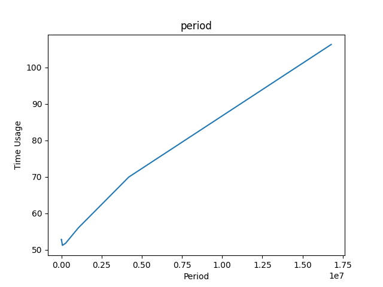

2. 圖像化 PERIOD 對 CONSUMER SIZE CHANGE LIST 的影響:

    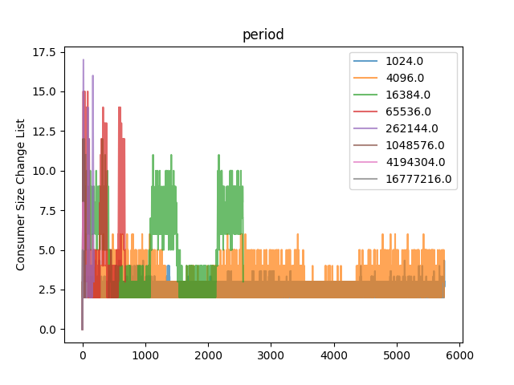

3. 討論:

   1. 從上圖可以明顯發現 Time Usage 和 period 大致呈正相關, period 越大, Time Usage 就越久

   2. 另外可以發現, 當 period 越小, CONSUMER SIZE　CHANGE 的次數就越多, 但幅度較小, 反觀是 period 小的時候, 改變幅度大, 有明顯高峰與低谷, 且改變次數大幅減少

### Different values of CONSUMER_CONTROLLER_HIGH/LOW_THRESHOLD_PERCENTAGE

<details><summary>CONSUMER_CONTROLLER_LOW_THRESHOLD_PERCENTAGE 由小到大產生的 data</summary>

```python
['Low Threshold', 'Time Usage', 'Consumer Size Change List']
[[0.0 55.35764285714286
  array([ 0.,  1.,  2.,  3.,  4.,  5.,  6.,  7.,  8.,  9., 10., 11., 12.,
         11., 10.,  9.,  8.,  7.,  6.,  5.,  4.,  3.,  4.,  3.,  4.,  3.,
          4.,  5.,  6.,  7.,  8.,  9., 10., 11., 12., 11., 10.,  9.,  8.,
          7.,  6.,  5.,  4.,  3.,  4.,  3.,  4.,  3.,  4.,  5.,  6.,  7.,
          8.,  9., 10., 11.])                                            ]
 [5.0 55.35515000000001
  array([ 0.,  1.,  2.,  3.,  4.,  5.,  6.,  7.,  8.,  9., 10., 11., 12.,
         11., 10.,  9.,  8.,  7.,  6.,  5.,  4.,  3.,  2.,  3.,  4.,  3.,
          4.,  5.,  6.,  7.,  8.,  9., 10., 11., 12., 11., 10.,  9.,  8.,
          7.,  6.,  5.,  4.,  3.,  2.,  3.,  4.,  3.,  4.,  5.,  6.,  7.,
          8.,  9., 10., 11.])                                            ]
 [10.0 55.358062499999996
  array([ 0.,  1.,  2.,  3.,  4.,  5.,  6.,  7.,  8.,  9., 10., 11., 12.,
         11., 10.,  9.,  8.,  7.,  6.,  5.,  4.,  3.,  2.,  3.,  4.,  3.,
          4.,  5.,  6.,  7.,  8.,  9., 10., 11., 12., 11., 10.,  9.,  8.,
          7.,  6.,  5.,  4.,  3.,  2.,  3.,  4.,  3.,  4.,  5.,  6.,  7.,
          8.,  9., 10., 11.])                                            ]
 [15.0 53.828525000000006
  array([ 0.,  1.,  2.,  3.,  4.,  5.,  6.,  7.,  8.,  9., 10., 11., 12.,
         11., 10.,  9.,  8.,  7.,  6.,  5.,  4.,  3.,  2.,  3.,  4.,  5.,
          6.,  7.,  8.,  9., 10., 11., 12., 11., 10.,  9.,  8.,  7.,  6.,
          5.,  4.,  3.,  2.,  3.,  4.,  5.,  6.,  7.,  8.,  9., 10., 11.])]
 [20.0 55.354971428571424
  array([ 0.,  1.,  2.,  3.,  4.,  5.,  6.,  7.,  8.,  9., 10., 11., 12.,
         11., 10.,  9.,  8.,  7.,  6.,  5.,  4.,  3.,  2.,  3.,  4.,  5.,
          6.,  7.,  8.,  9., 10., 11., 12., 11., 10.,  9.,  8.,  7.,  6.,
          5.,  4.,  3.,  2.,  3.,  4.,  3.,  4.,  5.,  6.,  7.,  8.,  9.,
         10., 11.])                                                      ]
 [25.0 55.413512499999996
  array([ 0.,  1.,  2.,  3.,  4.,  5.,  6.,  7.,  8.,  9., 10., 11., 12.,
         11., 10.,  9.,  8.,  7.,  6.,  5.,  4.,  3.,  2.,  3.,  4.,  5.,
          6.,  7.,  8.,  9., 10., 11., 12., 11., 10.,  9.,  8.,  7.,  6.,
          5.,  4.,  3.,  2.,  3.,  4.,  3.,  4.,  5.,  6.,  7.,  8.,  9.,
         10., 11.])                                                      ]
 [30.0 55.7284
  array([ 0.,  1.,  2.,  3.,  4.,  5.,  6.,  7.,  8.,  9., 10., 11., 12.,
         11., 10.,  9.,  8.,  7.,  6.,  5.,  4.,  3.,  2.,  3.,  4.,  5.,
          6.,  7.,  8.,  9., 10., 11., 12., 11., 10.,  9.,  8.,  7.,  6.,
          5.,  4.,  3.,  2.,  3.,  4.,  5.,  6.,  7.,  8.,  9., 10., 11.])]
 [35.0 55.7040875
  array([ 0.,  1.,  2.,  3.,  4.,  5.,  6.,  7.,  8.,  9., 10., 11., 12.,
         11., 10.,  9.,  8.,  7.,  6.,  5.,  4.,  3.,  2.,  3.,  4.,  5.,
          6.,  7.,  8.,  9., 10., 11., 12., 11., 10.,  9.,  8.,  7.,  6.,
          5.,  4.,  3.,  2.,  3.,  4.,  5.,  6.,  7.,  8.,  9., 10., 11.])]
 [40.0 55.706537499999996
  array([ 0.,  1.,  2.,  3.,  4.,  5.,  6.,  7.,  8.,  9., 10., 11., 12.,
         11., 10.,  9.,  8.,  7.,  6.,  5.,  4.,  3.,  2.,  3.,  4.,  5.,
          6.,  7.,  8.,  9., 10., 11., 12., 11., 10.,  9.,  8.,  7.,  6.,
          5.,  4.,  3.,  2.,  3.,  4.,  5.,  6.,  7.,  8.,  9., 10., 11.])]
 [45.0 55.68725
  array([ 0.,  1.,  2.,  3.,  4.,  5.,  6.,  7.,  8.,  9., 10., 11., 10.,
          9.,  8.,  7.,  6.,  5.,  4.,  3.,  2.,  3.,  4.,  5.,  6.,  7.,
          8.,  9., 10., 11., 12., 11., 10.,  9.,  8.,  7.,  6.,  5.,  4.,
          3.,  2.,  3.,  4.,  5.,  6.,  7.,  8.,  9., 10., 11.])         ]
 [50.0 55.82374999999999
  array([ 0.,  1.,  2.,  3.,  4.,  5.,  6.,  7.,  8.,  9., 10., 11., 10.,
          9.,  8.,  7.,  6.,  5.,  4.,  3.,  2.,  3.,  4.,  5.,  6.,  7.,
          8.,  9., 10., 11., 12., 11., 10.,  9.,  8.,  7.,  6.,  5.,  4.,
          3.,  2.,  3.,  4.,  5.,  6.,  7.,  8.,  9., 10., 11.])         ]
 [55.0 56.8237
  array([ 0.,  1.,  2.,  3.,  4.,  5.,  6.,  7.,  8.,  9., 10., 11., 10.,
          9.,  8.,  7.,  6.,  5.,  4.,  3.,  2.,  3.,  4.,  5.,  6.,  7.,
          8.,  9., 10., 11., 12., 11., 10.,  9.,  8.,  7.,  6.,  5.,  4.,
          3.,  2.,  3.,  4.,  5.,  6.,  7.,  8.,  9., 10., 11.])         ]
 [60.0 58.68450000000001
  array([ 0.,  1.,  2.,  3.,  4.,  5.,  6.,  7.,  8.,  9., 10., 11., 10.,
          9.,  8.,  7.,  6.,  5.,  4.,  3.,  2.,  3.,  4.,  5.,  6.,  7.,
          8.,  9., 10., 11., 12., 11., 10.,  9.,  8.,  7.,  6.,  5.,  4.,
          3.,  2.,  3.,  4.,  5.,  6.,  7.,  8.,  9., 10., 11.])         ]
 [65.0 56.92485714285714
  array([ 0.,  1.,  2.,  3.,  4.,  5.,  6.,  7.,  8.,  9., 10., 11., 10.,
          9.,  8.,  7.,  6.,  5.,  4.,  3.,  2.,  3.,  4.,  5.,  6.,  7.,
          8.,  9., 10., 11., 10.,  9.,  8.,  7.,  6.,  5.,  4.,  3.,  2.,
          3.,  4.,  5.,  6.,  7.,  8.,  9., 10., 11.])                   ]
 [70.0 57.746175
  array([ 0.,  1.,  2.,  3.,  4.,  5.,  6.,  7.,  8.,  9., 10., 11., 10.,
          9.,  8.,  7.,  6.,  5.,  4.,  3.,  2.,  3.,  4.,  5.,  6.,  7.,
          8.,  9., 10., 11., 10.,  9.,  8.,  7.,  6.,  5.,  4.,  3.,  2.,
          3.,  4.,  5.,  6.,  7.,  8.,  9., 10., 11., 10.])              ]
 [75.0 58.984275000000004
  array([ 0.,  1.,  2.,  3.,  4.,  5.,  6.,  7.,  8.,  9., 10., 11., 10.,
          9.,  8.,  7.,  6.,  5.,  4.,  3.,  2.,  3.,  4.,  5.,  6.,  7.,
          8.,  9., 10., 11., 10.,  9.,  8.,  7.,  6.,  5.,  4.,  3.,  2.,
          3.,  4.,  5.,  6.,  7.,  8.,  9., 10., 11.])                   ]]
```

</details>

1. 圖像化 LOW_THRESHOLD 對 Time Usage 的影響:
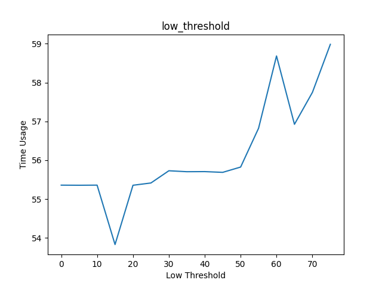

2. 圖像化 LOW_THRESHOLD 對 CONSUMER SIZE CHANGE LIST 的影響:
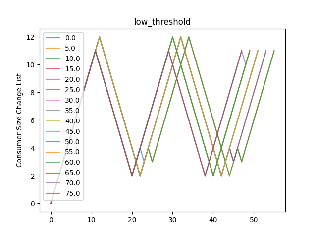

<details><summary>CONSUMER_CONTROLLER_HIGH_THRESHOLD_PERCENTAGE 由小到大產生的 data</summary>

```python
['High Threshold', 'Time Usage', 'Consumer Size Change List']
[[25.0 55.3564125
  array([ 0.,  1.,  2.,  3.,  4.,  5.,  6.,  7.,  8.,  9., 10., 11., 12.,
         11., 10.,  9.,  8.,  7.,  6.,  5.,  4.,  3.,  2.,  3.,  4.,  5.,
          6.,  7.,  8.,  9., 10., 11., 12., 11., 10.,  9.,  8.,  7.,  6.,
          5.,  4.,  3.,  2.,  3.,  4.,  3.,  4.,  5.,  6.,  7.,  8.,  9.,
         10., 11.])                                                      ]
 [30.0 55.35501999999999
  array([ 0.,  1.,  2.,  3.,  4.,  5.,  6.,  7.,  8.,  9., 10., 11., 12.,
         11., 10.,  9.,  8.,  7.,  6.,  5.,  4.,  3.,  2.,  3.,  4.,  5.,
          6.,  7.,  8.,  9., 10., 11., 12., 11., 10.,  9.,  8.,  7.,  6.,
          5.,  4.,  3.,  2.,  3.,  4.,  3.,  4.,  5.,  6.,  7.,  8.,  9.,
         10., 11.])                                                      ]
 [35.0 55.3563875
  array([ 0.,  1.,  2.,  3.,  4.,  5.,  6.,  7.,  8.,  9., 10., 11., 12.,
         11., 10.,  9.,  8.,  7.,  6.,  5.,  4.,  3.,  2.,  3.,  4.,  5.,
          6.,  7.,  8.,  9., 10., 11., 12., 11., 10.,  9.,  8.,  7.,  6.,
          5.,  4.,  3.,  2.,  3.,  4.,  3.,  4.,  5.,  6.,  7.,  8.,  9.,
         10., 11.])                                                      ]
 [40.0 55.35765000000001
  array([ 0.,  1.,  2.,  3.,  4.,  5.,  6.,  7.,  8.,  9., 10., 11., 12.,
         11., 10.,  9.,  8.,  7.,  6.,  5.,  4.,  3.,  2.,  3.,  4.,  5.,
          6.,  7.,  8.,  9., 10., 11., 12., 11., 10.,  9.,  8.,  7.,  6.,
          5.,  4.,  3.,  2.,  3.,  4.,  3.,  4.,  5.,  6.,  7.,  8.,  9.,
         10., 11.])                                                      ]
 [45.0 55.3583625
  array([ 0.,  1.,  2.,  3.,  4.,  5.,  6.,  7.,  8.,  9., 10., 11., 12.,
         11., 10.,  9.,  8.,  7.,  6.,  5.,  4.,  3.,  2.,  3.,  4.,  5.,
          6.,  7.,  8.,  9., 10., 11., 12., 11., 10.,  9.,  8.,  7.,  6.,
          5.,  4.,  3.,  2.,  3.,  4.,  3.,  4.,  5.,  6.,  7.,  8.,  9.,
         10., 11.])                                                      ]
 [50.0 55.35848571428572
  array([ 0.,  1.,  2.,  3.,  4.,  5.,  6.,  7.,  8.,  9., 10., 11., 12.,
         11., 10.,  9.,  8.,  7.,  6.,  5.,  4.,  3.,  2.,  3.,  4.,  5.,
          6.,  7.,  8.,  9., 10., 11., 12., 11., 10.,  9.,  8.,  7.,  6.,
          5.,  4.,  3.,  2.,  3.,  4.,  3.,  4.,  5.,  6.,  7.,  8.,  9.,
         10., 11.])                                                      ]
 [55.0 55.35292857142856
  array([ 0.,  1.,  2.,  3.,  4.,  5.,  6.,  7.,  8.,  9., 10., 11., 12.,
         11., 10.,  9.,  8.,  7.,  6.,  5.,  4.,  3.,  2.,  3.,  4.,  5.,
          6.,  7.,  8.,  9., 10., 11., 12., 11., 10.,  9.,  8.,  7.,  6.,
          5.,  4.,  3.,  2.,  3.,  4.,  3.,  4.,  5.,  6.,  7.,  8.,  9.,
         10., 11.])                                                      ]
 [60.0 55.353500000000004
  array([ 0.,  1.,  2.,  3.,  4.,  5.,  6.,  7.,  8.,  9., 10., 11., 12.,
         11., 10.,  9.,  8.,  7.,  6.,  5.,  4.,  3.,  2.,  3.,  4.,  5.,
          6.,  7.,  8.,  9., 10., 11., 12., 11., 10.,  9.,  8.,  7.,  6.,
          5.,  4.,  3.,  2.,  3.,  4.,  3.,  4.,  5.,  6.,  7.,  8.,  9.,
         10., 11.])                                                      ]
 [65.0 55.357780000000005
  array([ 0.,  1.,  2.,  3.,  4.,  5.,  6.,  7.,  8.,  9., 10., 11., 12.,
         11., 10.,  9.,  8.,  7.,  6.,  5.,  4.,  3.,  2.,  3.,  4.,  5.,
          6.,  7.,  8.,  9., 10., 11., 12., 11., 10.,  9.,  8.,  7.,  6.,
          5.,  4.,  3.,  2.,  3.,  4.,  3.,  4.,  5.,  6.,  7.,  8.,  9.,
         10., 11.])                                                      ]
 [70.0 55.36524285714285
  array([ 0.,  1.,  2.,  3.,  4.,  5.,  6.,  7.,  8.,  9., 10., 11., 12.,
         11., 10.,  9.,  8.,  7.,  6.,  5.,  4.,  3.,  2.,  3.,  4.,  5.,
          6.,  7.,  8.,  9., 10., 11., 12., 11., 10.,  9.,  8.,  7.,  6.,
          5.,  4.,  3.,  2.,  3.,  4.,  3.,  4.,  5.,  6.,  7.,  8.,  9.,
         10., 11.])                                                      ]
 [75.0 55.36701666666667
  array([ 0.,  1.,  2.,  3.,  4.,  5.,  6.,  7.,  8.,  9., 10., 11., 12.,
         11., 10.,  9.,  8.,  7.,  6.,  5.,  4.,  3.,  2.,  3.,  4.,  5.,
          6.,  7.,  8.,  9., 10., 11., 12., 11., 10.,  9.,  8.,  7.,  6.,
          5.,  4.,  3.,  2.,  3.,  4.,  3.,  4.,  5.,  6.,  7.,  8.,  9.,
         10., 11.])                                                      ]
 [80.0 55.36472857142858
  array([ 0.,  1.,  2.,  3.,  4.,  5.,  6.,  7.,  8.,  9., 10., 11., 12.,
         11., 10.,  9.,  8.,  7.,  6.,  5.,  4.,  3.,  2.,  3.,  4.,  5.,
          6.,  7.,  8.,  9., 10., 11., 12., 11., 10.,  9.,  8.,  7.,  6.,
          5.,  4.,  3.,  2.,  3.,  4.,  3.,  4.,  5.,  6.,  7.,  8.,  9.,
         10., 11.])                                                      ]
 [85.0 55.35898333333333
  array([ 0.,  1.,  2.,  3.,  4.,  5.,  6.,  7.,  8.,  9., 10., 11., 12.,
         11., 10.,  9.,  8.,  7.,  6.,  5.,  4.,  3.,  2.,  3.,  4.,  5.,
          6.,  7.,  8.,  9., 10., 11., 12., 11., 10.,  9.,  8.,  7.,  6.,
          5.,  4.,  3.,  2.,  3.,  4.,  3.,  4.,  5.,  6.,  7.,  8.,  9.,
         10., 11.])                                                      ]
 [90.0 55.35592857142858
  array([ 0.,  1.,  2.,  3.,  4.,  5.,  6.,  7.,  8.,  9., 10., 11., 12.,
         11., 10.,  9.,  8.,  7.,  6.,  5.,  4.,  3.,  2.,  3.,  4.,  5.,
          6.,  7.,  8.,  9., 10., 11., 12., 11., 10.,  9.,  8.,  7.,  6.,
          5.,  4.,  3.,  2.,  3.,  4.,  3.,  4.,  5.,  6.,  7.,  8.,  9.,
         10., 11.])                                                      ]
 [95.0 55.357
  array([ 0.,  1.,  2.,  3.,  4.,  5.,  6.,  7.,  8.,  9., 10., 11., 12.,
         11., 10.,  9.,  8.,  7.,  6.,  5.,  4.,  3.,  2.,  3.,  4.,  5.,
          6.,  7.,  8.,  9., 10., 11., 12., 11., 10.,  9.,  8.,  7.,  6.,
          5.,  4.,  3.,  2.,  3.,  4.,  3.,  4.,  5.,  6.,  7.,  8.,  9.,
         10., 11.])                                                      ]
 [100.0 55.35830000000001
  array([ 0.,  1.,  2.,  3.,  4.,  5.,  6.,  7.,  8.,  9., 10., 11., 12.,
         11., 10.,  9.,  8.,  7.,  6.,  5.,  4.,  3.,  2.,  3.,  4.,  5.,
          6.,  7.,  8.,  9., 10., 11., 12., 11., 10.,  9.,  8.,  7.,  6.,
          5.,  4.,  3.,  2.,  3.,  4.,  3.,  4.,  5.,  6.,  7.,  8.,  9.,
         10., 11.])                                                      ]]
```
</details>

1. 圖像化 HIGH_THRESHOLD 對 Time Usage 的影響

    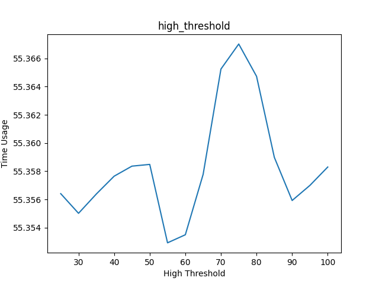

2. 圖像化 HIGH_THRESHOLD 對 CONSUMER SIZE CHANGE LIST 的影響:

    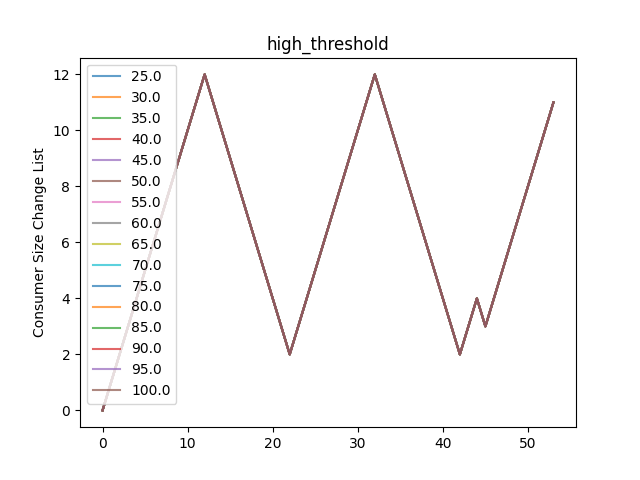

3. 討論

   1. 觀看兩者變因的圖, 我們可以發現 Time Usage 在 LOW THRESHOLD 有最低值, 約在 Threshold = 15 時. 也可以大致觀察出, 在 low thresdhold Time Usage 較小, 但反觀 HIGH_THRESHOLD　的圖，似乎 HIGH THREASHOLD 值的改變對 Time Usage 影響不大
   
   2. HIGH THRESHOLD 的變化對 CONSUMER SIZE CHANGE 沒有影響, 所有線是疊在一起的, 呈現波谷波峰波谷波峰, 而 LOW THRESHOLD 的圖則可以看出 LOW THRESHOLD 低的, 可以達到最高峰 (震幅較大), 改變次數也減少(可以對應到上一點, LOW THRESHOLD Time Usage 較小),總體波形成現谷峰谷峰谷峰 (看圖可能因為重疊而難以分辨, 可以 txt 文字 data 輔助)

### Different values of WORKER_QUEUE_SIZE

<details> <summary>WORKER_QUEUE_SIZE 由小到大所產生的 data</summary>

```python
['Worker Queue Size', 'Time Usage', 'Consumer Size Change List']
[[20.0 59.941537499999995
  array([ 0.,  1.,  2.,  3.,  4.,  5.,  6.,  7.,  8.,  9., 10.,  9.,  8.,
          7.,  6.,  5.,  4.,  3.,  2.,  3.,  4.,  3.,  2.,  3.,  4.,  3.,
          2.,  3.,  4.,  5.,  6.,  7.,  8.,  9., 10.,  9.,  8.,  7.,  6.,
          5.,  4.,  3.,  2.,  3.,  4.,  3.,  2.,  3.,  4.,  3.,  2.,  3.,
          4.,  5.,  6.,  7.,  8.,  9., 10.,  9.])                        ]
 [40.0 57.49584999999999
  array([ 0.,  1.,  2.,  3.,  4.,  5.,  6.,  7.,  8.,  9., 10., 11., 10.,
          9.,  8.,  7.,  6.,  5.,  4.,  3.,  2.,  3.,  4.,  3.,  2.,  3.,
          4.,  5.,  6.,  7.,  8.,  9., 10., 11., 10.,  9.,  8.,  7.,  6.,
          5.,  4.,  3.,  2.,  3.,  4.,  3.,  2.,  3.,  4.,  3.,  4.,  5.,
          6.,  7.,  8.,  9., 10., 11.])                                  ]
 [60.0 57.33358749999999
  array([ 0.  ,  1.  ,  2.  ,  3.  ,  4.  ,  5.  ,  6.  ,  7.  ,  8.  ,
          9.  , 10.  , 11.  , 10.  ,  9.  ,  8.  ,  7.  ,  6.  ,  5.  ,
          4.  ,  3.  ,  2.  ,  3.  ,  4.  ,  3.  ,  2.  ,  3.  ,  4.  ,
          5.  ,  6.  ,  7.  ,  8.  ,  9.  , 10.  , 11.  , 10.25,  9.25,
          8.25,  7.25,  6.25,  5.25,  4.25,  3.25,  2.25,  3.  ,  3.75,
          3.  ,  2.25,  3.  ,  3.75,  3.  ,  4.  ,  5.  ,  6.  ,  7.  ,
          8.  ,  9.  , 10.  , 11.  ])                                  ]
 [80.0 59.27218750000001
  array([ 0.,  1.,  2.,  3.,  4.,  5.,  6.,  7.,  8.,  9., 10., 11., 12.,
         11., 10.,  9.,  8.,  7.,  6.,  5.,  4.,  3.,  2.,  3.,  4.,  3.,
          2.,  3.,  4.,  5.,  6.,  7.,  8.,  9., 10., 11., 12., 11., 10.,
          9.,  8.,  7.,  6.,  5.,  4.,  3.,  2.,  3.,  4.,  3.,  2.,  3.,
          4.,  5.,  6.,  7.,  8.,  9., 10., 11.])                        ]
 [100.0 59.217512500000005
  array([ 0.,  1.,  2.,  3.,  4.,  5.,  6.,  7.,  8.,  9., 10., 11., 12.,
         11., 10.,  9.,  8.,  7.,  6.,  5.,  4.,  3.,  2.,  3.,  4.,  3.,
          2.,  3.,  4.,  5.,  6.,  7.,  8.,  9., 10., 11., 12., 11., 10.,
          9.,  8.,  7.,  6.,  5.,  4.,  3.,  2.,  3.,  4.,  3.,  2.,  3.,
          4.,  5.,  6.,  7.,  8.,  9., 10., 11.])                        ]
 [120.0 59.2023
  array([ 0.,  1.,  2.,  3.,  4.,  5.,  6.,  7.,  8.,  9., 10., 11., 12.,
         11., 10.,  9.,  8.,  7.,  6.,  5.,  4.,  3.,  2.,  3.,  4.,  3.,
          2.,  3.,  4.,  5.,  6.,  7.,  8.,  9., 10., 11., 12., 11., 10.,
          9.,  8.,  7.,  6.,  5.,  4.,  3.,  2.,  3.,  4.,  3.,  2.,  3.,
          4.,  5.,  6.,  7.,  8.,  9., 10., 11.])                        ]
 [140.0 54.84546
  array([ 0.,  1.,  2.,  3.,  4.,  5.,  6.,  7.,  8.,  9., 10., 11., 12.,
         11., 10.,  9.,  8.,  7.,  6.,  5.,  4.,  3.,  2.,  3.,  4.,  3.,
          4.,  5.,  6.,  7.,  8.,  9., 10., 11., 12., 11., 10.,  9.,  8.,
          7.,  6.,  5.,  4.,  3.,  2.,  3.,  4.,  5.,  6.,  7.,  8.,  9.,
         10., 11.])                                                      ]
 [160.0 55.45547142857142
  array([ 0.,  1.,  2.,  3.,  4.,  5.,  6.,  7.,  8.,  9., 10., 11., 12.,
         11., 10.,  9.,  8.,  7.,  6.,  5.,  4.,  3.,  2.,  3.,  4.,  5.,
          6.,  7.,  8.,  9., 10., 11., 12., 11., 10.,  9.,  8.,  7.,  6.,
          5.,  4.,  3.,  2.,  3.,  4.,  3.,  4.,  5.,  6.,  7.,  8.,  9.,
         10., 11.])                                                      ]
 [180.0 55.410475
  array([ 0.,  1.,  2.,  3.,  4.,  5.,  6.,  7.,  8.,  9., 10., 11., 12.,
         11., 10.,  9.,  8.,  7.,  6.,  5.,  4.,  3.,  2.,  3.,  4.,  5.,
          6.,  7.,  8.,  9., 10., 11., 12., 11., 10.,  9.,  8.,  7.,  6.,
          5.,  4.,  3.,  2.,  3.,  4.,  3.,  4.,  5.,  6.,  7.,  8.,  9.,
         10., 11.])                                                      ]
 [200.0 55.35336666666666
  array([ 0.,  1.,  2.,  3.,  4.,  5.,  6.,  7.,  8.,  9., 10., 11., 12.,
         11., 10.,  9.,  8.,  7.,  6.,  5.,  4.,  3.,  2.,  3.,  4.,  5.,
          6.,  7.,  8.,  9., 10., 11., 12., 11., 10.,  9.,  8.,  7.,  6.,
          5.,  4.,  3.,  2.,  3.,  4.,  3.,  4.,  5.,  6.,  7.,  8.,  9.,
         10., 11.])                                                      ]
 [220.0 53.776812500000005
  array([ 0.,  1.,  2.,  3.,  4.,  5.,  6.,  7.,  8.,  9., 10., 11., 12.,
         11., 10.,  9.,  8.,  7.,  6.,  5.,  4.,  3.,  2.,  3.,  4.,  5.,
          6.,  7.,  8.,  9., 10., 11., 12., 11., 10.,  9.,  8.,  7.,  6.,
          5.,  4.,  3.,  2.,  3.,  4.,  5.,  6.,  7.,  8.,  9., 10., 11.])]
 [240.0 53.753575
  array([ 0.,  1.,  2.,  3.,  4.,  5.,  6.,  7.,  8.,  9., 10., 11., 12.,
         11., 10.,  9.,  8.,  7.,  6.,  5.,  4.,  3.,  2.,  3.,  4.,  5.,
          6.,  7.,  8.,  9., 10., 11., 12., 11., 10.,  9.,  8.,  7.,  6.,
          5.,  4.,  3.,  2.,  3.,  4.,  5.,  6.,  7.,  8.,  9., 10., 11.])]
 [260.0 53.7031875
  array([ 0.,  1.,  2.,  3.,  4.,  5.,  6.,  7.,  8.,  9., 10., 11., 12.,
         11., 10.,  9.,  8.,  7.,  6.,  5.,  4.,  3.,  2.,  3.,  4.,  5.,
          6.,  7.,  8.,  9., 10., 11., 12., 11., 10.,  9.,  8.,  7.,  6.,
          5.,  4.,  3.,  2.,  3.,  4.,  5.,  6.,  7.,  8.,  9., 10., 11.])]
 [280.0 54.0351875
  array([ 0.,  1.,  2.,  3.,  4.,  5.,  6.,  7.,  8.,  9., 10., 11., 12.,
         11., 10.,  9.,  8.,  7.,  6.,  5.,  4.,  3.,  2.,  3.,  4.,  5.,
          6.,  7.,  8.,  9., 10., 11., 12., 11., 10.,  9.,  8.,  7.,  6.,
          5.,  4.,  3.,  2.,  3.,  4.,  5.,  6.,  7.,  8.,  9., 10., 11.])]
 [300.0 55.501787500000006
  array([ 0.,  1.,  2.,  3.,  4.,  5.,  6.,  7.,  8.,  9., 10., 11., 12.,
         11., 10.,  9.,  8.,  7.,  6.,  5.,  4.,  3.,  2.,  3.,  4.,  5.,
          6.,  7.,  8.,  9., 10., 11., 12., 11., 10.,  9.,  8.,  7.,  6.,
          5.,  4.,  3.,  2.,  3.,  4.,  5.,  6.,  7.,  8.,  9., 10., 11.])]
 [320.0 55.556962500000004
  array([ 0.,  1.,  2.,  3.,  4.,  5.,  6.,  7.,  8.,  9., 10., 11., 12.,
         11., 10.,  9.,  8.,  7.,  6.,  5.,  4.,  3.,  2.,  3.,  4.,  5.,
          6.,  7.,  8.,  9., 10., 11., 12., 11., 10.,  9.,  8.,  7.,  6.,
          5.,  4.,  3.,  2.,  3.,  4.,  5.,  6.,  7.,  8.,  9., 10., 11.])]
 [340.0 55.4902
  array([ 0.,  1.,  2.,  3.,  4.,  5.,  6.,  7.,  8.,  9., 10., 11., 12.,
         11., 10.,  9.,  8.,  7.,  6.,  5.,  4.,  3.,  2.,  3.,  4.,  5.,
          6.,  7.,  8.,  9., 10., 11., 12., 11., 10.,  9.,  8.,  7.,  6.,
          5.,  4.,  3.,  2.,  3.,  4.,  5.,  6.,  7.,  8.,  9., 10., 11.])]
 [360.0 54.492525
  array([ 0.,  1.,  2.,  3.,  4.,  5.,  6.,  7.,  8.,  9., 10., 11., 12.,
         11., 10.,  9.,  8.,  7.,  6.,  5.,  4.,  3.,  2.,  3.,  4.,  5.,
          6.,  7.,  8.,  9., 10., 11., 12., 11., 10.,  9.,  8.,  7.,  6.,
          5.,  4.,  3.,  2.,  3.,  4.,  5.,  6.,  7.,  8.,  9., 10., 11.])]
 [380.0 54.4706125
  array([ 0.,  1.,  2.,  3.,  4.,  5.,  6.,  7.,  8.,  9., 10., 11., 12.,
         11., 10.,  9.,  8.,  7.,  6.,  5.,  4.,  3.,  2.,  3.,  4.,  5.,
          6.,  7.,  8.,  9., 10., 11., 12., 11., 10.,  9.,  8.,  7.,  6.,
          5.,  4.,  3.,  2.,  3.,  4.,  5.,  6.,  7.,  8.,  9., 10., 11.])]
 [400.0 54.41483749999999
  array([ 0.,  1.,  2.,  3.,  4.,  5.,  6.,  7.,  8.,  9., 10., 11., 12.,
         11., 10.,  9.,  8.,  7.,  6.,  5.,  4.,  3.,  2.,  3.,  4.,  5.,
          6.,  7.,  8.,  9., 10., 11., 12., 11., 10.,  9.,  8.,  7.,  6.,
          5.,  4.,  3.,  2.,  3.,  4.,  5.,  6.,  7.,  8.,  9., 10., 11.])]]
```

</details>

1. 圖像化 WORKER_QUEUE_SIZE 對 Time Usage 的影響:

    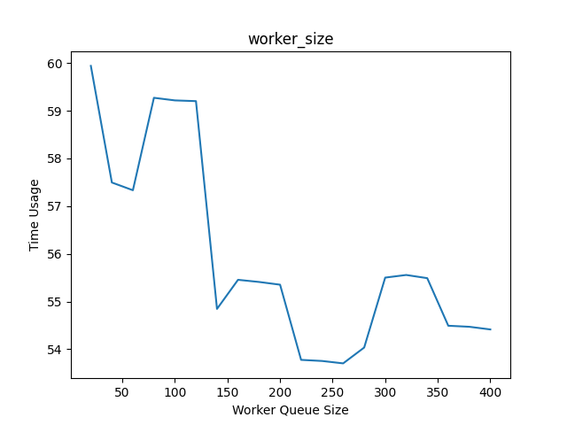

2. 圖像化 WRITER_QUEUE_SIZE 對 CONSUMER SIZE CHANGE LIST 的影響:

    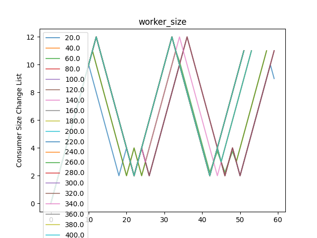

3. 討論:

   1. 可以發現 WORKER_QUEUE_SIZE 和 Time Usage 有點呈現階梯狀下降, WORKER_QUEUE_SIZE 越大, Time Usage 越小
   
   2. WORKER_QUEUE_SIZE 越大可以達到 COMSUMER SIZE 的峰值 12, 較小的還未達到 12 即下降 (震幅較小), 總體波形呈現谷峰谷峰谷峰

### What happens if WRITER_QUEUE_SIZE is very small?

<details><summary>WRITER_QUEUE_SIZE 由小到大所產生的 data:</summary>

```python
['Writer Queue Size', 'Time Usage', 'Consumer Size Change List']
[[250.0 55.3548375
  array([ 0.,  1.,  2.,  3.,  4.,  5.,  6.,  7.,  8.,  9., 10., 11., 12.,
         11., 10.,  9.,  8.,  7.,  6.,  5.,  4.,  3.,  2.,  3.,  4.,  5.,
          6.,  7.,  8.,  9., 10., 11., 12., 11., 10.,  9.,  8.,  7.,  6.,
          5.,  4.,  3.,  2.,  3.,  4.,  3.,  4.,  5.,  6.,  7.,  8.,  9.,
         10., 11.])                                                      ]
 [500.0 55.3569
  array([ 0.,  1.,  2.,  3.,  4.,  5.,  6.,  7.,  8.,  9., 10., 11., 12.,
         11., 10.,  9.,  8.,  7.,  6.,  5.,  4.,  3.,  2.,  3.,  4.,  5.,
          6.,  7.,  8.,  9., 10., 11., 12., 11., 10.,  9.,  8.,  7.,  6.,
          5.,  4.,  3.,  2.,  3.,  4.,  3.,  4.,  5.,  6.,  7.,  8.,  9.,
         10., 11.])                                                      ]
 [750.0 55.3546875
  array([ 0.,  1.,  2.,  3.,  4.,  5.,  6.,  7.,  8.,  9., 10., 11., 12.,
         11., 10.,  9.,  8.,  7.,  6.,  5.,  4.,  3.,  2.,  3.,  4.,  5.,
          6.,  7.,  8.,  9., 10., 11., 12., 11., 10.,  9.,  8.,  7.,  6.,
          5.,  4.,  3.,  2.,  3.,  4.,  3.,  4.,  5.,  6.,  7.,  8.,  9.,
         10., 11.])                                                      ]
 [1000.0 55.353199999999994
  array([ 0.,  1.,  2.,  3.,  4.,  5.,  6.,  7.,  8.,  9., 10., 11., 12.,
         11., 10.,  9.,  8.,  7.,  6.,  5.,  4.,  3.,  2.,  3.,  4.,  5.,
          6.,  7.,  8.,  9., 10., 11., 12., 11., 10.,  9.,  8.,  7.,  6.,
          5.,  4.,  3.,  2.,  3.,  4.,  3.,  4.,  5.,  6.,  7.,  8.,  9.,
         10., 11.])                                                      ]
 [1250.0 55.354949999999995
  array([ 0.,  1.,  2.,  3.,  4.,  5.,  6.,  7.,  8.,  9., 10., 11., 12.,
         11., 10.,  9.,  8.,  7.,  6.,  5.,  4.,  3.,  2.,  3.,  4.,  5.,
          6.,  7.,  8.,  9., 10., 11., 12., 11., 10.,  9.,  8.,  7.,  6.,
          5.,  4.,  3.,  2.,  3.,  4.,  3.,  4.,  5.,  6.,  7.,  8.,  9.,
         10., 11.])                                                      ]
 [1500.0 55.35694999999999
  array([ 0.,  1.,  2.,  3.,  4.,  5.,  6.,  7.,  8.,  9., 10., 11., 12.,
         11., 10.,  9.,  8.,  7.,  6.,  5.,  4.,  3.,  2.,  3.,  4.,  5.,
          6.,  7.,  8.,  9., 10., 11., 12., 11., 10.,  9.,  8.,  7.,  6.,
          5.,  4.,  3.,  2.,  3.,  4.,  3.,  4.,  5.,  6.,  7.,  8.,  9.,
         10., 11.])                                                      ]
 [1750.0 55.35794999999999
  array([ 0.,  1.,  2.,  3.,  4.,  5.,  6.,  7.,  8.,  9., 10., 11., 12.,
         11., 10.,  9.,  8.,  7.,  6.,  5.,  4.,  3.,  2.,  3.,  4.,  5.,
          6.,  7.,  8.,  9., 10., 11., 12., 11., 10.,  9.,  8.,  7.,  6.,
          5.,  4.,  3.,  2.,  3.,  4.,  3.,  4.,  5.,  6.,  7.,  8.,  9.,
         10., 11.])                                                      ]
 [2000.0 55.356775
  array([ 0.,  1.,  2.,  3.,  4.,  5.,  6.,  7.,  8.,  9., 10., 11., 12.,
         11., 10.,  9.,  8.,  7.,  6.,  5.,  4.,  3.,  2.,  3.,  4.,  5.,
          6.,  7.,  8.,  9., 10., 11., 12., 11., 10.,  9.,  8.,  7.,  6.,
          5.,  4.,  3.,  2.,  3.,  4.,  3.,  4.,  5.,  6.,  7.,  8.,  9.,
         10., 11.])                                                      ]
 [2250.0 55.356
  array([ 0.,  1.,  2.,  3.,  4.,  5.,  6.,  7.,  8.,  9., 10., 11., 12.,
         11., 10.,  9.,  8.,  7.,  6.,  5.,  4.,  3.,  2.,  3.,  4.,  5.,
          6.,  7.,  8.,  9., 10., 11., 12., 11., 10.,  9.,  8.,  7.,  6.,
          5.,  4.,  3.,  2.,  3.,  4.,  3.,  4.,  5.,  6.,  7.,  8.,  9.,
         10., 11.])                                                      ]
 [2500.0 55.356280000000005
  array([ 0.,  1.,  2.,  3.,  4.,  5.,  6.,  7.,  8.,  9., 10., 11., 12.,
         11., 10.,  9.,  8.,  7.,  6.,  5.,  4.,  3.,  2.,  3.,  4.,  5.,
          6.,  7.,  8.,  9., 10., 11., 12., 11., 10.,  9.,  8.,  7.,  6.,
          5.,  4.,  3.,  2.,  3.,  4.,  3.,  4.,  5.,  6.,  7.,  8.,  9.,
         10., 11.])                                                      ]
 [2750.0 55.35272
  array([ 0.,  1.,  2.,  3.,  4.,  5.,  6.,  7.,  8.,  9., 10., 11., 12.,
         11., 10.,  9.,  8.,  7.,  6.,  5.,  4.,  3.,  2.,  3.,  4.,  5.,
          6.,  7.,  8.,  9., 10., 11., 12., 11., 10.,  9.,  8.,  7.,  6.,
          5.,  4.,  3.,  2.,  3.,  4.,  3.,  4.,  5.,  6.,  7.,  8.,  9.,
         10., 11.])                                                      ]
 [3000.0 55.355533333333334
  array([ 0.,  1.,  2.,  3.,  4.,  5.,  6.,  7.,  8.,  9., 10., 11., 12.,
         11., 10.,  9.,  8.,  7.,  6.,  5.,  4.,  3.,  2.,  3.,  4.,  5.,
          6.,  7.,  8.,  9., 10., 11., 12., 11., 10.,  9.,  8.,  7.,  6.,
          5.,  4.,  3.,  2.,  3.,  4.,  3.,  4.,  5.,  6.,  7.,  8.,  9.,
         10., 11.])                                                      ]
 [3250.0 55.35745000000001
  array([ 0.,  1.,  2.,  3.,  4.,  5.,  6.,  7.,  8.,  9., 10., 11., 12.,
         11., 10.,  9.,  8.,  7.,  6.,  5.,  4.,  3.,  2.,  3.,  4.,  5.,
          6.,  7.,  8.,  9., 10., 11., 12., 11., 10.,  9.,  8.,  7.,  6.,
          5.,  4.,  3.,  2.,  3.,  4.,  3.,  4.,  5.,  6.,  7.,  8.,  9.,
         10., 11.])                                                      ]
 [3500.0 55.35671428571429
  array([ 0.,  1.,  2.,  3.,  4.,  5.,  6.,  7.,  8.,  9., 10., 11., 12.,
         11., 10.,  9.,  8.,  7.,  6.,  5.,  4.,  3.,  2.,  3.,  4.,  5.,
          6.,  7.,  8.,  9., 10., 11., 12., 11., 10.,  9.,  8.,  7.,  6.,
          5.,  4.,  3.,  2.,  3.,  4.,  3.,  4.,  5.,  6.,  7.,  8.,  9.,
         10., 11.])                                                      ]
 [3750.0 55.3678125
  array([ 0.,  1.,  2.,  3.,  4.,  5.,  6.,  7.,  8.,  9., 10., 11., 12.,
         11., 10.,  9.,  8.,  7.,  6.,  5.,  4.,  3.,  2.,  3.,  4.,  5.,
          6.,  7.,  8.,  9., 10., 11., 12., 11., 10.,  9.,  8.,  7.,  6.,
          5.,  4.,  3.,  2.,  3.,  4.,  3.,  4.,  5.,  6.,  7.,  8.,  9.,
         10., 11.])                                                      ]
 [4000.0 55.358075
  array([ 0.,  1.,  2.,  3.,  4.,  5.,  6.,  7.,  8.,  9., 10., 11., 12.,
         11., 10.,  9.,  8.,  7.,  6.,  5.,  4.,  3.,  2.,  3.,  4.,  5.,
          6.,  7.,  8.,  9., 10., 11., 12., 11., 10.,  9.,  8.,  7.,  6.,
          5.,  4.,  3.,  2.,  3.,  4.,  3.,  4.,  5.,  6.,  7.,  8.,  9.,
         10., 11.])                                                      ]
 [4250.0 55.3819125
  array([ 0.,  1.,  2.,  3.,  4.,  5.,  6.,  7.,  8.,  9., 10., 11., 12.,
         11., 10.,  9.,  8.,  7.,  6.,  5.,  4.,  3.,  2.,  3.,  4.,  5.,
          6.,  7.,  8.,  9., 10., 11., 12., 11., 10.,  9.,  8.,  7.,  6.,
          5.,  4.,  3.,  2.,  3.,  4.,  3.,  4.,  5.,  6.,  7.,  8.,  9.,
         10., 11.])                                                      ]
 [4500.0 55.359871428571424
  array([ 0.,  1.,  2.,  3.,  4.,  5.,  6.,  7.,  8.,  9., 10., 11., 12.,
         11., 10.,  9.,  8.,  7.,  6.,  5.,  4.,  3.,  2.,  3.,  4.,  5.,
          6.,  7.,  8.,  9., 10., 11., 12., 11., 10.,  9.,  8.,  7.,  6.,
          5.,  4.,  3.,  2.,  3.,  4.,  3.,  4.,  5.,  6.,  7.,  8.,  9.,
         10., 11.])                                                      ]
 [4750.0 55.35838333333333
  array([ 0.,  1.,  2.,  3.,  4.,  5.,  6.,  7.,  8.,  9., 10., 11., 12.,
         11., 10.,  9.,  8.,  7.,  6.,  5.,  4.,  3.,  2.,  3.,  4.,  5.,
          6.,  7.,  8.,  9., 10., 11., 12., 11., 10.,  9.,  8.,  7.,  6.,
          5.,  4.,  3.,  2.,  3.,  4.,  3.,  4.,  5.,  6.,  7.,  8.,  9.,
         10., 11.])                                                      ]
 [5000.0 55.360549999999996
  array([ 0.,  1.,  2.,  3.,  4.,  5.,  6.,  7.,  8.,  9., 10., 11., 12.,
         11., 10.,  9.,  8.,  7.,  6.,  5.,  4.,  3.,  2.,  3.,  4.,  5.,
          6.,  7.,  8.,  9., 10., 11., 12., 11., 10.,  9.,  8.,  7.,  6.,
          5.,  4.,  3.,  2.,  3.,  4.,  3.,  4.,  5.,  6.,  7.,  8.,  9.,
         10., 11.])                                                      ]
 [5250.0 55.35682857142858
  array([ 0.,  1.,  2.,  3.,  4.,  5.,  6.,  7.,  8.,  9., 10., 11., 12.,
         11., 10.,  9.,  8.,  7.,  6.,  5.,  4.,  3.,  2.,  3.,  4.,  5.,
          6.,  7.,  8.,  9., 10., 11., 12., 11., 10.,  9.,  8.,  7.,  6.,
          5.,  4.,  3.,  2.,  3.,  4.,  3.,  4.,  5.,  6.,  7.,  8.,  9.,
         10., 11.])                                                      ]
 [5500.0 55.3578
  array([ 0.,  1.,  2.,  3.,  4.,  5.,  6.,  7.,  8.,  9., 10., 11., 12.,
         11., 10.,  9.,  8.,  7.,  6.,  5.,  4.,  3.,  2.,  3.,  4.,  5.,
          6.,  7.,  8.,  9., 10., 11., 12., 11., 10.,  9.,  8.,  7.,  6.,
          5.,  4.,  3.,  2.,  3.,  4.,  3.,  4.,  5.,  6.,  7.,  8.,  9.,
         10., 11.])                                                      ]
 [5750.0 55.363075
  array([ 0.,  1.,  2.,  3.,  4.,  5.,  6.,  7.,  8.,  9., 10., 11., 12.,
         11., 10.,  9.,  8.,  7.,  6.,  5.,  4.,  3.,  2.,  3.,  4.,  5.,
          6.,  7.,  8.,  9., 10., 11., 12., 11., 10.,  9.,  8.,  7.,  6.,
          5.,  4.,  3.,  2.,  3.,  4.,  3.,  4.,  5.,  6.,  7.,  8.,  9.,
         10., 11.])                                                      ]
 [6000.0 55.36355714285715
  array([ 0.,  1.,  2.,  3.,  4.,  5.,  6.,  7.,  8.,  9., 10., 11., 12.,
         11., 10.,  9.,  8.,  7.,  6.,  5.,  4.,  3.,  2.,  3.,  4.,  5.,
          6.,  7.,  8.,  9., 10., 11., 12., 11., 10.,  9.,  8.,  7.,  6.,
          5.,  4.,  3.,  2.,  3.,  4.,  3.,  4.,  5.,  6.,  7.,  8.,  9.,
         10., 11.])                                                      ]
 [6250.0 55.357342857142854
  array([ 0.,  1.,  2.,  3.,  4.,  5.,  6.,  7.,  8.,  9., 10., 11., 12.,
         11., 10.,  9.,  8.,  7.,  6.,  5.,  4.,  3.,  2.,  3.,  4.,  5.,
          6.,  7.,  8.,  9., 10., 11., 12., 11., 10.,  9.,  8.,  7.,  6.,
          5.,  4.,  3.,  2.,  3.,  4.,  3.,  4.,  5.,  6.,  7.,  8.,  9.,
         10., 11.])                                                      ]
 [6500.0 55.35555
  array([ 0.,  1.,  2.,  3.,  4.,  5.,  6.,  7.,  8.,  9., 10., 11., 12.,
         11., 10.,  9.,  8.,  7.,  6.,  5.,  4.,  3.,  2.,  3.,  4.,  5.,
          6.,  7.,  8.,  9., 10., 11., 12., 11., 10.,  9.,  8.,  7.,  6.,
          5.,  4.,  3.,  2.,  3.,  4.,  3.,  4.,  5.,  6.,  7.,  8.,  9.,
         10., 11.])                                                      ]
 [6750.0 55.3618
  array([ 0.,  1.,  2.,  3.,  4.,  5.,  6.,  7.,  8.,  9., 10., 11., 12.,
         11., 10.,  9.,  8.,  7.,  6.,  5.,  4.,  3.,  2.,  3.,  4.,  5.,
          6.,  7.,  8.,  9., 10., 11., 12., 11., 10.,  9.,  8.,  7.,  6.,
          5.,  4.,  3.,  2.,  3.,  4.,  3.,  4.,  5.,  6.,  7.,  8.,  9.,
         10., 11.])                                                      ]
 [7000.0 55.35518333333334
  array([ 0.,  1.,  2.,  3.,  4.,  5.,  6.,  7.,  8.,  9., 10., 11., 12.,
         11., 10.,  9.,  8.,  7.,  6.,  5.,  4.,  3.,  2.,  3.,  4.,  5.,
          6.,  7.,  8.,  9., 10., 11., 12., 11., 10.,  9.,  8.,  7.,  6.,
          5.,  4.,  3.,  2.,  3.,  4.,  3.,  4.,  5.,  6.,  7.,  8.,  9.,
         10., 11.])                                                      ]
 [7250.0 55.355016666666664
  array([ 0.,  1.,  2.,  3.,  4.,  5.,  6.,  7.,  8.,  9., 10., 11., 12.,
         11., 10.,  9.,  8.,  7.,  6.,  5.,  4.,  3.,  2.,  3.,  4.,  5.,
          6.,  7.,  8.,  9., 10., 11., 12., 11., 10.,  9.,  8.,  7.,  6.,
          5.,  4.,  3.,  2.,  3.,  4.,  3.,  4.,  5.,  6.,  7.,  8.,  9.,
         10., 11.])                                                      ]
 [7500.0 55.3633
  array([ 0.,  1.,  2.,  3.,  4.,  5.,  6.,  7.,  8.,  9., 10., 11., 12.,
         11., 10.,  9.,  8.,  7.,  6.,  5.,  4.,  3.,  2.,  3.,  4.,  5.,
          6.,  7.,  8.,  9., 10., 11., 12., 11., 10.,  9.,  8.,  7.,  6.,
          5.,  4.,  3.,  2.,  3.,  4.,  3.,  4.,  5.,  6.,  7.,  8.,  9.,
         10., 11.])                                                      ]]
```

</details>

1. 圖像化 WRITER_QUEUE_SIZE 對 Time Usage 的影響:

    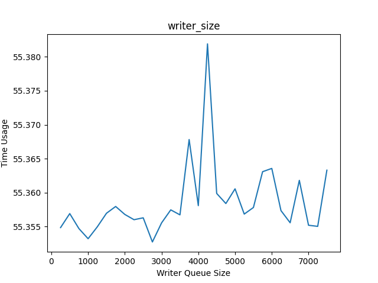

2. 圖像化 WRITER_QUEUE_SIZE 對 CONSUMER SIZE CHANGE LIST 的影響:

    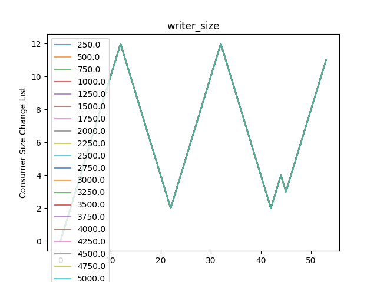

3. 討論:

   1. WRITE＿QUEUE_SIZE 和 Time Usage 的關係呈現中間有一高峰的情況, 但雖然圖上有一高峰, 但實際值並沒有差到太多 (約 0.03), 所以我認為 WRITER_QUEUE_SIZE 的大小對 Time Usage 影響不大

   2. 從圖可以發現 WRITER_QUEUE_SIZE 對 CONSUMER SIZE CHANGE 並沒有影響, 所有的線重疊在一起, 總體波形呈現谷峰谷峰谷峰

   3. What happens if WRITER_QUEUE_SIZE is very small?
      1. 從這裡的結果來看, 對 Time Usage 與 CONSUMER SIZE CHANGE 並沒有太大影響

### What happens if READER_QUEUE_SIZE is very small?

 <details> <summary>READER_QUEUE_SIZE 由小到大所產生的 data:</summary>

```python
['Reader Queue Size', 'Time Usage', 'Consumer Size Change List']
[[5.0 55.3581
  array([ 0.,  1.,  2.,  3.,  4.,  5.,  6.,  7.,  8.,  9., 10., 11., 12.,
         11., 10.,  9.,  8.,  7.,  6.,  5.,  4.,  3.,  2.,  3.,  4.,  5.,
          6.,  7.,  8.,  9., 10., 11., 12., 11., 10.,  9.,  8.,  7.,  6.,
          5.,  4.,  3.,  2.,  3.,  4.,  3.,  4.,  5.,  6.,  7.,  8.,  9.,
         10., 11.])                                                      ]
 [10.0 55.3555375
  array([ 0.,  1.,  2.,  3.,  4.,  5.,  6.,  7.,  8.,  9., 10., 11., 12.,
         11., 10.,  9.,  8.,  7.,  6.,  5.,  4.,  3.,  2.,  3.,  4.,  5.,
          6.,  7.,  8.,  9., 10., 11., 12., 11., 10.,  9.,  8.,  7.,  6.,
          5.,  4.,  3.,  2.,  3.,  4.,  3.,  4.,  5.,  6.,  7.,  8.,  9.,
         10., 11.])                                                      ]
 [15.0 55.36351666666667
  array([ 0.,  1.,  2.,  3.,  4.,  5.,  6.,  7.,  8.,  9., 10., 11., 12.,
         11., 10.,  9.,  8.,  7.,  6.,  5.,  4.,  3.,  2.,  3.,  4.,  5.,
          6.,  7.,  8.,  9., 10., 11., 12., 11., 10.,  9.,  8.,  7.,  6.,
          5.,  4.,  3.,  2.,  3.,  4.,  3.,  4.,  5.,  6.,  7.,  8.,  9.,
         10., 11.])                                                      ]
 [20.0 55.35305714285714
  array([ 0.,  1.,  2.,  3.,  4.,  5.,  6.,  7.,  8.,  9., 10., 11., 12.,
         11., 10.,  9.,  8.,  7.,  6.,  5.,  4.,  3.,  2.,  3.,  4.,  5.,
          6.,  7.,  8.,  9., 10., 11., 12., 11., 10.,  9.,  8.,  7.,  6.,
          5.,  4.,  3.,  2.,  3.,  4.,  3.,  4.,  5.,  6.,  7.,  8.,  9.,
         10., 11.])                                                      ]
 [25.0 55.35788333333334
  array([ 0.,  1.,  2.,  3.,  4.,  5.,  6.,  7.,  8.,  9., 10., 11., 12.,
         11., 10.,  9.,  8.,  7.,  6.,  5.,  4.,  3.,  2.,  3.,  4.,  5.,
          6.,  7.,  8.,  9., 10., 11., 12., 11., 10.,  9.,  8.,  7.,  6.,
          5.,  4.,  3.,  2.,  3.,  4.,  3.,  4.,  5.,  6.,  7.,  8.,  9.,
         10., 11.])                                                      ]
 [30.0 55.35285
  array([ 0.,  1.,  2.,  3.,  4.,  5.,  6.,  7.,  8.,  9., 10., 11., 12.,
         11., 10.,  9.,  8.,  7.,  6.,  5.,  4.,  3.,  2.,  3.,  4.,  5.,
          6.,  7.,  8.,  9., 10., 11., 12., 11., 10.,  9.,  8.,  7.,  6.,
          5.,  4.,  3.,  2.,  3.,  4.,  3.,  4.,  5.,  6.,  7.,  8.,  9.,
         10., 11.])                                                      ]
 [35.0 55.3582875
  array([ 0.,  1.,  2.,  3.,  4.,  5.,  6.,  7.,  8.,  9., 10., 11., 12.,
         11., 10.,  9.,  8.,  7.,  6.,  5.,  4.,  3.,  2.,  3.,  4.,  5.,
          6.,  7.,  8.,  9., 10., 11., 12., 11., 10.,  9.,  8.,  7.,  6.,
          5.,  4.,  3.,  2.,  3.,  4.,  3.,  4.,  5.,  6.,  7.,  8.,  9.,
         10., 11.])                                                      ]
 [40.0 55.35725714285714
  array([ 0.,  1.,  2.,  3.,  4.,  5.,  6.,  7.,  8.,  9., 10., 11., 12.,
         11., 10.,  9.,  8.,  7.,  6.,  5.,  4.,  3.,  2.,  3.,  4.,  5.,
          6.,  7.,  8.,  9., 10., 11., 12., 11., 10.,  9.,  8.,  7.,  6.,
          5.,  4.,  3.,  2.,  3.,  4.,  3.,  4.,  5.,  6.,  7.,  8.,  9.,
         10., 11.])                                                      ]
 [45.0 55.35682857142857
  array([ 0.,  1.,  2.,  3.,  4.,  5.,  6.,  7.,  8.,  9., 10., 11., 12.,
         11., 10.,  9.,  8.,  7.,  6.,  5.,  4.,  3.,  2.,  3.,  4.,  5.,
          6.,  7.,  8.,  9., 10., 11., 12., 11., 10.,  9.,  8.,  7.,  6.,
          5.,  4.,  3.,  2.,  3.,  4.,  3.,  4.,  5.,  6.,  7.,  8.,  9.,
         10., 11.])                                                      ]
 [50.0 55.35616666666667
  array([ 0.,  1.,  2.,  3.,  4.,  5.,  6.,  7.,  8.,  9., 10., 11., 12.,
         11., 10.,  9.,  8.,  7.,  6.,  5.,  4.,  3.,  2.,  3.,  4.,  5.,
          6.,  7.,  8.,  9., 10., 11., 12., 11., 10.,  9.,  8.,  7.,  6.,
          5.,  4.,  3.,  2.,  3.,  4.,  3.,  4.,  5.,  6.,  7.,  8.,  9.,
         10., 11.])                                                      ]
 [55.0 55.360825000000006
  array([ 0.,  1.,  2.,  3.,  4.,  5.,  6.,  7.,  8.,  9., 10., 11., 12.,
         11., 10.,  9.,  8.,  7.,  6.,  5.,  4.,  3.,  2.,  3.,  4.,  5.,
          6.,  7.,  8.,  9., 10., 11., 12., 11., 10.,  9.,  8.,  7.,  6.,
          5.,  4.,  3.,  2.,  3.,  4.,  3.,  4.,  5.,  6.,  7.,  8.,  9.,
         10., 11.])                                                      ]
 [60.0 55.3538
  array([ 0.,  1.,  2.,  3.,  4.,  5.,  6.,  7.,  8.,  9., 10., 11., 12.,
         11., 10.,  9.,  8.,  7.,  6.,  5.,  4.,  3.,  2.,  3.,  4.,  5.,
          6.,  7.,  8.,  9., 10., 11., 12., 11., 10.,  9.,  8.,  7.,  6.,
          5.,  4.,  3.,  2.,  3.,  4.,  3.,  4.,  5.,  6.,  7.,  8.,  9.,
         10., 11.])                                                      ]
 [65.0 55.358371428571424
  array([ 0.,  1.,  2.,  3.,  4.,  5.,  6.,  7.,  8.,  9., 10., 11., 12.,
         11., 10.,  9.,  8.,  7.,  6.,  5.,  4.,  3.,  2.,  3.,  4.,  5.,
          6.,  7.,  8.,  9., 10., 11., 12., 11., 10.,  9.,  8.,  7.,  6.,
          5.,  4.,  3.,  2.,  3.,  4.,  3.,  4.,  5.,  6.,  7.,  8.,  9.,
         10., 11.])                                                      ]
 [70.0 55.354685714285715
  array([ 0.,  1.,  2.,  3.,  4.,  5.,  6.,  7.,  8.,  9., 10., 11., 12.,
         11., 10.,  9.,  8.,  7.,  6.,  5.,  4.,  3.,  2.,  3.,  4.,  5.,
          6.,  7.,  8.,  9., 10., 11., 12., 11., 10.,  9.,  8.,  7.,  6.,
          5.,  4.,  3.,  2.,  3.,  4.,  3.,  4.,  5.,  6.,  7.,  8.,  9.,
         10., 11.])                                                      ]
 [75.0 55.35552857142857
  array([ 0.,  1.,  2.,  3.,  4.,  5.,  6.,  7.,  8.,  9., 10., 11., 12.,
         11., 10.,  9.,  8.,  7.,  6.,  5.,  4.,  3.,  2.,  3.,  4.,  5.,
          6.,  7.,  8.,  9., 10., 11., 12., 11., 10.,  9.,  8.,  7.,  6.,
          5.,  4.,  3.,  2.,  3.,  4.,  3.,  4.,  5.,  6.,  7.,  8.,  9.,
         10., 11.])                                                      ]
 [80.0 55.357275
  array([ 0.,  1.,  2.,  3.,  4.,  5.,  6.,  7.,  8.,  9., 10., 11., 12.,
         11., 10.,  9.,  8.,  7.,  6.,  5.,  4.,  3.,  2.,  3.,  4.,  5.,
          6.,  7.,  8.,  9., 10., 11., 12., 11., 10.,  9.,  8.,  7.,  6.,
          5.,  4.,  3.,  2.,  3.,  4.,  3.,  4.,  5.,  6.,  7.,  8.,  9.,
         10., 11.])                                                      ]
 [85.0 55.35604285714287
  array([ 0.,  1.,  2.,  3.,  4.,  5.,  6.,  7.,  8.,  9., 10., 11., 12.,
         11., 10.,  9.,  8.,  7.,  6.,  5.,  4.,  3.,  2.,  3.,  4.,  5.,
          6.,  7.,  8.,  9., 10., 11., 12., 11., 10.,  9.,  8.,  7.,  6.,
          5.,  4.,  3.,  2.,  3.,  4.,  3.,  4.,  5.,  6.,  7.,  8.,  9.,
         10., 11.])                                                      ]
 [90.0 55.35945714285714
  array([ 0.,  1.,  2.,  3.,  4.,  5.,  6.,  7.,  8.,  9., 10., 11., 12.,
         11., 10.,  9.,  8.,  7.,  6.,  5.,  4.,  3.,  2.,  3.,  4.,  5.,
          6.,  7.,  8.,  9., 10., 11., 12., 11., 10.,  9.,  8.,  7.,  6.,
          5.,  4.,  3.,  2.,  3.,  4.,  3.,  4.,  5.,  6.,  7.,  8.,  9.,
         10., 11.])                                                      ]
 [95.0 55.355675000000005
  array([ 0.,  1.,  2.,  3.,  4.,  5.,  6.,  7.,  8.,  9., 10., 11., 12.,
         11., 10.,  9.,  8.,  7.,  6.,  5.,  4.,  3.,  2.,  3.,  4.,  5.,
          6.,  7.,  8.,  9., 10., 11., 12., 11., 10.,  9.,  8.,  7.,  6.,
          5.,  4.,  3.,  2.,  3.,  4.,  3.,  4.,  5.,  6.,  7.,  8.,  9.,
         10., 11.])                                                      ]
 [100.0 55.35617142857143
  array([ 0.,  1.,  2.,  3.,  4.,  5.,  6.,  7.,  8.,  9., 10., 11., 12.,
         11., 10.,  9.,  8.,  7.,  6.,  5.,  4.,  3.,  2.,  3.,  4.,  5.,
          6.,  7.,  8.,  9., 10., 11., 12., 11., 10.,  9.,  8.,  7.,  6.,
          5.,  4.,  3.,  2.,  3.,  4.,  3.,  4.,  5.,  6.,  7.,  8.,  9.,
         10., 11.])                                                      ]
 [105.0 55.35452857142857
  array([ 0.,  1.,  2.,  3.,  4.,  5.,  6.,  7.,  8.,  9., 10., 11., 12.,
         11., 10.,  9.,  8.,  7.,  6.,  5.,  4.,  3.,  2.,  3.,  4.,  5.,
          6.,  7.,  8.,  9., 10., 11., 12., 11., 10.,  9.,  8.,  7.,  6.,
          5.,  4.,  3.,  2.,  3.,  4.,  3.,  4.,  5.,  6.,  7.,  8.,  9.,
         10., 11.])                                                      ]
 [110.0 55.35465000000001
  array([ 0.,  1.,  2.,  3.,  4.,  5.,  6.,  7.,  8.,  9., 10., 11., 12.,
         11., 10.,  9.,  8.,  7.,  6.,  5.,  4.,  3.,  2.,  3.,  4.,  5.,
          6.,  7.,  8.,  9., 10., 11., 12., 11., 10.,  9.,  8.,  7.,  6.,
          5.,  4.,  3.,  2.,  3.,  4.,  3.,  4.,  5.,  6.,  7.,  8.,  9.,
         10., 11.])                                                      ]
 [115.0 55.356971428571434
  array([ 0.,  1.,  2.,  3.,  4.,  5.,  6.,  7.,  8.,  9., 10., 11., 12.,
         11., 10.,  9.,  8.,  7.,  6.,  5.,  4.,  3.,  2.,  3.,  4.,  5.,
          6.,  7.,  8.,  9., 10., 11., 12., 11., 10.,  9.,  8.,  7.,  6.,
          5.,  4.,  3.,  2.,  3.,  4.,  3.,  4.,  5.,  6.,  7.,  8.,  9.,
         10., 11.])                                                      ]
 [120.0 55.35452857142857
  array([ 0.,  1.,  2.,  3.,  4.,  5.,  6.,  7.,  8.,  9., 10., 11., 12.,
         11., 10.,  9.,  8.,  7.,  6.,  5.,  4.,  3.,  2.,  3.,  4.,  5.,
          6.,  7.,  8.,  9., 10., 11., 12., 11., 10.,  9.,  8.,  7.,  6.,
          5.,  4.,  3.,  2.,  3.,  4.,  3.,  4.,  5.,  6.,  7.,  8.,  9.,
         10., 11.])                                                      ]
 [125.0 53.817
  array([ 0.,  1.,  2.,  3.,  4.,  5.,  6.,  7.,  8.,  9., 10., 11., 12.,
         11., 10.,  9.,  8.,  7.,  6.,  5.,  4.,  3.,  2.,  3.,  4.,  5.,
          6.,  7.,  8.,  9., 10., 11., 12., 11., 10.,  9.,  8.,  7.,  6.,
          5.,  4.,  3.,  2.,  3.,  4.,  5.,  6.,  7.,  8.,  9., 10., 11.])]
 [130.0 53.8235
  array([ 0.,  1.,  2.,  3.,  4.,  5.,  6.,  7.,  8.,  9., 10., 11., 12.,
         11., 10.,  9.,  8.,  7.,  6.,  5.,  4.,  3.,  2.,  3.,  4.,  5.,
          6.,  7.,  8.,  9., 10., 11., 12., 11., 10.,  9.,  8.,  7.,  6.,
          5.,  4.,  3.,  2.,  3.,  4.,  5.,  6.,  7.,  8.,  9., 10., 11.])]
 [135.0 55.362728571428576
  array([ 0.,  1.,  2.,  3.,  4.,  5.,  6.,  7.,  8.,  9., 10., 11., 12.,
         11., 10.,  9.,  8.,  7.,  6.,  5.,  4.,  3.,  2.,  3.,  4.,  5.,
          6.,  7.,  8.,  9., 10., 11., 12., 11., 10.,  9.,  8.,  7.,  6.,
          5.,  4.,  3.,  2.,  3.,  4.,  3.,  4.,  5.,  6.,  7.,  8.,  9.,
         10., 11.])                                                      ]
 [140.0 55.35525714285715
  array([ 0.,  1.,  2.,  3.,  4.,  5.,  6.,  7.,  8.,  9., 10., 11., 12.,
         11., 10.,  9.,  8.,  7.,  6.,  5.,  4.,  3.,  2.,  3.,  4.,  5.,
          6.,  7.,  8.,  9., 10., 11., 12., 11., 10.,  9.,  8.,  7.,  6.,
          5.,  4.,  3.,  2.,  3.,  4.,  3.,  4.,  5.,  6.,  7.,  8.,  9.,
         10., 11.])                                                      ]
 [145.0 55.363487500000005
  array([ 0.,  1.,  2.,  3.,  4.,  5.,  6.,  7.,  8.,  9., 10., 11., 12.,
         11., 10.,  9.,  8.,  7.,  6.,  5.,  4.,  3.,  2.,  3.,  4.,  5.,
          6.,  7.,  8.,  9., 10., 11., 12., 11., 10.,  9.,  8.,  7.,  6.,
          5.,  4.,  3.,  2.,  3.,  4.,  3.,  4.,  5.,  6.,  7.,  8.,  9.,
         10., 11.])                                                      ]
 [150.0 53.826074999999996
  array([ 0.,  1.,  2.,  3.,  4.,  5.,  6.,  7.,  8.,  9., 10., 11., 12.,
         11., 10.,  9.,  8.,  7.,  6.,  5.,  4.,  3.,  2.,  3.,  4.,  5.,
          6.,  7.,  8.,  9., 10., 11., 12., 11., 10.,  9.,  8.,  7.,  6.,
          5.,  4.,  3.,  2.,  3.,  4.,  5.,  6.,  7.,  8.,  9., 10., 11.])]
 [155.0 55.354471428571436
  array([ 0.,  1.,  2.,  3.,  4.,  5.,  6.,  7.,  8.,  9., 10., 11., 12.,
         11., 10.,  9.,  8.,  7.,  6.,  5.,  4.,  3.,  2.,  3.,  4.,  5.,
          6.,  7.,  8.,  9., 10., 11., 12., 11., 10.,  9.,  8.,  7.,  6.,
          5.,  4.,  3.,  2.,  3.,  4.,  3.,  4.,  5.,  6.,  7.,  8.,  9.,
         10., 11.])                                                      ]
 [160.0 55.35376
  array([ 0.,  1.,  2.,  3.,  4.,  5.,  6.,  7.,  8.,  9., 10., 11., 12.,
         11., 10.,  9.,  8.,  7.,  6.,  5.,  4.,  3.,  2.,  3.,  4.,  5.,
          6.,  7.,  8.,  9., 10., 11., 12., 11., 10.,  9.,  8.,  7.,  6.,
          5.,  4.,  3.,  2.,  3.,  4.,  3.,  4.,  5.,  6.,  7.,  8.,  9.,
         10., 11.])                                                      ]
 [165.0 55.358233333333324
  array([ 0.,  1.,  2.,  3.,  4.,  5.,  6.,  7.,  8.,  9., 10., 11., 12.,
         11., 10.,  9.,  8.,  7.,  6.,  5.,  4.,  3.,  2.,  3.,  4.,  5.,
          6.,  7.,  8.,  9., 10., 11., 12., 11., 10.,  9.,  8.,  7.,  6.,
          5.,  4.,  3.,  2.,  3.,  4.,  3.,  4.,  5.,  6.,  7.,  8.,  9.,
         10., 11.])                                                      ]
 [170.0 55.35251666666667
  array([ 0.,  1.,  2.,  3.,  4.,  5.,  6.,  7.,  8.,  9., 10., 11., 12.,
         11., 10.,  9.,  8.,  7.,  6.,  5.,  4.,  3.,  2.,  3.,  4.,  5.,
          6.,  7.,  8.,  9., 10., 11., 12., 11., 10.,  9.,  8.,  7.,  6.,
          5.,  4.,  3.,  2.,  3.,  4.,  3.,  4.,  5.,  6.,  7.,  8.,  9.,
         10., 11.])                                                      ]
 [175.0 55.355740000000004
  array([ 0.,  1.,  2.,  3.,  4.,  5.,  6.,  7.,  8.,  9., 10., 11., 12.,
         11., 10.,  9.,  8.,  7.,  6.,  5.,  4.,  3.,  2.,  3.,  4.,  5.,
          6.,  7.,  8.,  9., 10., 11., 12., 11., 10.,  9.,  8.,  7.,  6.,
          5.,  4.,  3.,  2.,  3.,  4.,  3.,  4.,  5.,  6.,  7.,  8.,  9.,
         10., 11.])                                                      ]
 [180.0 55.35517142857144
  array([ 0.,  1.,  2.,  3.,  4.,  5.,  6.,  7.,  8.,  9., 10., 11., 12.,
         11., 10.,  9.,  8.,  7.,  6.,  5.,  4.,  3.,  2.,  3.,  4.,  5.,
          6.,  7.,  8.,  9., 10., 11., 12., 11., 10.,  9.,  8.,  7.,  6.,
          5.,  4.,  3.,  2.,  3.,  4.,  3.,  4.,  5.,  6.,  7.,  8.,  9.,
         10., 11.])                                                      ]
 [185.0 55.35237142857142
  array([ 0.,  1.,  2.,  3.,  4.,  5.,  6.,  7.,  8.,  9., 10., 11., 12.,
         11., 10.,  9.,  8.,  7.,  6.,  5.,  4.,  3.,  2.,  3.,  4.,  5.,
          6.,  7.,  8.,  9., 10., 11., 12., 11., 10.,  9.,  8.,  7.,  6.,
          5.,  4.,  3.,  2.,  3.,  4.,  3.,  4.,  5.,  6.,  7.,  8.,  9.,
         10., 11.])                                                      ]
 [190.0 55.3581
  array([ 0.,  1.,  2.,  3.,  4.,  5.,  6.,  7.,  8.,  9., 10., 11., 12.,
         11., 10.,  9.,  8.,  7.,  6.,  5.,  4.,  3.,  2.,  3.,  4.,  5.,
          6.,  7.,  8.,  9., 10., 11., 12., 11., 10.,  9.,  8.,  7.,  6.,
          5.,  4.,  3.,  2.,  3.,  4.,  3.,  4.,  5.,  6.,  7.,  8.,  9.,
         10., 11.])                                                      ]
 [195.0 55.357442857142864
  array([ 0.,  1.,  2.,  3.,  4.,  5.,  6.,  7.,  8.,  9., 10., 11., 12.,
         11., 10.,  9.,  8.,  7.,  6.,  5.,  4.,  3.,  2.,  3.,  4.,  5.,
          6.,  7.,  8.,  9., 10., 11., 12., 11., 10.,  9.,  8.,  7.,  6.,
          5.,  4.,  3.,  2.,  3.,  4.,  3.,  4.,  5.,  6.,  7.,  8.,  9.,
         10., 11.])                                                      ]
 [200.0 55.35788333333333
  array([ 0.,  1.,  2.,  3.,  4.,  5.,  6.,  7.,  8.,  9., 10., 11., 12.,
         11., 10.,  9.,  8.,  7.,  6.,  5.,  4.,  3.,  2.,  3.,  4.,  5.,
          6.,  7.,  8.,  9., 10., 11., 12., 11., 10.,  9.,  8.,  7.,  6.,
          5.,  4.,  3.,  2.,  3.,  4.,  3.,  4.,  5.,  6.,  7.,  8.,  9.,
         10., 11.])                                                      ]
 [205.0 55.35902857142857
  array([ 0.,  1.,  2.,  3.,  4.,  5.,  6.,  7.,  8.,  9., 10., 11., 12.,
         11., 10.,  9.,  8.,  7.,  6.,  5.,  4.,  3.,  2.,  3.,  4.,  5.,
          6.,  7.,  8.,  9., 10., 11., 12., 11., 10.,  9.,  8.,  7.,  6.,
          5.,  4.,  3.,  2.,  3.,  4.,  3.,  4.,  5.,  6.,  7.,  8.,  9.,
         10., 11.])                                                      ]
 [210.0 55.355114285714286
  array([ 0.,  1.,  2.,  3.,  4.,  5.,  6.,  7.,  8.,  9., 10., 11., 12.,
         11., 10.,  9.,  8.,  7.,  6.,  5.,  4.,  3.,  2.,  3.,  4.,  5.,
          6.,  7.,  8.,  9., 10., 11., 12., 11., 10.,  9.,  8.,  7.,  6.,
          5.,  4.,  3.,  2.,  3.,  4.,  3.,  4.,  5.,  6.,  7.,  8.,  9.,
         10., 11.])                                                      ]
 [215.0 55.3632
  array([ 0.,  1.,  2.,  3.,  4.,  5.,  6.,  7.,  8.,  9., 10., 11., 12.,
         11., 10.,  9.,  8.,  7.,  6.,  5.,  4.,  3.,  2.,  3.,  4.,  5.,
          6.,  7.,  8.,  9., 10., 11., 12., 11., 10.,  9.,  8.,  7.,  6.,
          5.,  4.,  3.,  2.,  3.,  4.,  3.,  4.,  5.,  6.,  7.,  8.,  9.,
         10., 11.])                                                      ]
 [220.0 55.35581428571429
  array([ 0.,  1.,  2.,  3.,  4.,  5.,  6.,  7.,  8.,  9., 10., 11., 12.,
         11., 10.,  9.,  8.,  7.,  6.,  5.,  4.,  3.,  2.,  3.,  4.,  5.,
          6.,  7.,  8.,  9., 10., 11., 12., 11., 10.,  9.,  8.,  7.,  6.,
          5.,  4.,  3.,  2.,  3.,  4.,  3.,  4.,  5.,  6.,  7.,  8.,  9.,
         10., 11.])                                                      ]
 [225.0 55.35664285714285
  array([ 0.,  1.,  2.,  3.,  4.,  5.,  6.,  7.,  8.,  9., 10., 11., 12.,
         11., 10.,  9.,  8.,  7.,  6.,  5.,  4.,  3.,  2.,  3.,  4.,  5.,
          6.,  7.,  8.,  9., 10., 11., 12., 11., 10.,  9.,  8.,  7.,  6.,
          5.,  4.,  3.,  2.,  3.,  4.,  3.,  4.,  5.,  6.,  7.,  8.,  9.,
         10., 11.])                                                      ]
 [230.0 55.36134285714286
  array([ 0.,  1.,  2.,  3.,  4.,  5.,  6.,  7.,  8.,  9., 10., 11., 12.,
         11., 10.,  9.,  8.,  7.,  6.,  5.,  4.,  3.,  2.,  3.,  4.,  5.,
          6.,  7.,  8.,  9., 10., 11., 12., 11., 10.,  9.,  8.,  7.,  6.,
          5.,  4.,  3.,  2.,  3.,  4.,  3.,  4.,  5.,  6.,  7.,  8.,  9.,
         10., 11.])                                                      ]
 [235.0 55.36058333333333
  array([ 0.,  1.,  2.,  3.,  4.,  5.,  6.,  7.,  8.,  9., 10., 11., 12.,
         11., 10.,  9.,  8.,  7.,  6.,  5.,  4.,  3.,  2.,  3.,  4.,  5.,
          6.,  7.,  8.,  9., 10., 11., 12., 11., 10.,  9.,  8.,  7.,  6.,
          5.,  4.,  3.,  2.,  3.,  4.,  3.,  4.,  5.,  6.,  7.,  8.,  9.,
         10., 11.])                                                      ]
 [240.0 55.36203750000001
  array([ 0.,  1.,  2.,  3.,  4.,  5.,  6.,  7.,  8.,  9., 10., 11., 12.,
         11., 10.,  9.,  8.,  7.,  6.,  5.,  4.,  3.,  2.,  3.,  4.,  5.,
          6.,  7.,  8.,  9., 10., 11., 12., 11., 10.,  9.,  8.,  7.,  6.,
          5.,  4.,  3.,  2.,  3.,  4.,  3.,  4.,  5.,  6.,  7.,  8.,  9.,
         10., 11.])                                                      ]
 [245.0 55.356042857142846
  array([ 0.,  1.,  2.,  3.,  4.,  5.,  6.,  7.,  8.,  9., 10., 11., 12.,
         11., 10.,  9.,  8.,  7.,  6.,  5.,  4.,  3.,  2.,  3.,  4.,  5.,
          6.,  7.,  8.,  9., 10., 11., 12., 11., 10.,  9.,  8.,  7.,  6.,
          5.,  4.,  3.,  2.,  3.,  4.,  3.,  4.,  5.,  6.,  7.,  8.,  9.,
         10., 11.])                                                      ]
 [250.0 55.36475714285714
  array([ 0.,  1.,  2.,  3.,  4.,  5.,  6.,  7.,  8.,  9., 10., 11., 12.,
         11., 10.,  9.,  8.,  7.,  6.,  5.,  4.,  3.,  2.,  3.,  4.,  5.,
          6.,  7.,  8.,  9., 10., 11., 12., 11., 10.,  9.,  8.,  7.,  6.,
          5.,  4.,  3.,  2.,  3.,  4.,  3.,  4.,  5.,  6.,  7.,  8.,  9.,
         10., 11.])                                                      ]
 [255.0 55.3564625
  array([ 0.,  1.,  2.,  3.,  4.,  5.,  6.,  7.,  8.,  9., 10., 11., 12.,
         11., 10.,  9.,  8.,  7.,  6.,  5.,  4.,  3.,  2.,  3.,  4.,  5.,
          6.,  7.,  8.,  9., 10., 11., 12., 11., 10.,  9.,  8.,  7.,  6.,
          5.,  4.,  3.,  2.,  3.,  4.,  3.,  4.,  5.,  6.,  7.,  8.,  9.,
         10., 11.])                                                      ]
 [260.0 55.35791428571429
  array([ 0.,  1.,  2.,  3.,  4.,  5.,  6.,  7.,  8.,  9., 10., 11., 12.,
         11., 10.,  9.,  8.,  7.,  6.,  5.,  4.,  3.,  2.,  3.,  4.,  5.,
          6.,  7.,  8.,  9., 10., 11., 12., 11., 10.,  9.,  8.,  7.,  6.,
          5.,  4.,  3.,  2.,  3.,  4.,  3.,  4.,  5.,  6.,  7.,  8.,  9.,
         10., 11.])                                                      ]
 [265.0 55.35582857142857
  array([ 0.,  1.,  2.,  3.,  4.,  5.,  6.,  7.,  8.,  9., 10., 11., 12.,
         11., 10.,  9.,  8.,  7.,  6.,  5.,  4.,  3.,  2.,  3.,  4.,  5.,
          6.,  7.,  8.,  9., 10., 11., 12., 11., 10.,  9.,  8.,  7.,  6.,
          5.,  4.,  3.,  2.,  3.,  4.,  3.,  4.,  5.,  6.,  7.,  8.,  9.,
         10., 11.])                                                      ]
 [270.0 55.36211666666666
  array([ 0.,  1.,  2.,  3.,  4.,  5.,  6.,  7.,  8.,  9., 10., 11., 12.,
         11., 10.,  9.,  8.,  7.,  6.,  5.,  4.,  3.,  2.,  3.,  4.,  5.,
          6.,  7.,  8.,  9., 10., 11., 12., 11., 10.,  9.,  8.,  7.,  6.,
          5.,  4.,  3.,  2.,  3.,  4.,  3.,  4.,  5.,  6.,  7.,  8.,  9.,
         10., 11.])                                                      ]
 [275.0 55.360299999999995
  array([ 0.,  1.,  2.,  3.,  4.,  5.,  6.,  7.,  8.,  9., 10., 11., 12.,
         11., 10.,  9.,  8.,  7.,  6.,  5.,  4.,  3.,  2.,  3.,  4.,  5.,
          6.,  7.,  8.,  9., 10., 11., 12., 11., 10.,  9.,  8.,  7.,  6.,
          5.,  4.,  3.,  2.,  3.,  4.,  3.,  4.,  5.,  6.,  7.,  8.,  9.,
         10., 11.])                                                      ]
 [280.0 55.35605714285714
  array([ 0.,  1.,  2.,  3.,  4.,  5.,  6.,  7.,  8.,  9., 10., 11., 12.,
         11., 10.,  9.,  8.,  7.,  6.,  5.,  4.,  3.,  2.,  3.,  4.,  5.,
          6.,  7.,  8.,  9., 10., 11., 12., 11., 10.,  9.,  8.,  7.,  6.,
          5.,  4.,  3.,  2.,  3.,  4.,  3.,  4.,  5.,  6.,  7.,  8.,  9.,
         10., 11.])                                                      ]
 [285.0 55.35338
  array([ 0.,  1.,  2.,  3.,  4.,  5.,  6.,  7.,  8.,  9., 10., 11., 12.,
         11., 10.,  9.,  8.,  7.,  6.,  5.,  4.,  3.,  2.,  3.,  4.,  5.,
          6.,  7.,  8.,  9., 10., 11., 12., 11., 10.,  9.,  8.,  7.,  6.,
          5.,  4.,  3.,  2.,  3.,  4.,  3.,  4.,  5.,  6.,  7.,  8.,  9.,
         10., 11.])                                                      ]
 [290.0 55.35475714285714
  array([ 0.,  1.,  2.,  3.,  4.,  5.,  6.,  7.,  8.,  9., 10., 11., 12.,
         11., 10.,  9.,  8.,  7.,  6.,  5.,  4.,  3.,  2.,  3.,  4.,  5.,
          6.,  7.,  8.,  9., 10., 11., 12., 11., 10.,  9.,  8.,  7.,  6.,
          5.,  4.,  3.,  2.,  3.,  4.,  3.,  4.,  5.,  6.,  7.,  8.,  9.,
         10., 11.])                                                      ]
 [295.0 55.35774
  array([ 0.,  1.,  2.,  3.,  4.,  5.,  6.,  7.,  8.,  9., 10., 11., 12.,
         11., 10.,  9.,  8.,  7.,  6.,  5.,  4.,  3.,  2.,  3.,  4.,  5.,
          6.,  7.,  8.,  9., 10., 11., 12., 11., 10.,  9.,  8.,  7.,  6.,
          5.,  4.,  3.,  2.,  3.,  4.,  3.,  4.,  5.,  6.,  7.,  8.,  9.,
         10., 11.])                                                      ]
 [300.0 55.3563
  array([ 0.,  1.,  2.,  3.,  4.,  5.,  6.,  7.,  8.,  9., 10., 11., 12.,
         11., 10.,  9.,  8.,  7.,  6.,  5.,  4.,  3.,  2.,  3.,  4.,  5.,
          6.,  7.,  8.,  9., 10., 11., 12., 11., 10.,  9.,  8.,  7.,  6.,
          5.,  4.,  3.,  2.,  3.,  4.,  3.,  4.,  5.,  6.,  7.,  8.,  9.,
         10., 11.])                                                      ]
 [305.0 55.36382857142856
  array([ 0.,  1.,  2.,  3.,  4.,  5.,  6.,  7.,  8.,  9., 10., 11., 12.,
         11., 10.,  9.,  8.,  7.,  6.,  5.,  4.,  3.,  2.,  3.,  4.,  5.,
          6.,  7.,  8.,  9., 10., 11., 12., 11., 10.,  9.,  8.,  7.,  6.,
          5.,  4.,  3.,  2.,  3.,  4.,  3.,  4.,  5.,  6.,  7.,  8.,  9.,
         10., 11.])                                                      ]
 [310.0 55.36171666666666
  array([ 0.,  1.,  2.,  3.,  4.,  5.,  6.,  7.,  8.,  9., 10., 11., 12.,
         11., 10.,  9.,  8.,  7.,  6.,  5.,  4.,  3.,  2.,  3.,  4.,  5.,
          6.,  7.,  8.,  9., 10., 11., 12., 11., 10.,  9.,  8.,  7.,  6.,
          5.,  4.,  3.,  2.,  3.,  4.,  3.,  4.,  5.,  6.,  7.,  8.,  9.,
         10., 11.])                                                      ]
 [315.0 55.35406666666666
  array([ 0.,  1.,  2.,  3.,  4.,  5.,  6.,  7.,  8.,  9., 10., 11., 12.,
         11., 10.,  9.,  8.,  7.,  6.,  5.,  4.,  3.,  2.,  3.,  4.,  5.,
          6.,  7.,  8.,  9., 10., 11., 12., 11., 10.,  9.,  8.,  7.,  6.,
          5.,  4.,  3.,  2.,  3.,  4.,  3.,  4.,  5.,  6.,  7.,  8.,  9.,
         10., 11.])                                                      ]
 [320.0 55.35661666666667
  array([ 0.,  1.,  2.,  3.,  4.,  5.,  6.,  7.,  8.,  9., 10., 11., 12.,
         11., 10.,  9.,  8.,  7.,  6.,  5.,  4.,  3.,  2.,  3.,  4.,  5.,
          6.,  7.,  8.,  9., 10., 11., 12., 11., 10.,  9.,  8.,  7.,  6.,
          5.,  4.,  3.,  2.,  3.,  4.,  3.,  4.,  5.,  6.,  7.,  8.,  9.,
         10., 11.])                                                      ]
 [325.0 55.362275
  array([ 0.,  1.,  2.,  3.,  4.,  5.,  6.,  7.,  8.,  9., 10., 11., 12.,
         11., 10.,  9.,  8.,  7.,  6.,  5.,  4.,  3.,  2.,  3.,  4.,  5.,
          6.,  7.,  8.,  9., 10., 11., 12., 11., 10.,  9.,  8.,  7.,  6.,
          5.,  4.,  3.,  2.,  3.,  4.,  3.,  4.,  5.,  6.,  7.,  8.,  9.,
         10., 11.])                                                      ]
 [330.0 55.358725
  array([ 0.,  1.,  2.,  3.,  4.,  5.,  6.,  7.,  8.,  9., 10., 11., 12.,
         11., 10.,  9.,  8.,  7.,  6.,  5.,  4.,  3.,  2.,  3.,  4.,  5.,
          6.,  7.,  8.,  9., 10., 11., 12., 11., 10.,  9.,  8.,  7.,  6.,
          5.,  4.,  3.,  2.,  3.,  4.,  3.,  4.,  5.,  6.,  7.,  8.,  9.,
         10., 11.])                                                      ]
 [335.0 55.36412
  array([ 0.,  1.,  2.,  3.,  4.,  5.,  6.,  7.,  8.,  9., 10., 11., 12.,
         11., 10.,  9.,  8.,  7.,  6.,  5.,  4.,  3.,  2.,  3.,  4.,  5.,
          6.,  7.,  8.,  9., 10., 11., 12., 11., 10.,  9.,  8.,  7.,  6.,
          5.,  4.,  3.,  2.,  3.,  4.,  3.,  4.,  5.,  6.,  7.,  8.,  9.,
         10., 11.])                                                      ]
 [340.0 55.35841666666667
  array([ 0.,  1.,  2.,  3.,  4.,  5.,  6.,  7.,  8.,  9., 10., 11., 12.,
         11., 10.,  9.,  8.,  7.,  6.,  5.,  4.,  3.,  2.,  3.,  4.,  5.,
          6.,  7.,  8.,  9., 10., 11., 12., 11., 10.,  9.,  8.,  7.,  6.,
          5.,  4.,  3.,  2.,  3.,  4.,  3.,  4.,  5.,  6.,  7.,  8.,  9.,
         10., 11.])                                                      ]
 [345.0 55.35536
  array([ 0.,  1.,  2.,  3.,  4.,  5.,  6.,  7.,  8.,  9., 10., 11., 12.,
         11., 10.,  9.,  8.,  7.,  6.,  5.,  4.,  3.,  2.,  3.,  4.,  5.,
          6.,  7.,  8.,  9., 10., 11., 12., 11., 10.,  9.,  8.,  7.,  6.,
          5.,  4.,  3.,  2.,  3.,  4.,  3.,  4.,  5.,  6.,  7.,  8.,  9.,
         10., 11.])                                                      ]
 [350.0 55.38452857142857
  array([ 0.,  1.,  2.,  3.,  4.,  5.,  6.,  7.,  8.,  9., 10., 11., 12.,
         11., 10.,  9.,  8.,  7.,  6.,  5.,  4.,  3.,  2.,  3.,  4.,  5.,
          6.,  7.,  8.,  9., 10., 11., 12., 11., 10.,  9.,  8.,  7.,  6.,
          5.,  4.,  3.,  2.,  3.,  4.,  3.,  4.,  5.,  6.,  7.,  8.,  9.,
         10., 11.])                                                      ]
 [355.0 55.3576875
  array([ 0.,  1.,  2.,  3.,  4.,  5.,  6.,  7.,  8.,  9., 10., 11., 12.,
         11., 10.,  9.,  8.,  7.,  6.,  5.,  4.,  3.,  2.,  3.,  4.,  5.,
          6.,  7.,  8.,  9., 10., 11., 12., 11., 10.,  9.,  8.,  7.,  6.,
          5.,  4.,  3.,  2.,  3.,  4.,  3.,  4.,  5.,  6.,  7.,  8.,  9.,
         10., 11.])                                                      ]
 [360.0 55.35633750000001
  array([ 0.,  1.,  2.,  3.,  4.,  5.,  6.,  7.,  8.,  9., 10., 11., 12.,
         11., 10.,  9.,  8.,  7.,  6.,  5.,  4.,  3.,  2.,  3.,  4.,  5.,
          6.,  7.,  8.,  9., 10., 11., 12., 11., 10.,  9.,  8.,  7.,  6.,
          5.,  4.,  3.,  2.,  3.,  4.,  3.,  4.,  5.,  6.,  7.,  8.,  9.,
         10., 11.])                                                      ]
 [365.0 55.358062499999996
  array([ 0.,  1.,  2.,  3.,  4.,  5.,  6.,  7.,  8.,  9., 10., 11., 12.,
         11., 10.,  9.,  8.,  7.,  6.,  5.,  4.,  3.,  2.,  3.,  4.,  5.,
          6.,  7.,  8.,  9., 10., 11., 12., 11., 10.,  9.,  8.,  7.,  6.,
          5.,  4.,  3.,  2.,  3.,  4.,  3.,  4.,  5.,  6.,  7.,  8.,  9.,
         10., 11.])                                                      ]
 [370.0 55.37388571428571
  array([ 0.,  1.,  2.,  3.,  4.,  5.,  6.,  7.,  8.,  9., 10., 11., 12.,
         11., 10.,  9.,  8.,  7.,  6.,  5.,  4.,  3.,  2.,  3.,  4.,  5.,
          6.,  7.,  8.,  9., 10., 11., 12., 11., 10.,  9.,  8.,  7.,  6.,
          5.,  4.,  3.,  2.,  3.,  4.,  3.,  4.,  5.,  6.,  7.,  8.,  9.,
         10., 11.])                                                      ]
 [375.0 55.35752
  array([ 0.,  1.,  2.,  3.,  4.,  5.,  6.,  7.,  8.,  9., 10., 11., 12.,
         11., 10.,  9.,  8.,  7.,  6.,  5.,  4.,  3.,  2.,  3.,  4.,  5.,
          6.,  7.,  8.,  9., 10., 11., 12., 11., 10.,  9.,  8.,  7.,  6.,
          5.,  4.,  3.,  2.,  3.,  4.,  3.,  4.,  5.,  6.,  7.,  8.,  9.,
         10., 11.])                                                      ]
 [380.0 55.3566125
  array([ 0.,  1.,  2.,  3.,  4.,  5.,  6.,  7.,  8.,  9., 10., 11., 12.,
         11., 10.,  9.,  8.,  7.,  6.,  5.,  4.,  3.,  2.,  3.,  4.,  5.,
          6.,  7.,  8.,  9., 10., 11., 12., 11., 10.,  9.,  8.,  7.,  6.,
          5.,  4.,  3.,  2.,  3.,  4.,  3.,  4.,  5.,  6.,  7.,  8.,  9.,
         10., 11.])                                                      ]
 [385.0 55.36155000000001
  array([ 0.,  1.,  2.,  3.,  4.,  5.,  6.,  7.,  8.,  9., 10., 11., 12.,
         11., 10.,  9.,  8.,  7.,  6.,  5.,  4.,  3.,  2.,  3.,  4.,  5.,
          6.,  7.,  8.,  9., 10., 11., 12., 11., 10.,  9.,  8.,  7.,  6.,
          5.,  4.,  3.,  2.,  3.,  4.,  3.,  4.,  5.,  6.,  7.,  8.,  9.,
         10., 11.])                                                      ]
 [390.0 55.357662499999996
  array([ 0.,  1.,  2.,  3.,  4.,  5.,  6.,  7.,  8.,  9., 10., 11., 12.,
         11., 10.,  9.,  8.,  7.,  6.,  5.,  4.,  3.,  2.,  3.,  4.,  5.,
          6.,  7.,  8.,  9., 10., 11., 12., 11., 10.,  9.,  8.,  7.,  6.,
          5.,  4.,  3.,  2.,  3.,  4.,  3.,  4.,  5.,  6.,  7.,  8.,  9.,
         10., 11.])                                                      ]
 [395.0 55.36783333333333
  array([ 0.,  1.,  2.,  3.,  4.,  5.,  6.,  7.,  8.,  9., 10., 11., 12.,
         11., 10.,  9.,  8.,  7.,  6.,  5.,  4.,  3.,  2.,  3.,  4.,  5.,
          6.,  7.,  8.,  9., 10., 11., 12., 11., 10.,  9.,  8.,  7.,  6.,
          5.,  4.,  3.,  2.,  3.,  4.,  3.,  4.,  5.,  6.,  7.,  8.,  9.,
         10., 11.])                                                      ]
 [400.0 55.358314285714286
  array([ 0.,  1.,  2.,  3.,  4.,  5.,  6.,  7.,  8.,  9., 10., 11., 12.,
         11., 10.,  9.,  8.,  7.,  6.,  5.,  4.,  3.,  2.,  3.,  4.,  5.,
          6.,  7.,  8.,  9., 10., 11., 12., 11., 10.,  9.,  8.,  7.,  6.,
          5.,  4.,  3.,  2.,  3.,  4.,  3.,  4.,  5.,  6.,  7.,  8.,  9.,
         10., 11.])                                                      ]]
```

</details>

1. 圖像化 READER_QUEUE_SIZE 對 Time Usage 的影響:

    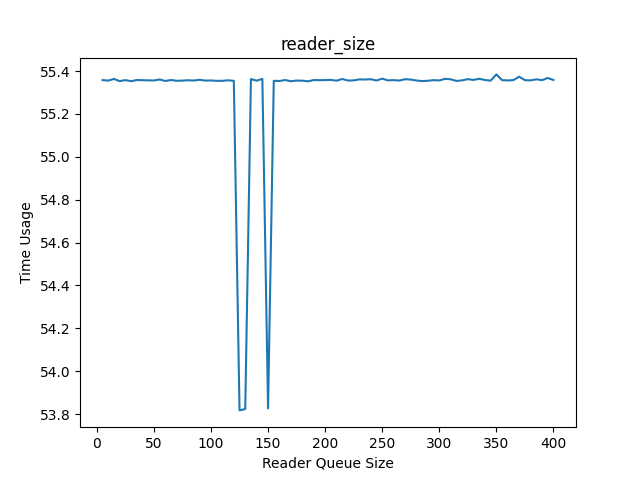

2. 圖像化 READER_QUEUE_SIZE 對 CONSUMER SIZE CHANGE LIST 的影響:

    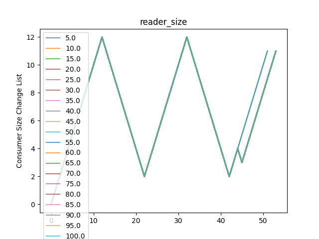

3. 討論:

   1. 從圖中可以很明顯發現 READER_QUEUE_SIZE 約在 130 與 150 時, Time Usage 有明顯的下降, 其他則呈現平穩的狀況

   2. 從圖可以發現 READER_QUEUE_SIZE 對 CONSUMER SIZE CHANGE 並沒有太大影響, 幾乎所有的線重疊在一起, 總體波形呈現谷峰谷峰谷峰, 有條線岔出可以聯想到和第一點有些許點有極低值有相關

   3. What happens if READER_QUEUE_SIZE is very small?
      1. 從這裡的結果來看, 對 Time Usage 與 CONSUMER SIZE CHANGE 並沒有太大影響

## Feedback

### 楊子慶's feedback

本次的實作加入實驗的成分, 我利用 Process 的獨立性來測試當中多個 Thread 一起運行的表現, 以此實作獨立的運行環境, 讓使用者可以輕鬆調整操作變因來進行實驗。另運用 Linux 的 Timer API 實現 Consumer 數量的增減邏輯, 其運作方式頗為有趣, 是很好的練習經驗。

### 俞政佑's feedback

很少在資工的課程上面進行 "實驗", 是一次新鮮的體驗, 但感覺實驗之間的結果差距沒有很大, 分析感覺無法得到太多資訊。
